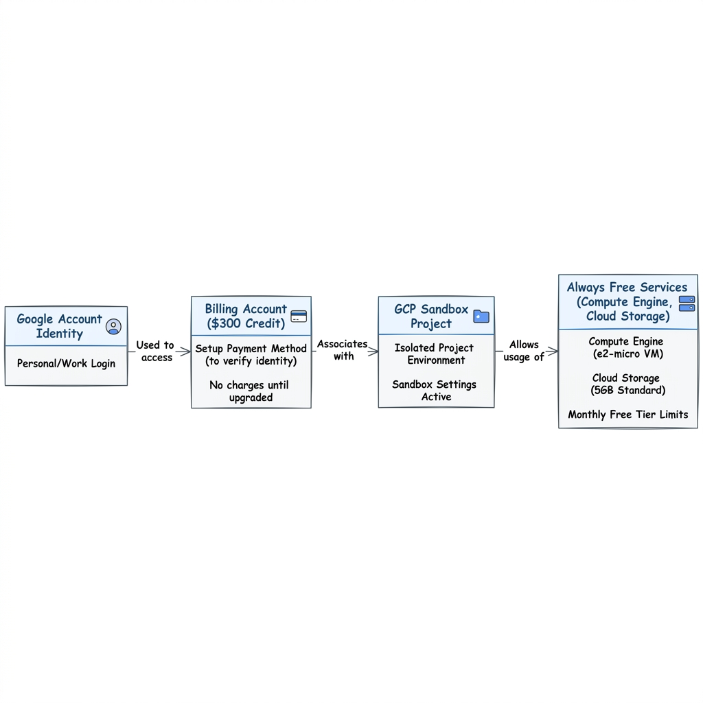
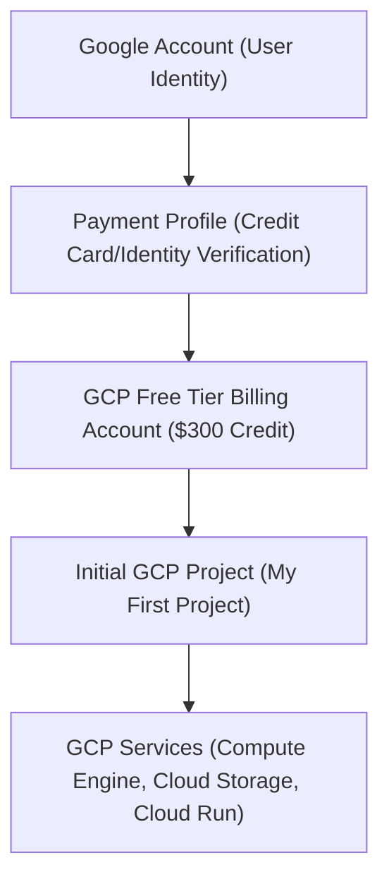

# Topic 01: Setup Free Account

---

## 1. What Is It?

A **GCP Free Tier Account** is Google Cloud Platform's entry mechanism for developers, architects, and enterprise engineers to experiment, build, and evaluate cloud services without upfront financial risk. 

It provides two distinct financial/resource safety nets:
1. **$300 Free Trial Credit**: Valid for 90 days across almost all GCP services.
2. **Always Free Tier**: Ongoing access to specified usage limits for core products (e.g., e2-micro VM, Cloud Storage 5GB, Cloud Functions 2M invocations/month) even after trial expiration.

### Real-World Analogy
Think of a GCP Free Account like a prepaid gym pass with two benefits: a **$300 gift card** to try premium personal training sessions for 90 days, plus **free lifetime access** to the basic dumbbell rack as long as you don't exceed 1 hour per day.

---

## 2. Where Does It Fit?

A Free Account sits at the absolute foundation of your journey in Google Cloud. It establishes your root identity, links your personal or corporate payment profile, and provisions your initial Billing Account and default Project.





---

## 3. Core Concepts

| Concept | What It Means | Why It Matters | Production Consideration |
|---|---|---|---|
| **Billing Account** | The financial entity attached to GCP projects that pays for resource usage. | Resources cannot be created without an active Billing Account. | Enterprise accounts use invoicing; free accounts use self-serve credit cards. |
| **$300 Free Credit** | Promotional credit granted upon initial registration, expiring in 90 days. | Allows zero-cost testing of high-tier services (e.g., GKE, BigQuery, Cloud SQL). | Once exhausted, services stop unless upgraded to a paid account. |
| **Always Free Limits** | Monthly non-expiring usage thresholds for specific GCP services. | Keeps small side-projects or learning workloads completely free indefinitely. | Exceeding Always Free thresholds incurs standard pay-as-you-go rates. |
| **Identity Verification** | Temporary $0–$1 authorization hold on a credit/debit card during sign-up. | Prevents automated bot creation and fraudulent crypto-mining abuse. | GCP does not automatically charge your card when the $300 credit expires. |
| **Upgrade Account** | Converting from Free Trial status to a standard Pay-As-You-Go Billing Account. | Required to unlock higher quotas (e.g., GPU instances, high CPU counts). | Manually required; prevents surprise billing upon trial expiration. |

---

## 4. How It Works

Registration links your Google Identity to a GCP Self-Serve Billing Account.

```text
User signs up with Google Account
              ↓
Credit Card submitted for Identity Verification ($0 auth hold)
              ↓
GCP allocates $300 Credit + 90-day expiration timer
              ↓
System creates default Billing Account & "My First Project"
              ↓
User provisions resources within Always Free & $300 limits
              ↓
Trial Expiration / Credit Depletion → Resources paused (No automatic card charge)
```

1. **Identity & Auth**: Google validates your identity via an existing Gmail/Google Workspace account.
2. **Verification**: Payment details are verified via micro-transaction.
3. **Provisioning**: A billing account (`Billing Account ID: 01XXXX-XXXXXX-XXXXXX`) is established and tied to your user identity with the `Billing Account Administrator` role.

---

## 5. Production Scenario

### Personal Learning Sandbox vs. Enterprise Developer Sandbox

```text
Requirement: Establish an isolated environment for safe experimentation without risk of overspending.
    ↓
Architecture: Dedicated GCP Project tied to a self-serve Free Tier Billing Account with strict programmatic budget caps.
    ↓
Configuration: Configure 50%, 80%, 100% budget alerts sending Pub/Sub notifications to Cloud Functions.
    ↓
Security: Enforce 2FA on Google Account, restrict root user privileges, create non-owner IAM roles for day-to-day work.
    ↓
Scaling: Operates under strict Free Tier quota ceilings (e.g., 8 vCPUs max per region).
    ↓
Monitoring: Cloud Billing Dashboard + Cloud Monitoring Billing Metrics.
```

*Why Selected*: Ensures complete financial isolation. A personal free account prevents accidental charges against company billing accounts during early learning phases.

---

## 6. Hands-On Lab

### Prerequisites
- Personal Google Account (Gmail) or Google Workspace user.
- Valid Credit/Debit Card (Visa, Mastercard, American Express).
- Modern web browser and terminal shell.

### Console Method
1. Navigate to [cloud.google.com/free](https://cloud.google.com/free) and click **Get Started for Free**.
2. Sign in with your Google Account.
3. **Step 1 of 2**: Select your Country and agree to the Terms of Service.
4. **Step 2 of 2**: Enter your phone number for SMS verification.
5. Enter payment details (Credit/Debit Card) and billing address.
6. Click **Start My Free Trial**.
7. In the GCP Console top bar, verify the banner showing **$300 credit remaining**.
8. Navigate to **Billing** → **Budgets & alerts** → Click **Create Budget**.
9. Set Budget Name to `Free-Trial-Guardrail`, Amount to `$1.00` (or `$300`), and configure alerts at 50%, 90%, and 100%.

### CLI Method
Install and initialize Google Cloud SDK locally:

```bash
# 1. Download and install gcloud SDK (or launch Cloud Shell in Console)
# 2. Authenticate CLI with your Google account
gcloud auth login

# 3. List active billing accounts to verify the Free Account creation
gcloud billing accounts list

# Expected Output:
# ACCOUNT_ID           NAME                    OPEN  MASTER_ACCOUNT_ID
# 01ABCD-234EFG-567HIJ My Billing Account      True

# 4. Set current project context
PROJECT_ID="free-tier-sandbox-01"
gcloud config set project $PROJECT_ID
```

### Verification
Execute in terminal / Cloud Shell:

```bash
gcloud billing accounts list --filter="open=true"
```
*Expected Result*: Returns `OPEN=True` for your newly created self-serve billing account.

### Cleanup
If you wish to terminate the account or avoid future billing risks:
1. Console: Go to **Billing** → **Account Management** → Click **Close Billing Account**.
2. CLI Command:
```bash
gcloud billing accounts describe YOUR_BILLING_ACCOUNT_ID
```

---

## 7. Security

### Identity, IAM & Access Control
- **Billing Account Creator**: Inherits `roles/billing.admin`.
- **Project Owner**: Default role assigned to the user who creates the project under the account.

```text
BAD PRACTICE:
Using personal Gmail root account with owner privileges for daily CLI operations without MFA enabled.
Risk: Password leakage leads to full billing account takeover and crypto-mining hijacking.

PRODUCTION PRACTICE:
Enforce 2-Step Verification (2SV) on Google Account. Create a secondary least-privilege IAM service account or user role for routine API interactions.
```

### Key Security Safeguards
- **Never export Service Account keys** to public GitHub repositories.
- **Set Organization / Folder policies** if creating under a domain to block public IP assignment.
- **Enable Cloud Audit Logs** for billing account mutation events.

---

## 8. Scaling & High Availability

Free accounts are subject to **Free Tier Quotas & Guardrails**:

```text
Free Account Limits (Personal)
   ↓ (Default: 8 vCPUs, 1 VPC, 5 GB GCS)
Small Project (Upgraded Account)
   ↓ (Increase Quotas via Support Request)
Hyperscaler Production (Enterprise Invoiced Billing)
   ↓ (Thousands of vCPUs, Multi-Region Managed Instance Groups)
```

- **Quotas**: Free trial accounts cannot request quota increases for high-end GPUs or massive compute instances.
- **Single Point of Failure**: A personal free account has no enterprise support SLA. For production workloads, upgraded accounts with direct Google Cloud Support packages are mandatory.

---

## 9. Cost

### Pricing Factors & Cost Triggers
- **Network Egress**: Data leaving GCP to the Internet is free up to 1 GB/month (Always Free), then charged per GB.
- **Persistent Disk (PD)**: Always Free allows up to 30 GB-months of Standard PD. Exceeding 30 GB incurs billing.
- **External IP Addresses**: Static and in-use ephemeral external IP addresses incur hourly charges if not within free thresholds.

```text
Always Free Guardrails:
- 1 e2-micro VM instance per month (us-central1, us-east1, us-west1)
- 5 GB-months Standard Storage in Cloud Storage
- 2,000,000 Cloud Function invocations/month
- 1 GB egress from North America to all internet destinations/month
```

---

## 10. Monitoring & Troubleshooting

### Essential Observability Features
- **Cloud Billing Dashboard**: Real-time spending reports categorized by service, project, and SKU.
- **Billing Health Notifications**: Automatic emails sent when budget thresholds (50%, 80%, 100%) are breached.

### Troubleshooting Matrix

| Symptom | Possible Cause | What to Check | Fix |
|---|---|---|---|
| Credit card rejected during sign-up | Virtual card, prepaid card, or bank blocking zero-auth holds | Bank transaction log / card type | Use a standard credit card or major debit card. |
| Cannot create VM instance | Regional vCPU quota exceeded for Free Tier | `gcloud compute project-info describe` | Switch region (e.g., `us-central1`) or use `e2-micro`. |
| Charged small fee despite free trial | Provisioned non-Always Free resources (e.g., SSD PD or load balancer) | Billing Console → Cost Table by SKU | Delete SSD PDs; replace with Standard PD (under 30GB). |
| $300 credit vanished before 90 days | Launched heavy resources (e.g., BigQuery multi-terabyte queries, 32-core VMs) | Billing Reports → Group by Service | Stop high-spec instances immediately; set daily quota limits. |

---

## 11. Common Mistakes

```text
Mistake: Assuming Always Free allows any VM instance type anywhere.
Why: Always Free e2-micro is restricted specifically to us-central1, us-east1, and us-west1.
Impact: Deploying e2-micro in europe-west1 consumes your $300 credit immediately.
Correct approach: Always deploy learning VMs in us-central1 / us-east1 using standard persistent disk.

Mistake: Leaving unattached External Static IP addresses running.
Why: GCP charges an hourly fee for unattached static IPs to prevent IP hoarding.
Impact: Small continuous trickle charges depleting credits or generating invoices.
Correct approach: Release unattached static IPs immediately when disassociating from VMs.

Mistake: Believing Google will automatically charge thousands of dollars upon trial expiration.
Why: Misunderstanding GCP's Free Tier terms.
Impact: Unnecessary fear of trying GCP.
Correct approach: GCP explicitly pauses resources at $300 / 90-day limits until you manually upgrade.
```

---

## 12. Production Best Practices

- [ ] Enable 2-Factor Authentication (2SV) on the Google Account used to register.
- [ ] Set up a **$1.00 Budget Alert** immediately after account creation.
- [ ] Verify VM instance selection uses `e2-micro` in `us-central1`, `us-east1`, or `us-west1`.
- [ ] Keep total Persistent Disk allocation under 30 GB Standard PD.
- [ ] Never check in Service Account key JSON files to version control.
- [ ] Monitor **Billing Reports** weekly to track credit consumption rate.

---

## 13. Hyperscaler / Enterprise Perspective

```text
Personal / Learning (Free Account)
  Self-serve credit card verification → $300 credit → Single Project → Personal Gmail identity
        ↓
Small Production
  Upgraded Billing Account → 1-3 Projects (Dev/Staging/Prod) → Basic IAM Roles
        ↓
Enterprise Environment
  Monthly Invoiced Billing Account → Organization Node → Folder Hierarchy → Shared VPC → Centralized IAM (Cloud Identity / Workspace)
        ↓
Hyperscaler Environment
  Multi-Organization / Multi-Billing Account setups → Automated Landing Zones via Terraform → FinOps Cost Guardrails → Centralized Security Command Center → Enterprise Support SLAs
```

In a hyperscaler environment, developers **never** sign up with personal credit cards for work. Enterprise landing zones provision sandboxes programmatically under corporate Billing Accounts with organizational policy guardrails preventing data exfiltration and budget overruns.

---

## 14. Real Project Questions

### Q1: What happens to my running workloads when the $300 trial credit expires?
**Answer:** GCP automatically shuts down and pauses your resources. Your data is retained for a grace period (typically 30 days), giving you time to upgrade to a paid account or export data before permanent deletion. Google will *never* automatically charge your credit card unless you explicitly click **Upgrade**.

### Q2: Can an enterprise use Free Accounts for development sandboxes?
**Answer:** No. Enterprises utilize Google Cloud Workspace/Cloud Identity integrated with an Enterprise Organization node and monthly invoicing. Dev sandboxes are provisioned as sub-projects under enterprise billing with Org Policies enforcing strict boundaries.

### Q3: How do Always Free tier limits interact with the $300 credit?
**Answer:** Always Free usage is consumed first at $0 cost. The $300 credit is only drawn down when your usage exceeds Always Free thresholds or when you consume non-Free-Tier services (e.g., GKE cluster management fees, BigQuery storage beyond 10GB).

---

## 15. Quick Decision Guide

| Requirement | Recommended Approach | Reason |
|---|---|---|
| Learning GCP fundamentals & CLI commands | **GCP Free Tier Account** | $0 risk, $300 credit, non-expiring Always Free limits. |
| Building enterprise production applications | **Enterprise Invoiced Account + Org Node** | Requires SLA, high quotas, centralized IAM, and corporate billing. |
| Running long-term lightweight web scraping bot | **Free Tier Account (e2-micro + GCS)** | Fits entirely within Always Free tier limits indefinitely. |

### When should I use it?
- Starting your GCP learning journey.
- Prototyping personal side projects or studying for GCP Certifications.

### When should I NOT use it?
- Hosting commercial production workloads requiring guaranteed uptime SLAs.
- Workloads requiring high vCPU counts, GPUs, or enterprise compliance (HIPAA, PCI-DSS).

---

## 16. Related Services

```text
                 [01. Setup Free Account]
                  /          |         \
         Billing Account    IAM    Resource Hierarchy
                |            |          |
         Budget Alerts   User Identity  GCP Project
```

- **Billing Accounts**: The core billing container managing payments and credits.
- **IAM (Identity & Access Control)**: Manages permissions on who can view/modify billing and resources.
- **Projects**: The organizational boundary where resources (VMs, Buckets) live under a billing account.

---

## 17. Cheat Sheet

### Essential Terminology
- **Free Trial**: $300 credit for 90 days.
- **Always Free**: Ongoing monthly non-expiring usage quotas.
- **Billing Account ID**: 18-character alphanumeric string identifying your payment entity.

### Useful CLI Commands
```bash
# Check current logged-in identity
gcloud auth list

# List all associated billing accounts
gcloud billing accounts list

# View active project configuration
gcloud config list project
```

---

## 18. Learning Connection

- **Previous Topic**: None
- **Next Topic**: [02. What is GCP](../02-what-is-gcp/README.md)
