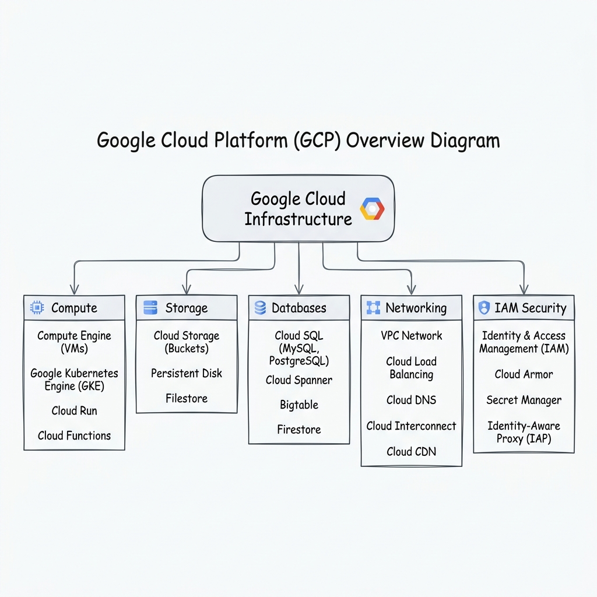
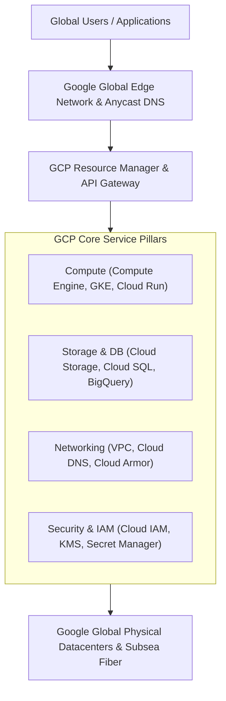

# Topic 02: What is GCP

---

## 1. What Is It?

**Google Cloud Platform (GCP)** is a comprehensive suite of cloud computing services provided by Google. It runs on the exact same global infrastructure that Google uses internally for its end-user consumer products, including Google Search, YouTube, Gmail, and Google Drive.

GCP provides infrastructure-as-a-service (IaaS), platform-as-a-service (PaaS), and serverless environments. It enables enterprises and developers to deploy scalable applications, analyze petabytes of data, train machine learning models, and manage global networks with low latency and high availability.

### Real-World Analogy
Think of GCP as renting space and specialized machinery inside Google's global digital factory. Instead of purchasing, powering, and maintaining your own physical servers, cooling systems, and fiber-optic cables, you pay only for the compute power, storage, and software services you consume on demand.

---

## 2. Where Does It Fit?

GCP sits between your application code / client devices and Google's physical datacenter hardware. It abstracts bare-metal servers, networking equipment, and disk arrays into API-driven virtual resources.





---

## 3. Core Concepts

| Concept | What It Means | Why It Matters | Production Consideration |
|---|---|---|---|
| **Cloud Resource Manager** | Hierarchical governance system managing Organizations, Folders, and Projects. | Controls permission inheritance, policy enforcement, and billing isolation. | Root policies cascade down; explicit denies block sub-folder overrides. |
| **GCP Control Plane** | The API ecosystem that receives deployment requests and orchestrates hardware. | All interactions (Console, gcloud CLI, Terraform) route through GCP APIs. | Control plane availability is decoupled from data plane runtime availability. |
| **Data Plane** | The underlying execution engine running VMs, containers, and network packets. | Where application workloads actually execute and process customer traffic. | Must be engineered across multiple zones/regions for fault tolerance. |
| **API-First Platform** | Every feature in GCP is exposed via REST/gRPC APIs before UI integration. | Allows 100% automation of infrastructure via Infrastructure as Code (IaC). | Service APIs must be explicitly enabled per project before deployment. |
| **Multi-Tenancy** | Sharing physical hardware securely among isolated customer tenants. | Maximizes hardware efficiency while maintaining hypervisor/container security boundaries. | Highly regulated industries can use Dedicated Nodes or Sole-Tenant Nodes. |

---

## 4. How It Works

When an engineer issues a command or deploys a service, GCP processes the request through a standardized control flow:

```text
User / Terraform / gcloud CLI
              ↓
HTTPS REST / gRPC API Request to Google Cloud Endpoint
              ↓
Cloud IAM Authentication & Authorization Check
              ↓
Resource Manager validates Quotas & Organization Policies
              ↓
GCP Control Plane dispatches instruction to Datacenter Controllers
              ↓
Physical hardware provisions Virtual Machine / Container / Storage Object
              ↓
Status updated in GCP API & returned to caller
```

1. **Authentication**: Your identity (User or Service Account) is verified via OAuth2 / OIDC tokens.
2. **Authorization**: IAM evaluates policy bindings attached to the target resource and project.
3. **Orchestration**: Internal Borg and Jupiter cluster software allocate virtual CPUs, RAM, or disk blocks across physical hardware racks.

---

## 5. Production Scenario

### Enterprise Cloud Adoption Architecture

```text
Requirement: Migrate an enterprise web application and analytics platform to GCP with zero downtime.
    ↓
Architecture: Hybrid VPC connected via Cloud Interconnect; web tier on Cloud Run; transactional DB on Cloud SQL; analytics on BigQuery.
    ↓
Configuration: Terraform provisions multi-region infrastructure under an Enterprise Organization Node.
    ↓
Security: Identity-Aware Proxy (IAP) enforces Zero Trust access; CMEK encrypts data at rest; Cloud Armor mitigates DDoS.
    ↓
Scaling: Global External HTTP(S) Load Balancer distributes incoming traffic automatically across regional backends.
    ↓
Monitoring: Centralized Cloud Monitoring dashboards with alerts pushed to PagerDuty.
```

*Why Selected*: Combines serverless execution for automatic scaling with managed relational and analytical database engines, backed by Google's private subsea network.

---

## 6. Hands-On Lab

### Prerequisites
- GCP Free Account or Sandbox Project (from Topic 01).
- Google Cloud SDK installed or Cloud Shell access.
- IAM permissions: `roles/viewer` or `roles/editor`.

### Console Method
1. Log into the [Google Cloud Console](https://console.cloud.google.com/).
2. In the top navigation bar, open the **Project Selector** and choose your active project.
3. Open the **Navigation Menu** (top-left burger menu) to view service categories (Compute, Storage, Databases, Networking).
4. Navigate to **APIs & Services** → **Library**.
5. Search for `Compute Engine API` and observe its status (click **Enable** if not enabled).
6. Open **Cloud Shell** by clicking the terminal icon in the top right header bar.

### CLI Method
Execute in Cloud Shell or local terminal:

```bash
# Set project context
PROJECT_ID="your-gcp-project-id"
gcloud config set project $PROJECT_ID

# List all enabled Google APIs in your project
gcloud services list --enabled

# Query available GCP regions worldwide
gcloud compute regions list --format="table(name, status, zones)"

# Describe current project metadata
gcloud projects describe $PROJECT_ID
```

### Verification
Verify that your CLI communicates with GCP control plane APIs:

```bash
gcloud compute zones list --filter="region:us-central1"
```
*Expected Result*: Returns a table listing `us-central1-a`, `us-central1-b`, `us-central1-c`, `us-central1-f`.

### Cleanup
No billable resources were provisioned in this introductory overview lab. To disable an API if required:
```bash
# Optional cleanup example
# gcloud services disable compute.googleapis.com
```

---

## 7. Security

### Foundation Security Principles
- **Encryption by Default**: All data stored inside GCP is automatically encrypted at rest using AES-256 before being written to disk.
- **TLS in Transit**: Data moving across Google's global network between datacenters is encrypted automatically.
- **Identity-Centric Perimeter**: GCP replaces traditional network-only firewalls with IAM and Identity-Aware Proxy (Zero Trust model).

```text
BAD PRACTICE:
Enabling all GCP APIs indiscriminately across all projects and giving developers Organization Admin roles.
Risk: Excessive blast radius; security vulnerabilities exposed by unused APIs.

PRODUCTION PRACTICE:
Enable only required APIs per project via Terraform. Enforce least-privilege IAM roles and Organization Policies restricting external IP creation.
```

---

## 8. Scaling & High Availability

GCP infrastructure scales across three architectural tiers:

```text
Zonal Resources (e.g., Compute Instance, Single-zone Persistent Disk)
   ↓ (Manual replication or Managed Instance Groups)
Regional Resources (e.g., Regional GKE, Cloud SQL High Availability, Regional VPC Subnet)
   ↓ (Anycast routing & multi-region replication)
Global Resources (e.g., Global Load Balancer, Cloud Storage Multi-Region, Spanner, Cloud DNS)
```

- **Traffic Expansion Handling**:
  - **100 users**: Single instance or basic Cloud Run service handling request traffic.
  - **10,000 users**: Regional Managed Instance Group / Autopilot GKE auto-scaling across 3 Availability Zones.
  - **1,000,000 users**: Multi-region deployment behind a Global HTTP(S) Load Balancer with Cloud CDN caching edge content.

---

## 9. Cost

### Main Pricing Drivers
- **Compute**: Charged per vCPU second and RAM GB-hour consumed.
- **Storage**: Charged per GB-month based on storage class (Standard, Nearline, Coldline, Archive).
- **Network Egress**: Data transferred out of GCP to external networks or between regions.

### FinOps Optimization Rules
- Shut down non-production development environments outside business hours.
- Utilize Committed Use Discounts (CUDs) for predictable 1-year or 3-year workloads.
- Avoid cross-region data transfers whenever possible.

---

## 10. Monitoring & Troubleshooting

### GCP Health & Observability Tools
- **Google Cloud Service Health Dashboard**: Public status page monitoring GCP service outages globally.
- **Cloud Logging**: Aggregate log stream capturing API calls, system events, and application logs.

### Troubleshooting Matrix

| Symptom | Possible Cause | What to Check | Fix |
|---|---|---|---|
| `API Has Not Been Used` error when running gcloud commands | The specific GCP service API is disabled for the project | `gcloud services list --available` | Run `gcloud services enable <api_name>.googleapis.com`. |
| Permission Denied (`403 Forbidden`) | User or Service Account lacks IAM permission for the service API | Cloud Logging IAM Audit Logs | Grant required predefined role via Cloud IAM console/CLI. |
| Cannot access GCP resources from external network | Organization Policy or VPC firewall rule blocking access | VPC Firewall Rules & Org Policies | Adjust firewall ingress rules or use Identity-Aware Proxy. |

---

## 11. Common Mistakes

```text
Mistake: Treating GCP exactly like a traditional physical datacenter or legacy VM host.
Why: Overlooking serverless, managed services, and cloud-native architecture benefits.
Impact: Higher operational overhead, overprovisioned resources, and increased costs.
Correct approach: Utilize managed PaaS services (Cloud Run, Cloud SQL) over self-managed IaaS where applicable.

Mistake: Deploying production resources into the default project without folders or IAM structure.
Why: Skipping resource hierarchy setup during initial experimentation.
Impact: Inability to enforce granular security policies or isolate environment billing.
Correct approach: Create dedicated Projects inside DEV/STAG/PROD Folders under an Organization Node.
```

---

## 12. Production Best Practices

- [ ] Structure projects logically using Folders (Dev, Staging, Production).
- [ ] Enable only necessary GCP APIs required for application workloads.
- [ ] Implement Least Privilege access control via Cloud IAM predefined roles.
- [ ] Enforce Organization Policies to restrict public IP exposure and unauthorized regions.
- [ ] Deploy workloads across multiple Availability Zones for high availability.
- [ ] Use Infrastructure as Code (Terraform) to manage GCP resource declarations.

---

## 13. Hyperscaler / Enterprise Perspective

```text
Personal / Learning
  Single GCP Project → Manual Console ClickOps → Default VPC → Basic Compute
        ↓
Small Production
  Dev & Prod Projects → Custom VPC → Managed Databases → Basic Monitoring Alerts
        ↓
Enterprise Environment
  Organization Node → Folder Hierarchy → Shared VPC → IAM Single Sign-On (SAML/OIDC) → Dedicated Interconnect
        ↓
Hyperscaler Environment
  Multi-Region Landing Zones → Automated Terraform Pipelines → Zero Trust Architecture → Centralized FinOps & Security Operations Center (SOC)
```

In a hyperscaler environment, GCP is managed as an automated software platform. Infrastructure changes pass through git-driven CI/CD pipelines, security compliance checks are automated via Security Command Center, and network traffic routes privately across dedicated fiber backbones.

---

## 14. Real Project Questions

### Q1: What makes GCP's network architecture unique compared to other cloud providers?
**Answer:** Google owns and operates its own private global fiber-optic network backbone. When traffic enters GCP through Anycast IP addresses at an edge PoP, it immediately enters Google's private network rather than traversing the public internet, drastically reducing latency and packet loss.

### Q2: How does GCP isolate data between different enterprise customers?
**Answer:** GCP enforces strict multi-tenancy isolation at multiple layers: KVM hypervisors separate Compute Engine instances, gVisor container sandboxing isolates Cloud Run/GKE pods, customer-specific encryption keys protect disk storage, and logical IAM boundaries isolate project resources.

### Q3: What is the difference between GCP Control Plane and Data Plane?
**Answer:** The Control Plane processes API calls, authenticates requests, and manages resource states. The Data Plane carries out actual workload execution and data processing. A temporary Control Plane outage does not disrupt already running VM instances or active database queries on the Data Plane.

---

## 15. Quick Decision Guide

| Requirement | Recommended Approach | Reason |
|---|---|---|
| Rapid deployment of containerized web API | **Cloud Run** | Serverless, auto-scales from 0 to thousands, zero server management. |
| Production Kubernetes with full control | **GKE (Google Kubernetes Engine)** | Deep integration with GCP networking, IAM, and auto-scaling. |
| Massive enterprise data analytics | **BigQuery** | Serverless SQL data warehouse scaling to petabytes in seconds. |

### When should I use it?
- Building modern, scalable, cloud-native applications.
- Processing large-scale analytical and machine learning workloads.

### When should I NOT use it?
- Legacy applications with hardcoded physical hardware dependencies that cannot be virtualized.
- Environments prohibited by strict regulatory sovereignty from utilizing public cloud infrastructure.

---

## 16. Related Services

```text
                 [02. What is GCP]
                  /      |      \
        Compute Engine  VPC   Cloud Storage
               |         |        |
              IAM    Networking  Security
```

- **Cloud IAM**: Manages identity and access permissions for all GCP services.
- **VPC (Virtual Private Cloud)**: Provides private networking boundaries for compute resources.
- **Cloud Storage**: Serves as the primary object store integrated across all GCP services.

---

## 17. Cheat Sheet

### Essential Terminology
- **Google Cloud Console**: The web UI for GCP management.
- **gcloud CLI**: Command-line tool for GCP automation.
- **Resource Manager**: API managing GCP resource hierarchy.
- **Region**: Geographic location composed of multiple independent Zones.

### Useful CLI Commands
```bash
# View active account configuration
gcloud auth list

# Set default working project
gcloud config set project PROJECT_ID

# List all available GCP regions
gcloud compute regions list

# Check enabled APIs in current project
gcloud services list --enabled
```

---

## 18. Learning Connection

- **Previous Topic**: [01. Setup Free Account](../01-setup-free-account/README.md)
- **Next Topic**: [03. Why GCP is Used](../03-why-gcp-is-used/README.md)
