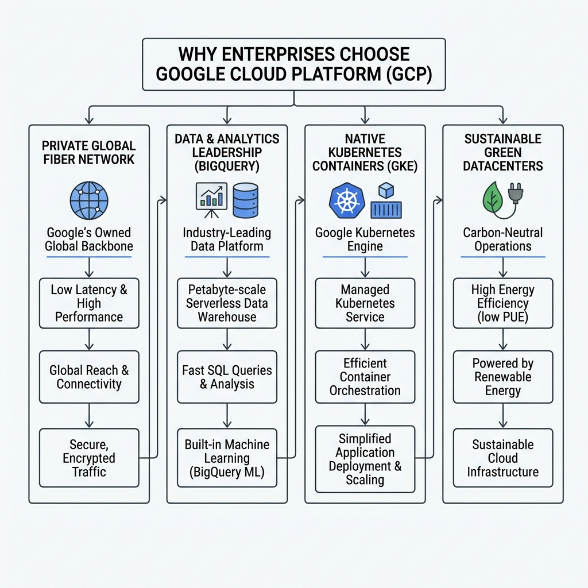
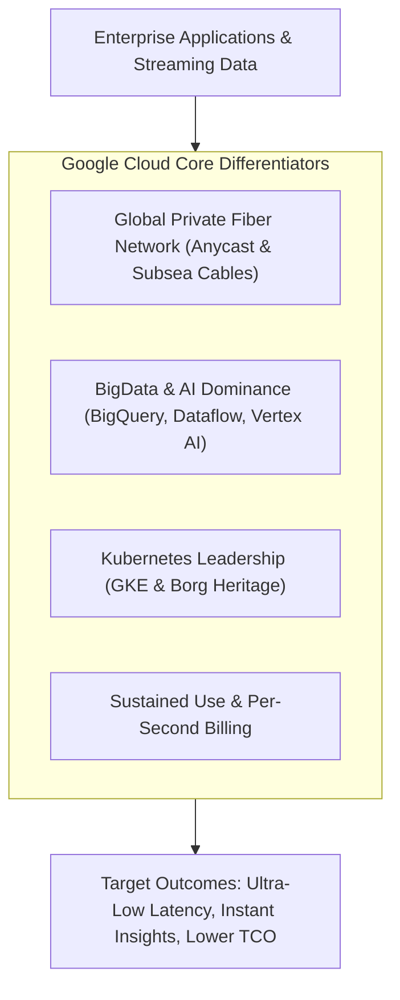

# Topic 03: Why GCP is Used

---

## 1. What Is It?

Enterprises choose **Google Cloud Platform (GCP)** over competing cloud providers due to distinct engineering differentiators: Google's proprietary global private network backbone, industry-leading data analytics and AI capabilities, native Kubernetes container orchestration, and serverless compute efficiency.

While all major cloud hyperscalers offer basic virtual machines and storage, GCP stands out for organizations requiring ultra-low latency networking, petabyte-scale real-time data processing, modern containerization, and carbon-neutral energy efficiency.

### Real-World Analogy
Choosing GCP is like choosing to transport high-speed freight on Google's private, dedicated bullet train network instead of using congested public highways. Your data travels directly across Google's private fiber lines, bypassing public internet bottlenecks and transit hops.

---

## 2. Where Does It Fit?

GCP fits into enterprise architectures as an engine for high-performance data processing, global application distribution, and cloud-native containerized microservices.





---

## 3. Core Concepts

| Concept | What It Means | Why It Matters | Production Consideration |
|---|---|---|---|
| **Private Global Network** | Google owns and operates hundreds of thousands of miles of private subsea and terrestrial fiber cables. | Bypasses public internet congestion, resulting in lower latency, lower packet loss, and higher security. | Premium Tier networking routes packets via Google's backbone immediately at the nearest edge PoP. |
| **Data & Analytics Engine** | Serverless tools like BigQuery, Dataflow, and Pub/Sub designed for petabyte-scale analytics. | Enables real-time analytics and ML model training without managing database server infrastructure. | BigQuery uses a decoupled compute/storage architecture for cost-effective query scaling. |
| **Kubernetes Originator** | Kubernetes was created by Google based on 15+ years of internal Borg cluster management. | GKE offers the most mature, seamless, and automated Kubernetes management environment in the cloud industry. | GKE Autopilot manages node provisioning, security hardening, and OS upgrades automatically. |
| **Sustained Use Discounts** | Automatic discounts applied by GCP for running VM instances for a significant portion of a billing month. | Reduces compute costs automatically without requiring upfront multi-year financial lock-in. | Can be combined with Committed Use Discounts (CUDs) for maximum FinOps savings. |
| **Per-Second Billing** | Compute resources (Compute Engine, Cloud Run) are billed per second after a 1-minute minimum. | Eliminates paying for unused idle compute minutes during batch runs and auto-scaling events. | Ideal for ephemeral workloads, microservices, and auto-scaled workloads. |

---

## 4. How It Works

GCP delivers performance advantages through specialized hardware and software engineering innovations:

```text
Incoming Enterprise Workload / Request
              ↓
Ingress at Google Edge Point of Presence (PoP) via Anycast IP
              ↓
Traffic routed into Google's Private Fiber Backbone (Bypassing public transit)
              ↓
Processed by Andromeda Software-Defined Network (SDN)
              ↓
Executed on Custom Google Hardware (Titan Security Chips & TPU Accelerators)
              ↓
Data stored in Colossus Distributed Storage System & BigQuery Capacitor engine
```

1. **Edge Networking**: Traffic enters Google's network at the PoP closest to the user.
2. **Software-Defined Networking**: Google's Andromeda SDN orchestrates network throughput at multi-terabit speeds.
3. **Analytics Pipeline**: BigQuery processes queries by separating storage (Colossus) from compute (Dremel execution engines).

---

## 5. Production Scenario

### Real-Time Financial Fraud Detection & Global E-Commerce

```text
Requirement: Process 50,000 transactions per second globally with sub-50ms fraud analysis and real-time reporting.
    ↓
Architecture: Edge ingress via Cloud Armor → Cloud Run API → Pub/Sub messaging → Dataflow streaming → BigQuery ML → Cloud Spanner.
    ↓
Configuration: Multi-region active-active deployment using Premium Tier Global Network routing.
    ↓
Security: Data encrypted in transit across Google backbone; CMEK keys protect database storage.
    ↓
Scaling: Serverless Auto-scaling handles 10x traffic spikes during promotional events automatically.
    ↓
Monitoring: Custom Cloud Monitoring metrics tracking end-to-end processing latency.
```

*Why GCP Selected*: Competitors require complex multi-vendor stitching to achieve sub-second global database consistency and streaming analytics. GCP handles this natively using Cloud Spanner and BigQuery.

---

## 6. Hands-On Lab

### Prerequisites
- GCP Project with Compute Engine and BigQuery APIs enabled.
- Cloud Shell or local `gcloud` CLI installed.
- IAM permissions: `roles/bigquery.user` and `roles/compute.networkViewer`.

### Console Method
1. Open the [Google Cloud Console](https://console.cloud.google.com/).
2. Navigate to **BigQuery** in the top search bar.
3. In the Explorer pane, click **+ Add** → **Public Datasets**.
4. Search for `usa_names` or `covid19_open_data` and select it.
5. Click **Query** and execute a sample SQL query across millions of rows:
   ```sql
   SELECT state, gender, year, name, number
   FROM `bigquery-public-data.usa_names.usa_1910_2013`
   WHERE year = 2000
   ORDER BY number DESC
   LIMIT 100;
   ```
6. Observe the execution details: Query completes in under 1 second processing megabytes of data without managing any server hardware.

### CLI Method
Compare Premium Tier network routing vs Standard Tier routing using `gcloud`:

```bash
# 1. Inspect default network tier configuration
gcloud compute project-info describe --format="value(defaultNetworkTier)"

# Expected Output: PREMIUM

# 2. Test BigQuery query execution directly from CLI
gcloud bigquery query \
    --use_legacy_sql=false \
    'SELECT count(*) AS total_rows FROM `bigquery-public-data.usa_names.usa_1910_2013`'
```

### Verification
Confirm that BigQuery query returns row counts instantly via command line.

### Cleanup
Public dataset queries fall within the Always Free tier (1 TB queries/month free). No resource deletion is required.

---

## 7. Security

### GCP Security Differentiators
- **Custom Hardware Security**: Google designs custom server hardware and manufactures proprietary **Titan security chips** to verify hardware root-of-trust.
- **Subsea Network Encryption**: Traffic traveling between Google datacenters is automatically encrypted at the physical network layer (MACsec).
- **VPC Service Controls**: Creates security perimeters around Google managed services to prevent data exfiltration.

```text
BAD PRACTICE:
Selecting Standard Tier networking for cross-region data transfers to save minimal bandwidth costs.
Risk: Traffic routes over the public internet, exposing packets to public ISP transit latency and external inspection.

PRODUCTION PRACTICE:
Enforce Premium Tier networking by default. Secure managed service APIs using VPC Service Controls and CMEK encryption.
```

---

## 8. Scaling & High Availability

GCP provides global availability out of the box through Anycast IP routing:

```text
Single Region Deployment (Standard Cloud Setup)
   ↓ (GCP Global Anycast IP Load Balancer)
Multi-Region Active-Active Deployment (Traffic routes to nearest healthy region automatically)
   ↓ (Cloud Spanner / BigQuery Multi-Region)
Global Hyperscaler Architecture (Zero-downtime regional failover)
```

- **Traffic Growth Capability**:
  - **100 users**: Single Cloud Run instance handling requests.
  - **10,000 users**: Cloud Run auto-scales instances across multiple zones automatically.
  - **1,000,000 users**: Global HTTP(S) Load Balancer distributes traffic across multiple continents using a single static Anycast IP address.

---

## 9. Cost

### Financial Advantages of GCP
- **Per-Second Billing**: Compute Engine, Cloud Run, and Cloud Functions bill by the second rather than rounding up to full hours.
- **Sustained Use Discounts (SUD)**: Automatic savings of up to 30% on Compute Engine VMs running continuously without upfront commitment.
- **Custom Machine Types**: Configure exact vCPU and RAM ratios instead of paying for fixed pre-defined instance sizes.

---

## 10. Monitoring & Troubleshooting

### Key Observability Tools
- **Cloud Monitoring**: Integrated infrastructure and application metrics.
- **Network Intelligence Center**: Network Topology and Connectivity Tests visualizing global traffic paths.

### Troubleshooting Matrix

| Symptom | Possible Cause | What to Check | Fix |
|---|---|---|---|
| High network latency between client and GCP | Egress configured to use Standard Tier instead of Premium Tier | `gcloud compute instances describe <instance>` | Change network tier to `PREMIUM`. |
| BigQuery query costs escalating | Unoptimized `SELECT *` queries scanning full table partitions | BigQuery Query Validator (bytes billed indicator) | Use partitioned and clustered tables; specify exact columns. |
| GKE Pod deployment delays | Node pool auto-scaling ceiling reached | `gcloud container clusters describe` | Increase maximum node pool quota limits. |

---

## 11. Common Mistakes

```text
Mistake: Choosing pre-defined VM sizes when custom CPU/RAM ratios fit the workload better.
Why: Habit from legacy cloud platforms with rigid VM instance matrices.
Impact: Paying for unused memory or idle vCPUs.
Correct approach: Create Custom Machine Types matching exact memory and vCPU requirements.

Mistake: Running raw database software inside Compute Engine VMs instead of managed services.
Why: Overlooking Cloud SQL, Firestore, and Spanner capabilities.
Impact: Massive engineering overhead for manual backups, failovers, and OS patching.
Correct approach: Use Cloud SQL or Spanner for managed relational databases with built-in HA.
```

---

## 12. Production Best Practices

- [ ] Use Premium Tier networking for latency-critical production applications.
- [ ] Utilize Custom Machine Types to rightsize Compute Engine instances.
- [ ] Adopt serverless products (Cloud Run, BigQuery) to eliminate infrastructure management.
- [ ] Implement Committed Use Discounts (CUDs) for baseline production compute.
- [ ] Enforce VPC Service Controls to prevent unauthorized data exfiltration.
- [ ] Partition and cluster BigQuery tables to optimize analytical query costs.

---

## 13. Hyperscaler / Enterprise Perspective

```text
Personal / Learning
  Single Project → Basic VM / BigQuery experimentation → Standard Networking
        ↓
Small Production
  Custom VPC → Managed Databases (Cloud SQL) → Automatic Sustained Use Discounts
        ↓
Enterprise Environment
  Dedicated Interconnect → Shared VPC → BigQuery Enterprise Data Lake → Multi-Region GKE
        ↓
Hyperscaler Environment
  Global Anycast Load Balancing → Subsea Fiber Infrastructure → Anthos Multi-Cloud Orchestration → Automated FinOps Governance
```

In a hyperscaler environment, enterprises leverage GCP's global network and data analytics platforms to unify multi-region operations under a single global network perimeter with automated security and FinOps controls.

---

## 14. Real Project Questions

### Q1: Why do data-intensive companies choose BigQuery over traditional data warehouses?
**Answer:** BigQuery decouples compute from storage completely. Storage scales automatically at low object-storage rates, while compute (Dremel slots) scales instantly to thousands of cores on demand. Users execute SQL queries across petabytes of data in seconds without provisioning database clusters.

### Q2: What is the difference between GCP Premium Tier and Standard Tier networking?
**Answer:** Premium Tier routes traffic onto Google's private global fiber network at the Point of Presence (PoP) nearest to the user. Standard Tier routes traffic across the public ISP internet until it reaches the destination GCP region. Premium Tier offers lower latency, less jitter, and higher reliability.

### Q3: How does GCP GKE differ from self-managed Kubernetes on other clouds?
**Answer:** GKE is developed by the creators of Kubernetes. It provides advanced automated capabilities like Autopilot mode, automated cluster repairs, 4-layer auto-scaling (HPA, VPA, Cluster Autoscaler, NAP), and native integration with GCP IAM and VPC-native networking.

---

## 15. Quick Decision Guide

| Requirement | Recommended Approach | Reason |
|---|---|---|
| Latency-sensitive global web application | **GCP Global External Load Balancer + Premium Tier** | Uses Anycast IP to ingest traffic at the closest global PoP onto Google's private network. |
| Petabyte-scale SQL analytics without cluster management | **BigQuery** | Serverless SQL engine with automatic compute scaling and zero infrastructure management. |
| Production containerized workloads with minimal ops | **GKE Autopilot** | Fully managed Kubernetes where Google manages nodes, scaling, security, and control plane. |

### When should I use it?
- Applications requiring ultra-fast global networking, container scalability, or real-time big data processing.
- Organizations seeking carbon-neutral cloud infrastructure and transparent per-second billing.

### When should I NOT use it?
- Workloads tied tightly to proprietary legacy operating systems with no cloud migration path.
- Environments where local region coverage is unavailable in specific niche jurisdictions.

---

## 16. Related Services

```text
              [03. Why GCP is Used]
               /        |        \
        BigQuery       GKE   Global Networking
           |            |            |
      Data Analytics Containers   Subsea Fiber
```

- **BigQuery**: Enterprise serverless analytical data warehouse.
- **GKE (Google Kubernetes Engine)**: Managed Kubernetes container platform.
- **Cloud Armor**: Edge security and DDoS protection for global applications.

---

## 17. Cheat Sheet

### Key Concepts
- **Anycast IP**: Single IP address routing traffic to the nearest healthy edge datacenter.
- **Premium Tier**: Network routing via Google's private global fiber.
- **Titan Chip**: Hardware security chip verifying server boot integrity.

### Useful Commands
```bash
# Check current default network tier
gcloud compute project-info describe --format="value(defaultNetworkTier)"

# Execute a fast BigQuery test query
gcloud bigquery query --use_legacy_sql=false 'SELECT 1'

# List custom machine type availability in a zone
gcloud compute machine-types list --filter="zone:us-central1-a AND name:e2-custom*"
```

---

## 18. Learning Connection

- **Previous Topic**: [02. What is GCP](../02-what-is-gcp/README.md)
- **Next Topic**: [04. Cloud Computing Fundamentals](../04-cloud-computing-fundamentals/README.md)
