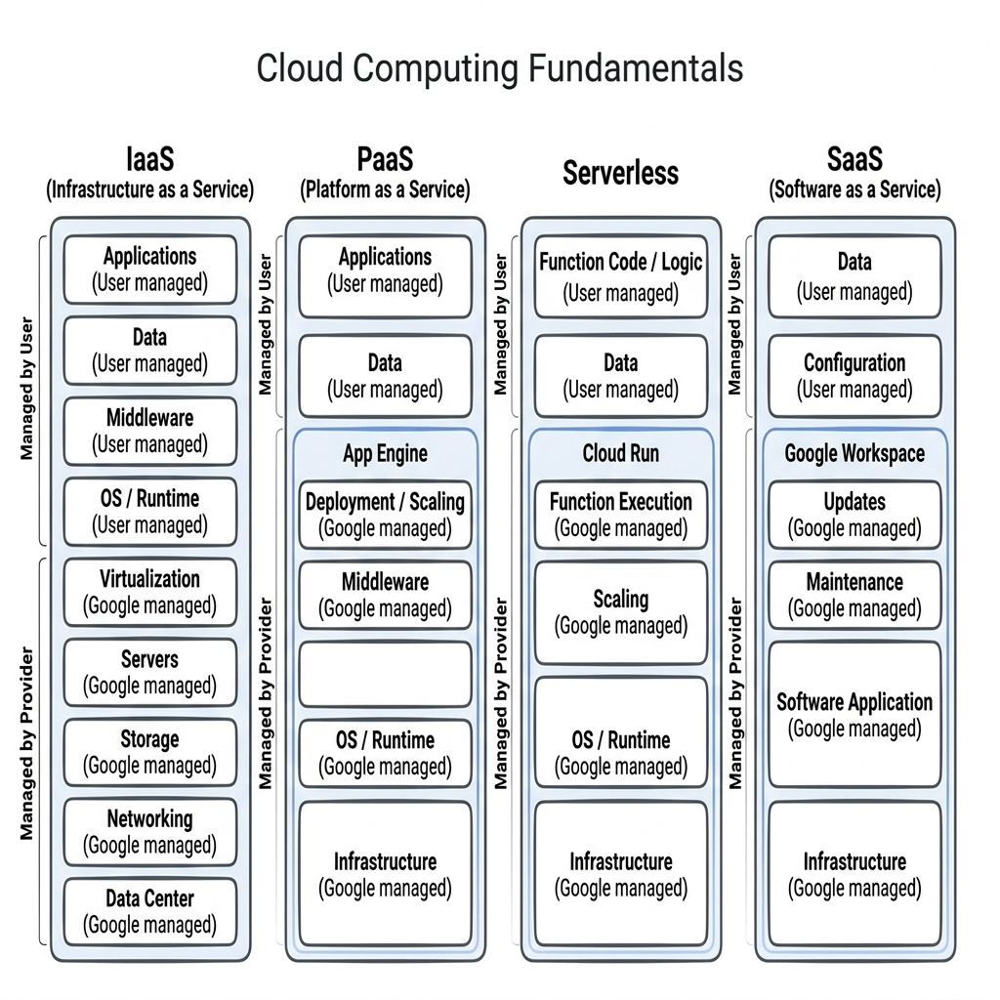
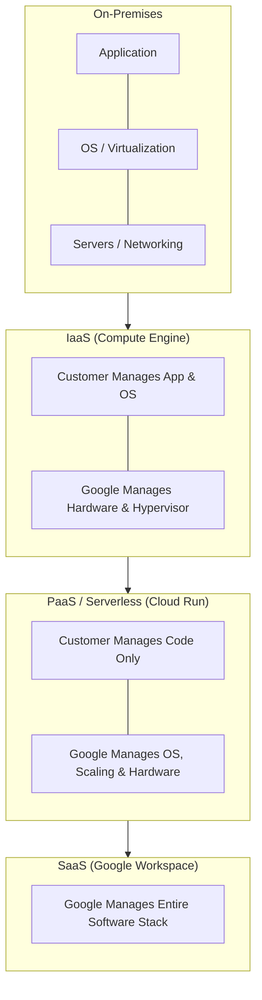

# Topic 04: Cloud Computing Fundamentals

---

## 1. What Is It?

**Cloud Computing** is the on-demand delivery of computing power, database storage, applications, and other IT resources through a cloud services platform over the internet with pay-as-you-go pricing.

Instead of buying, owning, and maintaining physical datacenters and hardware servers, organizations access technology services on an as-needed basis from a cloud provider like Google Cloud. Cloud computing converts capital expenditures (CapEx) into variable operational expenditures (OpEx), enabling rapid innovation and instant global scalability.

### Real-World Analogy
Think of cloud computing like the modern electrical grid. Instead of building your own power generator, installing transmission lines, and maintaining transformers at your home, you plug into the municipal grid, use electricity on demand, and receive a monthly bill based only on the exact kilowatt-hours consumed.

---

## 2. Where Does It Fit?

Cloud computing models define the division of operational responsibility between the customer and Google Cloud across hardware, virtualization, operating systems, runtime environments, and applications.





---

## 3. Core Concepts

| Service Model | Customer Manages | Google Manages | GCP Example | Best Used For |
|---|---|---|---|---|
| **IaaS** (Infrastructure as a Service) | OS, Runtime, Middleware, Data, Applications | Physical Servers, Storage, Networking, Hypervisor | Compute Engine (VMs), Persistent Disk | Lift-and-shift migration, custom OS requirements |
| **PaaS** (Platform as a Service) | Application Code, Data, Configuration | OS, Patching, Runtime, Hardware, Scaling | App Engine, Cloud SQL | Rapid application development without OS ops |
| **Serverless / FaaS** (Function as a Service) | Code & Event Triggers | Everything (Zero instances, auto-scale 0 to N) | Cloud Functions, Cloud Run | Event-driven microservices, REST APIs |
| **SaaS** (Software as a Service) | User Access & Data Configuration | Entire Application, Infrastructure, Upgrades | Google Workspace, BigQuery (as SaaS analytical DW) | End-user productivity, turnkey enterprise apps |

---

## 4. How It Works

Cloud computing relies on **Virtualization** and **Multi-Tenancy** orchestrated by a distributed software abstraction layer.

```text
Customer Application Code / API Call
              ↓
Virtualization Layer (Hypervisor / Container Runtime / KVM)
              ↓
Software-Defined Control Plane (Borg Cluster Management System)
              ↓
Physical Hardware Rack (CPU, Memory, Storage, NIC)
              ↓
Metered Billing Engine (Tracks exact vCPU-seconds & Network GBs)
```

1. **Virtualization**: Software (KVM/gVisor) partitions physical servers into multiple isolated Virtual Machines or Containers.
2. **Elasticity**: Resources expand or contract automatically in response to real-time workload demand.
3. **Resource Pooling**: Physical compute, storage, and networking resources are pooled to serve multiple customers securely.

---

## 5. Production Scenario

### Legacy Application Migration & Modernization Pipeline

```text
Requirement: Migrate an on-premises monolithic e-commerce stack to GCP and modernize it for high elasticity.
    ↓
Phase 1 (IaaS): Rehost legacy VMs onto Compute Engine instances attached to a Custom VPC.
    ↓
Phase 2 (PaaS): Migrate PostgreSQL database to Cloud SQL to automate backups, replication, and failovers.
    ↓
Phase 3 (Serverless): Decompose stateless API endpoints into Cloud Run containerized microservices.
    ↓
Security: Enforce IAM roles across service boundaries; CMEK encryption for stored data.
    ↓
Scaling: Automated auto-scaling from 0 to 5,000 instances during peak shopping events.
    ↓
Monitoring: Unified Cloud Monitoring dashboards observing latency across IaaS and Serverless tiers.
```

*Why Selected*: Allows instant migration via IaaS without code changes, followed by progressive refactoring into Serverless PaaS to reduce ongoing maintenance costs.

---

## 6. Hands-On Lab

### Prerequisites
- GCP Sandbox Project with Compute Engine API enabled.
- Access to Cloud Shell or local `gcloud` CLI.
- Basic familiarity with Linux shell commands.

### Console Method
1. Open the [Google Cloud Console](https://console.cloud.google.com/).
2. Navigate to **Compute Engine** → **VM instances** (IaaS Model).
3. Click **Create Instance**.
4. Configure Name: `iaas-demo-vm`, Region: `us-central1`, Machine Type: `e2-micro`.
5. Under **Boot Disk**, select `Debian GNU/Linux 11`.
6. Click **Create** and observe how GCP provisions an IaaS VM in under 30 seconds.
7. Next, navigate to **Cloud Run** (Serverless Model) and observe how serverless deployments accept ready-to-run container images without configuring underlying OS VMs.

### CLI Method
Provision an IaaS VM instance using `gcloud`:

```bash
# Set active project
PROJECT_ID="your-gcp-project-id"
gcloud config set project $PROJECT_ID

# Create an IaaS Compute Engine VM
gcloud compute instances create iaas-lab-vm \
    --zone=us-central1-a \
    --machine-type=e2-micro \
    --image-family=debian-11 \
    --image-project=debian-cloud

# Describe instance details to verify hypervisor & network provisioning
gcloud compute instances describe iaas-lab-vm --zone=us-central1-a
```

### Verification
Connect to the newly created IaaS virtual machine via SSH:

```bash
gcloud compute ssh iaas-lab-vm --zone=us-central1-a --command="uname -a"
```
*Expected Result*: Returns Linux kernel details from inside your isolated IaaS Virtual Machine.

### Cleanup
Delete the IaaS VM instance immediately to prevent unnecessary compute charges:

```bash
gcloud compute instances delete iaas-lab-vm --zone=us-central1-a --quiet
```

---

## 7. Security

### Shared Responsibility Model across Cloud Service Models
- **IaaS**: Customer is responsible for OS patching, firewall rules, user access, and application code.
- **PaaS / Serverless**: Customer is responsible for application code, data, and IAM permissions; Google patches OS and manages hardware.
- **SaaS**: Customer is responsible only for identity access management and data governance.

```text
BAD PRACTICE:
Deploying an IaaS Compute Engine instance with an unpatched OS, default root passwords, and open 0.0.0.0/0 SSH access.
Risk: Server compromise within minutes via automated brute-force internet scanners.

PRODUCTION PRACTICE:
Use Identity-Aware Proxy (IAP) for SSH access without public IPs. Enable OS Login and automated security patching.
```

---

## 8. Scaling & High Availability

Elasticity vs. Scalability in Cloud Models:

```text
Manual Scaling (On-Premises / Basic IaaS)
   ↓ (Auto-scaling Groups / Managed Instance Groups)
Elastic Scaling (IaaS / PaaS auto-scaling based on CPU/RAM)
   ↓ (Serverless Scaling)
Instant Zero-to-N Scaling (Cloud Run / Cloud Functions scale to 0 when idle)
```

- **Traffic Scaling Dynamics**:
  - **100 users**: Single `e2-micro` VM or 1 warm Cloud Run container instance.
  - **10,000 users**: Managed Instance Group auto-scales VMs across 3 Availability Zones; Cloud Run scales container instances dynamically.
  - **1,000,000 users**: Multi-region serverless deployment auto-scaling across regional quotas with Global Load Balancing.

---

## 9. Cost

### Capex vs. Opex Economics
- **Capital Expenditure (CapEx)**: Upfront investments in hardware, datacenters, cooling, and network gear (amortized over 3–5 years).
- **Operational Expenditure (OpEx)**: Pay-as-you-go monthly operational bill based on actual compute seconds, storage gigabytes, and network egress.

```text
Cost Drivers by Cloud Model:
- IaaS: Billed continuously while VM is RUNNING (even if CPU is 0% idle).
- PaaS / Serverless: Billed only when processing requests (Cloud Run scales to 0 = $0 cost when idle).
```

---

## 10. Monitoring & Troubleshooting

### Essential Cloud Observability
- **Cloud Monitoring**: Tracks CPU, memory, disk I/O, and network traffic across IaaS and PaaS.
- **Cloud Logging**: Collects OS system logs (`var/log/syslog`) and serverless container stdout streams.

### Troubleshooting Matrix

| Symptom | Possible Cause | What to Check | Fix |
|---|---|---|---|
| IaaS VM SSH connection timeout | Firewall rule blocking port 22 or missing external/IAP route | `gcloud compute firewall-rules list` | Add firewall rule allowing ingress port 22 from IAP CIDR (`35.235.240.0/20`). |
| Serverless Cloud Run `504 Gateway Timeout` | Container initialization code exceeding request timeout limit | Cloud Run Logs → Container stdout | Optimize startup code or increase timeout limit (up to 60 mins). |
| High monthly bill on idle dev VM | IaaS instance left in RUNNING state continuous 24/7 | Compute Engine Instance State | Schedule automated VM start/stop scripts outside working hours. |

---

## 11. Common Mistakes

```text
Mistake: Treating IaaS VMs like static on-premises physical servers that never change.
Why: Preserving state directly on ephemeral boot disks instead of external storage.
Impact: Data loss when instances are auto-healed, recreated, or migrated.
Correct approach: Design stateless compute instances; store persistent state in Cloud Storage or Cloud SQL.

Mistake: Choosing IaaS for simple REST APIs when Serverless PaaS fits better.
Why: Familiarity with traditional VM administration.
Impact: Paying for 24/7 idle server capacity and spending hours patching OS updates.
Correct approach: Deploy stateless microservices to Cloud Run or Cloud Functions.
```

---

## 12. Production Best Practices

- [ ] Prefer Serverless / PaaS models over IaaS whenever application architecture allows.
- [ ] Decouple state from compute instances to ensure seamless auto-scaling.
- [ ] Enforce OS Login for SSH user management on IaaS virtual machines.
- [ ] Implement automated instance shutdown policies for non-production environments.
- [ ] Monitor resource utilization metrics to rightsize compute instances regularly.
- [ ] Understand the Shared Responsibility Model for each selected cloud service tier.

---

## 13. Hyperscaler / Enterprise Perspective

```text
Personal / Learning
  Manual IaaS VM creation → Single Project → Pay-as-you-go credit card
        ↓
Small Production
  Auto-scaled IaaS VMs + Managed Relational DB → Multi-Zone deployment
        ↓
Enterprise Environment
  Multi-Project Organization Node → Standardized PaaS / Serverless Blueprints → Automated OS Patch Management
        ↓
Hyperscaler Environment
  Automated Infrastructure as Code (Terraform) → Hybrid Multi-Cloud (Serverless + Anthos) → Continuous FinOps & Compliance Automation
```

In a hyperscaler environment, organizations systematically move up the stack—shifting workloads from IaaS to Serverless PaaS—to reduce operational toil, eliminate manual server patching, and achieve automatic multi-region elasticity.

---

## 14. Real Project / Tech Lead Questions

### Q1: When should an enterprise choose IaaS over Serverless/PaaS on GCP?
**Answer:** Choose IaaS (Compute Engine) when workloads require kernel-level modifications, legacy operating system versions, specialized third-party software agents, or non-HTTP custom networking protocols. Choose Serverless/PaaS (Cloud Run, GKE) for modern, stateless containerized microservices to eliminate OS management overhead.

### Q2: How does the Shared Responsibility Model change between Compute Engine and Cloud Run?
**Answer:** On Compute Engine (IaaS), the customer manages OS security patching, firewall configuration, system logging, and runtime software. On Cloud Run (Serverless), Google manages the host OS, container runtime, hypervisor security, and auto-scaling; the customer manages only their container code and IAM permissions.

### Q3: What is the financial impact of moving from CapEx to OpEx in cloud computing?
**Answer:** Shifting to OpEx eliminates large upfront hardware investments and data center leases, allowing companies to align costs directly with business revenue and usage growth. However, it requires strong FinOps governance to prevent unexpected operational cost accumulation from unmonitored cloud resources.

---

## 15. Quick Decision Guide

| Requirement | Recommended Approach | Reason |
|---|---|---|
| Lift-and-shift legacy application requiring specific Linux kernel | **Compute Engine (IaaS)** | Full root access, custom OS images, and full control over system configuration. |
| Containerized web API with unpredictable traffic | **Cloud Run (Serverless PaaS)** | Auto-scales instantly from 0 to thousands of instances; pay only per second of execution. |
| Standard SQL database with zero backup administration | **Cloud SQL (Managed PaaS)** | Fully managed PostgreSQL/MySQL with automated backups, replication, and failover. |

### When should I use it?
- Modernizing infrastructure, building scalable web APIs, or migrating applications to elastic cloud platforms.

### When should I NOT use it?
- Standard off-the-shelf software where turn-key SaaS (e.g., Google Workspace) already satisfies business requirements.

---

## 16. Related Services

```text
           [04. Cloud Computing Fundamentals]
             /            |            \
    Compute Engine     Cloud Run    App Engine
        (IaaS)        (Serverless)    (PaaS)
```

- **Compute Engine**: Infrastructure as a Service (IaaS) virtual machines.
- **Cloud Run**: Serverless container platform (PaaS/FaaS).
- **Google Workspace**: Software as a Service (SaaS) collaboration suite.

---

## 17. Cheat Sheet

### Core Terms
- **IaaS**: Infrastructure as a Service (VMs, Disks, Networks).
- **PaaS**: Platform as a Service (Managed Runtimes, Databases).
- **FaaS / Serverless**: Function as a Service (Event-driven code, zero idle cost).
- **SaaS**: Software as a Service (Turnkey user applications).

### Useful Commands
```bash
# Create an IaaS virtual machine
gcloud compute instances create my-vm --zone=us-central1-a --machine-type=e2-micro

# SSH into an IaaS virtual machine
gcloud compute ssh my-vm --zone=us-central1-a

# Delete an IaaS virtual machine
gcloud compute instances delete my-vm --zone=us-central1-a
```

---

## 18. Learning Connection

- **Previous Topic**: [03. Why GCP is Used](../03-why-gcp-is-used/README.md)
- **Next Topic**: [05. Global Infrastructure](../05-global-infrastructure/README.md)
