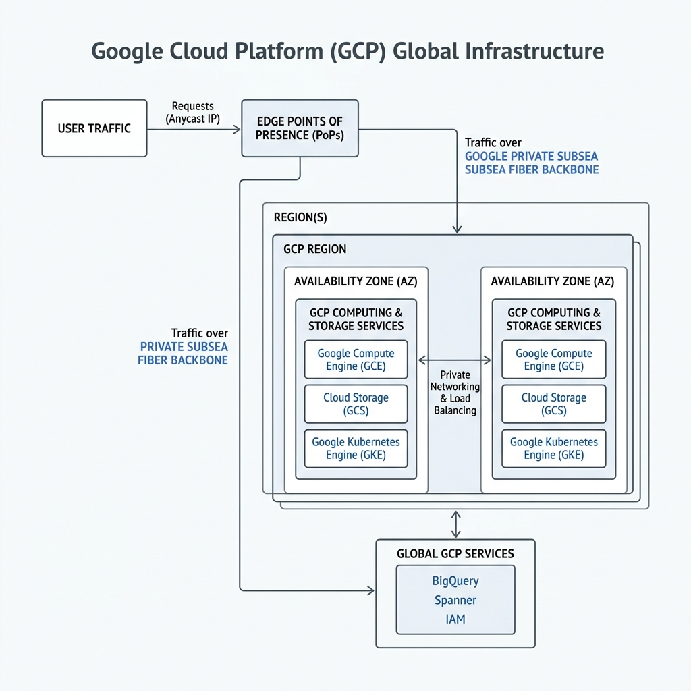
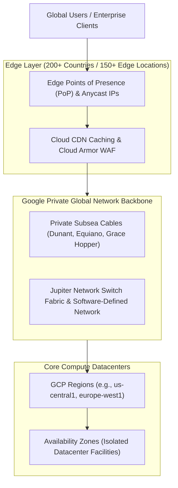

# Topic 05: Global Infrastructure

---

## 1. What Is It?

Google Cloud's **Global Infrastructure** is one of the largest physical computing hardware and optical networking footprints on Earth. It comprises globally distributed datacenters, high-bandwidth subsea submarine fiber cables, Points of Presence (PoPs), and edge caching locations.

Unlike public clouds that rely heavily on third-party commercial internet networks to route traffic between regions, Google owns and operates its own private, software-defined network backbone. This global footprint ensures that user requests enter Google's network at the nearest geographic point, delivering lower latency, higher security, and sub-millisecond inter-datacenter speeds.

### Real-World Analogy
Think of Google's Global Infrastructure like a private worldwide underground bullet train transit system built exclusively for Google Cloud traffic. While public internet traffic sits in congested street traffic across multiple toll booths (public ISPs), your data enters Google's private station at the nearest city entrance and speeds directly to its global destination.

---

## 2. Where Does It Fit?

Global Infrastructure provides the physical hardware foundation under all logical GCP services, enabling global single-IP load balancing, multi-region database replication, and edge content delivery.





---

## 3. Core Concepts

| Element | What It Means | Why It Matters | Production Consideration |
|---|---|---|---|
| **Points of Presence (PoPs)** | Physical edge locations where Google connects to local internet service providers (ISPs). | Ingests user traffic into Google's private network at the absolute closest physical location. | 150+ edge locations globally minimize public internet transit hops. |
| **Subsea Cables** | High-capacity optical underwater cables (e.g., Curie, Dunant, Grace Hopper) owned by Google. | Transfers petabytes of data across oceans at terabits per second with zero public internet exposure. | Ensures multi-region database replication (Spanner, BigQuery) is fast and reliable. |
| **Anycast Routing** | A networking technique where a single IP address is announced simultaneously from all global edge PoPs. | Routes end-user traffic automatically to the nearest healthy edge datacenter without DNS changes. | Enables global load balancing and instant DDoS traffic absorption via Cloud Armor. |
| **Jupiter Network Fabric** | Google's custom datacenter network switch architecture delivering 1+ Petabit/sec bandwidth. | Eliminates network bottlenecks inside datacenter racks, enabling high-performance compute clusters. | Essential for distributed BigData queries and massive AI model training workloads. |
| **Edge Nodes (GGE)** | Google Global Cache servers installed directly inside third-party ISP networks. | Caches static assets (images, video, web content) right next to end consumers. | Leveraged by Cloud CDN to drastically accelerate website response times globally. |

---

## 4. How It Works

Packet routing across Google's Global Infrastructure follows a deterministic physical and logical path:

```text
User initiates HTTPS Request (e.g., app.company.com)
              ↓
DNS resolves to a single GCP Anycast IP Address
              ↓
Packet enters nearest Google Edge Point of Presence (PoP)
              ↓
Cloud Armor inspects packet for DDoS / WAF threats at the edge
              ↓
Packet encapsulated & routed over Google Private Subsea Backbone (Bypassing public ISPs)
              ↓
Arrives at target GCP Region Datacenter via Jupiter SDN switch fabric
              ↓
Processed by Compute Engine / Cloud Run / GKE in target Availability Zone
```

1. **Edge Ingress**: Anycast BGP routing directs packets to the closest physical Google PoP.
2. **Backbone Transit**: Packets travel over Google's optical fiber network rather than the public internet.
3. **Internal Processing**: Jupiter fabric delivers sub-millisecond latency between servers inside the datacenter.

---

## 5. Production Scenario

### Low-Latency Global Video Streaming Platform

```text
Requirement: Deliver 4K video content globally to 5,000,000 concurrent viewers with sub-100ms startup latency.
    ↓
Architecture: Global External HTTP(S) Load Balancer using Anycast IP → Cloud CDN at Edge PoPs → Storage Bucket origin.
    ↓
Configuration: Enable Cloud CDN caching at 150+ Edge Locations; enforce Premium Tier network routing.
    ↓
Security: Cloud Armor protects edge PoPs against 100+ Gbps volumetric SYN flood DDoS attacks.
    ↓
Scaling: 95% of static video segments served directly from Edge PoPs; backend Cloud Storage scales automatically.
    ↓
Monitoring: Network Intelligence Center topology graphs observing real-time edge cache hit rates.
```

*Why Selected*: Competitors require integrating third-party CDNs and complex DNS geo-routing. GCP's native global Anycast IP and subsea backbone handle edge caching and DDoS mitigation out of the box.

---

## 6. Hands-On Lab

### Prerequisites
- Active GCP Project with Compute Engine API enabled.
- Access to Cloud Shell or local terminal.
- Basic networking tools (`ping`, `traceroute`, `curl`).

### Console Method
1. Log into the [Google Cloud Console](https://console.cloud.google.com/).
2. Search for **Network Intelligence Center** in the top search bar.
3. Select **Network Topology**.
4. Observe the interactive visual map displaying Google's global network connections, regional traffic flows, and cross-datacenter ingress/egress bandwidth.
5. Open **Cloud CDN** → Observe how edge locations cache content globally.

### CLI Method
Inspect Google Cloud's edge infrastructure and test network latency across regions:

```bash
# 1. List available Compute Engine regions across continents
gcloud compute regions list --format="table(name, status, zones)"

# 2. Query Google's Anycast DNS servers to observe edge routing speed
nslookup 8.8.8.8

# 3. Create a test VM in us-central1 and another in europe-west1 to observe inter-datacenter latency
gcloud compute instances create vm-us --zone=us-central1-a --machine-type=e2-micro
gcloud compute instances create vm-eu --zone=europe-west1-a --machine-type=e2-micro

# 4. Measure internal latency between US and Europe across Google's private backbone
gcloud compute ssh vm-us --zone=us-central1-a --command="ping -c 5 vm-eu.europe-west1-a"
```

### Verification
*Expected Result*: The `ping` command succeeds with low, stable latency (~70-90ms across oceans) showing zero packet loss because traffic stays entirely within Google's private subsea network.

### Cleanup
Delete test VMs immediately to prevent charges:

```bash
gcloud compute instances delete vm-us --zone=us-central1-a --quiet
gcloud compute instances delete vm-eu --zone=europe-west1-a --quiet
```

---

## 7. Security

### Physical & Network Edge Defense
- **Physical Security**: Google datacenters employ multi-layered biometrics, laser intrusion detection, custom hardware security (Titan chips), and strict floor access controls.
- **Hardware Root of Trust**: Servers boot custom signed firmware validated by Google Titan chips.
- **Edge Perimeter Defense**: Cloud Armor filters malicious traffic directly at the 150+ Edge PoPs before it ever reaches application servers inside datacenters.

```text
BAD PRACTICE:
Exposing application endpoints directly to the public internet using individual VM public IPs instead of a Global Load Balancer.
Risk: Exposes VMs to direct DDoS attacks and circumvents Google's edge Cloud Armor protections.

PRODUCTION PRACTICE:
Route all public ingress traffic through a Global External Load Balancer backed by Anycast IPs and Cloud Armor WAF rules.
```

---

## 8. Scaling & High Availability

Global Infrastructure enables seamless multi-region high availability:

```text
Single Availability Zone (Zonal risk)
   ↓ (Multi-Zone setup within a Region)
Regional High Availability (Resilient against single datacenter power/cooling failure)
   ↓ (Multi-Region Anycast routing)
Global Multi-Region Architecture (Resilient against entire regional grid outages)
```

- **Traffic Scaling Dynamics**:
  - **100 users**: Edge PoP routes traffic to a single regional compute instance.
  - **10,000 users**: Edge PoP distributes requests across multiple instances in 3 Availability Zones.
  - **1,000,000 users**: Anycast IPs route global traffic across 5 continents simultaneously, dynamically failing over if a region experiences an outage.

---

## 9. Cost

### Network Tier Economics
- **Premium Tier (Default)**: Routes traffic over Google's high-speed private global network backbone. Slightly higher cost per GB egress, but delivers lowest latency and highest reliability.
- **Standard Tier**: Routes traffic over public ISP networks (transit providers) to the target region. Lower cost per GB egress, but subject to public internet congestion and higher latency.

```text
FinOps Optimization Tip:
- Use Standard Tier for non-critical batch file downloads where latency is irrelevant.
- Use Premium Tier for production web applications, database replication, and real-time APIs.
```

---

## 10. Monitoring & Troubleshooting

### Observability Tools for Infrastructure
- **Network Intelligence Center**: Topology, Performance Dashboard, and Connectivity Tests.
- **Google Cloud Service Health**: Real-time status tracker for global infrastructure and subsea cable networks.

### Troubleshooting Matrix

| Symptom | Possible Cause | What to Check | Fix |
|---|---|---|---|
| High cross-region latency | Traffic routed over Standard Tier or misconfigured DNS | Network Intelligence Center Performance Dashboard | Switch network tier to `PREMIUM` in project settings. |
| Edge cache miss rates high | Cache-Control headers missing or invalid TTL in response | Cloud CDN Monitoring Metrics | Add `Cache-Control: public, max-age=3600` headers to origin response. |
| Packet drops between regions | Inter-VPC firewall rule missing or VPC Service Control block | `gcloud compute connectivity-tests` | Create VPC firewall rule allowing internal RFC1918 traffic. |

---

## 11. Common Mistakes

```text
Mistake: Assuming all public cloud networks operate the same as GCP.
Why: Misunderstanding that competitors often route inter-region traffic over public ISP backbones.
Impact: Suboptimal architecture designs that unnecessarily add third-party CDNs or external VPNs.
Correct approach: Leverage GCP's built-in subsea fiber backbone and Anycast global load balancing native features.

Mistake: Disabling Premium Tier networking globally to save minimal egress pennies.
Why: Over-indexing on immediate cost savings without measuring performance degradation.
Impact: Increased network jitter, dropped TCP connections, and poor user experience.
Correct approach: Keep Premium Tier enabled for user-facing applications; selectively use Standard Tier for non-critical bulk exports.
```

---

## 12. Production Best Practices

- [ ] Utilize Premium Tier networking for user-facing web services and databases.
- [ ] Enforce Global Load Balancing with Anycast IPs for global high availability.
- [ ] Deploy Cloud Armor at edge PoPs to absorb volumetric DDoS attacks.
- [ ] Enable Cloud CDN at Edge PoPs for static assets to reduce origin compute load.
- [ ] Monitor inter-datacenter latency using Network Intelligence Center.
- [ ] Architect multi-region database replication over Google's private subsea network.

---

## 13. Hyperscaler / Enterprise Perspective

```text
Personal / Learning
  Single Region VM → Default VPC → Public IP ingress
        ↓
Small Production
  Multi-Zone deployment in 1 Region → Regional Load Balancer → Basic CDN
        ↓
Enterprise Environment
  Multi-Region Landing Zones → Dedicated Interconnect to On-Premises → Shared VPC → Centralized Security Perimeter
        ↓
Hyperscaler Environment
  Global Anycast IP Routing → Private Subsea Network Utilization → Multi-Region Active-Active Failover → Zero-Trust Edge Identity (IAP)
```

In a hyperscaler environment, Google's Global Infrastructure allows enterprises to operate multi-continent active-active architectures seamlessly. Traffic is ingested at 150+ edge locations, scrubbed by Cloud Armor at line rate, and carried privately across subsea cables to the nearest healthy datacenter region.

---

## 14. Real Project Questions

### Q1: How does Google's Anycast IP technology simplify global multi-region load balancing?
**Answer:** Anycast allows multiple physical edge servers around the world to advertise the exact same IP address via BGP. When a client makes a request, internet routers direct packets to the geographically nearest Google Edge PoP. This allows a single static IP address to distribute traffic globally across multiple backend regions without complex GeoDNS routing.

### Q2: What is the technical difference between Google's Premium Tier and Standard Tier network routing?
**Answer:** Premium Tier enters Google's private fiber network at the Edge PoP closest to the user and stays on Google's private subsea backbone all the way to the destination datacenter. Standard Tier routes traffic across external public ISP networks until it reaches the Point of Presence closest to the destination datacenter region.

### Q3: How does Google ensure physical security inside its global datacenter facilities?
**Answer:** Google datacenters use multi-layered physical security including perimeter fencing, 24/7 security guards, biometric access controls, laser intrusion detection, hardware security verification using custom Titan chips, and strict drive-shredding procedures for decommissioned storage media.

---

## 15. Quick Decision Guide

| Requirement | Recommended Approach | Reason |
|---|---|---|
| Global web app requiring single IP address and low latency | **Global External Load Balancer + Anycast IP** | Ingests traffic at nearest edge PoP and routes over Google subsea fiber. |
| Low-cost bulk data downloads where latency is not critical | **Standard Tier Network Egress** | Lower egress pricing by using public internet transit to destination region. |
| Global DDoS protection at the network edge | **Cloud Armor at Edge PoPs** | Filters malicious traffic at 150+ edge locations before reaching backend VMs. |

### When should I use it?
- Building high-availability global applications, media distribution networks, or enterprise hybrid clouds.

### When should I NOT use it?
- Local-only applications where all users and servers reside within a single city or private isolated network.

---

## 16. Related Services

```text
           [05. Global Infrastructure]
             /          |          \
      Points of      Subsea     Global Load
      Presence       Fiber      Balancing
         |              |            |
     Cloud CDN    Private Net   Anycast IP
```

- **Cloud CDN**: Edge content delivery caching static assets at 150+ PoPs.
- **Global External Load Balancers**: Single-IP Anycast traffic management across regions.
- **Cloud Armor**: Edge Web Application Firewall (WAF) and DDoS protection.

---

## 17. Cheat Sheet

### Essential Concepts
- **PoP (Point of Presence)**: Physical edge location connecting Google to ISPs.
- **Anycast IP**: Single IP announced globally from all edge PoPs.
- **Premium Tier**: Default routing over Google's private global fiber network.
- **Jupiter Switch**: Custom 1+ Petabit/sec datacenter network fabric.

### Useful Commands
```bash
# List all global GCP compute regions
gcloud compute regions list

# Check default network tier setting for project
gcloud compute project-info describe --format="value(defaultNetworkTier)"

# Test internal latency between VMs across regions
gcloud compute ssh vm-name --zone=zone-name --command="ping target-ip"
```

---

## 18. Learning Connection

- **Previous Topic**: [04. Cloud Computing Fundamentals](../04-cloud-computing-fundamentals/README.md)
- **Next Topic**: [06. Regions & Zones](../06-regions-and-zones/README.md)
