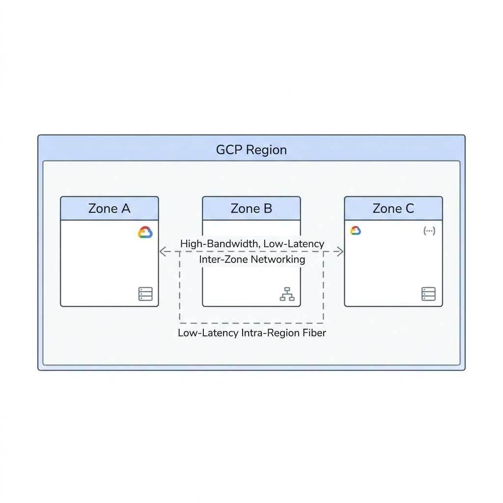
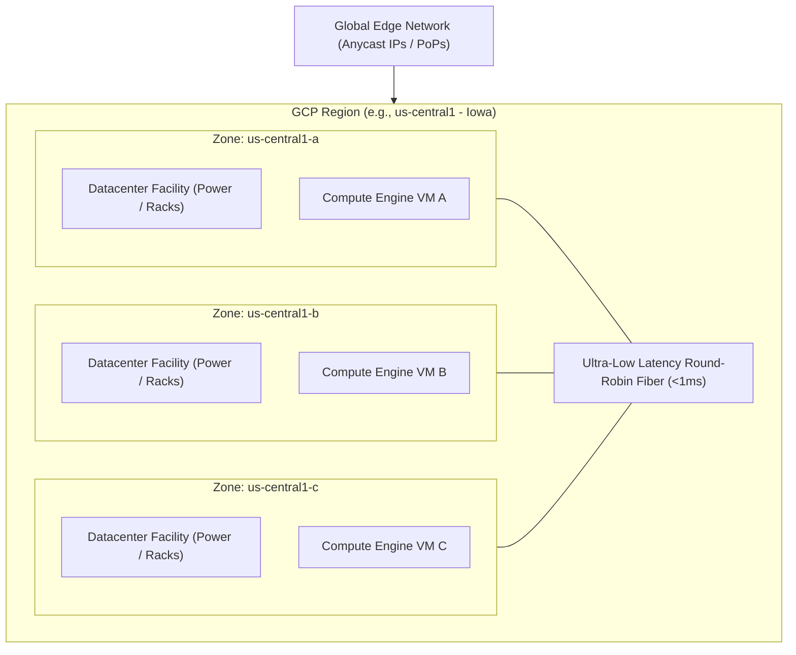

# Topic 06: Regions & Zones

---

## 1. What Is It?

In Google Cloud Platform, **Regions** and **Zones** define the physical geographic deployment topology of your resources.

A **Region** is a specific geographic location (such as `us-central1` in Iowa or `europe-west1` in Belgium) composed of three or more independent **Zones**. A **Zone** is a deployment area within a region representing an isolated physical datacenter facility equipped with independent power, cooling, compute racks, and networking infrastructure.

Understanding regions and zones is fundamental to building high-availability applications, achieving compliance with data residency regulations, minimizing latency for end users, and planning disaster recovery strategies.

### Real-World Analogy
Think of a Region as a major metropolitan city (like Chicago) and Zones as separate physical fulfillment centers built in distinct suburbs (North Chicago, South Chicago, West Chicago). If one fulfillment center experiences a local power blackout or fire, the other two centers continue operating normally without interruption.

---

## 2. Where Does It Fit?

Regions and zones form the middle tier of Google Cloud's deployment boundary between global edge infrastructure and individual resource instances.





---

## 3. Core Concepts

| Scope Level | Description | Examples | Fault Isolation Boundary |
|---|---|---|---|
| **Zonal Resource** | Bound to a single specific zone within a region. | Compute Engine VMs, Zonal Persistent Disks, Ephemeral IPs. | Fails if the specific zone experiences a power or hardware outage. |
| **Regional Resource** | Shared redundantly across multiple zones within a single region. | Regional Persistent Disks, Cloud SQL HA, Regional GKE Control Plane, Subnets. | Survives single zone failures automatically. |
| **Global Resource** | Accessible across all regions worldwide. | Global External Load Balancer, IAM Policies, Cloud DNS, VPC Networks, Image Templates. | Survives regional outages via Anycast failover. |
| **Multi-Region** | Service spread across two or more geographic regions separated by hundreds of miles. | Cloud Storage Multi-Region buckets, Cloud Spanner Global instances. | Survives catastrophic regional disasters (earthquakes, major grid failures). |

---

## 4. How It Works

Placement and routing of resources across regions and zones follow strict fault-isolation mechanisms:

```text
User Request / Deployment API
              ↓
Specified Target Region & Zone (e.g., region: us-central1, zone: us-central1-a)
              ↓
GCP Control Plane checks regional quota & zonal hardware availability
              ↓
Resource deployed to isolated physical datacenter building (us-central1-a)
              ↓
Inter-zone traffic within region routes via low-latency internal fiber (< 1 millisecond)
              ↓
Inter-region traffic routes via Google's private subsea network backbone
```

1. **Subnet Scope**: In GCP, a Virtual Private Cloud (VPC) network is global, while individual Subnets are regional (spanning all zones in that region).
2. **Low-Latency Interconnect**: Zones within the same region are connected by high-bandwidth private fiber lines delivering sub-millisecond round-trip latency.
3. **Maintenance Isolation**: Google performs physical hardware maintenance rolling zone-by-zone to prevent simultaneous outages.

---

## 5. Production Scenario

### Highly Available E-Commerce Payment Gateway

```text
Requirement: Guarantee 99.99% uptime for transaction processing; survive full datacenter zone failures.
    ↓
Architecture: Managed Instance Group (MIG) spread evenly across 3 zones (`us-central1-a`, `b`, `c`) behind a Regional Internal Load Balancer.
    ↓
Configuration: Cloud SQL deployed in High Availability (HA) mode with primary DB in Zone A and standby DB in Zone B.
    ↓
Security: Internal RFC1918 private IP addresses; no public IPs on database or app instances.
    ↓
Scaling: Auto-scaling MIG adds instances to healthy zones if a zone becomes degraded.
    ↓
Monitoring: Cloud Monitoring uptime checks probing all 3 zonal backends continuously.
```

*Why Selected*: Deploying across 3 zones in a single region provides high availability with sub-millisecond database replication, avoiding cross-region network latency while protecting against hardware failures.

---

## 6. Hands-On Lab

### Prerequisites
- Active GCP Project with Compute Engine API enabled.
- Cloud Shell or local `gcloud` CLI.
- IAM permissions: `roles/compute.instanceAdmin.v1`.

### Console Method
1. Log into the [Google Cloud Console](https://console.cloud.google.com/).
2. Navigate to **Compute Engine** → **VM instances**.
3. Click **Create Instance**.
4. Observe the **Region** and **Zone** drop-down menus.
5. Select Region `us-central1 (Iowa)` → Observe available Zones (`us-central1-a`, `b`, `c`, `f`).
6. Change Region to `europe-west1 (Belgium)` → Observe how available zones change to European datacenter codes.
7. Click **Cancel** (or provision a test VM to observe zone assignment).

### CLI Method
Query regions, zones, and deploy zonal VMs across multiple zones:

```bash
# Set project context
PROJECT_ID="your-gcp-project-id"
gcloud config set project $PROJECT_ID

# 1. List all available GCP regions and their operational status
gcloud compute regions list

# 2. List all zones in a specific region
gcloud compute zones list --filter="region:us-central1"

# 3. Provision two VMs in separate zones within the same region
gcloud compute instances create vm-zone-a --zone=us-central1-a --machine-type=e2-micro
gcloud compute instances create vm-zone-b --zone=us-central1-b --machine-type=e2-micro

# 4. Ping between zones to measure intra-region latency
gcloud compute ssh vm-zone-a --zone=us-central1-a --command="ping -c 5 vm-zone-b.us-central1-b"
```

### Verification
*Expected Result*: Intra-region ping latency between `us-central1-a` and `us-central1-b` is under 1 millisecond (~0.4 - 0.8ms), demonstrating high-speed private fiber interconnectivity.

### Cleanup
Delete both test VM instances:

```bash
gcloud compute instances delete vm-zone-a --zone=us-central1-a --quiet
gcloud compute instances delete vm-zone-b --zone=us-central1-b --quiet
```

---

## 7. Security

### Compliance, Sovereignty & Data Boundaries
- **Data Residency**: Certain regulations (GDPR, HIPAA, Financial Sovereignty) require data to remain physically within specific national or regional borders. Selecting a specific GCP region guarantees data remains in that physical geographic territory.
- **Cross-Region Exfiltration Prevention**: Use Organization Policies to restrict resource creation strictly to approved regions.

```text
BAD PRACTICE:
Deploying production databases into a single Availability Zone without standby replicas.
Risk: A single physical datacenter power failure, network switch outage, or cooling loss causes complete application downtime.

PRODUCTION PRACTICE:
Deploy production workloads across a minimum of 2 or 3 Availability Zones within a region using Regional Managed Instance Groups and Cloud SQL HA.
```

---

## 8. Scaling & High Availability

Deployment Topologies for Growth:

```text
Single Zone (Dev / Testing only - 99.9% SLA)
   ↓ (Regional HA - Multi-Zone)
Multi-Zone Region (Production Standard - 99.99% SLA)
   ↓ (Multi-Region Active-Active)
Dual / Multi-Region Architecture (Disaster Recovery & Extreme Resilience - 99.999% SLA)
```

- **Traffic Scaling Dynamics**:
  - **100 users**: Single zonal instance or serverless Cloud Run in 1 region.
  - **10,000 users**: Regional Managed Instance Group auto-scaling across 3 zones in `us-central1`.
  - **1,000,000 users**: Multi-Region active-active deployment in `us-central1` and `europe-west1` behind a Global Load Balancer.

---

## 9. Cost

### Pricing Factors across Regions
- **Regional Price Variations**: Hardware, electricity, tax, and real-estate costs vary by country. For example, `us-central1` (Iowa) is typically cheaper than `southamerica-east1` (São Paulo) or `asia-east1` (Taiwan).
- **Inter-Zone Data Egress**: Data transferred between different zones within the same region incurs a small per-GB network charge ($0.01/GB).
- **Inter-Region Data Egress**: Data transferred between different regions incurs standard cross-region egress charges ($0.02 - $0.08+/GB).

---

## 10. Monitoring & Troubleshooting

### Observability Tools
- **Cloud Monitoring Dashboard**: Filter metrics by `location` (region/zone).
- **Service Health Dashboard**: Track real-time incidents categorized by specific region and zone.

### Troubleshooting Matrix

| Symptom | Possible Cause | What to Check | Fix |
|---|---|---|---|
| `ZONE_RESOURCE_POOL_EXHAUSTED` error during VM creation | The specific zone has temporarily run out of specific hardware instance types | `gcloud compute instances create` error output | Switch to another zone in the same region (e.g., from `us-central1-a` to `us-central1-b`). |
| Unexpected cross-zone network charges | VMs communicating across different zones instead of keeping traffic local | Billing Cost Table by SKU | Keep application instances and database replicas in the same primary zone or use regional subnets. |
| High database replication latency | Primary and Standby databases placed in different regions instead of zones | Cloud SQL Instance Location config | Ensure HA standby replica is in a different **zone**, not a different **region**. |

---

## 11. Common Mistakes

```text
Mistake: Confusing Regions with Zones and assuming a Zone is just a room in the same building.
Why: Misunderstanding physical fault isolation boundaries.
Impact: Assuming multi-zone deployments share power grids or flood risks.
Correct approach: Recognize that Zones are distinct physical datacenter facilities separated geographically within a metro area.

Mistake: Hardcoding zone names in deployment scripts without variable abstraction.
Why: Using static strings like us-central1-a across all Terraform manifests.
Impact: Inability to failover or deploy into alternate zones during regional capacity constraints.
Correct approach: Parameterize region and zone variables in Terraform and deployment scripts.
```

---

## 12. Production Best Practices

- [ ] Select primary regions close to your primary end-user demographic to minimize latency.
- [ ] Enforce Multi-Zone deployment (minimum 2-3 zones) for all production workloads.
- [ ] Use Regional Persistent Disks for critical VMs requiring zero-RPO storage failover.
- [ ] Enforce Organization Policies to restrict allowed GCP deployment regions for compliance.
- [ ] Account for regional price differences during initial FinOps infrastructure planning.
- [ ] Test cross-zone failover scenarios periodically to validate automated recovery.

---

## 13. Hyperscaler / Enterprise Perspective

```text
Personal / Learning
  Single Zone (`us-central1-a`) → Manual VM setup → No redundancy
        ↓
Small Production
  Multi-Zone (`us-central1-a/b/c`) → Regional Load Balancer → Basic Backups
        ↓
Enterprise Environment
  Multi-Region Landing Zones (`us-central1` + `us-east4`) → Primary/Secondary VPC Subnets → Regional Org Policies
        ↓
Hyperscaler Environment
  Global Multi-Region Active-Active Mesh → Automated Cross-Region Disaster Recovery (RTO < 5m, RPO ~ 0) → FinOps Regional Cost Optimization
```

In a hyperscaler environment, enterprises architect around regional fault domains. Workloads run active-active across multiple regions, databases use multi-region synchronous replication (Spanner), and global Anycast load balancers instantly redirect traffic away from impaired regions.

---

## 14. Real Project Questions

### Q1: What is the main architectural trade-off between Multi-Zone and Multi-Region deployments?
**Answer:** Multi-Zone deployments offer sub-millisecond intra-region latency, low data egress costs, and protection against single datacenter failures. Multi-Region deployments protect against regional grid/catastrophic disasters and reduce latency for global end users, but introduce higher cross-region data egress costs and network latency for synchronous database writes.

### Q2: How does GCP handle physical datacenter maintenance without impacting running VMs?
**Answer:** Compute Engine uses **Live Migration**. GCP automatically migrates running VM instances from host machines undergoing maintenance to other machines in the same zone without restarting the VM or interrupting application execution.

### Q3: What happens to regional subnets when a single zone experiences an outage?
**Answer:** GCP VPC Subnets are regional entities that span all zones in that region. If Zone A fails, the subnet remains online and operational in Zone B and Zone C. Resources deployed in Zone B and C continue communicating over the subnet without network reconfiguration.

---

## 15. Quick Decision Guide

| Requirement | Recommended Approach | Reason |
|---|---|---|
| Production web app requiring high availability with sub-1ms DB latency | **Multi-Zone Regional MIG + Cloud SQL HA** | Protects against single zone failure while maintaining low-latency database reads/writes. |
| Mission-critical global banking application requiring zero RPO disaster recovery | **Multi-Region Cloud Spanner + Global Anycast LB** | Provides synchronous multi-region replication and global automated failover. |
| Development/staging environment with minimal budget | **Single-Zone deployment in low-cost region (e.g., us-central1)** | Eliminates inter-zone network charges and takes advantage of cheaper regional rates. |

### When should I use it?
- Designing any cloud deployment—selecting the proper regions and zones is the first architectural decision for every GCP resource.

### When should I NOT use it?
- Fully managed global SaaS services (e.g., BigQuery, Cloud DNS) where Google manages regional/zonal placement automatically.

---

## 16. Related Services

```text
              [06. Regions & Zones]
               /        |        \
        Compute Engine  VPC   Cloud SQL HA
           (Zonal)   (Regional) (Multi-Zone)
```

- **Compute Engine**: Instances deployed into specific zones.
- **VPC Subnets**: Regional networks spanning all zones in a region.
- **Cloud SQL HA**: Multi-zone database deployment providing automated failover.

---

## 17. Cheat Sheet

### Key Terminology
- **Region**: Geographic area with 3+ isolated zones (e.g., `us-central1`).
- **Zone**: Single physical datacenter deployment domain (e.g., `us-central1-a`).
- **Live Migration**: Automated VM relocation during host hardware maintenance.
- **Multi-Region**: High-availability scope spanning multiple regions.

### Useful CLI Commands
```bash
# List all GCP regions
gcloud compute regions list

# List all zones in a region
gcloud compute zones list --filter="region:us-central1"

# Create a VM in a specific zone
gcloud compute instances create my-vm --zone=us-central1-a
```

---

## 18. Learning Connection

- **Previous Topic**: [05. Global Infrastructure](../05-global-infrastructure/README.md)
- **Next Topic**: [07. Projects](../07-projects/README.md)
