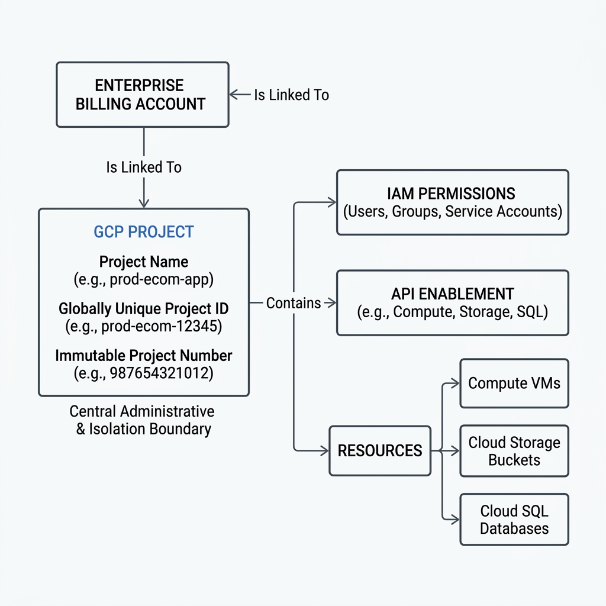
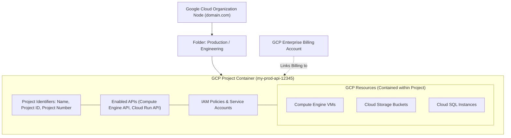

# Topic 07: Projects

---

## 1. What Is It?

A **GCP Project** is the fundamental organizing and administrative entity in Google Cloud Platform. Every resource you create in GCP—such as Compute Engine virtual machines, Cloud Storage buckets, Cloud SQL databases, or GKE clusters—must reside inside exactly one project.

A project acts as an isolated container that encapsulates resource configuration, API enablement, Identity and Access Management (IAM) permissions, network boundaries, and billing links.

### Real-World Analogy
Think of a GCP Project like a dedicated apartment unit inside a large high-rise building. The apartment unit has its own unique apartment number (Project ID), its own door lock and key privileges (IAM Policies), its own separate electric and utility meter (Billing Account), and houses all your personal furniture and appliances (GCP Resources).

---

## 2. Where Does It Fit?

Projects form the core operational layer of the GCP Resource Hierarchy, sitting directly below Folders/Organization nodes and above individual cloud resources.





---

## 3. Core Concepts

| Identifier / Element | Description | Mutable? | Globally Unique? | Example Value |
|---|---|---|---|---|
| **Project Name** | User-assigned human-readable display name for the project. | Yes (Can be changed anytime) | No (Duplicates allowed) | `Production E-Commerce API` |
| **Project ID** | Unique string identifier used in `gcloud` CLI commands and API endpoints. | No (Set at creation) | **Yes** (Globally unique across ALL GCP users) | `prod-ecommerce-api-98765` |
| **Project Number** | System-generated 12-digit numeric identifier created automatically by GCP. | No (Immutable) | **Yes** (Globally unique) | `458291039482` |
| **Billing Link** | The association between a project and a GCP Billing Account. | Yes (Can link/unlink) | N/A | `01ABCD-234EFG-567HIJ` |
| **Lifecycle State** | Project state tracking active, pending deletion, or shut down status. | Yes | N/A | `ACTIVE`, `DELETE_REQUESTED` |

---

## 4. How It Works

Project management and isolation operate through strict API boundaries:

```text
User / Terraform issues gcloud projects create
              ↓
GCP Resource Manager API validates globally unique Project ID
              ↓
System assigns immutable Project Number & registers Project state
              ↓
Project linked to Billing Account (enables resource creation)
              ↓
Specific GCP Service APIs enabled within Project scope (e.g., compute.googleapis.com)
              ↓
Resources created within Project isolation boundary
```

1. **Isolation**: Resources in Project A cannot communicate with resources in Project B over internal IP addresses unless VPC Peering or Shared VPC is explicitly configured.
2. **Billing Aggregation**: All resource charges generated inside a project roll up directly to the linked Billing Account.
3. **API Governance**: Disabling an API inside a project instantly freezes all operations for that specific service within the project.

---

## 5. Production Scenario

### Multi-Environment Isolated Microservice Pipeline

```text
Requirement: Enforce zero-trust security and blast-radius isolation between Development, Staging, and Production environments.
    ↓
Architecture: Create 3 distinct GCP Projects: `app-dev-10293`, `app-stage-49201`, `app-prod-83920`.
    ↓
Configuration: Link all 3 projects to the Enterprise Billing Account; enable Cloud Run and Cloud SQL APIs per project.
    ↓
Security: Developers get `roles/editor` in `app-dev-10293`, `roles/viewer` in `app-stage-49201`, and $0$ access to `app-prod-83920`.
    ↓
Scaling: Production project operates under high regional quota ceilings; Dev project operates under strict cost caps.
    ↓
Monitoring: Log Sink routes audit logs from all 3 projects into a centralized Security Operations Logging Project.
```

*Why Selected*: Using separate projects per environment prevents accidental developer commands in Dev from ever affecting Production databases or network routes.

---

## 6. Hands-On Lab

### Prerequisites
- Active GCP Account with permission to create projects (`roles/resourcemanager.projectCreator`).
- Cloud Shell or local `gcloud` CLI.

### Console Method
1. Log into [Google Cloud Console](https://console.cloud.google.com/).
2. Click the **Project Selector** drop-down menu in the top left header bar.
3. Click **New Project** in the top right of the modal window.
4. Enter Project Name: `Demo Learning Project`.
5. Observe the automatically generated **Project ID** below the name box (click **Edit** to customize, ensuring global uniqueness).
6. Select Organization / Folder location if applicable.
7. Click **Create** and wait 10-15 seconds for project provisioning to complete.
8. Switch to the new project via the Project Selector.

### CLI Method
Create, manage, and inspect projects using `gcloud`:

```bash
# Generate a globally unique Project ID variable
RANDOM_SUFFIX=$RANDOM
PROJECT_ID="sandbox-demo-${RANDOM_SUFFIX}"

# 1. Create a new GCP Project
gcloud projects create $PROJECT_ID --name="Sandbox Demo Project"

# 2. Describe project details (Observe Project Number, ID, and Lifecycle State)
gcloud projects describe $PROJECT_ID

# 3. Set local CLI context to the new project
gcloud config set project $PROJECT_ID

# 4. Link the project to an active billing account (Required before launching VMs)
BILLING_ACCOUNT_ID=$(gcloud billing accounts list --format="value(name)" --filter="open=true" | head -n 1)
gcloud billing projects link $PROJECT_ID --billing-account=$BILLING_ACCOUNT_ID

# 5. Enable Compute Engine API inside the project
gcloud services enable compute.googleapis.com
```

### Verification
Confirm that the project is active and billing is linked:

```bash
gcloud billing projects describe $PROJECT_ID
```
*Expected Result*: Returns `billingEnabled: true` and confirms project association with your billing account ID.

### Cleanup
Delete (shut down) the test project:

```bash
gcloud projects delete $PROJECT_ID --quiet
```
*Note*: Project enters a 30-day grace period (`DELETE_REQUESTED`) before permanent deletion.

---

## 7. Security

### Identity, IAM & Project Boundaries
- **Project Ownership**: Never grant primitive `roles/owner` to individuals. Assign job-function specific predefined roles (e.g., `roles/compute.admin`, `roles/storage.admin`).
- **Default Service Accounts**: Upon enabling Compute Engine, GCP automatically creates a default Compute Service Account with broad Editor privileges. Disable auto-creation or strip Editor rights in production.

```text
BAD PRACTICE:
Using a single monolithic GCP Project for Development, Testing, Staging, and Production workloads.
Risk: A developer testing a script in Dev accidentally deletes the production database or drains project quotas.

PRODUCTION PRACTICE:
Enforce strict environment segregation: One GCP Project per Environment per Application component.
```

---

## 8. Scaling & High Availability

Quotas and Limits at the Project Boundary:

```text
Project Quota Ceiling (e.g., 100 vCPUs, 5 VPC Networks)
   ↓ (Request Quota Increase via Console/gcloud)
Expanded Enterprise Project Quota
   ↓ (Divide Workloads across Multiple Projects)
Multi-Project Enterprise Architecture (Unbounded Scale via Shared VPC)
```

- **Project Limits**: Google limits the total number of projects a user/organization can create (Project Creation Quota). Request quota increases when launching large multi-project architectures.
- **Quota Isolation**: Exhausting CPU quotas or API rate limits in Project A does not impact quotas in Project B.

---

## 9. Cost

### Project-Level FinOps Management
- **Unlinking Billing**: Unlinking a project from its Billing Account immediately pauses all billable resources without deleting the underlying code or disks.
- **Cost Attribution**: Group billing reports by Project ID to determine exact cloud spend per department or application team.
- **Labels**: Apply key-value labels to projects (e.g., `environment: production`, `cost_center: fin-102`) for granular cost tracking.

---

## 10. Monitoring & Troubleshooting

### Project Observability Tools
- **Cloud Quotas Dashboard**: Monitor API call rates and resource quotas per project.
- **Cloud Audit Logs**: View project creation, IAM changes, and API enablement events.

### Troubleshooting Matrix

| Symptom | Possible Cause | What to Check | Fix |
|---|---|---|---|
| `Project ID already exists` error during creation | Another GCP user worldwide is already using that exact Project ID string | `gcloud projects create` output | Append random numeric digits or company prefix to ensure global uniqueness. |
| `Billing account not linked` error when creating VMs | Project created but not associated with an active Billing Account | `gcloud billing projects describe <ID>` | Link billing via `gcloud billing projects link <ID> --billing-account=<ACCOUNT>`. |
| Project stuck in `DELETE_REQUESTED` state | Project in 30-day deletion grace period | `gcloud projects list --deleted` | Run `gcloud projects undelete <ID>` if accidental deletion occurred. |

---

## 11. Common Mistakes

```text
Mistake: Confusing Project Name with Project ID.
Why: Project Name can be changed anytime and is non-unique; Project ID is permanent and globally unique.
Impact: Script failures when attempting to pass human-readable Project Names into CLI automation scripts.
Correct approach: Always use globally unique Project IDs in scripts, Terraform manifests, and API calls.

Mistake: Deleting a project assuming immediate, non-recoverable destruction.
Why: Overlooking the 30-day GCP project deletion grace period.
Impact: Thinking resources are immediately purged, or panic when a deleted project still appears in lists.
Correct approach: Understand that projects remain in DELETE_REQUESTED status for 30 days before permanent deletion.
```

---

## 12. Production Best Practices

- [ ] Use a standardized, automated Project ID naming convention (e.g., `company-app-env-id`).
- [ ] Maintain strict 1:1 separation between GCP Projects and Application Environments (Dev, Stage, Prod).
- [ ] Link projects to dedicated FinOps cost centers using project labels.
- [ ] Disable default Compute Engine service account Editor privileges upon project creation.
- [ ] Enforce Organization Policies at the project boundary to block public IP assignment.
- [ ] Automate all project provisioning and API enablement using Infrastructure as Code (Terraform).

---

## 13. Hyperscaler / Enterprise Perspective

```text
Personal / Learning
  1 Project ("My First Project") → Everything thrown inside → Default VPC → Owner Role
        ↓
Small Production
  3 Projects (Dev/Stage/Prod) → Manual Console Creation → Linked to 1 Billing Account
        ↓
Enterprise Environment
  Folder Hierarchy → Dozens of Projects per Business Unit → Shared VPC Networking → Centralized IAM
        ↓
Hyperscaler Environment
  Automated Project Factory (Terraform) → Hundreds of Ephemeral Projects → Automated Quota Provisioning → Centralized SOC Logging Sinks
```

In a hyperscaler environment, projects are provisioned programmatically using a **Project Factory** pattern via Terraform. When a developer team requests a new microservice, the Project Factory automatically creates the project, assigns it to the correct Folder, links it to corporate billing, attaches it to the Shared VPC network, and applies enterprise security policies in minutes.

---

## 14. Real Project Questions

### Q1: Why must a GCP Project ID be globally unique across all Google Cloud customers?
**Answer:** GCP Project IDs form part of global DNS names and unified resource identifiers (URIs) for Google Cloud APIs and storage services (e.g., `project-id.appspot.com` or `storage.googleapis.com`). To prevent routing conflicts across multi-tenant environments, Project IDs must be unique across all GCP users worldwide.

### Q2: What happens during the 30-day project deletion grace period?
**Answer:** When a project is deleted, its status changes to `DELETE_REQUESTED`. All underlying VMs, storage buckets, and database resources are immediately stopped and scheduled for destruction. Billable charges cease. During this 30-day window, an owner can issue `gcloud projects undelete` to recover the project and its configurations. After 30 days, the project and all data are permanently destroyed.

### Q3: How do enterprise organizations prevent developers from creating arbitrary unmonitored GCP projects?
**Answer:** Organizations restrict the `roles/resourcemanager.projectCreator` IAM role at the Organization root level. Only automated CI/CD service accounts or Cloud Administrators hold project creation permissions, forcing all project provisioning to go through approval pipelines and Terraform Project Factories.

---

## 15. Quick Decision Guide

| Requirement | Recommended Approach | Reason |
|---|---|---|
| Deploying a new independent microservice into production | **New Dedicated GCP Project** | Enforces complete blast-radius isolation, distinct IAM policies, and separate quotas. |
| Grouping related VMs and database inside the same environment | **Same GCP Project** | Allows shared VPC networking, simplified local IAM permissions, and unified service APIs. |
| Temporary sandbox testing by an engineer | **Ephemeral Sandbox Project** | Easily deleted after testing without risking shared project resources or configuration drift. |

### When should I use it?
- Every resource in GCP requires a project—creating and configuring projects is the baseline starting point for all cloud architectures.

### When should I NOT use it?
- Never share a single project across conflicting security domains (e.g., mixing Dev and Prod inside one project).

---

## 16. Related Services

```text
                 [07. Projects]
                  /     |     \
         Resource     IAM   Billing
        Hierarchy  Policies Account
            |           |       |
         Folders   Permissions Invoice
```

- **Resource Hierarchy**: Folders and Organization nodes that group projects logically.
- **Cloud IAM**: Grants permissions scoped to specific projects or resources.
- **Cloud Billing Accounts**: Pays for resource usage accumulated across linked projects.

---

## 17. Cheat Sheet

### Key Identifiers
- **Project Name**: Human-readable display name (mutable, non-unique).
- **Project ID**: Global CLI/API string identifier (immutable, globally unique).
- **Project Number**: 12-digit numeric system ID (immutable, globally unique).

### Useful CLI Commands
```bash
# Create a new project
gcloud projects create PROJECT_ID --name="PROJECT_NAME"

# List all accessible projects
gcloud projects list

# Describe specific project details
gcloud projects describe PROJECT_ID

# Set active working project
gcloud config set project PROJECT_ID

# Shut down / delete a project
gcloud projects delete PROJECT_ID
```

---

## 18. Learning Connection

- **Previous Topic**: [06. Regions & Zones](../06-regions-and-zones/README.md)
- **Next Topic**: [08. Resource Hierarchy](../08-resource-hierarchy/README.md)
