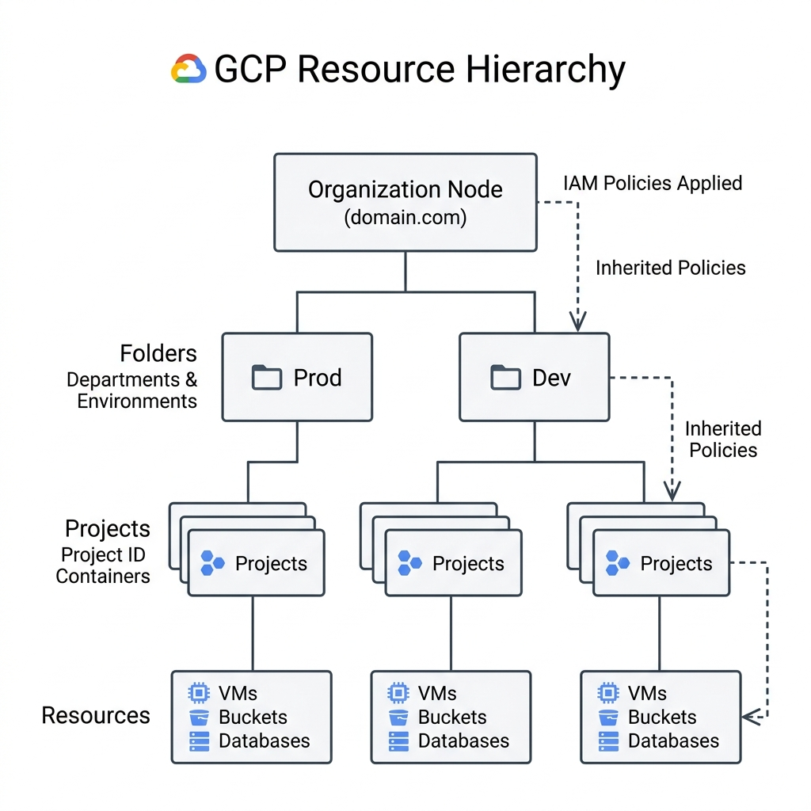
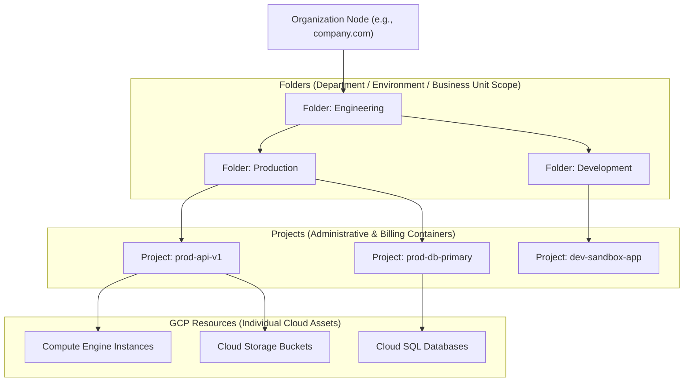

# Topic 08: Resource Hierarchy

---

## 1. What Is It?

The **GCP Resource Hierarchy** is a structured, tree-like administrative framework that governs how resources are organized, managed, and controlled across Google Cloud. It consists of four distinct levels: **Organization**, **Folders**, **Projects**, and **Resources**.

The resource hierarchy establishes clear boundaries for two critical cloud governance pillars:
1. **Inheritance of IAM Permissions**: Roles granted at a higher level automatically apply to all child resources below it.
2. **Inheritance of Organization Policies**: Constraints and security guardrails set at top levels enforce compliance universally down the tree.

### Real-World Analogy
Think of the Resource Hierarchy like a corporate organizational chart. The **Company Headquarters** (Organization) sets company-wide rules. **Divisions/Departments** (Folders) manage specific teams (Engineering vs. Finance). Individual **Teams** manage specific active projects (Projects), which contain physical **Equipment** (Resources). A security policy enforced by Headquarters applies to all departments, teams, and equipment automatically.

---

## 2. Where Does It Fit?

The Resource Hierarchy serves as the overarching structural spine for all access control, audit logging, security policy enforcement, and billing management in Google Cloud.





---

## 3. Core Concepts

| Hierarchy Level | Description | Key Governance Function | Parent / Child Relationships |
|---|---|---|---|
| **Organization** | The root node representing the enterprise company domain (linked to Google Workspace or Cloud Identity). | Enforces global Org Policies, manages centralized billing, and roots all IAM inheritance. | Top level (No parent). Parent to Folders and Projects. |
| **Folders** | Grouping mechanism inside an Organization used to isolate departments, business units, or environments. | Groups projects to delegate administrative control (e.g., Security Team manages Security Folder). | Child of Organization or another Folder. Parent to Sub-Folders and Projects. |
| **Projects** | Base container required for provisioning individual GCP resources. | Isolates VPC networks, service APIs, quotas, and billing attribution. | Child of Organization or Folder. Parent to Resources. |
| **Resources** | Individual cloud infrastructure components (VMs, Buckets, Subnets, Pub/Sub topics). | Actual functional assets executing workloads or storing data. | Child of a single Project (Lowest level in tree). |

---

## 4. How It Works

Policy and permission evaluation across the Resource Hierarchy operates via **Downward Inheritance**:

```text
IAM Policy / Organization Policy defined at Organization Root
              ↓
Policy inherited automatically down to all child Folders
              ↓
Policy inherited down to all child Projects
              ↓
Policy inherited down to individual GCP Resources (VMs, Buckets, SQL)
```

1. **Permissive Privilege Inheritance**: If a user is granted `roles/storage.admin` at the Folder level, they automatically possess Storage Admin rights across **all** Projects and Buckets inside that Folder.
2. **Effective Policy**: A resource's effective permissions are the union of all IAM bindings set at the Resource, Project, Folder, and Organization levels.
3. **Organization Policy Constraints**: Constraints (e.g., `constraints/gcp.resourceLocations` or `constraints/compute.disableGlobalExternalIp`) enforced at higher levels block sub-folders or projects from overriding security guardrails.

---

## 5. Production Scenario

### Enterprise Multi-Tenant Hierarchy Architecture

```text
Requirement: Establish enterprise cloud governance for a global financial organization with strict Prod vs. Non-Prod isolation.
    ↓
Architecture: Organization Node (`finbank.com`) → Top-Level Folders (`Production`, `Non-Production`, `Shared-Services`).
    ↓
Configuration: Nested sub-folders under `Non-Production` (`Development`, `Staging`) separating environment lifecycles.
    ↓
Security: Root Org Policy blocks public IP creation across `Production` folder; IAM Security Admin role assigned at Org root.
    ↓
Scaling: Terraform project factory provisions new microservice projects into designated Folders automatically.
    ↓
Monitoring: Centralized Audit Log Sink configured at Organization level, capturing log events across all child folders and projects.
```

*Why Selected*: Ensures security policies and audit logging cascade universally without requiring manual policy binding every time a team creates a new project.

---

## 6. Hands-On Lab

### Prerequisites
- Google Cloud Organization Node (requires Google Workspace or Cloud Identity domain).
- IAM permissions: `roles/resourcemanager.organizationAdmin` or `roles/resourcemanager.folderAdmin`.
- Access to Cloud Shell or `gcloud` CLI.

### Console Method
1. Log into [Google Cloud Console](https://console.cloud.google.com/).
2. Click the **Project Selector** drop-down menu in the top header bar.
3. In the modal, select your **Organization** from the dropdown list.
4. Navigate to **IAM & Admin** → **Manage Resources**.
5. View the interactive tree displaying your Organization, Folders, and Projects.
6. Click **Create Folder** at the top.
7. Set Folder Name: `Engineering-Sandbox`, select Destination (Organization Root or Parent Folder), and click **Create**.
8. Select the newly created folder → Click **Add Principal** on the right panel to grant a role scoped exclusively to this folder.

### CLI Method
Inspect and manage the Resource Hierarchy using `gcloud`:

```bash
# 1. Get your Organization ID linked to your domain
ORG_ID=$(gcloud organizations list --format="value(name)")
echo "Organization ID: $ORG_ID"

# 2. Create a top-level Folder under the Organization
gcloud resource-manager folders create \
    --display-name="Engineering-Lab" \
    --organization=$ORG_ID

# 3. List all folders under the Organization
gcloud resource-manager folders list --organization=$ORG_ID

# 4. Get the generated Folder ID
FOLDER_ID=$(gcloud resource-manager folders list --organization=$ORG_ID --filter="displayName:Engineering-Lab" --format="value(name)")

# 5. Move an existing project into the newly created folder
# gcloud projects move YOUR_PROJECT_ID --folder=$FOLDER_ID
```

### Verification
Confirm that the folder structure exists under the organization root:

```bash
gcloud resource-manager folders describe $FOLDER_ID
```
*Expected Result*: Returns folder details, lifecycle state (`ACTIVE`), and confirms parent organization reference.

### Cleanup
Delete the test folder (Note: Folders must be empty of child projects before deletion):

```bash
gcloud resource-manager folders delete $FOLDER_ID --quiet
```

---

## 7. Security

### IAM Policy Binding vs Organization Policy Inheritance
- **IAM Policy Inheritance**: IAM permissions are additive. You cannot revoke a permission at a lower level if it was granted at a higher level.
- **Organization Policy Overrides**: Org policy constraints enforce hard security rules (Deny rules) that cannot be bypassed by project owners.

```text
BAD PRACTICE:
Granting broad primitive roles (e.g., roles/editor or roles/owner) at the Organization or top-level Folder scope.
Risk: Gives users administrative power across every single project and resource in the enterprise.

PRODUCTION PRACTICE:
Grant Org/Folder level roles strictly for centralized governance teams (Security Admins, Network Admins). Grant application developers access only at the specific Project scope.
```

---

## 8. Scaling & High Availability

Hierarchy Limits and Folder Nesting:

```text
Organization Root
   ↓ (Max Nesting Depth: 10 levels of Folders)
Deeply Nested Folder Structure (e.g., Org -> Country -> Division -> Dept -> Env)
   ↓ (Best Practice: Max 2-3 Folder levels)
Optimized Enterprise Hierarchy (Simplified maintenance & predictable IAM inheritance)
```

- **Nesting Limit**: GCP supports up to **10 levels** of nested folders. However, production best practice recommends keeping depth to 2–4 levels to avoid complex IAM debugging.
- **Folder Scale**: An organization can contain up to thousands of folders and projects.

---

## 9. Cost

### Financial Governance across the Hierarchy
- **Billing Account Association**: Billing accounts exist outside the resource hierarchy tree and are linked directly to Projects.
- **Hierarchical Cost Visibility**: Use Google Cloud Billing Export to BigQuery with folder metadata enabled to analyze spend by Department Folder.
- **Cost Center Grouping**: Structuring folders by Business Unit (e.g., `Folder: Retail-Banking`, `Folder: Wealth-Management`) allows automatic budget tracking.

---

## 10. Monitoring & Troubleshooting

### Hierarchy Observability Tools
- **Organization Audit Logs**: Centralized logging sinks configured at the Org root export all child logs to BigQuery or Cloud Storage.
- **Security Command Center (SCC)**: Scans the entire resource hierarchy for vulnerabilities and security posture violations.

### Troubleshooting Matrix

| Symptom | Possible Cause | What to Check | Fix |
|---|---|---|---|
| User has unexpected access to a private project | Role granted at higher Folder or Org level overriding project settings | `gcloud asset analyze-iam-policy` | Check IAM bindings on parent Folders and Organization root. |
| `Cannot delete folder` error | Folder still contains active child projects or sub-folders | `gcloud resource-manager folders list` | Move or delete all child projects before deleting the parent folder. |
| Cannot create external IP in project | Organization Policy constraint enforced at parent Folder or Org | Org Policy Console → `compute.disableGlobalExternalIp` | Request Org Policy exception or use Private Service Connect / IAP. |

---

## 11. Common Mistakes

```text
Mistake: Assuming an IAM role denied at a Project level will override a role granted at the Folder level.
Why: Misunderstanding IAM's additive inheritance model.
Impact: Inability to revoke access for specific sub-projects when broad access was granted higher up.
Correct approach: Grant roles at the lowest necessary level (Project scope) instead of over-granting at Folder scope.

Mistake: Creating a flat GCP environment with no Organization Node or Folders.
Why: Operating without Cloud Identity or Google Workspace integration.
Impact: Inability to enforce central security policies, manage employee offboarding safely, or audit multi-project logs.
Correct approach: Set up Cloud Identity to establish an Organization Node before building production infrastructure.
```

---

## 12. Production Best Practices

- [ ] Establish a Cloud Identity or Google Workspace domain to create an Organization Node.
- [ ] Limit Folder nesting depth to 2–3 levels (e.g., `Org` → `Business Unit` → `Environment`).
- [ ] Grant IAM roles at the lowest practical scope; reserve Org/Folder roles for central Security/Network admins.
- [ ] Configure centralized Cloud Logging Sinks at the Organization level for security auditing.
- [ ] Enforce security guardrail Organization Policies at the top-level Organization or Folder boundaries.
- [ ] Automate all Folder and Project hierarchy provisioning using Infrastructure as Code (Terraform).

---

## 13. Hyperscaler / Enterprise Perspective

```text
Personal / Learning (No Org)
  Standalone Projects → Independent Credit Card links → Direct User Accounts
        ↓
Small Production
  Organization Node → Simple Folders (Prod vs Dev) → Shared Billing Account
        ↓
Enterprise Environment
  Multi-Tier Folder Tree (Business Units + Environments) → Centralized Shared VPC Folder → Org Policy Guardrails
        ↓
Hyperscaler Environment
  Automated Landing Zones via Terraform → Hierarchical IAM Policies → Real-time Security Command Center (SCC) → Centralized Audit Log Archiving
```

In a hyperscaler environment, the Resource Hierarchy represents the blueprint of enterprise governance. Landing zones automatically structure folders, enforce strict security policy constraints at the root, and route log telemetry across hundreds of projects into centralized security analytics lakes.

---

## 14. Real Project Questions

### Q1: How does IAM policy inheritance work across the GCP Resource Hierarchy?
**Answer:** IAM policy inheritance is strictly additive and downward-cascading. Permissions granted at the Organization or Folder level automatically apply to all child projects and resources beneath them. You cannot restrict or revoke a permission at a lower project level if it was granted at a higher folder level.

### Q2: What is the technical difference between an IAM Policy and an Organization Policy?
**Answer:** An IAM Policy defines **who** (identity) can do **what** (roles/permissions) on a resource. An Organization Policy defines **what constraints** (rules/restrictions) are enforced on resources, regardless of who is making the request (e.g., blocking public IP creation or restricting allowed GCP regions).

### Q3: Why is an Organization Node required for enterprise GCP deployments?
**Answer:** An Organization node links GCP to an enterprise identity domain (Google Workspace or Cloud Identity). It acts as the root of central control, preventing employees from taking ownership of projects created with corporate credentials, enabling centralized logging, and enforcing global security policies across all company cloud assets.

---

## 15. Quick Decision Guide

| Requirement | Recommended Approach | Reason |
|---|---|---|
| Enforcing a security restriction (e.g., blocking public IPs) across 50 production projects | **Organization Policy applied to Production Folder** | Policy automatically cascades to all current and future projects in that folder. |
| Granting the Security Operations Team audit access across the entire company | **IAM Viewer Role at Organization Root** | Inherits downward to give visibility across all folders, projects, and resources. |
| Isolating Development, Staging, and Production application components | **Separate Folders for each Environment** | Allows distinct IAM permissions, security constraints, and budget guardrails per environment. |

### When should I use it?
- Designing enterprise cloud governance, organizing multi-project environments, or setting up landing zones.

### When should I NOT use it?
- Single-project personal learning sandboxes operating without a domain (where an Organization node is unavailable).

---

## 16. Related Services

```text
             [08. Resource Hierarchy]
              /          |          \
       Organization   Folders     Projects
           Node          |           |
            |         IAM Rules   Resources
       Cloud Identity Policy      VMs/Buckets
```

- **Cloud Identity / Google Workspace**: Provides the enterprise domain for the Organization Node.
- **Cloud IAM**: Manages access permissions inherited down the hierarchy tree.
- **Organization Policy Service**: Enforces security constraints across folders and projects.

---

## 17. Cheat Sheet

### Hierarchy Tree
1. **Organization**: Domain root (e.g., `company.com`).
2. **Folder**: Logical department/environment grouping.
3. **Project**: Resource & billing container.
4. **Resource**: Compute VM, Storage Bucket, Database.

### Useful CLI Commands
```bash
# List organization details
gcloud organizations list

# Create a new folder under an organization
gcloud resource-manager folders create --display-name="NAME" --organization=ORG_ID

# List folders under an organization
gcloud resource-manager folders list --organization=ORG_ID

# Move a project to a folder
gcloud projects move PROJECT_ID --folder=FOLDER_ID
```

---

## 18. Learning Connection

- **Previous Topic**: [07. Projects](../07-projects/README.md)
- **Next Topic**: [09. Billing Accounts](../09-billing-accounts/README.md)
