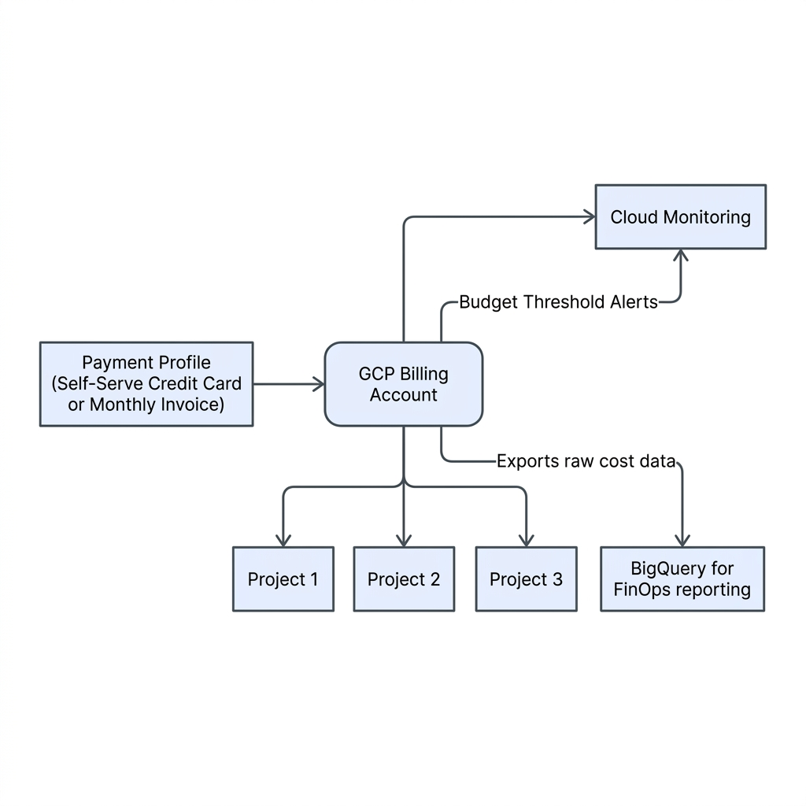
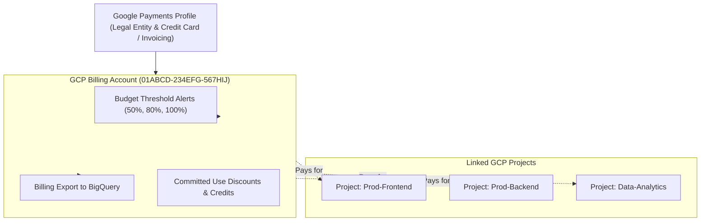

# Topic 09: Billing Accounts

---

## 1. What Is It?

A **GCP Billing Account** is a top-level financial entity in Google Cloud Platform that tracks, measures, and pays for resource usage incurred across one or more linked GCP projects.

No billable resources (such as Compute Engine VMs, BigQuery queries, or Cloud SQL databases) can be created inside a GCP project unless that project is linked to an active, valid Billing Account.

A Billing Account is connected to a **Google Payments Profile**, which defines the legal entity, tax details, and payment mechanism (credit card, debit card, or monthly enterprise invoicing).

### Real-World Analogy
Think of a GCP Billing Account like a corporate credit card account held by the Finance Department. Individual department teams (Projects) submit expense receipts for cloud server usage. All those receipts roll up to the central credit card account, which generates a single consolidated monthly statement sent to the CFO.

---

## 2. Where Does It Fit?

Billing Accounts exist alongside the Resource Hierarchy, operating as financial containers that link directly to Projects regardless of which Folder or Organization node those projects live under.





---

## 3. Core Concepts

| Concept | What It Means | Why It Matters | Enterprise Consideration |
|---|---|---|---|
| **Self-Serve Billing** | Automatic payment via Credit/Debit card or Direct Debit. | Used for personal accounts, early startups, and sandbox experiments. | Requires valid card; subject to credit limits and automatic monthly billing. |
| **Invoiced Billing** | Monthly invoice payment via bank wire transfer or ACH with Net-30 terms. | Required for enterprise organizations spending over thresholds ($10k+/mo). | Requires credit check and formal billing agreement with Google Cloud. |
| **Billing Account ID** | Globally unique 18-character alphanumeric string (e.g., `01ABCD-234EFG-567HIJ`). | Uniquely identifies your financial entity in CLI scripts and Terraform. | Immutable identifier used across all billing management APIs. |
| **Billing Link** | The 1:Many association binding a single Billing Account to multiple Projects. | Allows centralized payment while keeping individual project environments isolated. | Unlinking a project halts billable resource creation immediately. |
| **Billing IAM Roles** | Specific IAM roles (`roles/billing.admin`, `roles/billing.user`, `roles/billing.viewer`). | Enforces strict separation of duties between financial admins and developers. | Prevents application developers from seeing enterprise discount rates or credit card info. |

---

## 4. How It Works

Cost accumulation and billing enforcement follow a continuous metering lifecycle:

```text
Resource Usage Event (Compute Engine vCPU hour / GCS Storage GB)
              ↓
Metering Agent generates Usage Record (SKU, Quantity, Timestamp, Project ID)
              ↓
GCP Billing Engine applies Discounts (Sustained Use / Committed Use / Credits)
              ↓
Cost charged against linked GCP Billing Account
              ↓
Aggregated Cost Data exported to BigQuery Billing Export & Cloud Console
              ↓
Budget Alert rules evaluated → Pub/Sub notifications sent if threshold exceeded
```

1. **Metering**: GCP measures resource consumption at 1-second granularity for compute and byte-level granularity for storage.
2. **SKU Pricing**: Usage is priced according to specific Stock Keeping Unit (SKU) rates per region.
3. **Discounts**: Credits, Sustained Use Discounts (SUDs), and Committed Use Discounts (CUDs) are deducted automatically prior to final invoicing.

---

## 5. Production Scenario

### Enterprise FinOps Cost Control Pipeline

```text
Requirement: Manage cloud spend across 100+ projects with automated 80% budget alerts and real-time SQL analytics.
    ↓
Architecture: Monthly Invoiced Billing Account linked to Organization Node; Billing Export enabled to BigQuery.
    ↓
Configuration: Configure 50%, 80%, 100% budget alerts publishing events to a Pub/Sub topic.
    ↓
Security: Restrict `roles/billing.admin` strictly to Finance Team; Developers receive `roles/billing.user` (to link projects only).
    ↓
Scaling: BigQuery Billing Export streams millions of raw cost records into a central dataset for Looker visualization.
    ↓
Monitoring: Automated Cloud Function triggered by 100% budget breach to disable non-production project billing links.
```

*Why Selected*: Ensures full financial transparency across multi-team engineering departments while enforcing automated circuit breakers against unexpected runaway cloud spend.

---

## 6. Hands-On Lab

### Prerequisites
- GCP Free Account or active Billing Account.
- IAM permissions: `roles/billing.admin` or `roles/billing.viewer`.
- Cloud Shell or local `gcloud` CLI.

### Console Method
1. Log into [Google Cloud Console](https://console.cloud.google.com/).
2. Open the **Navigation Menu** → Select **Billing**.
3. In the Billing Overview dashboard, view the current month's **Estimated Cost**, **Cost Trend**, and **Top Projects by Spend**.
4. Select **Budgets & alerts** from the left menu → Click **Create Budget**.
5. Set Name: `Monthly-Guardrail-Budget`, Target Amount: Specified dollar limit (e.g., `$100.00`).
6. Set Alert Thresholds: 50%, 80%, and 100% of budget.
7. Under Actions, select **Email alerts to billing admins** and optionally attach a Pub/Sub topic.
8. Click **Finish**.
9. Select **Billing export** → Configure daily export to a BigQuery dataset.

### CLI Method
Inspect billing accounts and configure project billing links via `gcloud`:

```bash
# 1. List all billing accounts accessible by your user identity
gcloud billing accounts list

# 2. Get the primary Billing Account ID string
BILLING_ID=$(gcloud billing accounts list --format="value(name)" --filter="open=true" | head -n 1)
echo "Primary Billing Account: $BILLING_ID"

# 3. List all GCP projects currently linked to this billing account
gcloud billing projects list --billing-account=$BILLING_ID

# 4. Describe billing status of a specific project
PROJECT_ID="your-gcp-project-id"
gcloud billing projects describe $PROJECT_ID
```

### Verification
Confirm that billing export or budget rules exist:

```bash
gcloud billing accounts describe $BILLING_ID
```
*Expected Result*: Returns `open: true`, display name, and confirms active status of the billing account.

### Cleanup
Budgets and alerts incur no charges. To remove a test budget, navigate to **Billing** → **Budgets & alerts** → Select budget → Click **Delete**.

---

## 7. Security

### Billing IAM Roles & Separation of Duties
- **`roles/billing.admin`**: Complete control over billing account settings, payment profiles, and budget rules. (Grant ONLY to Finance/CFO).
- **`roles/billing.user`**: Allows linking projects to the billing account, but CANNOT view financial invoices or payment details. (Grant to Lead Engineers/DevOps).
- **`roles/billing.viewer`**: Read-only access to view spend reports and budgets. (Grant to FinOps Analysts).

```text
BAD PRACTICE:
Granting developers `roles/billing.admin` or giving all engineers direct access to the Google Payments Profile.
Risk: Unauthorized users can view credit card numbers, modify payment methods, or close the billing account.

PRODUCTION PRACTICE:
Enforce strict separation of duties. Grant developers `roles/billing.user` to link projects, keeping billing administration isolated to Finance.
```

---

## 8. Scaling & High Availability

Financial Governance at Scale:

```text
Single Self-Serve Credit Card (Personal / Startup - Manual limits)
   ↓ (Enterprise Billing Transition)
Single Invoiced Billing Account (Unified Enterprise Invoice across 100s of Projects)
   ↓ (Multi-Billing Account Architecture)
Multi-Billing Account Setup (Business Unit / Regional Tax isolation)
```

- **Project-to-Billing Limits**: A single Billing Account can easily support thousands of linked projects across an Organization node.
- **Multi-Billing Accounts**: Large conglomerates use separate Billing Accounts for distinct international subsidiaries to handle local currency billing and tax jurisdictions.

---

## 9. Cost

### Pricing Factors & Cost Optimization
- **No Direct Service Charge**: Operating a GCP Billing Account itself is completely free; charges derive solely from underlying project resource consumption.
- **Committed Use Discounts (CUDs)**: Purchase 1-year or 3-year resource commitments (vCPU, RAM, GPUs) at the Billing Account level to receive up to 57% automated price discounts across all linked projects.
- **Budget Alerts Do NOT Stop Spending Automatically**: Standard budget alerts send notifications only. Programmatic circuit breakers (Cloud Functions) are required to halt resources at 100% spend.

---

## 10. Monitoring & Troubleshooting

### Billing Observability Tools
- **Billing Reports**: Interactive cost graphs grouped by Project, Service, Region, or Label.
- **Cost Table**: Detailed invoice line-item breakdown by SKU.

### Troubleshooting Matrix

| Symptom | Possible Cause | What to Check | Fix |
|---|---|---|---|
| `Billing Account Closed` error when creating VMs | Payment profile failure (expired credit card, declined bank auth) | Billing Console → Payment Settings | Update credit card details or contact bank to resolve payment hold. |
| Developer cannot launch Compute VMs | Project not linked to an active Billing Account | `gcloud billing projects describe <ID>` | Run `gcloud billing projects link <ID> --billing-account=<ACCOUNT_ID>`. |
| Billing alerts not being received | Email addresses missing from Billing Admin list or spam filtered | Billing Console → Budgets & alerts | Verify recipient email addresses and Pub/Sub topic subscription. |

---

## 11. Common Mistakes

```text
Mistake: Expecting Budget Alerts to automatically shut down VMs when the budget is reached.
Why: Misunderstanding that budget alerts are passive notification triggers by default.
Impact: Continuous billing charges even after breaching 100% budget thresholds.
Correct approach: Attach a Pub/Sub topic to the budget alert to trigger a Cloud Function that unlinks billing automatically.

Mistake: Creating separate Billing Accounts for every small project.
Why: Over-fragmenting financial management.
Impact: Inability to consolidate Committed Use Discounts or meet enterprise invoicing minimum spend thresholds.
Correct approach: Use 1 Central Billing Account linked to multiple Projects organized by Folders and Labels.
```

---

## 12. Production Best Practices

- [ ] Transition from Self-Serve Credit Card to Monthly Invoiced Billing for production workloads.
- [ ] Enforce strict IAM separation of duties (`roles/billing.admin` for Finance; `roles/billing.user` for DevOps).
- [ ] Configure 50%, 80%, and 100% Budget Alerts on all billing accounts immediately.
- [ ] Stream real-time billing data to BigQuery using **Billing Export** for custom FinOps dashboards.
- [ ] Apply cost-center and environment labels to all projects for granular cost attribution.
- [ ] Purchase Committed Use Discounts (CUDs) at the Billing Account level for baseline compute workloads.

---

## 13. Hyperscaler / Enterprise Perspective

```text
Personal / Learning
  Self-serve credit card → Single Billing Account → 1-2 Projects → Manual dashboard checks
        ↓
Small Production
  Auto-pay Credit Card → 1 Billing Account → Dev/Prod Projects → 80% Budget Alerts
        ↓
Enterprise Environment
  Monthly Invoiced Billing → Organization Node → BigQuery Billing Export → FinOps Dedicated Team
        ↓
Hyperscaler Environment
  Multi-Currency Billing Accounts → Automated Pub/Sub Cost Cap Circuit Breakers → Enterprise Discount Agreements (EDA) → Looker FinOps Dashboards
```

In a hyperscaler environment, Billing Accounts are managed as strategic financial hubs. Enterprise Discount Agreements (EDAs) apply custom pricing across global projects, while automated streaming pipelines send raw SKU billing records to BigQuery and Looker for continuous FinOps cost optimization and anomaly detection.

---

## 14. Real Project Questions

### Q1: What is the difference between Self-Serve and Monthly Invoiced Billing Accounts on GCP?
**Answer:** Self-Serve Billing Accounts automatically charge a linked credit/debit card or bank account on a monthly threshold basis. Monthly Invoiced Billing Accounts are designed for enterprise customers spending $10k+/month; Google issues a monthly invoice with Net-30 payment terms paid via bank wire transfer.

### Q2: How can an organization automatically stop cloud spending when a budget limit is reached?
**Answer:** Because native GCP Budget Alerts only send notifications, an organization must attach a Pub/Sub topic to the budget alert. When a 100% threshold breach occurs, Pub/Sub triggers a Cloud Function that programmatically unlinks the billing account from the project or disables specific service APIs.

### Q3: How do Committed Use Discounts (CUDs) work across multiple linked projects?
**Answer:** CUDs are purchased at the Billing Account level. GCP's billing engine automatically applies the committed vCPU, RAM, or database discount slots across any eligible running workloads in *any* linked project under that billing account, maximizing overall discount utilization.

---

## 15. Quick Decision Guide

| Requirement | Recommended Approach | Reason |
|---|---|---|
| Enterprise cloud deployment spending >$10k/month | **Monthly Invoiced Billing Account** | Provides Net-30 payment terms, bank transfer options, and enterprise discount eligibility. |
| Personal learning sandbox or startup prototype | **Self-Serve Billing Account with $300 Credit** | Quick setup with credit card verification and Always Free tier guardrails. |
| Automated alerting when project costs breach 80% threshold | **Cloud Billing Budget Alert + Pub/Sub** | Delivers real-time email notifications and webhook event integration for FinOps teams. |

### When should I use it?
- Mandatory step for launching any billable GCP project or enterprise cloud environment.

### When should I NOT use it?
- Never share a personal self-serve billing account with corporate enterprise production workloads.

---

## 16. Related Services

```text
             [09. Billing Accounts]
              /          |          \
      BigQuery Export  Cloud IAM   Cloud Monitoring
            |            |             |
     FinOps Analytics  Billing Roles  Budget Alerts
```

- **BigQuery Billing Export**: Streams detailed SKU cost logs to BigQuery for SQL analysis.
- **Cloud IAM**: Controls who can manage billing settings vs. who can link projects.
- **Cloud Monitoring / Pub/Sub**: Delivers automated budget threshold alerts.

---

## 17. Cheat Sheet

### Core Identifiers
- **Billing Account ID**: 18-character string (e.g., `01ABCD-234EFG-567HIJ`).
- **Payment Profile**: Legal entity and payment instrument settings.
- **Billing Link**: Association binding a Project to a Billing Account.

### Useful CLI Commands
```bash
# List all accessible billing accounts
gcloud billing accounts list

# List all projects linked to a billing account
gcloud billing projects list --billing-account=ACCOUNT_ID

# Link a project to a billing account
gcloud billing projects link PROJECT_ID --billing-account=ACCOUNT_ID

# Describe project billing status
gcloud billing projects describe PROJECT_ID
```

---

## 18. Learning Connection

- **Previous Topic**: [08. Resource Hierarchy](../08-resource-hierarchy/README.md)
- **Next Topic**: [10. Cloud Console](../10-cloud-console/README.md)
