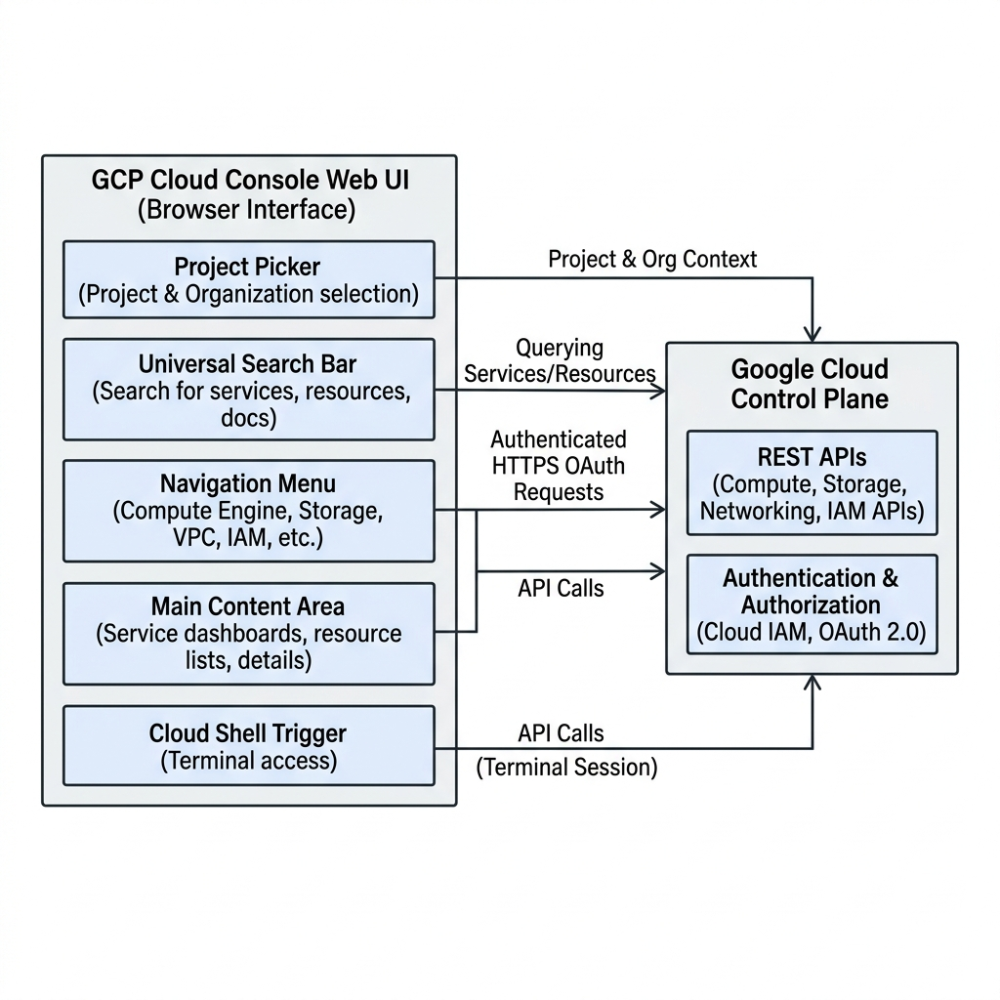
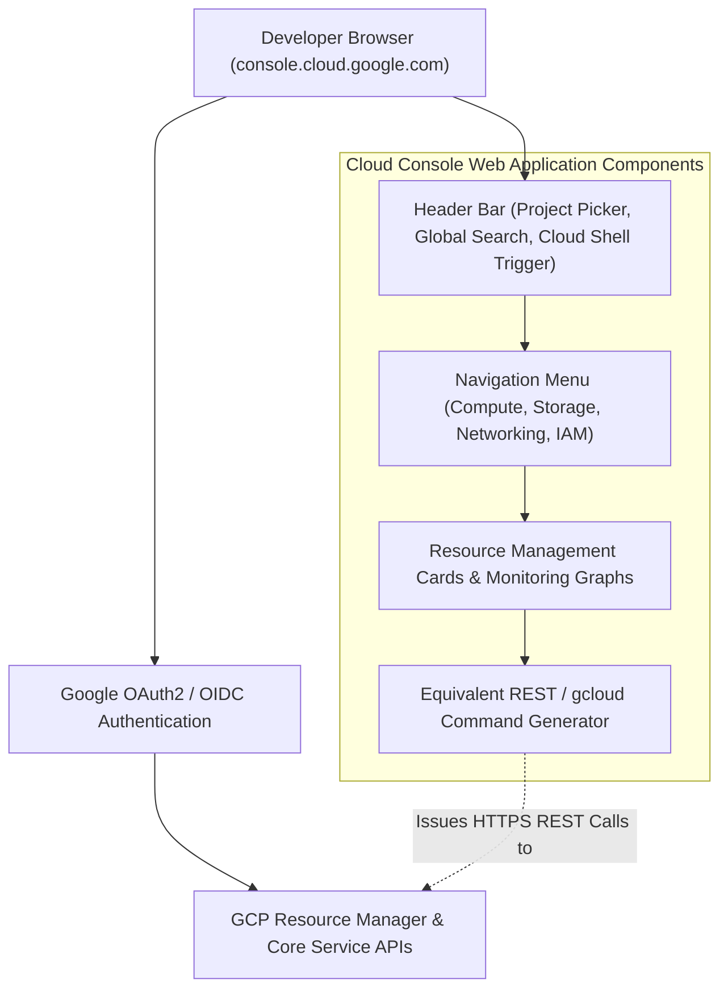

# Topic 10: Cloud Console

---

## 1. What Is It?

The **Google Cloud Console** (`console.cloud.google.com`) is the web-based graphical user interface (GUI) provided by Google to manage, provision, monitor, and troubleshoot all Google Cloud Platform resources.

It provides visual dashboards, interactive resource creation wizards, real-time logging views, IAM permission managers, and integrated command-line access via Cloud Shell. While production infrastructure is typically automated using Infrastructure as Code (Terraform), the Cloud Console remains the primary interface for exploratory learning, real-time observability, security auditing, and ad-hoc troubleshooting.

### Real-World Analogy
Think of the Cloud Console like the digital dashboard inside a modern aircraft cockpit. While the autopilot system (Terraform / CI/CD) handles routine flight paths automatically, the cockpit dashboard gives the pilot instant visual gauges, warning lights, control switches, and manual override controls whenever operational inspection is needed.

---

## 2. Where Does It Fit?

The Cloud Console acts as a web client layer interacting directly with the GCP Control Plane REST/gRPC APIs using OIDC/OAuth2 user authentication.





---

## 3. Core Concepts

| Interface Feature | Location | Primary Function | Production Consideration |
|---|---|---|---|
| **Project Picker** | Top Navigation Header | Switch working context between different GCP Projects, Folders, or Organizations. | Always double-check target project ID before creating or modifying resources. |
| **Global Search Bar** | Top Center Header (`/` shortcut) | Instantly locate services, specific VM names, IP addresses, documentation, or gcloud syntax. | Fastest way to navigate to deep sub-menus without browsing navigation trees. |
| **Navigation Menu** | Top-Left Pin Button (Burger Menu) | Access all 100+ GCP services grouped by category (Compute, Storage, Databases, Security). | Pin frequently used products to the top of the left navigation pane for fast access. |
| **Cloud Shell Button** | Top Right Header (Terminal Icon) | Opens an in-browser Linux shell pre-authenticated with gcloud CLI tools. | Useful for running CLI scripts directly from the browser without local setup. |
| **EQUIVALENT CODE Button** | Resource Creation Pages | Displays exact `gcloud` CLI syntax or REST API payload for the configured UI form. | Excellent tool for learning gcloud commands and building Terraform modules. |

---

## 4. How It Works

Console UI interactions translate into authenticated API calls behind the scenes:

```text
User fills out form in Cloud Console (e.g., Create VM)
              ↓
User clicks "EQUIVALENT CODE" (Optional view of gcloud / REST API payload)
              ↓
User clicks "CREATE" button
              ↓
Console issues authenticated HTTPS POST request to GCP Control Plane (compute.googleapis.com)
              ↓
Control Plane validates user IAM permissions (OAuth2 bearer token)
              ↓
Resource creation progress displayed via real-time Console Notification toaster
```

1. **Session State**: Console sessions are bound to your authenticated Google Account identity.
2. **Permission Rendering**: Buttons or pages gray out or return `403 Forbidden` if your IAM role lacks permissions for that specific service.
3. **API Discovery**: Every form field directly maps to a JSON parameter in Google Cloud's REST API schema.

---

## 5. Production Scenario

### Rapid Emergency Outage Triage via Cloud Console

```text
Requirement: Investigate an unexpected HTTP 500 error spike reported on a production web application.
    ↓
Architecture: Use Cloud Console for immediate visual diagnostic across Monitoring, Logging, and Compute.
    ↓
Step 1 (Navigation): Open Global Search → Type `Monitoring` → Inspect HTTP Error Rate graph.
    ↓
Step 2 (Logs Explorer): Open Navigation Menu → Logging → Logs Explorer → Query `resource.type="cloud_run_revision" severity>=ERROR`.
    ↓
Step 3 (Identification): Pinpoint database connection pool exhaustion in real-time log stack traces.
    ↓
Step 4 (Mitigation): Navigate to Cloud SQL → Increase max connections setting → Verify graph recovery in Console.
```

*Why Selected*: Performing emergency triage via the web console provides instant visual correlation across logs, metrics, and configurations faster than running manual raw terminal queries during a high-severity incident.

---

## 6. Hands-On Lab

### Prerequisites
- Active GCP Account and Project.
- Modern web browser (Chrome, Firefox, Edge, Safari).
- IAM permissions: `roles/viewer` or higher.

### Console Method
1. Navigate to [console.cloud.google.com](https://console.cloud.google.com/) and sign in.
2. Observe the **Header Bar**:
   - Click the **Project Picker** drop-down menu and inspect your organization/project list.
   - Click in the **Search Bar** (or press `/`) and type `Compute Engine`. Press Enter.
3. Observe the **Navigation Menu**:
   - Click the top-left burger menu icon.
   - Hover over **Cloud Storage** → Click the **Pin** icon to move it to the pinned section at top.
4. Test the **EQUIVALENT CODE** feature:
   - Navigate to **Compute Engine** → **VM instances** → Click **Create Instance**.
   - Set Name to `console-demo-vm`.
   - Scroll to the bottom of the page and click **EQUIVALENT CODE**.
   - Inspect the generated **REST** payload tab and **COMMAND LINE (`gcloud`)** tab.
   - Click **Cancel** (do not create the instance).
5. Open **Cloud Shell**:
   - Click the **Activate Cloud Shell** icon (`>_`) in the top right header bar.
   - Wait for the Cloud Shell terminal pane to initialize at the bottom of the browser.

### CLI Method
Verify CLI commands generated directly from the Console UI:

```bash
# Execute the gcloud command copied from the Console's EQUIVALENT CODE button
gcloud compute instances create console-demo-vm \
    --project=$DEVSHELL_PROJECT_ID \
    --zone=us-central1-a \
    --machine-type=e2-micro \
    --dry-run
```

### Verification
*Expected Result*: The `--dry-run` flag prints the validated request details showing that the Console-generated command is syntactically correct.

### Cleanup
No billable resources were created during this UI navigation lab. Close the Cloud Shell terminal pane.

---

## 7. Security

### Web Console Access Security
- **Session Timeout**: Enforce re-authentication session timeouts via Google Workspace / Cloud Identity policies.
- **Two-Factor Authentication (2FA)**: Enforce hardware security keys (FIDO2/WebAuthn) or 2SV for all users accessing the console.
- **Context-Aware Access**: Restrict access to the Cloud Console based on user IP location, device health, and network security posture using Identity-Aware Proxy (IAP).

```text
BAD PRACTICE:
Leaving unattended open browser sessions logged into the GCP Console on public or shared computers.
Risk: Unauthorized users can modify firewall rules, grant IAM permissions, or delete storage buckets.

PRODUCTION PRACTICE:
Enforce automatic session idle timeouts (e.g., 15–30 mins), mandate 2-Step Verification, and require corporate VPN/IAP device verification.
```

---

## 8. Scaling & High Availability

Managing Large Scale Infrastructure via Console:

```text
Individual Resource Management (Console ClickOps - OK for 1-5 resources)
   ↓ (High Resource Volume: 100+ VMs)
Console Filtering & Bulk Selection (Filter by label, region, or status)
   ↓ (Hyperscaler Scale: 10,000+ resources)
Infrastructure as Code (Terraform) + Console Read-Only Observability
```

- **Scale Limitations of GUI**: Managing hundreds of VM instances or microservices via manual UI clicks causes human error and configuration drift.
- **Console as a Viewer**: At enterprise scale, the Cloud Console transitions from a *creation tool* to a *monitoring and visualization tool*.

---

## 9. Cost

### FinOps Features in the Console
- **Cost Table & Reports**: Deep interactive breakdown of daily spend by SKU, region, and project.
- **Active Recommendations**: The Console displays automated **Recommender** notifications highlighting overprovisioned VMs, idle persistent disks, and unattached static IPs to save costs.

---

## 10. Monitoring & Troubleshooting

### Built-In UI Observability
- **Logs Explorer**: Real-time log streaming interface with query auto-completion.
- **Cloud Monitoring Dashboards**: Pre-built and customizable visual metric charts.

### Troubleshooting Matrix

| Symptom | Possible Cause | What to Check | Fix |
|---|---|---|---|
| "You do not have permission to view this page" | IAM role lacks viewer rights for the specific service | Top-right user avatar / Active IAM bindings | Request required predefined viewer role from project IAM Admin. |
| Console page failing to load or spinning endlessly | Temporary browser cache issue or GCP API outage | Google Cloud Service Health Dashboard | Clear browser cache/cookies or test in Incognito mode. |
| Cannot find newly created project in drop-down list | Project Selector filter set to wrong Organization or search query | Project Selector modal tabs | Click **ALL** tab in Project Selector modal to clear search filters. |

---

## 11. Common Mistakes

```text
Mistake: Performing manual production changes directly via Console clicks ("ClickOps").
Why: Speed and convenience of modifying settings in the web UI.
Impact: Creates untracked configuration drift between production state and Terraform code.
Correct approach: Make all production changes via Infrastructure as Code (Terraform) versioned in Git.

Mistake: Ignoring the "EQUIVALENT CODE" button when learning GCP.
Why: Overlooking the built-in command generator.
Impact: Struggling to write gcloud scripts or Terraform modules manually from scratch.
Correct approach: Use EQUIVALENT CODE on every console form to instantly learn the underlying gcloud syntax.
```

---

## 12. Production Best Practices

- [ ] Enforce 2-Step Verification (2SV) for all user accounts logging into the Console.
- [ ] Set up short session idle timeouts for web console access via Cloud Identity.
- [ ] Use the Cloud Console primarily for observability, auditing, and troubleshooting—not manual production provisioning.
- [ ] Utilize the **EQUIVALENT CODE** button to extract `gcloud` syntax for automation scripts.
- [ ] Pin frequently used services to the top of the left navigation pane for efficiency.
- [ ] Check GCP **Recommender** cards regularly in the console to identify idle or overprovisioned resources.

---

## 13. Hyperscaler / Enterprise Perspective

```text
Personal / Learning
  100% Console ClickOps → Manual VM creation → GUI troubleshooting
        ↓
Small Production
  Mixed Console + gcloud CLI → Manual staging deployments → Basic Console Monitoring
        ↓
Enterprise Environment
  Terraform IaC Provisioning → Console used for IAM Auditing & Log Exploration → Single Sign-On (SSO)
        ↓
Hyperscaler Environment
  Zero Manual Console Provisioning → Strict Read-Only Console IAM Roles → Automated GitOps CI/CD → Centralized SOC Monitoring
```

In a hyperscaler environment, direct write access to the Cloud Console is disabled for developers in production projects. Production infrastructure is managed 100% through automated GitOps CI/CD pipelines, while the Cloud Console serves as a read-only portal for logs, metrics, and security audits.

---

## 14. Real Project Questions

### Q1: Why is "ClickOps" in the Cloud Console considered an anti-pattern for production environments?
**Answer:** Making manual changes directly in the Cloud Console bypasses peer code reviews, introduces untracked configuration drift from source code repositories, lacks audit repeatability, and increases the risk of human error during production deployments. Production changes should always be executed via Infrastructure as Code (Terraform).

### Q2: How does the "EQUIVALENT CODE" feature in the Console assist DevOps engineers?
**Answer:** EQUIVALENT CODE translates all form field parameters configured in the Console UI into exact `gcloud` CLI commands or REST API JSON payloads. Engineers can configure complex resources visually in the UI, extract the generated code, and incorporate it directly into automated shell scripts or Terraform modules.

### Q3: How can security administrators restrict access to the Cloud Console based on user device location?
**Answer:** Security administrators use **BeyondCorp / Context-Aware Access** policies powered by Identity-Aware Proxy (IAP). This allows defining access rules that require users to log in from approved corporate IP ranges, encrypted company-managed devices, and specific geographic regions before access to `console.cloud.google.com` is granted.

---

## 15. Quick Decision Guide

| Requirement | Recommended Approach | Reason |
|---|---|---|
| Real-time visual log analysis during an active system outage | **Cloud Console (Logs Explorer)** | Fast interactive log filtering, live streaming, and visual stack trace analysis. |
| Provisioning 50 uniform Kubernetes worker nodes | **Terraform / gcloud CLI** | Ensures repeatable, error-free, version-controlled infrastructure deployment. |
| Learning gcloud syntax for a new GCP service | **Console (EQUIVALENT CODE feature)** | Instantly generates valid gcloud CLI commands from visual form inputs. |

### When should I use it?
- Ad-hoc troubleshooting, real-time log investigation, viewing metrics dashboards, and learning new GCP service parameters.

### When should I NOT use it?
- Deploying or updating production infrastructure—use Infrastructure as Code (Terraform) instead.

---

## 16. Related Services

```text
               [10. Cloud Console]
              /         |         \
       Cloud Shell  Logs Explorer  Cloud Monitoring
            |           |                 |
       CLI Terminal Real-time Logs   Visual Dashboards
```

- **Cloud Shell**: Embedded web terminal providing instant gcloud CLI access inside the console.
- **Logs Explorer**: Integrated log viewing and querying interface.
- **Cloud Monitoring**: Visual metrics, dashboards, and alerting interface.

---

## 17. Cheat Sheet

### UI Shortcuts & Features
- `/` : Focus Global Search Bar instantly.
- `g` then `h` : Go to Console Home Dashboard.
- `EQUIVALENT CODE` : View exact REST / `gcloud` syntax on any creation page.
- `>_` : Launch Cloud Shell terminal.

### Essential URLs
- Cloud Console: `https://console.cloud.google.com/`
- Service Health: `https://status.cloud.google.com/`
- GCP Documentation: `https://cloud.google.com/docs`

---

## 18. Learning Connection

- **Previous Topic**: [09. Billing Accounts](../09-billing-accounts/README.md)
- **Next Topic**: [11. Cloud Shell](../11-cloud-shell/README.md)
