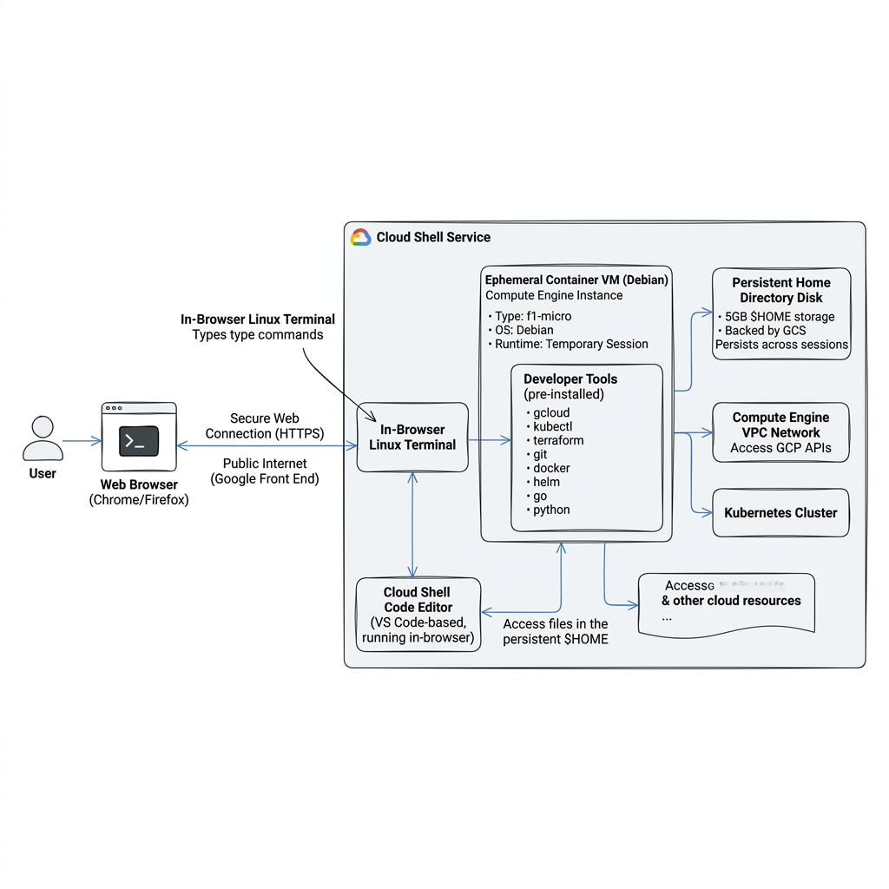
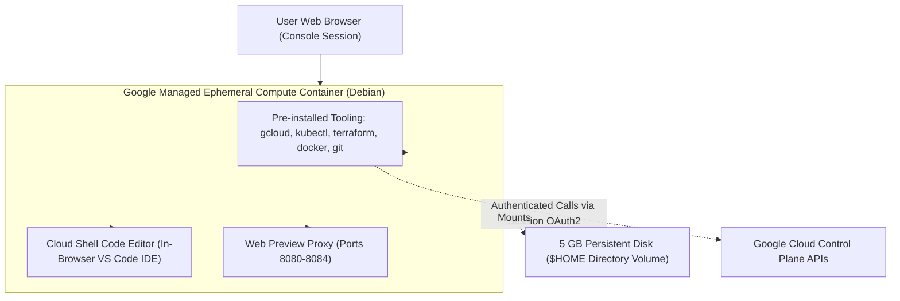

# Topic 11: Cloud Shell

---

## 1. What Is It?

**Google Cloud Shell** is an in-browser, fully managed command-line development environment accessible directly from the Google Cloud Console.

It provides a temporary Debian-based Linux virtual machine equipped with **5 GB of persistent `$HOME` directory storage**, pre-configured authentication matching your active web console session, and a built-in web-based code editor powered by Eclipse Theia / VS Code (`cloudshell edit`).

Cloud Shell comes pre-installed with all major cloud development tools, including `gcloud`, `kubectl`, `terraform`, `docker`, `git`, `python`, `node.js`, and `go`, allowing developers to manage GCP infrastructure instantly from any web browser without installing tools locally.

### Real-World Analogy
Think of Cloud Shell like a pre-configured engineer's workstation on wheels that follows you wherever you log in. Instead of carrying a personal laptop loaded with development software, drivers, and API keys, you open any web browser, click a button, and immediately step into a fully equipped Linux environment logged in and ready to work.

---

## 2. Where Does It Fit?

Cloud Shell provides a secure, zero-installation administrative bridge connecting your web browser to Google Cloud APIs and containerized runtimes.





---

## 3. Core Concepts

| Concept | What It Means | Why It Matters | Production Consideration |
|---|---|---|---|
| **Ephemeral Environment** | The underlying VM container is allocated on-demand and destroyed after inactivity. | Prevents resource hoarding and ensures a clean OS image on launch. | Files saved outside `$HOME` (e.g., in `/tmp` or `/var`) are lost on disconnect. |
| **5 GB Persistent `$HOME`** | A persistent network disk volume attached to your Cloud Shell instance across sessions. | Retains your custom scripts, git repos, `.bashrc`, and Terraform code indefinitely. | Unused `$HOME` directories are deleted if inactive for 120 days. |
| **Automatic Auth Context** | Cloud Shell inherits your Google Account credentials automatically upon initialization. | Eliminates running `gcloud auth login` or storing service account keys locally. | Inherits your active GCP user IAM permissions directly. |
| **Web Preview** | Proxies local ports (e.g., 8080, 8000) running inside Cloud Shell to a secure browser URL. | Test web apps or HTTP APIs running inside Cloud Shell without exposing public IPs. | Restricted to authenticated session user; not publicly accessible. |
| **Cloud Shell Boost Mode** | Temporarily upgrades VM hardware to 4 vCPUs and 8 GB RAM for 24 hours. | Accelerates heavy tasks like container builds, Terraform applies, or compilations. | Free of charge; automatically reverts to standard tier after 24 hours. |

---

## 4. How It Works

Cloud Shell provisions a gVisor-sandboxed container VM on demand:

```text
User clicks "Activate Cloud Shell" (>_) in GCP Console
              ↓
GCP Control Plane allocates ephemeral Debian container VM
              ↓
Attaches user's 5 GB Persistent Disk to /home/username
              ↓
Mounts OAuth2 access token for active Google Account session
              ↓
Terminal WebSocket connection rendered in browser panel
              ↓
Session Idle 60 mins → VM terminates; /home volume safely unmounted
```

1. **Provisioning Time**: Takes approximately 5–10 seconds to spin up an environment.
2. **Persistence Guarantee**: Any file stored within `/home/your_username/` persists across VM recycling events.
3. **Usage Quota**: Free to use up to 60 hours per week per user.

---

## 5. Production Scenario

### Hotfix Deployment via Cloud Shell & Terraform

```text
Requirement: Apply an urgent firewall rule patch to production VPC from a remote laptop without local dev tools.
    ↓
Step 1 (Access): Log into GCP Console on emergency laptop → Activate Cloud Shell.
    ↓
Step 2 (Repository): Git pull infrastructure repository inside persistent `$HOME` directory.
    ↓
Step 3 (Editor): Open Cloud Shell Editor (`cloudshell edit main.tf`) → Modify firewall block rule.
    ↓
Step 4 (Validation): Execute `terraform plan` directly inside Cloud Shell terminal.
    ↓
Step 5 (Execution): Run `terraform apply` → Authenticated gcloud credentials execute change against GCP APIs.
```

*Why Selected*: Allows executing complex Infrastructure as Code (Terraform) pipelines securely from any browser without requiring local SDK installation, SSH keys, or exposed API credentials.

---

## 6. Hands-On Lab

### Prerequisites
- Google Account with access to GCP Console.
- Web browser.

### Console Method
1. Log into [console.cloud.google.com](https://console.cloud.google.com/).
2. Click the **Activate Cloud Shell** icon (`>_`) in the top right navigation bar.
3. Wait for the terminal window to open at the bottom of the screen.
4. Test pre-installed tools in terminal:
   ```bash
   gcloud --version
   kubectl version --client
   terraform --version
   docker --version
   ```
5. Test file persistence in your `$HOME` directory:
   ```bash
   echo "Hello GCP Cloud Shell" > ~/test_persistence.txt
   cat ~/test_persistence.txt
   ```
6. Open the **Cloud Shell Code Editor**:
   - Click the **Open Editor** button (Pencil icon) on the Cloud Shell toolbar.
   - Observe the VS Code-based web editor opening above the terminal pane.
7. Test **Web Preview**:
   - In terminal, start a simple Python HTTP server:
     ```bash
     python3 -m http.server 8080
     ```
   - Click **Web Preview** icon (eye icon) on top right of terminal toolbar → Select **Preview on port 8080**.
   - Observe the browser tab opening and serving your `$HOME` directory files securely.
   - Stop Python server by pressing `Ctrl + C`.

### CLI Method
Inspect Cloud Shell environment variables and storage usage:

```bash
# Check active project context automatically set by Cloud Shell
echo $DEVSHELL_PROJECT_ID

# Check home directory disk usage (5 GB quota limit)
df -h ~

# Enable Boost Mode via command line (or via UI menu)
# (Available via Cloud Shell UI menu: More options -> Enable Boost Mode)
```

### Verification
*Expected Result*: The terminal returns `$DEVSHELL_PROJECT_ID` matching your current console project, confirming pre-authenticated session context.

### Cleanup
Close the Cloud Shell terminal tab or type `exit`. Persistent files in `~` remain saved; ephemeral `/tmp` files are purged automatically.

---

## 7. Security

### Identity, Tokens & Network Isolation
- **No Long-Lived Key Files**: Cloud Shell uses ephemeral OAuth2 tokens tied to your web login. You never need to generate or store JSON service account keys in `$HOME`.
- **Session Scoping**: The web preview proxy uses authenticated cookies. External internet users cannot access your web preview ports.

```text
BAD PRACTICE:
Storing raw hardcoded API keys, database passwords, or private SSH keys inside unencrypted files in Cloud Shell `$HOME`.
Risk: Insecure file permissions could expose credentials if session environments are shared.

PRODUCTION PRACTICE:
Use Secret Manager or environment variables for sensitive data. Keep persistent $HOME code committed to remote git repositories.
```

---

## 8. Scaling & High Availability

Limits and Quotas of Cloud Shell:

```text
Standard Cloud Shell Session (1 vCPU, 1.7 GB RAM, 5 GB Storage)
   ↓ (Enable Boost Mode via Console Menu)
Boost Mode Session (4 vCPUs, 8 GB RAM for 24 hours)
   ↓ (Heavy Compute Needs exceed Cloud Shell)
Dedicated Cloud Workstations / Compute Engine VM (Full Enterprise Dev Infrastructure)
```

- **Weekly Quota**: Cloud Shell access is capped at **60 hours per week**.
- **Inactivity Timeout**: Sessions automatically disconnect after 60 minutes of inactivity.

---

## 9. Cost

### Pricing & Usage Guardrails
- **100% Free Service**: Cloud Shell, including the 5 GB persistent disk, is provided **completely free of charge** for all Google Cloud users.
- **Resource Usage**: Running `terraform` or `gcloud` inside Cloud Shell costs $0. Costs are only incurred when your commands create *actual billable resources* (VMs, buckets) in your GCP project.

---

## 10. Monitoring & Troubleshooting

### Cloud Shell Environment Maintenance
- **Restarting Cloud Shell**: Resetting the VM container fixes environment glitches or stuck terminal processes.
- **Safe Mode**: Launching Cloud Shell in Safe Mode ignores custom `.bashrc` or `.zshrc` scripts if a configuration error locks the terminal.

### Troubleshooting Matrix

| Symptom | Possible Cause | What to Check | Fix |
|---|---|---|---|
| `Quota Exceeded` error launching Cloud Shell | Reached weekly 60-hour usage limit | Cloud Shell header alert | Wait for weekly quota reset or use local `gcloud` SDK. |
| Custom installed software vanished after disconnect | Package installed outside `$HOME` (e.g., in `/usr/bin`) | `which <tool>` | Re-install tool or install using local user paths inside `~/.local/bin`. |
| Terminal stuck on loading screen | Corrupted `.bashrc` or environment loop | Cloud Shell settings gear icon | Select **Restart** or launch in **Safe Mode** to bypass `.bashrc`. |

---

## 11. Common Mistakes

```text
Mistake: Installing custom system packages using `sudo apt install` and expecting them to survive session disconnects.
Why: Forgetting that the root filesystem outside `$HOME` is ephemeral.
Impact: Package disappears when the Cloud Shell VM container is recycled.
Correct approach: Place custom scripts or binaries inside `~/bin` or automate installation via `~/.bashrc`.

Mistake: Using Cloud Shell as a 24/7 background worker server.
Why: Attempting to run continuous cron jobs or persistent web servers for free.
Impact: Session terminates after 60 minutes of inactivity; background processes are killed.
Correct approach: Use Compute Engine, Cloud Run, or Cloud Functions for persistent background workloads.
```

---

## 12. Production Best Practices

- [ ] Use Cloud Shell for quick administrative tasks, emergency debugging, and gcloud testing.
- [ ] Enable **Boost Mode** when executing heavy Terraform builds or Docker container compilations.
- [ ] Keep custom configuration scripts in `~/.bashrc` to re-initialize your environment automatically.
- [ ] Store application code in remote Git repositories (Cloud Source Repositories / GitHub) rather than relying solely on `$HOME`.
- [ ] Use the built-in **Cloud Shell Editor** for side-by-side code editing and terminal execution.
- [ ] Avoid storing long-lived credentials or secrets in plain text inside the `$HOME` persistent disk.

---

## 13. Hyperscaler / Enterprise Perspective

```text
Personal / Learning
  100% Cloud Shell usage → Ad-hoc gcloud testing → Interactive command execution
        ↓
Small Production
  Cloud Shell used for manual Terraform execution + Code Editor inspection
        ↓
Enterprise Environment
  Managed Cloud Workstations → Standardized Dev Containers → Centralized VPC Security Controls
        ↓
Hyperscaler Environment
  Automated CI/CD Pipelines (Cloud Build / GitHub Actions) → Restricted Interactive CLI Access → Ephemeral Bastion Shells
```

In a hyperscaler environment, interactive CLI execution via Cloud Shell is primarily used for emergency break-glass procedures and read-only diagnostics. Production deployments are executed entirely through automated CI/CD build agents (Cloud Build), while developers use managed **Cloud Workstations** inside private VPC perimeters for daily software development.

---

## 14. Real Project Questions

### Q1: Why are custom APT software packages lost when a Cloud Shell session is restarted?
**Answer:** Cloud Shell runs inside an ephemeral Docker container. Only the 5 GB `/home/user` directory is mounted to a persistent network disk. The root filesystem (`/`, `/usr`, `/var`) is recreated from a clean base Debian image every time a new container VM is allocated after an inactivity timeout.

### Q2: What is the difference between Cloud Shell and Cloud Workstations in GCP?
**Answer:** Cloud Shell is a free, shared-quota, browser-based environment intended for ad-hoc administration and learning. Cloud Workstations is a fully enterprise-managed developer environment integrated into corporate VPCs, providing dedicated compute specs, persistent custom container images, enterprise IAM governance, and zero weekly usage limits.

### Q3: How does Cloud Shell authenticate `gcloud` commands without requiring credentials files?
**Answer:** Upon initializing Cloud Shell, GCP automatically injects short-lived OAuth2 access tokens derived from your active Google Cloud Console web session into the environment. The `gcloud` CLI automatically consumes these session tokens, inheriting your active user IAM permissions directly.

---

## 15. Quick Decision Guide

| Requirement | Recommended Approach | Reason |
|---|---|---|
| Quick gcloud command execution from any web browser without local setup | **Cloud Shell** | Free, instant setup, pre-authenticated, pre-installed tools. |
| Running a 24/7 production background service | **Compute Engine / Cloud Run** | Cloud Shell disconnects after 60 minutes of inactivity and has a 60-hr weekly limit. |
| Enterprise developer environment inside a private corporate VPC | **Cloud Workstations** | Managed dedicated dev environment with VPC security, custom images, and no weekly quota caps. |

### When should I use it?
- Prototyping gcloud/kubectl/terraform commands, emergency administration, and browser-based coding.

### When should I NOT use it?
- Hosting production services, long-running batch jobs, or storing critical enterprise data without Git backups.

---

## 16. Related Services

```text
              [11. Cloud Shell]
               /       |       \
        Cloud Shell  gcloud   Cloud Workstations
          Editor       CLI       (Enterprise)
            |          |             |
        VS Code IDE  Commands   VPC Developer VMs
```

- **Cloud Shell Editor**: In-browser VS Code IDE integrated into Cloud Shell.
- **gcloud CLI**: Pre-installed command-line SDK.
- **Cloud Workstations**: Managed enterprise developer environments in private VPCs.

---

## 17. Cheat Sheet

### Useful Cloud Shell Shortcuts & Commands
- `cloudshell edit <filename>` : Open file in Cloud Shell Code Editor.
- `cloudshell boost` : Request Boost Mode (4 vCPUs, 8 GB RAM).
- `Ctrl + C` : Cancel active running terminal command.
- `web-preview` icon : Proxy ports 8080-8084 to browser.

### Key Paths & Limits
- **Home Directory**: `/home/username` (5 GB persistent storage).
- **Weekly Limit**: 60 hours / week.
- **Idle Timeout**: 60 minutes.

---

## 18. Learning Connection

- **Previous Topic**: [10. Cloud Console](../10-cloud-console/README.md)
- **Next Topic**: [12. gcloud CLI](../12-gcloud-cli/README.md)
