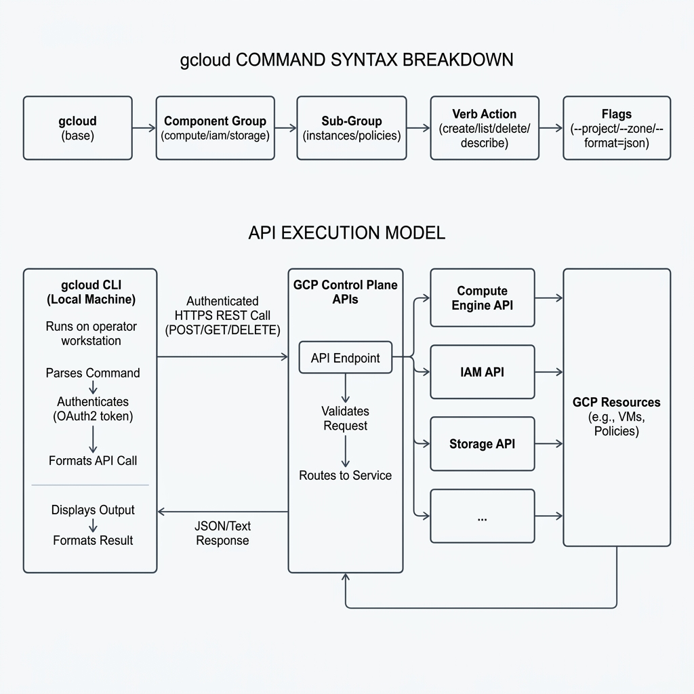
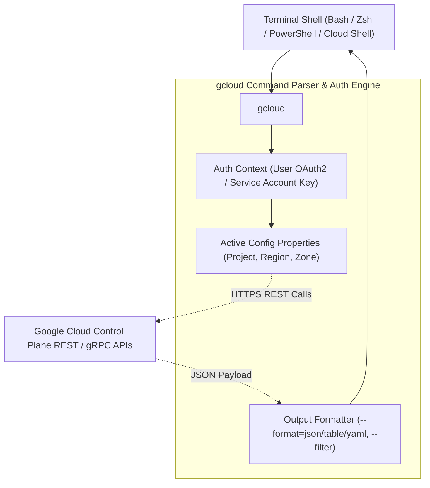

# Topic 12: gcloud CLI

---

## 1. What Is It?

The **`gcloud` CLI** is the primary command-line tool for creating, managing, automating, and troubleshooting Google Cloud resources.

It provides a unified, structured command syntax (`gcloud <group> <subgroup> <action>`) covering almost every GCP service—including Compute Engine, Cloud Storage, GKE, Cloud Run, Cloud IAM, and VPC networking. 

`gcloud` handles user and service account authentication, converts command-line flags into REST/gRPC API payloads, parses JSON responses, and supports powerful client-side filtering, formatting, and scripting.

### Real-World Analogy
Think of the `gcloud` CLI like a universal remote control for a complex smart home system. Instead of walking around to press physical buttons on individual appliances (Console UI clicks), you type precise commands into one central remote control to dim lights, adjust temperatures, or query battery status instantly.

---

## 2. Where Does It Fit?

The `gcloud` CLI sits between local/remote terminal shells (Bash, Zsh, PowerShell) and the GCP Control Plane APIs, serving as the core engine for scriptable cloud management.





---

## 3. Core Concepts

| Syntax Component | Description | Example |
|---|---|---|
| **Root Command** | Base executable binary name. | `gcloud` |
| **Service Group** | Target GCP service area. | `compute`, `iam`, `storage`, `container`, `run` |
| **Resource Sub-group** | Specific resource type within the service. | `instances`, `service-accounts`, `clusters`, `services` |
| **Action Verb** | Operational verb to perform on the resource. | `create`, `list`, `describe`, `delete`, `update` |
| **Global / Local Flags** | Parameters controlling targets, regions, zones, formatting, or projects. | `--project=my-id`, `--zone=us-central1-a`, `--format=json` |

### Command Structure Example
```bash
gcloud compute instances create my-vm --zone=us-central1-a --machine-type=e2-micro
# [root] [group]   [subgroup] [action] [positional] [-------------flags-------------]
```

---

## 4. How It Works

Execution of a `gcloud` command follows a standardized client-to-API pipeline:

```text
User executes gcloud command in terminal
              ↓
gcloud parses CLI arguments & evaluates active configuration (~/.config/gcloud)
              ↓
Retrieves cached OAuth2 Bearer Token (or authenticates via Service Account key)
              ↓
Constructs HTTPS REST request payload (e.g., POST https://compute.googleapis.com/v1/...)
              ↓
Sends request to GCP API Endpoint & awaits response
              ↓
Applies client-side --filter rules & formats output (--format=table/json/value)
```

1. **Configurations**: Named property sets (`gcloud config configurations list`) storing default `project`, `region`, `zone`, and `account`.
2. **Filtering & Formatting**: Operations performed locally on the returned JSON data stream to extract precise values.

---

## 5. Production Scenario

### Automated Infrastructure Auditing Script

```text
Requirement: Audit all running Compute Engine VMs across 50 production projects to identify non-compliant external IP assignments.
    ↓
Scripting Strategy: Use `gcloud` CLI with client-side `--filter` and `--format=json` in a Bash loop.
    ↓
Command:
  gcloud compute instances list \
    --filter="status=RUNNING AND networkInterfaces.accessConfigs.natIP:*" \
    --format="table(name, zone.basename(), networkInterfaces[0].accessConfigs[0].natIP)"
    ↓
Security: Script executes under a Service Account with read-only `roles/compute.viewer` permissions.
    ↓
Output: Generates a CSV/JSON report sent directly to the Security Operations Center (SOC).
```

*Why Selected*: `gcloud` CLI allows querying multi-project infrastructure status in seconds without manual web console clicking.

---

## 6. Hands-On Lab

### Prerequisites
- Installed Google Cloud SDK or active Cloud Shell.
- Authenticated user account or sandbox project.

### Console Method
To learn `gcloud` commands directly from the Console UI:
1. Navigate to **Compute Engine** → **VM instances** → Click **Create Instance**.
2. Configure parameters → Click **EQUIVALENT CODE** at bottom of page.
3. Copy the generated `gcloud compute instances create ...` snippet.

### CLI Method
Master core `gcloud` management, filtering, and formatting commands:

```bash
# 1. Check current authenticated identity and configuration
gcloud auth list
gcloud config list

# 2. Set default working project, region, and zone
gcloud config set project YOUR_PROJECT_ID
gcloud config set compute/region us-central1
gcloud config set compute/zone us-central1-a

# 3. Create a test Compute Engine VM
gcloud compute instances create cli-demo-vm \
    --machine-type=e2-micro \
    --labels=environment=test,owner=dev

# 4. Describe VM details using JSON output and jq filtering
gcloud compute instances describe cli-demo-vm --format="json"

# 5. Extract ONLY the Internal IP address using gcloud's built-in format flag
gcloud compute instances describe cli-demo-vm \
    --format="value(networkInterfaces[0].networkIP)"

# 6. Filter VMs using client-side filtering
gcloud compute instances list --filter="labels.environment=test"
```

### Verification
*Expected Result*: Command #5 returns a clean single IP string (e.g., `10.128.0.2`) ready for bash script variable assignment.

### Cleanup
Delete the test instance:

```bash
gcloud compute instances delete cli-demo-vm --quiet
```

---

## 7. Security

### Credential Handling & Least Privilege
- **Never Hardcode Credentials**: Never write service account key JSON paths or passwords directly inside shell scripts.
- **Use Workload Identity**: For CI/CD pipelines (GitHub Actions, GitLab), use Workload Identity Federation instead of long-lived service account key files.
- **Disable Component Updates in Production**: Do not run `gcloud components update` in automated CI/CD runners to prevent breaking changes.

```text
BAD PRACTICE:
Storing gcloud commands with embedded service account key files inside public GitHub repositories.
Risk: Key leakage leads to immediate account hijacking and crypto-mining abuse.

PRODUCTION PRACTICE:
Authenticate gcloud via gcloud auth login (User OAuth2) locally, and Workload Identity Federation in automated CI/CD runners.
```

---

## 8. Scaling & High Availability

Scripting at Scale with `gcloud`:

```text
Interactive Commands (Single resource execution)
   ↓ (Shell Loops: for project in $(gcloud projects list))
Batch Execution Scripts (Multi-project audits)
   ↓ (Parallel CLI Execution / API Rate Limits)
Infrastructure as Code (Terraform) / Direct REST SDKs for high-concurrency automation
```

- **API Quota Rate Limits**: Massively parallelized `gcloud` scripts running in loop may hit GCP API rate limits (HTTP 429). Implement exponential backoff in shell scripts.
- **`--quiet` Flag**: Pass `-q` or `--quiet` in automated scripts to suppress interactive confirmation prompts (e.g., `y/N` prompts).

---

## 9. Cost

### Pricing & CLI Efficiency
- **Tool Costs $0**: Using `gcloud` CLI itself is completely free.
- **Cost Reduction via Scripting**: `gcloud` enables writing quick cron scripts to stop non-production VMs at 7 PM and start them at 7 AM, cutting compute costs by up to 60%.

---

## 10. Monitoring & Troubleshooting

### Observability & Debugging Flags
- `--verbosity=debug` : Prints full raw HTTPS REST API requests, headers, and responses.
- `--log-http` : Logs all HTTP requests and responses directly to stdout.

### Troubleshooting Matrix

| Symptom | Possible Cause | What to Check | Fix |
|---|---|---|---|
| `Re-authentication required` error | OAuth2 refresh token expired or revoked | `gcloud auth list` | Run `gcloud auth login` to refresh web credentials. |
| `API [compute.googleapis.com] not enabled` | The target GCP API is disabled in current project | `gcloud services list --enabled` | Run `gcloud services enable compute.googleapis.com`. |
| Script hangs waiting for user input | Command prompting for confirmation (e.g., `Do you want to continue (y/N)?`) | Command arguments | Add `--quiet` or `-q` flag to non-interactive scripts. |

---

## 11. Common Mistakes

```text
Mistake: Using `grep`, `awk`, and `sed` to parse standard `gcloud` text table output.
Why: Unaware of built-in `--format` and `--filter` flags.
Impact: Fragile scripts that break whenever GCP changes table column widths or headers.
Correct approach: Always use `--format="value(field)"` or `--format="json"` for script parsing.

Mistake: Forgetting that `gcloud` commands depend on active configuration state (`gcloud config`).
Why: Assuming gcloud always acts on a fixed project regardless of context.
Impact: Accidentally creating or deleting resources in the wrong GCP Project.
Correct approach: Explicitly pass `--project=PROJECT_ID` flag in automated production scripts.
```

---

## 12. Production Best Practices

- [ ] Always pass `--project=PROJECT_ID` explicitly in automated production scripts.
- [ ] Use `--quiet` (`-q`) in CI/CD scripts to suppress interactive prompts.
- [ ] Use `--format="value(...)"` or `--format="json"` instead of text parsing for shell scripts.
- [ ] Leverage `--filter` flags to filter data client-side without external tools.
- [ ] Use `--verbosity=debug` or `--log-http` to troubleshoot API errors.
- [ ] Authenticate CI/CD pipelines via Workload Identity Federation instead of key files.

---

## 13. Hyperscaler / Enterprise Perspective

```text
Personal / Learning
  Interactive CLI commands → Manual gcloud auth login → Single project context
        ↓
Small Production
  Shell scripts with gcloud → Local config switches → Manual script execution
        ↓
Enterprise Environment
  Service Account Auth → Workload Identity Federation → Standardized gcloud Wrapper Scripts
        ↓
Hyperscaler Environment
  100% Terraform IaC for State Management → gcloud used strictly for Auditing & Emergency Operational Break-Glass Procedures
```

In a hyperscaler environment, `gcloud` CLI is the primary engine for ad-hoc operational debugging, security compliance auditing, and emergency break-glass triage. Provisioning state is managed by Infrastructure as Code (Terraform), while `gcloud` handles real-time queries and operational triggers across hundreds of projects.

---

## 14. Real Project Questions

### Q1: Why should production automation scripts use `gcloud --format` flags instead of `grep` and `awk`?
**Answer:** Standard `gcloud` table outputs are formatted for human readability and may change column alignments, headers, or spacing between releases. The `--format` flag (e.g., `--format="value(name)"` or `--format="json"`) queries the underlying structured JSON API data directly, guaranteeing stable, reliable programmatic output for scripts.

### Q2: What is the purpose of `gcloud configurations` in enterprise workflows?
**Answer:** `gcloud configurations` allow engineers to maintain multiple named environment settings (e.g., `dev-config`, `prod-config`). Each configuration stores distinct default accounts, projects, regions, and zones. Engineers can switch contexts instantly using `gcloud config configurations activate <name>` without re-authenticating or manually re-setting properties.

### Q3: How does the `gcloud` CLI differ from `gsutil` and `bq`?
**Answer:** Historically, `gcloud` managed general GCP infrastructure, `gsutil` managed Cloud Storage, and `bq` managed BigQuery. Modern Google Cloud SDK releases are consolidating all functionality under `gcloud` (e.g., `gcloud storage` and `gcloud alpha/beta bq`), providing a unified command interface across all GCP products.

---

## 15. Quick Decision Guide

| Requirement | Recommended Approach | Reason |
|---|---|---|
| Querying real-time status of 20 VMs across regions | **`gcloud compute instances list`** | Fast, instant CLI query with built-in filtering and formatting. |
| Provisioning production multi-region GKE clusters | **Terraform** | Provides state management, drift detection, and declarative code reviews. |
| Writing a shell script to stop non-prod VMs at night | **`gcloud compute instances stop --filter`** | Lightweight, easily scheduled via Cloud Scheduler or cron. |

### When should I use it?
- Operational management, bash scripting, quick resource inspection, and ad-hoc cloud administration.

### When should I NOT use it?
- Managing complex multi-resource state lifecycles—use Infrastructure as Code (Terraform) instead.

---

## 16. Related Services

```text
               [12. gcloud CLI]
              /       |       \
       Google Cloud  Cloud   Terraform
           SDK       Shell   GCP Provider
            |          |          |
       Installable In-Browser Declarative
        Tooling    Terminal   IaC Code
```

- **Google Cloud SDK**: Distribution package containing gcloud, gsutil, and bq.
- **Cloud Shell**: In-browser Linux VM pre-loaded with gcloud CLI.
- **Terraform GCP Provider**: Declarative IaC tool built on top of the same GCP REST APIs as gcloud.

---

## 17. Cheat Sheet

### Essential Commands
- `gcloud auth login` : Authenticate user account.
- `gcloud config set project ID` : Set default working project.
- `gcloud config set compute/zone ZONE` : Set default zone.
- `gcloud components update` : Update CLI tools to latest version.

### Essential Flags
- `--project=ID` : Override target project.
- `--format=json/table/value(...)` : Control output formatting.
- `--filter="key=value"` : Filter results client-side.
- `-q` / `--quiet` : Suppress interactive prompts.
- `--verbosity=debug` : Show detailed debug logs.

---

## 18. Learning Connection

- **Previous Topic**: [11. Cloud Shell](../11-cloud-shell/README.md)
- **Next Topic**: [13. Google Cloud SDK](../13-google-cloud-sdk/README.md)
