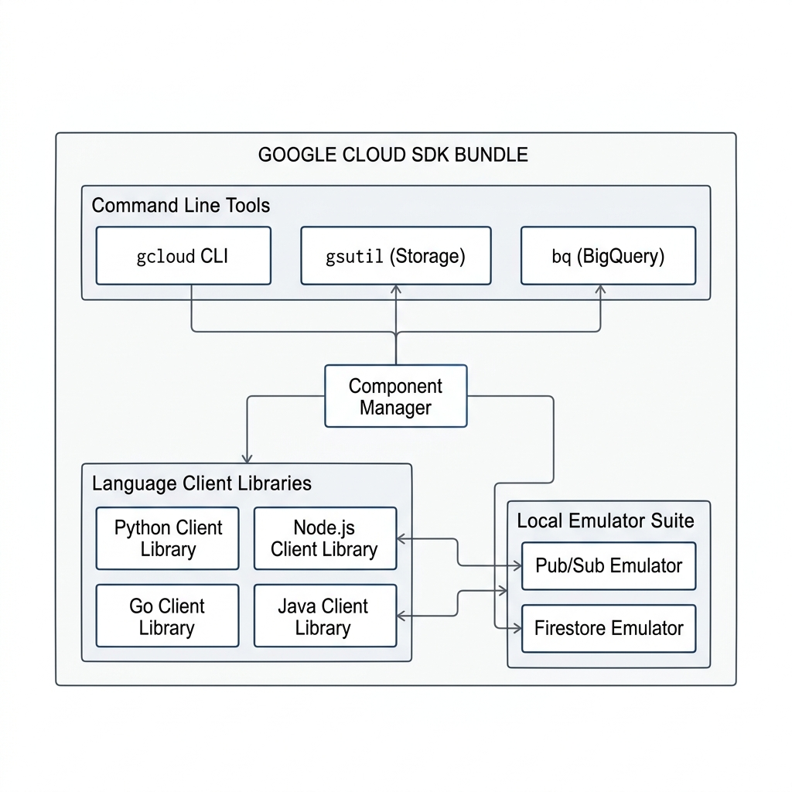
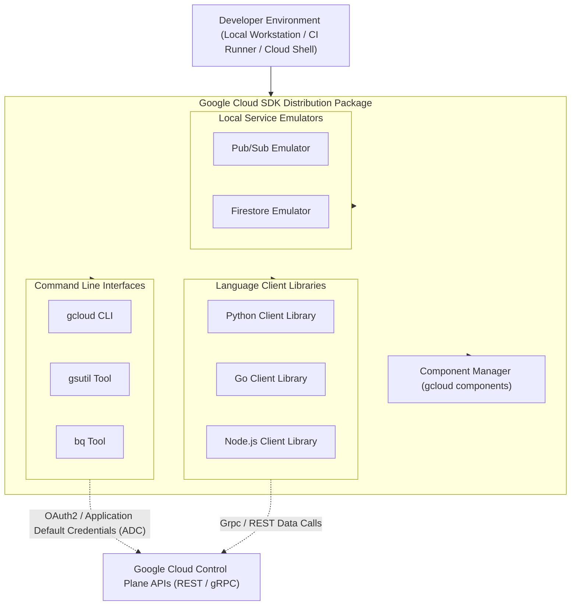

# Topic 13: Google Cloud SDK

---

## 1. What Is It?

The **Google Cloud SDK** (Software Development Kit) is a comprehensive set of command-line tools, client libraries, local service emulators, and runtime dependencies required for developing, deploying, and managing applications on Google Cloud Platform.

While `gcloud` is the primary CLI command within the suite, the **Google Cloud SDK** represents the complete distribution package. It includes:
- **CLI Tools**: `gcloud` (general infrastructure), `gsutil` (legacy storage), `bq` (legacy BigQuery).
- **Client Libraries**: Idiomatic programming language SDKs (Python, Java, Go, Node.js, C#, Ruby).
- **Local Emulators**: Off-line test emulators for Pub/Sub, Firestore, Datastore, and Bigtable.
- **Component Manager**: In-place installer for updating and adding SDK components.

### Real-World Analogy
Think of the Google Cloud SDK like a professional mechanic's toolbox shipped directly from the car manufacturer. `gcloud` is the primary ratchet wrench you use most often, `gsutil` and `bq` are specialized socket extensions, client libraries are the wiring schematics for your code, and emulators are diagnostic test benches in your shop.

---

## 2. Where Does It Fit?

The Google Cloud SDK connects developer workstations, local IDEs, build servers, and CI/CD pipelines directly to Google Cloud's REST/gRPC API endpoints.





---

## 3. Core Concepts

| SDK Component | Purpose | Key Commands / Examples | Best Used For |
|---|---|---|---|
| **`gcloud` CLI** | Universal CLI tool managing all GCP services. | `gcloud compute`, `gcloud iam`, `gcloud storage` | Infrastructure management, deployment scripts, IAM control. |
| **`gsutil` Tool** | Legacy CLI dedicated to Cloud Storage management. | `gsutil cp`, `gsutil rsync`, `gsutil mb` | High-throughput object transfers (moving to `gcloud storage`). |
| **`bq` Tool** | Legacy CLI dedicated to BigQuery queries and datasets. | `bq query`, `bq load`, `bq mk` | Executing SQL queries and dataset management from terminal. |
| **Client Libraries** | Language-native SDK libraries for application code. | `google-cloud-storage` (Python), `@google-cloud/pubsub` (Node) | Writing backend application code that interacts with GCP APIs. |
| **Application Default Credentials (ADC)** | Strategy automatically detecting credentials across environments. | `gcloud auth application-default login` | Allowing code to authenticate seamlessly locally and in cloud VMs. |
| **Service Emulators** | Local lightweight servers mimicking GCP APIs locally. | `gcloud beta emulators pubsub start` | Off-line local unit testing without incurring GCP billable costs. |

---

## 4. How It Works

Authentication and API routing in the Google Cloud SDK use **Application Default Credentials (ADC)**:

```text
Application Code calls Google Cloud Client Library (e.g., storage.Client())
              ↓
ADC checks GOOGLE_APPLICATION_CREDENTIALS environment variable (Service Account JSON)
              ↓ (If not set)
ADC checks gcloud ADC credentials file (~/.config/gcloud/application_default_credentials.json)
              ↓ (If not set)
ADC checks Compute Engine / GKE Metadata Server (If running inside GCP)
              ↓
Authenticates API request & establishes secure gRPC/HTTPS channel to GCP
```

1. **Unified Auth**: ADC ensures code written locally using `gcloud auth application-default login` runs unchanged when deployed to production VMs using Service Accounts.
2. **gRPC Protocol**: Client libraries use high-performance HTTP/2 gRPC protocols for low-latency streaming.

---

## 5. Production Scenario

### Local Microservice Development & Continuous Delivery

```text
Requirement: Develop a Python microservice locally that consumes Pub/Sub messages and stores objects in Cloud Storage.
    ↓
Step 1 (Local Setup): Install Google Cloud SDK; run `gcloud auth application-default login` to set ADC.
    ↓
Step 2 (Local Testing): Start local Pub/Sub emulator (`gcloud beta emulators pubsub start`) to test code for $0.
    ↓
Step 3 (Coding): Import `google-cloud-pubsub` Python client library; code consumes local emulator.
    ↓
Step 4 (Deployment): CI/CD runner builds container image using `gcloud builds submit`.
    ↓
Step 5 (Production): Deployed to Cloud Run; ADC switches seamlessly from local ADC to Cloud Run Service Account.
```

*Why Selected*: Using Google Cloud SDK's ADC pattern prevents hardcoding credentials, enabling code to run seamlessly in local dev, staging, and production environments without changing auth logic.

---

## 6. Hands-On Lab

### Prerequisites
- Operating System: Linux, macOS, or Windows.
- Python 3.8+ installed locally.

### Console & Package Installation Method
1. Install Google Cloud SDK locally following official OS package scripts (or use pre-installed SDK in Cloud Shell).
2. Verify SDK component installation via terminal:
   ```bash
   gcloud components list
   ```

### CLI Method
Initialize SDK, set up Application Default Credentials (ADC), and test local client library interaction:

```bash
# 1. Initialize SDK interactive setup wizard
# gcloud init

# 2. Authenticate CLI for gcloud user commands
gcloud auth login

# 3. Authenticate Application Default Credentials (ADC) for local code SDKs
gcloud auth application-default login

# 4. Install an additional SDK component (e.g., pubsub emulator)
gcloud components install beta pubsub-emulator --quiet

# 5. Verify installed SDK version and component paths
gcloud version
```

### Verification
Check that ADC credentials JSON file was generated locally:

```bash
# On Linux/macOS:
cat ~/.config/gcloud/application_default_credentials.json | grep "client_id"

# On Windows (PowerShell):
# Get-Content $env:APPDATA\gcloud\application_default_credentials.json
```
*Expected Result*: Returns JSON output displaying OAuth2 client details, confirming local ADC setup.

### Cleanup
Revoke local credentials if working on a shared workstation:

```bash
gcloud auth application-default revoke
gcloud auth revoke --all
```

---

## 7. Security

### Application Default Credentials & Key Isolation
- **User ADC vs. Service Account Keys**: Developers should use `gcloud auth application-default login` for local dev. Never download long-lived Service Account JSON key files to local laptops.
- **Revoking ADC Tokens**: Run `gcloud auth application-default revoke` when offboarding or switching machines.

```text
BAD PRACTICE:
Downloading Service Account JSON key files to developer laptops and hardcoding `os.environ["GOOGLE_APPLICATION_CREDENTIALS"] = "/path/to/key.json"`.
Risk: Keys checked into Git or stored on unencrypted developer laptops compromise GCP security.

PRODUCTION PRACTICE:
Use `gcloud auth application-default login` for local development. Use native GCP Service Account IAM metadata binding in production.
```

---

## 8. Scaling & High Availability

SDK Distribution Modes:

```text
Interactive Local SDK Installation (Developer Workstations - gcloud components update)
   ↓ (Package Managers / Hermetic Systems)
OS Native Packages (apt-get install google-cloud-cli / brew install google-cloud-sdk)
   ↓ (Automated CI/CD Containers)
Minimal Docker Container Images (google/cloud-sdk:slim for lightweight CI build nodes)
```

- **CI/CD Optimization**: Avoid installing full SDK components inside CI/CD build jobs. Use official slim container images (`google/cloud-sdk:slim`) to reduce build pipeline times by 80%.

---

## 9. Cost

### Free Local Emulators & Cost Savings
- **$0 SDK Costs**: Downloading and running the Google Cloud SDK is completely free.
- **Local Emulators**: Using local emulators (`pubsub`, `datastore`, `bigtable`, `spanner`) allows developers to run full integration test suites locally without making billable calls to GCP.

---

## 10. Monitoring & Troubleshooting

### Diagnostic Tools in the SDK
- `gcloud info` : Prints detailed diagnostic report of OS, Python version, install path, active config, and network connectivity to GCP endpoints.
- `gcloud feedback` : Submits bug reports directly to Google Cloud SDK engineering team.

### Troubleshooting Matrix

| Symptom | Possible Cause | What to Check | Fix |
|---|---|---|---|
| `DefaultCredentialsError` when running Python/Node code | Application Default Credentials (ADC) file missing locally | `gcloud auth application-default login` | Execute `gcloud auth application-default login` in terminal. |
| `gcloud components update` fails with permission error | SDK installed via root OS package manager (APT/Yum) | `gcloud info` (Installation Properties) | Update via system package manager (`sudo apt-get update && sudo apt-get install google-cloud-cli`). |
| Emulator connection refused | Code missing environment variable pointing to local emulator port | `echo $PUBSUB_EMULATOR_HOST` | Run `eval $(gcloud beta emulators pubsub env-init)`. |

---

## 11. Common Mistakes

```text
Mistake: Confusing `gcloud auth login` with `gcloud auth application-default login`.
Why: Assuming gcloud CLI login automatically authenticates application code libraries.
Impact: `gcloud compute instances list` works, but Python scripts throw `DefaultCredentialsError`.
Correct approach: Run `gcloud auth login` for CLI commands AND `gcloud auth application-default login` for code libraries.

Mistake: Attempting to run `gcloud components update` inside a Debian/Ubuntu APT installation.
Why: Component manager is disabled when SDK is managed by Linux system package managers.
Impact: Terminal error indicating components are managed by OS package manager.
Correct approach: Use `sudo apt-get install google-cloud-cli` to update system-managed SDK installs.
```

---

## 12. Production Best Practices

- [ ] Use Application Default Credentials (ADC) pattern for all application code.
- [ ] Install SDK via system package managers (`apt`, `yum`, `brew`) on local workstations.
- [ ] Use official `google/cloud-sdk:slim` Docker images in CI/CD build runners.
- [ ] Utilize local service emulators (Pub/Sub, Firestore) for local integration testing.
- [ ] Never commit Service Account JSON key files to source control repositories.
- [ ] Run `gcloud info` to diagnose local SDK environment issues.

---

## 13. Hyperscaler / Enterprise Perspective

```text
Personal / Learning
  Manual tarball installation → `gcloud components update` → Personal credit card ADC
        ↓
Small Production
  Brew / APT installation → Manual gcloud auth ADC setup → Local script execution
        ↓
Enterprise Environment
  Centralized Package Distribution → Workload Identity Federation → Standardized Developer Workstations
        ↓
Hyperscaler Environment
  Hermetic Build Runners (Containerized SDKs) → Zero Downloaded Service Account Keys → Policy Enforced SDK Versions across 1000s of Devs
```

In a hyperscaler environment, Google Cloud SDK installations are standardized across developer laptops and CI/CD systems using corporate package management and container images. Service account keys are completely banned; developers use single sign-on (SSO) for local ADC, while production workloads authenticate using IAM Workload Identity Federation.

---

## 14. Real Project Questions

### Q1: What is the exact difference between `gcloud auth login` and `gcloud auth application-default login`?
**Answer:** `gcloud auth login` authenticates the `gcloud` CLI tool itself and stores credentials in `~/.config/gcloud/credentials.db`. `gcloud auth application-default login` generates an Application Default Credentials (ADC) JSON file (`~/.config/gcloud/application_default_credentials.json`) specifically designed to be read by language client libraries (Python, Java, Go, Node.js) when running code locally.

### Q2: How does Application Default Credentials (ADC) simplify multi-environment deployments?
**Answer:** ADC implements a standardized search order for credentials. In local development, client libraries automatically read the local ADC file created by `gcloud`. When deployed to GCP (Cloud Run, GKE, Compute Engine), the exact same code automatically queries the internal GCP Metadata Server to authenticate using the assigned Service Account, requiring zero code or configuration changes.

### Q3: Why is `gcloud storage` replacing `gsutil` in modern Google Cloud SDK releases?
**Answer:** `gcloud storage` is a modernized C++ implementation built directly into the `gcloud` CLI. It offers up to 5x faster object transfer speeds compared to `gsutil`, supports parallel multi-thread composite uploads natively, and unifies command syntax under the standard `gcloud` CLI ecosystem.

---

## 15. Quick Decision Guide

| Requirement | Recommended Approach | Reason |
|---|---|---|
| Writing Python/Go code to upload files to Cloud Storage | **Google Cloud Client Libraries + ADC** | Idiomatic language methods, gRPC performance, seamless auth across environments. |
| Transferring 10 TB of files to Cloud Storage from CLI | **`gcloud storage cp`** | Up to 5x faster than legacy `gsutil` with native multi-thread parallel uploads. |
| Testing Pub/Sub message consumption locally without internet | **Google Cloud Pub/Sub Emulator** | Runs locally inside SDK container, $0 cost, zero network latency. |

### When should I use it?
- Essential SDK for every developer, DevOps engineer, and cloud architect building applications on GCP.

### When should I NOT use it?
- Do not use raw REST HTTP calls in application code when official Client Libraries exist.

---

## 16. Related Services

```text
             [13. Google Cloud SDK]
              /         |         \
        CLI Tools    Client     Emulators
       (gcloud/bq)  Libraries  (PubSub/Firestore)
            |           |            |
       Terminal UI   App Code   Local Testing
```

- **gcloud CLI**: Core command-line tool included in the SDK package.
- **Cloud Client Libraries**: Idiomatic programming libraries for application code.
- **Workload Identity**: Production keyless authentication mechanism for client libraries.

---

## 17. Cheat Sheet

### Core Tools
- `gcloud` : Universal infrastructure CLI.
- `gsutil` : Legacy Cloud Storage tool (migrating to `gcloud storage`).
- `bq` : Legacy BigQuery CLI tool.

### Useful Commands
```bash
# Display SDK installation and system info
gcloud info

# Set up local Application Default Credentials (ADC)
gcloud auth application-default login

# List installed SDK components
gcloud components list

# Install local emulator
gcloud components install beta pubsub-emulator
```

---

## 18. Learning Connection

- **Previous Topic**: [12. gcloud CLI](../12-gcloud-cli/README.md)
- **Next Topic**: [14. Shared Responsibility Model](../14-shared-responsibility-model/README.md)
