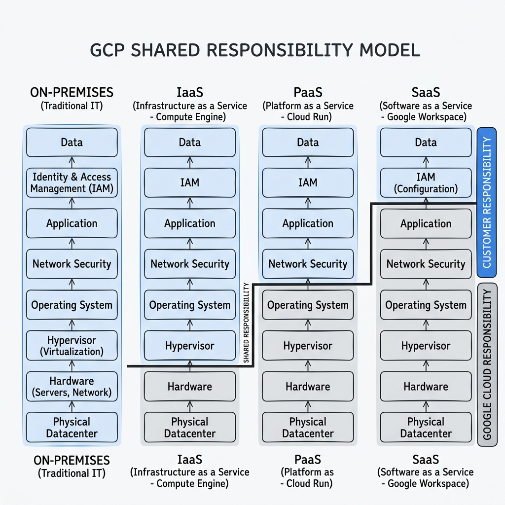
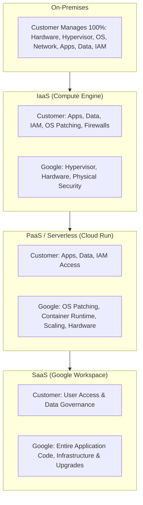

# Topic 14: Shared Responsibility Model

---

## 1. What Is It?

The **Shared Responsibility Model** is a foundational cloud security framework that defines the explicit division of security, operational, and compliance duties between Google Cloud and the customer.

Security *in* the cloud is fundamentally different from security *of* the cloud:
- **Google Cloud** is responsible for the security **OF** the cloud (physical datacenters, server hardware, custom Titan security chips, hypervisors, underlying network infrastructure, and core storage encryption).
- **The Customer** is responsible for security **IN** the cloud (data classification, IAM access policies, application code security, operating system patching on IaaS, VPC firewall rules, and encryption key management).

As you move up the cloud service stack from IaaS to PaaS and SaaS, Google assumes a larger portion of operational and security responsibility.

### Real-World Analogy
Think of the Shared Responsibility Model like renting a high-security safe deposit box inside a bank vault. The **Bank** (Google) provides physical guards, armored vault walls, surveillance cameras, and structural fireproofing (Security OF the bank). **You** (Customer) are responsible for who you give duplicate keys to, what valuables you place inside the box, and locking the box properly when you leave (Security IN the box).

---

## 2. Where Does It Fit?

The Shared Responsibility Model governs risk management and security compliance across every tier of deployment in Google Cloud.





---

## 3. Core Concepts

| Layer / Domain | Customer Responsibility | Google Cloud Responsibility | Variation by Model |
|---|---|---|---|
| **Content / Data** | Data classification, DLP policies, client-side encryption. | Customer-data isolation, underlying storage encryption (AES-256). | Customer responsible across ALL models. |
| **Access Control (IAM)** | User access, password policies, 2FA, service account roles. | IAM authentication framework, OAuth2 token generation. | Customer responsible across ALL models. |
| **Application Code** | Secure coding practices, vulnerability scanning, dependencies. | Platform runtime availability, API gateways. | Customer responsible in IaaS & PaaS. |
| **Operating System** | OS installation, kernel updates, security patching, SSH access. | Pre-baked OS image templates (Shielded VMs). | Customer in IaaS; Google in PaaS/SaaS. |
| **Network Security** | VPC subnets, firewall rules, routing tables, ingress/egress filtering. | Physical network fiber, DDoS mitigation (Cloud Armor infra), Anycast. | Customer in IaaS/PaaS; Google in SaaS. |
| **Physical Infrastructure** | None. | Datacenter security, Titan hardware chips, power, cooling, media destruction. | Google responsible across ALL models. |

---

## 4. How It Works

Security enforcement boundaries shift depending on the selected Google Cloud deployment paradigm:

```text
Customer selects GCP Service Tier
              ↓
[IaaS: Compute Engine] → Customer manages OS patches, firewall rules & application code
              ↓
[PaaS: Cloud Run / App Engine] → Customer manages app container & IAM; Google patches OS & scales runtime
              ↓
[SaaS: Google Workspace / BigQuery SaaS] → Customer manages data & user access; Google manages full stack
              ↓
Auditing & Compliance: Google provides Compliance Reports (SOC 2, ISO 27001, HIPAA) via Compliance Reports Manager
```

1. **Automation Boundary**: On Serverless (Cloud Run), Google automatically patches OS vulnerabilities (CVEs) without application downtime. On IaaS (Compute Engine), unpatched OS kernels remain the customer's vulnerability.
2. **Attestation**: Google provides independent third-party audit attestations (SOC 1/2/3, ISO/IEC 27001, FedRAMP) to prove physical and hypervisor security compliance.

---

## 5. Production Scenario

### Enterprise HIPAA Compliance Architecture

```text
Requirement: Process sensitive Healthcare Protected Health Information (PHI) under strict HIPAA compliance rules.
    ↓
Architecture: Stateless API on Cloud Run (PaaS); Healthcare data in Cloud SQL (PaaS) with Customer-Managed Encryption Keys (CMEK).
    ↓
Division of Responsibility:
  - Google: Provides HIPAA Business Associate Agreement (BAA), physical datacenter security, storage AES-256 encryption.
  - Customer: Configures IAM least-privilege, enables CMEK key rotation in Cloud KMS, turns on Cloud Audit Logging.
    ↓
Security: Private IP Cloud SQL database; VPC Service Controls perimeter blocking external data exfiltration.
    ↓
Monitoring: Security Command Center (SCC) scanning for misconfigured IAM bindings or open storage buckets.
```

*Why Selected*: Shifting from Compute Engine VMs (IaaS) to Cloud Run/Cloud SQL (PaaS) transfers OS security patching and database replication responsibility to Google, allowing the enterprise to focus solely on data governance and application logic.

---

## 6. Hands-On Lab

### Prerequisites
- Active GCP Project.
- Access to Cloud Shell or terminal.
- IAM permissions: `roles/iam.securityReviewer` or `roles/viewer`.

### Console Method
1. Log into [Google Cloud Console](https://console.cloud.google.com/).
2. Search for **Compliance Reports Manager** in the top search bar (or visit `cloud.google.com/security/compliance/compliance-reports-manager`).
3. Inspect available third-party audit reports provided by Google (SOC 2 Type II, ISO 27001, PCI-DSS Attestations of Compliance).
4. Navigate to **Security Command Center (SCC)** in the console.
5. Review the **Vulnerabilities** tab:
   - Observe how SCC separates **Infrastructure Vulnerabilities** (unpatched OS on VMs - Customer Responsibility) from **IAM Misconfigurations** (over-privileged service accounts - Customer Responsibility).

### CLI Method
Audit your portion of the Shared Responsibility Model (VPC Firewall & Storage Access):

```bash
# 1. Audit customer-managed VPC firewall rules to check for open 0.0.0.0/0 ingress
gcloud compute firewall-rules list --filter="direction=INGRESS AND sourceRanges:0.0.0.0/0"

# 2. Audit customer-managed Cloud Storage buckets for public access
gcloud storage buckets list --format="table(name, publicAccessPrevention)"

# 3. Check Organization Policy constraints enforcing customer security boundaries
gcloud resource-manager org-policies list --project=YOUR_PROJECT_ID
```

### Verification
*Expected Result*: The CLI returns list of customer-configured firewall rules and bucket access settings, demonstrating the configurations under your direct operational control.

### Cleanup
No billable resources were created during this security auditing lab.

---

## 7. Security

### Shared Fate vs. Shared Responsibility
- **Shared Responsibility**: Traditional model defining who owns what layer.
- **Google Shared Fate**: Google's proactive approach providing secure-by-default landing zones, Infrastructure as Code templates, Security Command Center posture management, and financial insurance partnerships to help customers fulfill their side of the responsibility model.

```text
BAD PRACTICE:
Assuming that deploying an application on Compute Engine (IaaS) automatically makes the operating system secure and compliance-certified without applying OS patches.
Risk: An unpatched Linux/Windows kernel vulnerability allows attackers to compromise the VM.

PRODUCTION PRACTICE:
Use Managed PaaS / Serverless (Cloud Run, GKE Autopilot) to offload OS patching to Google. If using IaaS, enable OS Login, Patch Management, and Shielded VM features.
```

---

## 8. Scaling & High Availability

Operational Offloading at Enterprise Scale:

```text
Full Customer Operations (On-Premises / Heavy IaaS VM Footprint)
   ↓ (Offload Hardware, Power & Hypervisor to Google)
Managed Infrastructure (Compute Engine + Shielded VMs + Auto-Patching)
   ↓ (Offload OS Patching, Container Scaling & Control Planes)
Serverless PaaS (Cloud Run + GKE Autopilot + Cloud SQL)
```

- **Reducing Operational Overhead**: Moving from IaaS to PaaS reduces customer-managed security engineering overhead by up to 70%, enabling small engineering teams to operate global-scale architectures securely.

---

## 9. Cost

### Financial Impact of Responsibility Shift
- **Hidden Cost of IaaS**: Operating system patching, custom security agents, antivirus licenses, and manual compliance audits on Compute Engine VMs add significant hidden operational costs.
- **PaaS Efficiency**: PaaS products (Cloud Run, Cloud Functions) include OS maintenance and security hardening in the base per-second execution price, delivering lower total cost of ownership (TCO).

---

## 10. Monitoring & Troubleshooting

### Compliance & Security Monitoring Tools
- **Compliance Reports Manager**: Download Google's SOC 1/2/3, ISO 27001, and PCI-DSS compliance certificates.
- **Security Command Center (SCC)**: Real-time threat detection and security posture monitoring.

### Troubleshooting Matrix

| Symptom | Possible Cause | Responsible Party | Fix |
|---|---|---|---|
| OS kernel vulnerability (CVE) flagged on Compute Engine VM | Customer has not updated OS packages | **Customer** | Run `sudo apt-get update && sudo apt-get upgrade` or rebuild VM from updated image. |
| Datacenter power outage in `us-central1-a` | Physical grid failure at Google datacenter | **Google** | Google auto-recovers hardware; Customer handles multi-zone failover architecture. |
| Data breach caused by public Cloud Storage bucket | Bucket IAM policy set to `allUsers` (Public) | **Customer** | Enable **Public Access Prevention** on bucket and strip `allUsers` IAM role. |

---

## 11. Common Mistakes

```text
Mistake: Believing Google Cloud is responsible for configuring your database firewall rules and IAM access policies.
Why: Misinterpreting "Google Cloud is secure" to mean "all customer configurations are automatically locked down."
Impact: Security breaches caused by permissive IAM roles or open 0.0.0.0/0 firewall rules.
Correct approach: Understand that customer configurations (IAM, Firewalls, Data Access) are 100% customer responsibility.

Mistake: Attempting to audit Google's physical datacenters manually for enterprise compliance audits.
Why: Overlooking Google's third-party compliance attestations.
Impact: Wasted time and legal friction; Google does not permit physical access to datacenters for customer audits.
Correct approach: Download official SOC 2, ISO 27001, and FedRAMP reports from the Compliance Reports Manager.
```

---

## 12. Production Best Practices

- [ ] Prefer PaaS and Serverless services (Cloud Run, GKE Autopilot) to offload OS security patching to Google.
- [ ] Enforce **Public Access Prevention** on all Cloud Storage buckets at the Organization Policy level.
- [ ] Enable **OS Login** and **Patch Management** for all Compute Engine (IaaS) virtual machines.
- [ ] Download third-party compliance reports (SOC 2, ISO 27001) from Compliance Reports Manager for auditors.
- [ ] Implement Security Command Center (SCC) to continuously monitor customer-side security posture.
- [ ] Enforce least-privilege IAM access policies across all projects and resources.

---

## 13. Hyperscaler / Enterprise Perspective

```text
Personal / Learning
  Basic VM deployment → Unpatched OS → Default public bucket settings → Manual checks
        ↓
Small Production
  Manual OS Patching → Basic IAM Least Privilege → VPC Firewall Isolation
        ↓
Enterprise Environment
  Shift from IaaS to Serverless PaaS → Security Command Center Posture Monitoring → Downloaded SOC 2 Reports for Auditors
        ↓
Hyperscaler Environment
  Google "Shared Fate" Partnership → Automated VPC Service Controls → Customer-Managed Encryption Keys (CMEK) → Automated Compliance Pipelines
```

In a hyperscaler environment, enterprises adopt a **Shared Fate** model with Google. They minimize self-managed IaaS VM footprints to shift operational patching toil onto Google's PaaS infrastructure, while using automated Org Policies and VPC Service Controls to prevent human error on customer-managed security boundaries.

---

## 14. Real Project Questions

### Q1: What is the core difference between security OF the cloud and security IN the cloud?
**Answer:** Security **OF** the cloud refers to Google's responsibility to protect the physical datacenters, fiber networks, server hardware, Titan chips, hypervisors, and storage infrastructure. Security **IN** the cloud refers to the customer's responsibility to configure IAM roles, encrypt sensitive data, write secure code, manage OS patches (on IaaS), and configure network firewall rules.

### Q2: How does customer security responsibility change when migrating from Compute Engine to Cloud Run?
**Answer:** On Compute Engine (IaaS), the customer is responsible for operating system installation, kernel updates, security patching, SSH access control, and network firewall configuration. On Cloud Run (PaaS/Serverless), Google assumes 100% responsibility for the underlying OS, container runtime, hypervisor, and auto-scaling, leaving the customer responsible only for container application code, data, and IAM permissions.

### Q3: How do enterprise auditors verify Google's physical security compliance without conducting on-site datacenter visits?
**Answer:** Google undergoes independent third-party audits annually. Enterprise auditors access Google's **Compliance Reports Manager** to download official SOC 1/2/3 reports, ISO/IEC 27001 certifications, PCI-DSS Attestations of Compliance, and FedRAMP documentation, which serve as legally binding compliance attestations.

---

## 15. Quick Decision Guide

| Requirement | Recommended Approach | Reason |
|---|---|---|
| Zero operational responsibility for OS security patching | **Cloud Run / App Engine (PaaS)** | Google manages OS, container runtime, and security updates automatically. |
| Complete control over operating system kernel and custom drivers | **Compute Engine (IaaS)** | Customer assumes full control and responsibility for OS configuration and patching. |
| Demonstrating compliance to external regulatory auditors | **Compliance Reports Manager** | Provides official third-party audit reports (SOC 2, ISO 27001, HIPAA) for Google's infrastructure. |

### When should I use it?
- Essential security concept that must be understood prior to designing any cloud architecture or compliance strategy.

### When should I NOT use it?
- Never assume Google Cloud handles customer-side IAM, application security, or firewall configuration automatically.

---

## 16. Related Services

```text
          [14. Shared Responsibility Model]
            /             |             \
    Compliance Reports  Security Command  Cloud IAM &
         Manager           Center          Firewalls
            |                 |                |
    Google Attestation  Customer Posture  Customer Security
```

- **Compliance Reports Manager**: Downloads third-party audit certificates for Google's responsibilities.
- **Security Command Center (SCC)**: Scans for customer-side misconfigurations and vulnerabilities.
- **Cloud IAM**: Manages customer access permissions across cloud resources.

---

## 17. Cheat Sheet

### Responsibility Division
- **Google**: Datacenters, Hardware, Titan Chips, Hypervisors, Storage Encryption at Rest.
- **Customer**: IAM Roles, Data Classification, Application Code, Firewall Rules, OS Patching (IaaS).

### Shift by Service Model
- **IaaS**: Customer manages OS + App + Data + IAM.
- **PaaS**: Customer manages App + Data + IAM (Google manages OS).
- **SaaS**: Customer manages Data + IAM (Google manages full stack).

---

## 18. Learning Connection

- **Previous Topic**: [13. Google Cloud SDK](../13-google-cloud-sdk/README.md)
- **Next Topic**: [15. Quotas & Limits](../15-quotas-and-limits/README.md)
