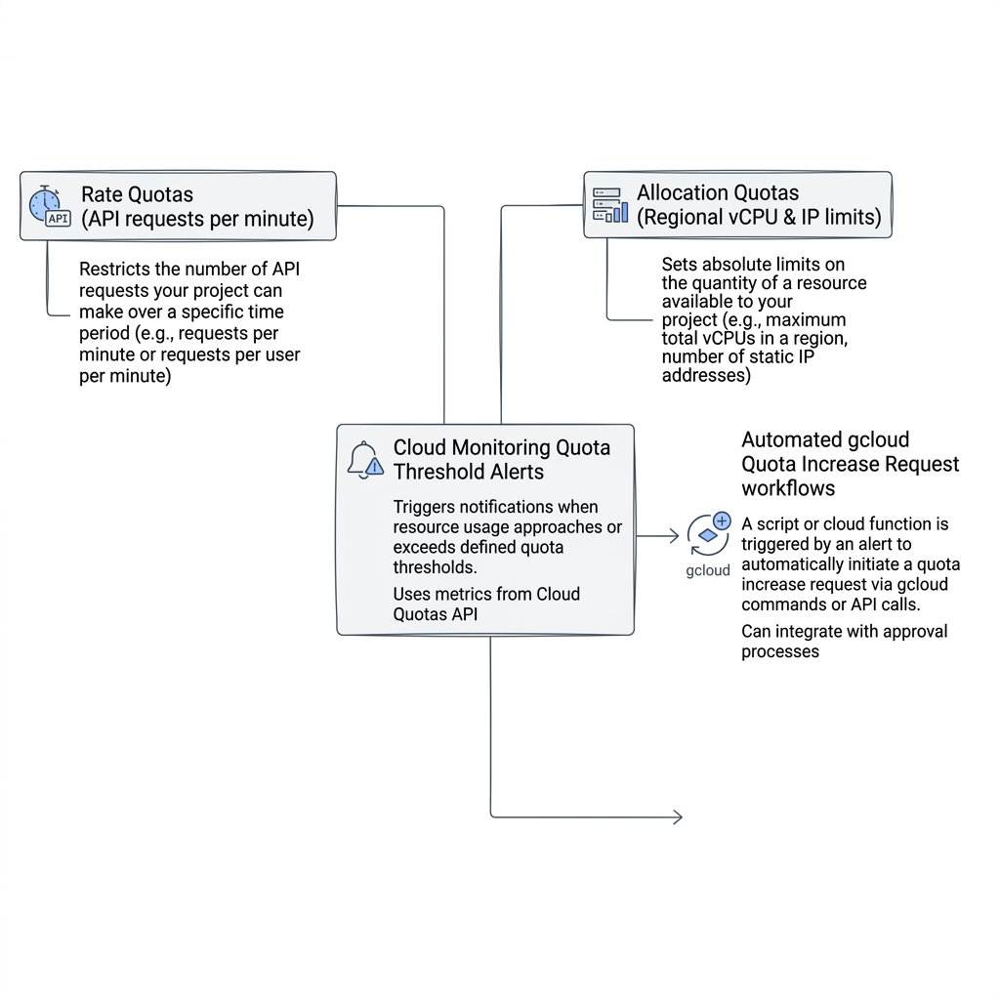
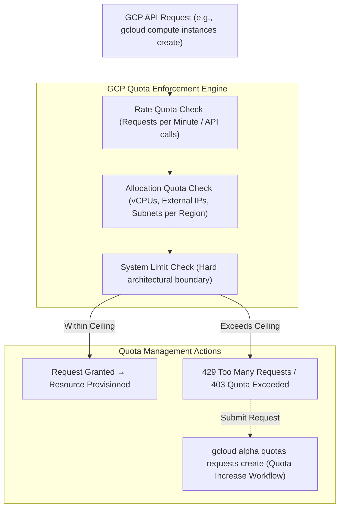

# Topic 15: Quotas & Limits

---

## 1. What Is It?

**Quotas & Limits** in Google Cloud Platform are system-enforced resource consumption ceilings designed to protect customers from unexpected runaway cloud costs, prevent system-wide resource exhaustion, and ensure fair multi-tenant access across Google's infrastructure.

GCP enforces two distinct types of restrictions:
1. **Quotas**: Configurable resource maximums (such as 24 vCPUs per region or 600 API calls per minute). Quotas can be increased by submitting a request via the Console or `gcloud` CLI.
2. **System Limits**: Fixed, non-negotiable physical or architectural boundaries (such as a maximum 5 TB file size limit in Cloud Storage or 100 GB message size in Pub/Sub) that cannot be increased.

### Real-World Analogy
Think of a Quota like the credit card limit set by your bank. Your default limit might be $5,000 to prevent fraud, but you can call customer service and request a limit increase to $25,000 if your business expands. A System Limit is like the physical passenger capacity of an elevator (max 10 people)—no matter who calls customer service, the physical capacity of that elevator shaft cannot be expanded.

---

## 2. Where Does It Fit?

Quotas and limits sit inside the GCP Resource Manager, enforcing consumption boundaries at the Project, Region, and Account scopes.





---

## 3. Core Concepts

| Category | Description | Adjustable? | Example | Action on Breach |
|---|---|---|---|---|
| **Allocation Quota** | Maximum quantity of a specific resource you can provision in a project/region. | **Yes** (Submit quota increase request) | 24 vCPUs in `us-central1`, 5 VPC networks per project. | Deployment fails (`QUOTA_EXCEEDED` 403 error). |
| **Rate Quota** | Maximum frequency of API calls or operations allowed per minute/second. | **Yes** (Submit quota increase request) | 600 Read Requests per minute for Compute Engine API. | API returns `HTTP 429 Too Many Requests`. |
| **Hard System Limit** | Fixed architectural or physical platform constraint. | **No** (Non-negotiable architectural cap) | 5 TB max size per Cloud Storage object; 10 MB payload per Cloud Function. | Operation rejected immediately by API validator. |
| **Preemption / Stock Out** | Temporary hardware unavailability in a specific zone despite quota. | N/A (Temporary physical stock out) | `ZONE_RESOURCE_POOL_EXHAUSTED` in `us-central1-a`. | Provisioning fails; select alternate zone. |

---

## 4. How It Works

Quota evaluation happens synchronously during API request processing:

```text
API Request arrives at GCP Gateway (e.g., Create 8 vCPU VM in us-central1)
              ↓
Quota Manager queries current regional utilization (Current: 20 vCPUs / Quota: 24 vCPUs)
              ↓
Evaluates new request (+8 vCPUs = 28 total vCPUs > 24 Quota Limit)
              ↓
Request Rejected with HTTP 403 QUOTA_EXCEEDED Error
              ↓
Developer submits Quota Increase Request via Console / CLI
              ↓
Automated AI Evaluator or Google Support approves request → Quota updated to 64 vCPUs
```

1. **Automatic Approvals**: Many standard quota increase requests (e.g., expanding vCPU quota from 24 to 64) are processed automatically by AI models within minutes if account payment history is healthy.
2. **Quota Project**: API rate quotas are billed and metered against the specific **Quota Project** specified in HTTP headers or `gcloud config`.

---

## 5. Production Scenario

### Auto-Scaling Web Cluster Quota Buffer Management

```text
Requirement: Scale a containerized web application during Black Friday from 50 to 500 Compute nodes without hitting regional vCPU quotas.
    ↓
Step 1 (Audit): Query current regional vCPU allocation quota in `us-central1`: Current Limit = 100 vCPUs.
    ↓
Step 2 (Capacity Planning): 500 nodes x 2 vCPUs = 1,000 vCPUs required; Buffer requirement = 1,500 vCPUs.
    ↓
Step 3 (Request): Submit a `gcloud alpha quotas requests create` request 2 weeks prior to event.
    ↓
Security: Admin IAM role `roles/servicemanagement.quotaAdmin` approves request.
    ↓
Monitoring: Configure Cloud Monitoring Alert Policy to notify DevOps team if vCPU utilization reaches 80% of regional quota.
```

*Why Selected*: Submitting quota increases weeks ahead of major scaling events prevents auto-scaling groups from failing mid-spikes due to hidden `QUOTA_EXCEEDED` errors.

---

## 6. Hands-On Lab

### Prerequisites
- Active GCP Project with Compute Engine API enabled.
- Cloud Shell or local `gcloud` CLI.
- IAM permissions: `roles/servicemanagement.quotaViewer` or `roles/viewer`.

### Console Method
1. Log into [Google Cloud Console](https://console.cloud.google.com/).
2. Navigate to **IAM & Admin** → **Quotas & System Limits**.
3. Filter by Service: `Compute Engine API`.
4. Filter by Metric: `N2 CPUs` or `CPUs (all regions)`.
5. Observe the **Current Usage**, **Quota Limit**, and **% Utilized** progress bar.
6. Select a specific quota (e.g., `CPUs` in `us-central1`) → Click **EDIT QUOTAS** at top.
7. Enter New Limit: `64` → Enter Request Justification: `Load testing new microservice`.
8. Click **SUBMIT REQUEST**.

### CLI Method
Query and inspect project quotas via `gcloud`:

```bash
# 1. Set working project
PROJECT_ID="your-gcp-project-id"
gcloud config set project $PROJECT_ID

# 2. List Compute Engine vCPU quotas across all regions
gcloud compute regions describe us-central1 --format="yaml(quotas)"

# 3. Filter for specific vCPU quota metrics in us-central1
gcloud compute regions describe us-central1 \
    --format="json(quotas)" | grep -E "metric|usage|limit" | head -n 12

# 4. View active quota increase requests (Requires alpha component)
# gcloud alpha quotas requests list --project=$PROJECT_ID
```

### Verification
*Expected Result*: Returns formatted output listing `metric: CPUS`, `limit: 24.0`, and current `usage: 0.0`.

### Cleanup
Quota increase requests that are approved require no cleanup and incur zero charges.

---

## 7. Security

### Quota IAM Roles & Rate Limit Defense
- **Quota Administration**: Restrict `roles/servicemanagement.quotaAdmin` strictly to Lead DevOps/Infra Admins to prevent unauthorized users from requesting massive quota surges that could result in excessive billing.
- **DDoS API Rate Protection**: Rate quotas protect your project against rogue loops or compromised service accounts making millions of expensive API calls per minute.

```text
BAD PRACTICE:
Launching large auto-scaling workloads in production without checking regional quota headrooms.
Risk: Auto-scaling groups hit quota limits halfway through a traffic spike, dropping 50%+ of incoming customer requests.

PRODUCTION PRACTICE:
Set up Cloud Monitoring Alert Policies on Quota Utilization (>80% limit). Submit quota expansion requests weeks before major product launches.
```

---

## 8. Scaling & High Availability

Multi-Region Quota Strategy:

```text
Single Region Quota Cap (e.g., 100 vCPUs in us-central1)
   ↓ (Split Workload across Multiple Regions)
Multi-Region Quota Distribution (100 vCPUs in us-central1 + 100 vCPUs in europe-west1)
   ↓ (Enterprise Quota Management)
Centralized Quota Monitoring & Auto-Approved Enterprise Accounts
```

- **Region Spreading**: Allocating workloads across multiple GCP regions (e.g., `us-central1`, `us-east4`) effectively doubles your total available quota ceiling, bypassing single-region constraints.

---

## 9. Cost

### Financial Guardrail Benefits of Quotas
- **Preventing Accidental Bankruptcy**: Default Free Tier and new account quotas (e.g., max 8–24 vCPUs) act as safety guardrails, preventing a beginner from accidentally deploying 1,000 high-spec 96-core VMs.
- **Zero Cost for Quotas**: Quotas themselves cost $0; charges only occur when actual resources are provisioned under those quota limits.

---

## 10. Monitoring & Troubleshooting

### Quota Observability Tools
- **Cloud Monitoring Quota Metrics**: Metric `servicedirectory.googleapis.com/quota/allocation/usage`.
- **Quota Alert Policies**: Triggers PagerDuty/Email when quota utilization breaches 80%.

### Troubleshooting Matrix

| Symptom | Possible Cause | What to Check | Fix |
|---|---|---|---|
| `QUOTA_EXCEEDED` error during VM creation | Total requested vCPUs exceed regional allocation quota | `gcloud compute regions describe <region>` | Submit Quota Increase request via Console or select alternate region. |
| `HTTP 429 Too Many Requests` API error | Burst of API calls breached short-term Rate Quota | Cloud Logging API Audit Logs | Implement exponential backoff retry in code or request Rate Quota increase. |
| `ZONE_RESOURCE_POOL_EXHAUSTED` | Physical hardware out-of-stock in zone (Not a quota issue) | Compute Engine status page | Retry in alternate zone (e.g., move from `us-central1-a` to `us-central1-b`). |

---

## 11. Common Mistakes

```text
Mistake: Confusing Quotas (adjustable limits) with Hard System Limits (non-negotiable limits).
Why: Assuming all errors containing the word "limit" can be increased by calling Google Support.
Impact: Wasted time requesting increases for hard constraints like Cloud Storage 5 TB max object size.
Correct approach: Architect applications around Hard System Limits; request increases for Allocation Quotas.

Mistake: Confusing Quota Limits with Hardware Availability (Stock Outs).
Why: Assuming having a 100 vCPU quota guarantees physical server availability in every zone.
Impact: Surprised when a specific zone returns `ZONE_RESOURCE_POOL_EXHAUSTED` despite having unused quota.
Correct approach: Architect multi-zone and multi-region deployments to handle temporary zonal hardware stock outs.
```

---

## 12. Production Best Practices

- [ ] Audit regional quota headrooms prior to launching new production workloads.
- [ ] Configure Cloud Monitoring Alert Policies to alert when quota utilization exceeds 80%.
- [ ] Restrict `roles/servicemanagement.quotaAdmin` role to authorized infrastructure leads.
- [ ] Distribute large-scale workloads across multiple regions to bypass single-region quota caps.
- [ ] Implement exponential backoff in application code to handle transient rate-quota `HTTP 429` errors gracefully.
- [ ] Submit quota increase requests 2–3 weeks prior to expected traffic spikes or marketing events.

---

## 13. Hyperscaler / Enterprise Perspective

```text
Personal / Learning
  Default small quotas (8 vCPUs) → Manual console request if hit → Single region
        ↓
Small Production
  Manual Quota Increase Requests (100 vCPUs) → Basic email alerts at 90%
        ↓
Enterprise Environment
  Automated Quota Alert Sinks → Multi-Region Quota Distribution → Enterprise Support Fast-Track Approvals
        ↓
Hyperscaler Environment
  Custom Enterprise Quota Commitments → Automated Infrastructure as Code (Terraform) Quota Checks → Pre-allocated Dedicated Hardware Reservations
```

In a hyperscaler environment, quotas are managed programmatically as part of FinOps and Capacity Planning. Large enterprises maintain dedicated Google TAM (Technical Account Manager) support channels to auto-approve high vCPU quotas, while automated CI/CD pipelines check regional quota availability before executing Terraform deployments.

---

## 14. Real Project Questions

### Q1: What is the difference between an Allocation Quota, a Rate Quota, and a Hard System Limit?
**Answer:** An Allocation Quota limits the total *quantity* of resources provisioned in a project/region (e.g., vCPUs, static IPs) and is adjustable upon request. A Rate Quota limits the *frequency* of API calls per minute (e.g., 600 req/min) and is also adjustable. A Hard System Limit is an immutable physical or architectural constraint (e.g., 5 TB max GCS object size) that cannot be increased.

### Q2: Why might a Compute Engine VM creation fail even if your project has 50 vCPUs of unused quota remaining?
**Answer:** A quota represents an administrative permission limit, not a physical hardware guarantee. If a specific datacenter zone experiences a temporary physical server shortage (a "stock out"), Compute Engine returns a `ZONE_RESOURCE_POOL_EXHAUSTED` error despite your project having available quota headroom.

### Q3: How do enterprise organizations prevent auto-scaling failures caused by quota breaches during peak traffic events?
**Answer:** Enterprise teams implement automated Quota Alert Policies in Cloud Monitoring that notify engineers at 80% quota capacity. Additionally, they perform capacity planning weeks prior to events, submit quota expansion requests early, and distribute auto-scaling workloads across multiple availability zones and regions to leverage multiple independent quota pools.

---

## 15. Quick Decision Guide

| Requirement | Recommended Approach | Reason |
|---|---|---|
| Need to launch 200 vCPUs for a new video rendering pipeline | **Submit Quota Increase Request via Console** | Allocation quotas can be expanded rapidly upon request with proper justification. |
| Application API throwing `HTTP 429` errors during batch sync | **Implement Exponential Backoff + Request Rate Quota Increase** | Exponential backoff handles transient rate spikes gracefully while quota increases long-term limit. |
| Need to store a 10 TB single database backup file | **Split into multiple <5 TB files** | Hard System Limit restricts individual Cloud Storage objects to a maximum of 5 TB. |

### When should I use it?
- Essential capacity planning and operational safety concept for all GCP deployments.

### When should I NOT use it?
- Do not rely on quotas as a replacement for explicit IAM access controls or budget alert caps.

---

## 16. Related Services

```text
               [15. Quotas & Limits]
              /          |          \
      Cloud Quotas   Cloud Monitoring  Resource Manager
           API             Alerts        (Quota Scope)
            |                |                 |
     Manage Limits    80% Thresholds    Project Bounds
```

- **Cloud Quotas API**: Programmatic API for viewing and requesting quota adjustments.
- **Cloud Monitoring**: Configures automated alerts when quota usage approaches limits.
- **Resource Manager**: Defines project and regional scopes where quotas are enforced.

---

## 17. Cheat Sheet

### Core Definitions
- **Allocation Quota**: Resource volume limit (vCPUs, Disks).
- **Rate Quota**: API request frequency limit (Req/min).
- **System Limit**: Immutable platform cap (5 TB max object).
- **Stock Out**: Temporary physical hardware unavailability (`ZONE_RESOURCE_POOL_EXHAUSTED`).

### Useful Commands
```bash
# Describe regional vCPU quotas in us-central1
gcloud compute regions describe us-central1 --format="yaml(quotas)"

# Check active project quota metrics
gcloud compute project-info describe --format="yaml(quotas)"
```

---

## 18. Learning Connection

- **Previous Topic**: [14. Shared Responsibility Model](../14-shared-responsibility-model/README.md)
- **Next Topic**: [16. IAM Fundamentals](../../02-iam-and-identity/16-iam-fundamentals/README.md)
