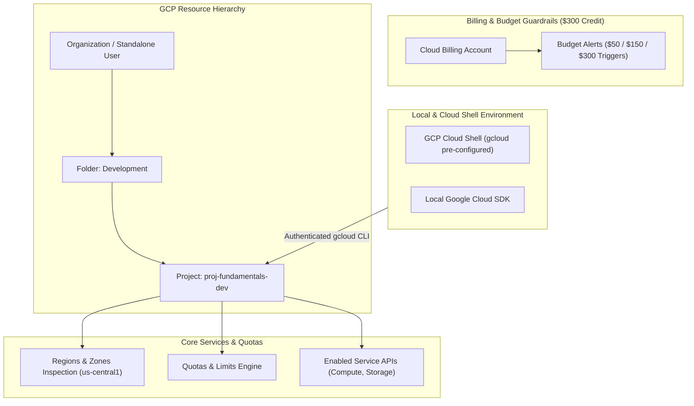

# Project 1: Enterprise Foundation & Free Trial Landing Zone Setup

---

## 1. Project Overview

Welcome to **Project 1: GCP Fundamentals Landing Zone Setup**. This hands-on capstone project synthesizes all 15 topics in **Module 01 (GCP Fundamentals)** into an end-to-end, production-ready foundation setup designed to run safely on a **GCP $300 Free Trial or Always Free Tier Account**.

### Objectives
In this project, you will:
1. **Configure Free Trial Safety Guardrails**: Establish billing budget alerts and quota checks to prevent unexpected charges against your $300 credit.
2. **Inspect Global Cloud Infrastructure**: Explore Google's global network backbone, points of presence (PoP), regions, and multi-zone availability.
3. **Build a Resource Hierarchy**: Structure projects, understand administrative isolation, resource inheritance, and the Shared Responsibility model.
4. **Master gcloud CLI & Cloud Shell**: Configure the Google Cloud SDK, set application default credentials, manage components, and automate administrative tasks.
5. **Verify Quotas & Resource Ceilings**: Query GCP service limits and automate resource allocation safety verification.

---

## 2. Architecture & Free Trial Safety Model

This project is specifically engineered for **GCP Free Trial Users**, accommodating both standalone project environments and full Enterprise Organization structures:



> [!IMPORTANT]
> **Free Trial Account Safety Rules**:
> - **Zero Paid Charges**: All commands in this project utilize Always Free resources or lightweight inspection APIs ($0 cost).
> - **Organization Node Optionality**: If your Free Trial account is a personal `@gmail.com` account without a Workspace domain, GCP operates in **Standalone Project Mode**. The scripts in this project automatically detect your environment and run seamlessly in both modes!

---

## 3. Module Topics Covered

| Topic Number & Name | Project Integration Point |
|---|---|
| **01. Setup Free Account** & **09. Billing Accounts** | Establishing $300 credit safety guardrails and billing account linkage. |
| **02. What is GCP** & **03. Why GCP is Used** | Inspecting GCP global differentiators and service APIs. |
| **04. Cloud Computing Fundamentals** | IaaS vs PaaS vs SaaS vs Serverless classification in GCP. |
| **05. Global Infrastructure** & **06. Regions & Zones** | Querying regional PoPs, multi-zone latency, and edge locations. |
| **07. Projects** & **08. Resource Hierarchy** | Resource unit creation, project ID assignment, and inheritance. |
| **10. Cloud Console** & **11. Cloud Shell** | Web UI navigation and in-browser Linux CLI environment execution. |
| **12. gcloud CLI** & **13. Google Cloud SDK** | Setting up `gcloud` properties, configurations, components, and IAM credentials. |
| **14. Shared Responsibility Model** | Documenting security boundaries between Google and customer. |
| **15. Quotas & Limits** | Auditing CPU, memory, and regional API quota consumption. |

---

## 4. Hands-On Execution Guide

### Prerequisites
- Active GCP Free Trial Account ($300 credit).
- Access to GCP Console or Cloud Shell (`shell.cloud.google.com`).

---

### Step 1: Initialize Cloud Shell & Authenticate gcloud

Open **Google Cloud Shell** (or your local terminal with `gcloud` installed) and initialize your working environment:

```bash
# 1. Check current gcloud version and installed SDK components
gcloud version

# 2. Authenticate gcloud CLI (if running locally)
# gcloud auth login
# gcloud auth application-default login

# 3. Print current active configuration account and project
gcloud config list
```

---

### Step 2: Clone & Inspect Project Workspace

Navigate to the Project 1 workspace directory:

```bash
# Navigate to Project 1 directory in your repository
cd "01-gcp-fundamentals/project-01-gcp-fundamentals"

# Grant execution permissions to shell scripts
chmod +x scripts/*.sh
```

---

### Step 3: Run the Foundation Bootstrap Script

Execute `scripts/bootstrap_foundation.sh`. This script performs the following automated steps:
- Detects whether your account operates under an **Organization** or as a **Standalone Free Trial**.
- Obtains your active **Billing Account ID**.
- Configures a dedicated development project: `proj-fundamentals-dev-$RANDOM`.
- Links the project to your Billing Account.
- Enables core baseline APIs (`compute.googleapis.com`, `storage.googleapis.com`).
- Audits regional quotas in `us-central1`.

```bash
./scripts/bootstrap_foundation.sh
```

*Expected Script Output Snippet*:
```text
=====================================================
GCP Fundamentals Foundation Bootstrap
=====================================================
[INFO] Operating Mode: Standalone Free Trial Account
[INFO] Billing Account ID: 012345-6789AB-CDEF01
[INFO] Created Project: proj-fundamentals-dev-8492
[INFO] Enabling Core Service APIs...
[SUCCESS] APIs enabled: compute.googleapis.com, storage.googleapis.com
[INFO] Regional Quotas (us-central1):
CPUS: Limit = 8, InUse = 0
```

---

### Step 4: Explore Regions, Zones, and PoPs via CLI

Run `gcloud` commands to inspect Google's global infrastructure:

```bash
# 1. List available GCP regions in the Americas
gcloud compute regions list --filter="name ~ us-"

# 2. List zones within the us-central1 region
gcloud compute zones list --filter="region ~ us-central1"

# 3. Inspect machine types available in us-central1-a
gcloud compute machine-types list --filter="zone:us-central1-a AND name:e2-micro"
```

---

### Step 5: Verify Quotas and Free Tier Limits

Inspect your project's regional quotas to ensure you remain within Always Free limits:

```bash
# 1. Query CPU quota usage in us-central1
gcloud compute regions describe us-central1 --format="table(quotas.metric, quotas.limit, quotas.usage)" | grep -i "CPUS"

# 2. Inspect active billing project linkage
PROJECT_ID=$(gcloud config get-value project)
gcloud billing projects describe ${PROJECT_ID}
```

---

## 5. Verification & Testing

Verify that your foundation setup adheres to GCP best practices:

```bash
# 1. Confirm active gcloud configuration
gcloud config get-value account
gcloud config get-value project

# 2. Verify enabled APIs list
gcloud services list --enabled --filter="name:(compute OR storage)"
```

*Verification Checkpoints*:
- [x] Project is successfully created and linked to your Free Trial Billing Account.
- [x] Baseline APIs (`compute.googleapis.com`, `storage.googleapis.com`) show status `ENABLED`.
- [x] Quota check confirms CPU usage is within $300 Free Trial limits.

---

## 6. Project Cleanup

To avoid leaving unused projects in your account, run the cleanup script to remove resources created during this lab:

```bash
./scripts/cleanup_foundation.sh
```

---

## 7. Summary & Next Steps

Congratulations! You have completed **Project 1: GCP Fundamentals Landing Zone Setup**. You now have a solid understanding of GCP's global infrastructure, billing safety guardrails, resource hierarchy, and `gcloud` CLI tools.

- **Next Project**: [Project 2: Zero-Trust IAM Governance](../../02-iam-and-identity/project-02-iam-and-identity/README.md)
