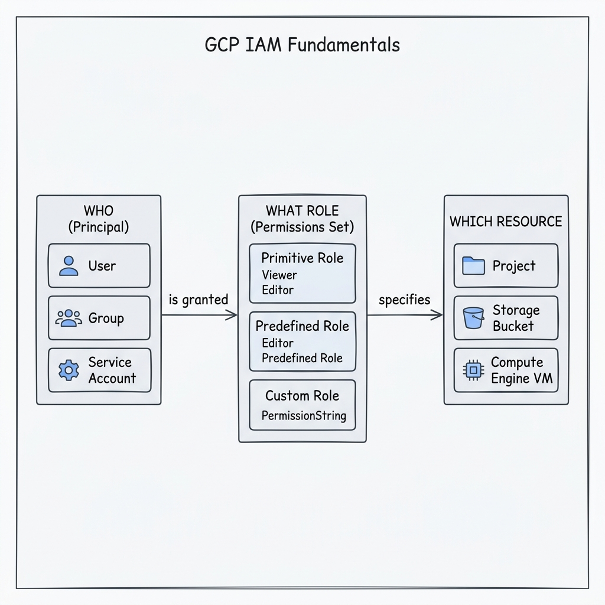
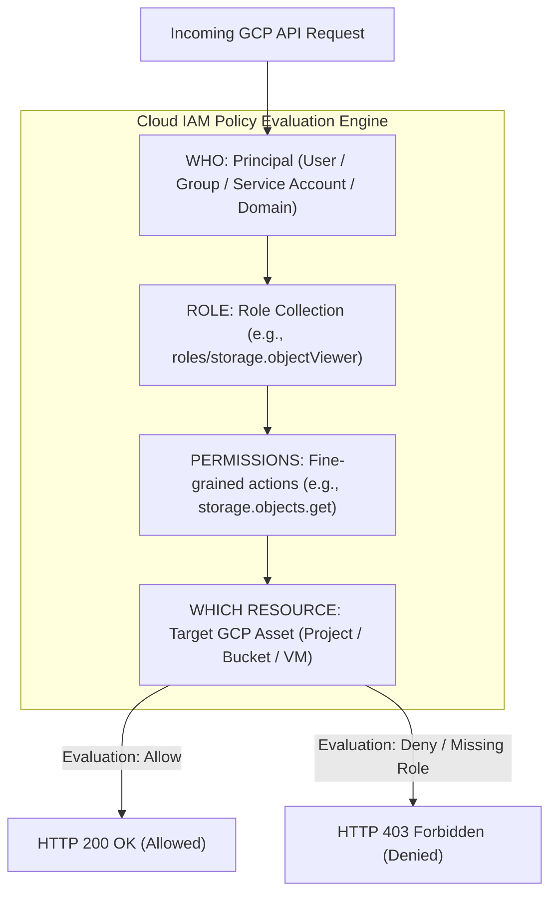

# Topic 16: IAM Fundamentals

---

## 1. What Is It?

Google Cloud **Identity and Access Management (IAM)** is the central authorization framework that controls **WHO** (identity) has **WHAT ACCESS** (roles/permissions) to **WHICH RESOURCE** (GCP assets) across Google Cloud Platform.

IAM provides a unified security policy engine across all GCP services. Instead of configuring separate permissions inside individual databases, storage buckets, or virtual machines, Cloud IAM manages access centrally using the Principle of Least Privilege.

### Real-World Analogy
Think of Cloud IAM like a high-security corporate badge system. Your **Badge** (Principal) states who you are. The **Access Level** programmed on your badge (Role) grants specific capabilities (Permissions)—such as entering the building, opening server room doors, or operating machinery. The **Physical Room** (Resource) checks your badge against the central security system before allowing entry.

---

## 2. Where Does It Fit?

Cloud IAM evaluates every single API request entering the Google Cloud Control Plane, sitting between client requests and resource execution engines.





---

## 3. Core Concepts

| IAM Element | Definition | Examples | Best Practice |
|---|---|---|---|
| **Principal** | The "WHO" requesting access (User, Group, Service Account, Domain). | `user:dev@company.com`, `serviceAccount:app@proj.iam.gserviceaccount.com` | Assign roles to Google Groups rather than individual users. |
| **Permission** | Fine-grained atomic capability to perform an action on a resource. | `compute.instances.start`, `storage.objects.get`, `bigquery.jobs.create` | Do NOT grant permissions directly; grant Roles that bundle permissions. |
| **Role** | A named collection of related permissions. | `roles/viewer`, `roles/storage.objectAdmin`, `roles/compute.networkAdmin` | Prefer Predefined or Custom Roles over Basic (Primitive) roles. |
| **IAM Policy** | A JSON document binding Principals to Roles on a specific resource. | `{ "role": "roles/storage.objectViewer", "members": ["group:analytics@company.com"] }` | Keep policies version-controlled and audit policy bindings regularly. |
| **IAM Condition** | Conditional logic attached to role bindings (Time, IP, Name prefix). | `request.time < timestamp("2026-12-31T00:00:00Z")` | Use for temporary break-glass access or time-bound maintenance windows. |

---

## 4. How It Works

IAM policy resolution follows an additive downward-inheritance model:

```text
API Request arrive (Principal: user@company.com, Action: storage.objects.get, Target: bucket-a)
              ↓
IAM Engine collects all IAM Policies attached to:
  1. Organization Node
  2. Folder Hierarchy
  3. Parent Project
  4. Bucket Resource itself
              ↓
IAM evaluates: Does ANY attached policy grant user@company.com a role containing storage.objects.get?
              ↓
YES → Request Allowed (HTTP 200)
NO  → Request Denied (HTTP 403 Permission Denied)
```

1. **Additive Evaluation**: IAM permissions are strictly additive. If a user is granted a role at the Folder level, granting or removing roles at the Project level cannot revoke that inherited folder permission.
2. **Deny Policies**: IAM Deny Policies explicitly block permissions regardless of inherited Allow roles.

---

## 5. Production Scenario

### Enterprise Least-Privilege Data Lake Security

```text
Requirement: Secure a BigQuery data warehouse storing financial records so data engineers can run queries, but only FinOps admins can modify datasets.
    ↓
Architecture: Group `data-engineers@company.com` bound to `roles/bigquery.jobUser` and `roles/bigquery.dataViewer` at Project scope.
    ↓
Configuration: Group `finops-admins@company.com` bound to `roles/bigquery.admin`.
    ↓
Security: Service Account `etl-pipeline@prod-proj.iam.gserviceaccount.com` granted `roles/bigquery.dataEditor` to load raw data.
    ↓
Scaling: Adding new data engineers to the Google Group grants them compliant access instantly without editing IAM policies.
    ↓
Monitoring: Cloud Audit Logs recording all `bigquery.jobs.create` and data access events.
```

*Why Selected*: Uses Google Groups and Predefined Roles to enforce least-privilege access, ensuring scalable user onboarding without policy drift.

---

## 6. Hands-On Lab

### Prerequisites
- GCP Sandbox Project.
- Access to Cloud Shell or `gcloud` CLI.
- IAM permissions: `roles/resourcemanager.projectIamAdmin`.

### Console Method
1. Log into [Google Cloud Console](https://console.cloud.google.com/).
2. Navigate to **IAM & Admin** → **IAM**.
3. Click **GRANT ACCESS** (or **ADD**) at top.
4. Under **New principals**, enter a test email address or group.
5. Under **Select a role**, choose `Storage Object Viewer` (`roles/storage.objectViewer`).
6. Click **+ ADD ANOTHER ROLE** → Select `BigQuery Job User` (`roles/bigquery.jobUser`).
7. Click **SAVE**.
8. Inspect the IAM main page filter to verify the newly assigned principal role bindings.

### CLI Method
Inspect and manage IAM policy bindings using `gcloud`:

```bash
# Set project variable
PROJECT_ID="your-gcp-project-id"
TEST_USER="user:test-dev@company.com"

# 1. Fetch current project IAM policy in JSON format
gcloud projects get-iam-policy $PROJECT_ID --format="json"

# 2. Add a predefined role binding to a principal
gcloud projects add-iam-policy-binding $PROJECT_ID \
    --member=$TEST_USER \
    --role="roles/viewer"

# 3. Remove the role binding
gcloud projects remove-iam-policy-binding $PROJECT_ID \
    --member=$TEST_USER \
    --role="roles/viewer"
```

### Verification
*Expected Result*: Output displays updated `bindings` list containing the specified principal and assigned role string.

### Cleanup
Ensure test IAM bindings are removed using step #3 above.

---

## 7. Security

### Fundamental IAM Guardrails
- **Principle of Least Privilege**: Grant users only the minimum permissions required to perform their specific job function.
- **Never Grant Primitive Roles in Production**: Avoid assigning `roles/owner`, `roles/editor`, or `roles/viewer` in production projects.
- **Group-Based Access Control**: Bind roles to Google Workspace Groups (`group:team-a@company.com`), never directly to individual personal email accounts.

```text
BAD PRACTICE:
Granting primitive `roles/editor` or `roles/owner` to developers at the Project or Folder scope.
Risk: Allows developers to delete databases, modify firewall rules, and grant themselves administrative privileges.

PRODUCTION PRACTICE:
Grant job-function Predefined Roles (e.g., `roles/compute.instanceAdmin.v1`, `roles/storage.objectViewer`) assigned to Google Groups.
```

---

## 8. Scaling & High Availability

Enterprise IAM Scaling Model:

```text
Individual User Role Bindings (Direct email assignment - High operational toil)
   ↓ (Transition to Group-Based IAM)
Google Group Role Bindings (Assign roles to group@domain.com - Scalable onboarding)
   ↓ (Automated Policy Management)
Infrastructure as Code (Terraform `google_project_iam_binding`) + Cloud Identity Automated Sync
```

- **Policy Size Limits**: An individual GCP resource IAM policy has a maximum size limit of **20 KB**. Assigning roles to Google Groups prevents hitting IAM policy size ceilings.

---

## 9. Cost

### IAM Economics
- **100% Free Core Feature**: Cloud IAM is a fundamental core service provided completely free of charge.
- **Indirect Savings**: Proper IAM configuration prevents costly unauthorized resource creation, data exfiltration, and crypto-mining abuse.

---

## 10. Monitoring & Troubleshooting

### IAM Observability Tools
- **Cloud Audit Logs**: Admin Activity logs record IAM policy changes; Data Access logs record resource access.
- **Policy Analyzer**: Analyze complex inherited IAM permissions across the resource hierarchy.

### Troubleshooting Matrix

| Symptom | Possible Cause | What to Check | Fix |
|---|---|---|---|
| `403 Permission Denied` when executing gcloud command | Principal lacks specific permission required for the API call | Cloud Audit Logs → Principal ID & requested permission | Grant predefined role containing the missing atomic permission. |
| User retains access after project role removal | Permission inherited from higher Folder or Organization scope | `gcloud asset analyze-iam-policy` | Remove user role binding from parent Folder or Organization level. |
| Cannot add IAM binding | Operating user lacks `resourcemanager.projects.setIamPolicy` permission | Active IAM bindings for operating user | Grant `roles/resourcemanager.projectIamAdmin` to operator. |

---

## 11. Common Mistakes

```text
Mistake: Assigning IAM roles to individual employee email accounts instead of Google Groups.
Why: Shortcut taken during initial project setup.
Impact: High operational toil during offboarding; orphaned role bindings across dozens of projects.
Correct approach: Create Google Groups in Cloud Identity and assign all IAM roles to group addresses.

Mistake: Believing IAM permissions can be "denied" at a Project level if allowed at a Folder level.
Why: Misunderstanding IAM's additive inheritance model.
Impact: Inability to restrict permissions inherited from higher levels.
Correct approach: Use explicit IAM Deny Policies or Organization Policy constraints to enforce hard restrictions.
```

---

## 12. Production Best Practices

- [ ] Enforce the Principle of Least Privilege across all projects and resources.
- [ ] Assign IAM roles exclusively to Google Groups or Service Accounts—never to individual users.
- [ ] Avoid primitive basic roles (`Owner`, `Editor`, `Viewer`) in production environments.
- [ ] Use IAM Conditions for temporary or time-restricted access requirements.
- [ ] Enable Data Access Audit Logs for sensitive storage buckets and databases.
- [ ] Automate all IAM policy bindings using Infrastructure as Code (Terraform).

---

## 13. Hyperscaler / Enterprise Perspective

```text
Personal / Learning
  Direct user email role assignment → Primitive Editor roles → Manual Console ClickOps
        ↓
Small Production
  Predefined roles → Dedicated Service Accounts → Basic IAM auditing
        ↓
Enterprise Environment
  Cloud Identity Group Sync → Single Sign-On (SSO) → Hierarchical IAM Policies → Automated Access Reviews
        ↓
Hyperscaler Environment
  Zero Manual IAM Bindings → Just-In-Time (JIT) Privileged Access Management → Policy-as-Code Auditing → Real-Time Security Command Center Alerts
```

In a hyperscaler environment, IAM is fully automated via Cloud Identity and Terraform. Developers receive zero permanent elevated privileges; temporary elevated access is granted via Just-In-Time (JIT) approval workflows, while automated bots continuously scan for over-privileged service accounts or policy violations.

---

## 14. Real Project Questions

### Q1: What is the difference between a Permission and a Role in GCP IAM?
**Answer:** A Permission is a single, atomic capability to perform an action on a specific resource (e.g., `compute.instances.start`). A Role is a named collection of permissions bundled together (e.g., `roles/compute.instanceAdmin.v1`). IAM policies bind Principals to Roles, not directly to individual Permissions.

### Q2: How does IAM policy inheritance handle conflicting permissions between a Folder and a Project?
**Answer:** IAM permissions are strictly additive and downward-cascading. If a user is granted a role at a Folder level, that permission automatically grants access to all child Projects and Resources under that folder. Adding or removing roles at the Project level cannot revoke or override permissions inherited from a parent Folder.

### Q3: Why is group-based IAM preferred over assigning roles directly to user accounts in enterprise GCP environments?
**Answer:** Group-based IAM decouples identity management from cloud access management. Adding or removing an employee from a Google Workspace Group automatically updates their cloud access across all linked GCP projects instantly, eliminating manual IAM policy updates and preventing orphaned user permissions upon employee offboarding.

---

## 15. Quick Decision Guide

| Requirement | Recommended Approach | Reason |
|---|---|---|
| Granting access to 20 data analysts in an enterprise | **Assign Predefined Role to Google Workspace Group** | Scalable, centralized onboarding/offboarding; policy updating requires 0 GCP changes. |
| Temporary emergency access for a database administrator | **IAM Condition bound with expiration timestamp** | Automatically revokes elevated privileges after a specified maintenance window. |
| Non-human application workload calling Cloud Storage | **Service Account with least-privilege Predefined Role** | Isolates application identity from human users without requiring passwords. |

### When should I use it?
- Mandatory foundation for securing every GCP resource, project, and service API.

### When should I NOT use it?
- Never use personal user identities for automated background applications—use Service Accounts instead.

---

## 16. Related Services

```text
                 [16. IAM Fundamentals]
                  /        |        \
          Cloud Identity  Service   Org Policies
             (Users)     Accounts    (Constraints)
                |           |             |
             Groups    Workloads   Security Rules
```

- **Cloud Identity**: Manages corporate user accounts and Google Groups.
- **Service Accounts**: Non-human identities for workloads and applications.
- **Organization Policies**: Centralized security constraints overriding IAM permissions.

---

## 17. Cheat Sheet

### Core Triad
- **WHO**: Principal (`user:`, `group:`, `serviceAccount:`).
- **ROLE**: Collection of permissions (`roles/storage.objectViewer`).
- **RESOURCE**: GCP Asset (`//storage.googleapis.com/projects/_/buckets/my-bucket`).

### Useful Commands
```bash
# Get project IAM policy
gcloud projects get-iam-policy PROJECT_ID

# Add IAM role binding to a principal
gcloud projects add-iam-policy-binding PROJECT_ID --member="group:devs@domain.com" --role="roles/viewer"

# Remove IAM role binding
gcloud projects remove-iam-policy-binding PROJECT_ID --member="group:devs@domain.com" --role="roles/viewer"
```

---

## 18. Learning Connection

- **Previous Topic**: [15. Quotas & Limits](../../01-gcp-fundamentals/15-quotas-and-limits/README.md)
- **Next Topic**: [17. Users](../17-users/README.md)
