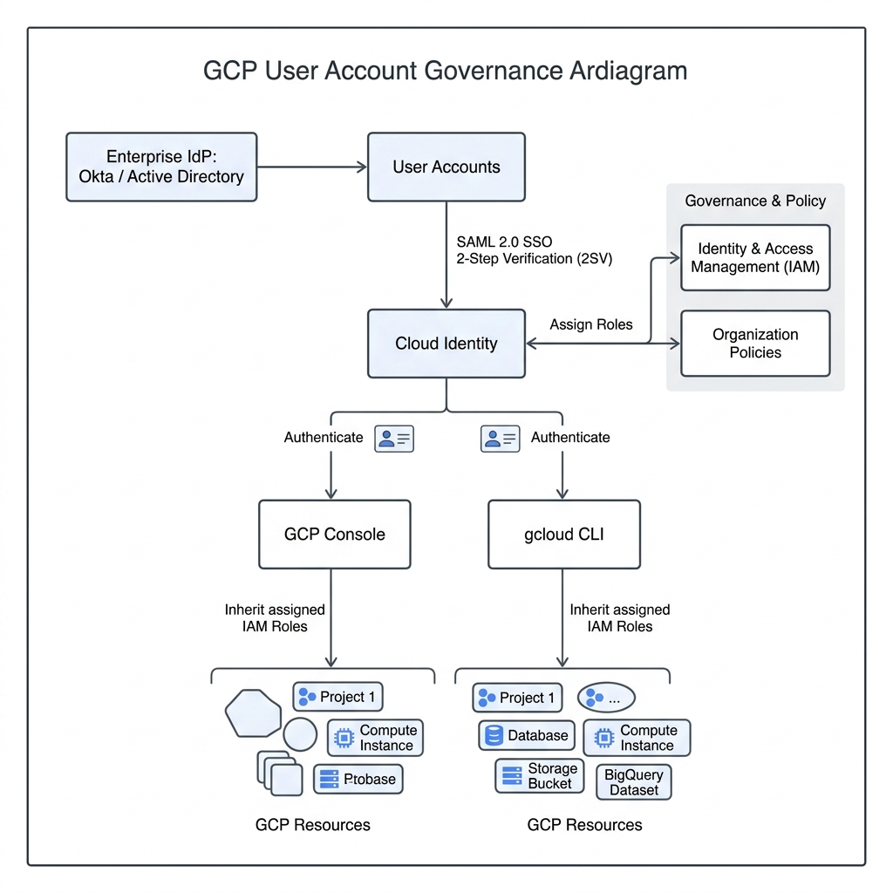
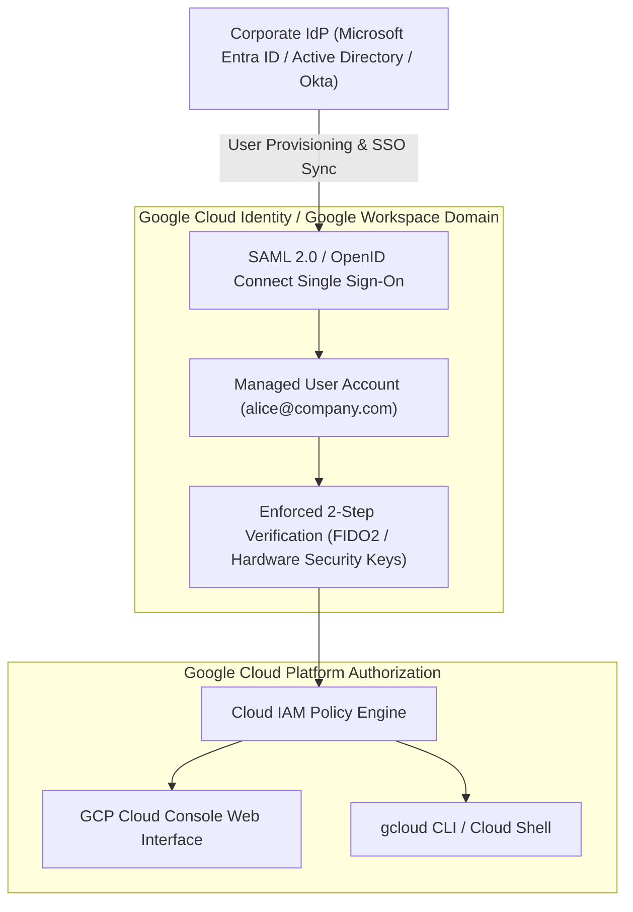

# Topic 17: Users

---

## 1. What Is It?

In Google Cloud IAM, a **User** represents an individual human identity authenticated via a Google Account, a Google Workspace account, or a Cloud Identity account.

User identities allow individual developers, cloud engineers, security auditors, and system administrators to log into the GCP Console, authenticate `gcloud` CLI sessions, and execute API actions bound to their specific assigned IAM roles.

In enterprise environments, user accounts are centrally managed in **Cloud Identity** or synchronized from corporate Identity Providers (IdPs) like Microsoft Entra ID (Active Directory), Okta, or Ping Identity using Single Sign-On (SSO).

### Real-World Analogy
Think of a GCP User Account like an official corporate email address and employee ID card issued by Human Resources. It uniquely identifies you as an authentic employee, verifies your password and 2FA credentials at the door, and allows security guards (Cloud IAM) to look up what office floors and filing cabinets you are allowed to access.

---

## 2. Where Does It Fit?

User accounts reside inside Cloud Identity or Google Workspace, providing human principal authentication for Cloud IAM authorization across the GCP Resource Hierarchy.





---

## 3. Core Concepts

| User Type | Account Origin | Management Console | Best Used For |
|---|---|---|---|
| **Google Account (Gmail)** | Personal `@gmail.com` accounts created independently. | Personal Google Settings | Initial free-tier learning, personal sandboxes. **Banned in Enterprise Production**. |
| **Cloud Identity User** | Corporate domain account (`user@company.com`) managed via Cloud Identity. | Admin Console (`admin.google.com`) | Enterprise users requiring GCP access without full Google Workspace email suites. |
| **Google Workspace User** | Corporate domain account integrated with Gmail, Drive, Docs, and GCP. | Admin Console (`admin.google.com`) | Organizations using Google Workspace for business productivity and GCP. |
| **Federated SSO User** | Corporate identity originating in external IdP (Entra ID, Okta). | External IdP Console | Enterprise single sign-on enabling unified employee credential management. |

---

## 4. How It Works

Authentication and IAM evaluation for user accounts follow a federated lifecycle:

```text
User initiates login (Console / gcloud auth login)
              ↓
Redirected to Corporate Identity Provider (Okta / Entra ID via SAML 2.0 / OIDC)
              ↓
User validates primary password & hardware 2-Step Verification (FIDO2)
              ↓
IdP issues SAML Assertion / ID Token to Cloud Identity
              ↓
GCP generates short-lived OAuth2 Access Token for user session
              ↓
Cloud IAM evaluates policy bindings attached to user:alice@company.com
```

1. **Central Offboarding**: Disabling a user account in the corporate IdP immediately revokes access across all GCP Console sessions and `gcloud` OAuth2 tokens.
2. **Directory Sync**: Google Cloud Directory Sync (GCDS) continuously mirrors active/inactive user statuses from Active Directory into Cloud Identity.

---

## 5. Production Scenario

### Enterprise Single Sign-On (SSO) & Zero Trust Authentication

```text
Requirement: Enforce corporate SSO and mandatory hardware key 2FA for 500 developers accessing GCP.
    ↓
Architecture: Microsoft Entra ID federated with Cloud Identity via SAML 2.0 SSO; GCDS syncing user lifecycle.
    ↓
Configuration: Enforce FIDO2 WebAuthn 2SV policy in Cloud Identity Admin Console (`admin.google.com`).
    ↓
Security: Block personal `@gmail.com` accounts using Organization Policy `constraints/iam.allowedPolicyMemberDomains`.
    ↓
Scaling: Adding a new engineer in Entra ID automatically provisions their Cloud Identity user account.
    ↓
Monitoring: Cloud Identity Audit Logs tracking login events, failed 2FA attempts, and SSO assertions.
```

*Why Selected*: Prevents employee credential sprawl, eliminates unmanaged Gmail accounts in production, and ensures instant cloud access revocation upon employee termination.

---

## 6. Hands-On Lab

### Prerequisites
- Cloud Identity or Google Workspace Admin privileges (`roles/iam.organizationAdmin`).
- Access to `admin.google.com` or GCP Console.

### Console Method
1. Log into the [Google Cloud Console](https://console.cloud.google.com/).
2. Navigate to **IAM & Admin** → **IAM**.
3. Inspect existing user accounts listed under the **Principals** column.
4. Filter by Type: `User`.
5. Select a user principal (e.g., `user:alice@company.com`).
6. Click the **Edit Principal** (Pencil) icon on the right panel to view assigned roles.
7. To restrict allowed domain users at the org level:
   - Navigate to **IAM & Admin** → **Organization Policies**.
   - Search for `Domain Restricted Sharing` (`constraints/iam.allowedPolicyMemberDomains`).
   - Click **Edit Policy** → Set Custom Rules to allow only your corporate Cloud Identity Customer ID.

### CLI Method
Inspect user accounts and test IAM policy bindings via `gcloud`:

```bash
# Set project context
PROJECT_ID="your-gcp-project-id"
USER_EMAIL="user:engineer@yourdomain.com"

# 1. Add a predefined viewer role binding to a corporate user account
gcloud projects add-iam-policy-binding $PROJECT_ID \
    --member=$USER_EMAIL \
    --role="roles/viewer"

# 2. Filter IAM policy for specific user bindings
gcloud projects get-iam-policy $PROJECT_ID \
    --flatten="bindings[].members" \
    --format="table(bindings.role)" \
    --filter="bindings.members:$USER_EMAIL"

# 3. Remove the user role binding
gcloud projects remove-iam-policy-binding $PROJECT_ID \
    --member=$USER_EMAIL \
    --role="roles/viewer"
```

### Verification
*Expected Result*: Output displays confirmed role assignment for the specific corporate user principal string.

### Cleanup
Ensure test user role bindings are removed using command #3.

---

## 7. Security

### User Identity Hardening
- **Ban Personal Gmail Accounts**: Use Organization Policy `constraints/iam.allowedPolicyMemberDomains` to block adding `@gmail.com` accounts to corporate GCP projects.
- **Mandate 2-Step Verification**: Enforce 2SV (specifically hardware security keys like YubiKeys or Titan Security Keys) for all cloud administrative users.
- **Session Idle Timeout**: Set web console session re-authentication limits to 1–8 hours in `admin.google.com`.

```text
BAD PRACTICE:
Granting production project roles directly to personal `@gmail.com` accounts or sharing generic user logins (e.g., `dev-team@company.com`).
Risk: Inability to audit individual user actions; loss of control when an employee leaves the company.

PRODUCTION PRACTICE:
Use individual corporate domain accounts (`user:first.last@company.com`) authenticated via SAML SSO with enforced FIDO2 2FA.
```

---

## 8. Scaling & High Availability

User Identity Lifecycle at Scale:

```text
Manual User Account Creation (ClickOps in admin.google.com - Small teams <10)
   ↓ (Automated Directory Sync)
Google Cloud Directory Sync (GCDS / SCIM provisioning from Okta / Entra ID)
   ↓ (Group-Based IAM Access)
Automated Group Membership Access (Assign roles to Groups, sync Users to Groups automatically)
```

- **Avoid Direct User IAM Assignments**: Assigning IAM roles directly to individual user accounts leads to permission drift. Always assign users to Google Workspace/Cloud Identity Groups, and bind IAM roles to those Groups.

---

## 9. Cost

### Cloud Identity Pricing Options
- **Cloud Identity Free**: Provides 50 free user licenses for domain user management, 2FA, and basic SSO without requiring paid Google Workspace subscriptions.
- **Cloud Identity Premium**: Charged per user per month; adds advanced mobile device management (MDM), automated app provisioning, and security rules.

---

## 10. Monitoring & Troubleshooting

### User Identity Observability
- **Cloud Identity Audit Logs**: Tracks login failures, password resets, 2FA prompt challenges, and SSO SAML assertions in `admin.google.com`.
- **Cloud Audit Logs**: Tracks user-initiated API calls inside GCP projects (`protoPayload.authenticationInfo.principalEmail`).

### Troubleshooting Matrix

| Symptom | Possible Cause | What to Check | Fix |
|---|---|---|---|
| `Domain Restricted Sharing` policy violation when adding user | User domain not listed in Organization Policy allowed Customer IDs | `constraints/iam.allowedPolicyMemberDomains` | Add user's Cloud Identity domain Customer ID to Org Policy or use corporate email. |
| User locked out after password reset | SSO assertion failing between Okta/Entra ID and Cloud Identity | SAML 2.0 log tracer in Enterprise IdP | Verify SAML certificate validity and name ID mapping in IdP settings. |
| User cannot access Console after role assignment | Role assigned to wrong email address or parent scope inheritance delayed | `gcloud asset analyze-iam-policy` | Confirm exact user email string and wait 60s for IAM policy propagation. |

---

## 11. Common Mistakes

```text
Mistake: Assigning IAM roles directly to individual user accounts (`user:alice@company.com`).
Why: Convenient for immediate short-term access requests.
Impact: Massive policy drift; tedious cleanup required when employees change roles or exit.
Correct approach: Assign IAM roles exclusively to Google Groups (`group:dev-team@company.com`) and add users to groups.

Mistake: Allowing contractors to use personal `@gmail.com` accounts for corporate GCP work.
Why: Avoiding the setup of Cloud Identity contractor licenses.
Impact: Enterprise IP and sensitive cloud resources remain accessible to contractors after their contract ends.
Correct approach: Issue contractor accounts under your corporate domain (`user:john.contractor@company.com`) in Cloud Identity.
```

---

## 12. Production Best Practices

- [ ] Enforce SAML 2.0 Single Sign-On (SSO) with your corporate Identity Provider (Entra ID, Okta).
- [ ] Enforce hardware-based 2-Step Verification (FIDO2 / YubiKey) for all GCP users.
- [ ] Use Organization Policy `constraints/iam.allowedPolicyMemberDomains` to ban personal Gmail accounts.
- [ ] Assign IAM roles to Google Groups rather than directly to individual user accounts.
- [ ] Automate user account provisioning and deprovisioning using GCDS or SCIM integrations.
- [ ] Set web console session re-authentication limits to 8 hours maximum.

---

## 13. Hyperscaler / Enterprise Perspective

```text
Personal / Learning
  Personal Gmail account → Direct IAM role assignment → No 2FA enforcement
        ↓
Small Production
  Cloud Identity Free domain → Manual user creation → Basic 2FA via SMS
        ↓
Enterprise Environment
  Federated SAML 2.0 SSO (Entra ID / Okta) → Automated SCIM User Sync → Enforced Hardware Security Keys
        ↓
Hyperscaler Environment
  Zero Trust Architecture (BeyondCorp) → Context-Aware Access Policies → Automated Offboarding Pipelines → JIT Privileged Escalation
```

In a hyperscaler environment, user accounts are strictly managed upstream in corporate Identity Providers. Context-Aware Access policies evaluate user location, device encryption status, and IP reputation before granting web console access. Users hold zero permanent elevated privileges, relying on Just-In-Time (JIT) access approval workflows.

---

## 14. Real Project Questions

### Q1: What is the difference between a Google Account, a Cloud Identity account, and a Google Workspace account?
**Answer:** A Google Account (`@gmail.com`) is an unmanaged personal account. A Cloud Identity account is an enterprise domain-managed account (`user@company.com`) providing authentication, 2FA, and SSO for GCP without office productivity apps. A Google Workspace account includes all Cloud Identity features plus enterprise email (Gmail), Drive, Docs, and Meet.

### Q2: Why should enterprises enforce the "Domain Restricted Sharing" Organization Policy?
**Answer:** The `constraints/iam.allowedPolicyMemberDomains` policy restricts which domains can be added to IAM policies across all projects. Enforcing this policy blocks developers from accidentally (or intentionally) granting project access to external personal `@gmail.com` addresses or unauthorized third-party domains.

### Q3: How does Google Cloud Directory Sync (GCDS) maintain security during employee offboarding?
**Answer:** GCDS runs on a scheduled basis, querying the corporate Active Directory / LDAP server for account status changes. When an employee is terminated in Active Directory, GCDS automatically suspends or deletes their corresponding Cloud Identity user account, instantly invalidating all active GCP Console sessions, OAuth2 tokens, and `gcloud` CLI access.

---

## 15. Quick Decision Guide

| Requirement | Recommended Approach | Reason |
|---|---|---|
| Enterprise user authentication for 1,000 employees with existing Okta IdP | **Cloud Identity (Free/Premium) + SAML 2.0 SSO** | Unified single sign-on, automated user sync, centralized credential management. |
| External contractor requiring 30-day temporary GCP access | **Cloud Identity User under corporate domain** | Allows enforcing corporate 2FA policies and automated offboarding after 30 days. |
| Individual developer learning GCP fundamentals | **Personal Google Account ($300 Free Trial)** | Zero cost, instant sign-up, safe isolation from corporate environments. |

### When should I use it?
- Essential principal type for human developers, DevOps engineers, and security auditors requiring interactive GCP access.

### When should I NOT use it?
- Never use human user accounts inside automated application code, microservices, or background CI/CD runners—use Service Accounts.

---

## 16. Related Services

```text
                   [17. Users]
                  /     |     \
          Cloud Identity  IAM   Context-Aware
              (SSO)    Policies    Access
                |         |          |
            Entra/Okta  Groups   Device Policy
```

- **Cloud Identity**: Enterprise domain management, SSO, and user provisioning.
- **Cloud IAM**: Assigns access permissions to user principals.
- **Context-Aware Access**: Enforces device health and IP rules for user logins.

---

## 17. Cheat Sheet

### Principal Syntax
- User Syntax: `user:first.last@domain.com`
- Group Syntax: `group:team-name@domain.com`

### Key URLs
- Admin Console: `https://admin.google.com/`
- Cloud Identity Docs: `https://cloud.google.com/identity`

---

## 18. Learning Connection

- **Previous Topic**: [16. IAM Fundamentals](../16-iam-fundamentals/README.md)
- **Next Topic**: [18. Groups](../18-groups/README.md)
