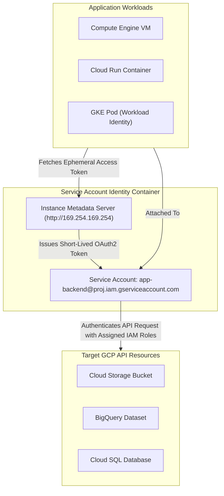

# Topic 19: Service Accounts

---

## 1. What Is It?

A **Service Account** is a special non-human identity in Google Cloud IAM used by applications, virtual machines, containers, microservices, and automated pipelines to make authenticated API requests to GCP services.

Unlike human user accounts that authenticate using passwords and 2-Step Verification, Service Accounts authenticate using automatically managed internal OAuth2 tokens, short-lived credentials, or cryptographically signed JSON key files.

Service Accounts act both as **Identities** (they can be granted IAM roles to access resources) and as **Resources** (users can be granted permission to impersonate or manage the Service Account itself).

### Real-World Analogy
Think of a Service Account like a robotic security keycard assigned to a delivery drone inside a automated factory. The drone doesn't have a human face, username, or password, but its keycard is programmed with specific access rights to load packages from Bay 3 (Cloud Storage) and deliver them to Bay 7 (BigQuery).

---

## 2. Where Does It Fit?

Service Accounts bridge the gap between application workloads (running on Compute Engine, GKE, Cloud Run, or external servers) and GCP Control Plane APIs.



---

## 3. Core Concepts

| Service Account Type | Email Pattern | Creation / Management | Primary Purpose |
|---|---|---|---|
| **User-Managed Service Account** | `name@project-id.iam.gserviceaccount.com` | Created by developers / Terraform in your project. | Primary identity attached to custom app workloads, VMs, and Cloud Run. |
| **Default Service Account** | `PROJECT_NUMBER-compute@developer.gserviceaccount.com` | Automatically created when enabling Compute Engine / App Engine. | Legacy default identity. **Warning**: Granted primitive `Editor` role by default. |
| **Google-Managed Service Agent** | `service-PROJECT_NUMBER@gcp-sa-service.iam.gserviceaccount.com` | Automatically created and managed by Google Cloud internal services. | Enables GCP services to perform operations on your behalf (e.g., Cloud Build, GKE). |

---

## 4. How It Works

Authentication using Service Accounts on GCP Compute Engine or Cloud Run uses the **Instance Metadata Server**:

```text
Application Code makes API call (e.g., storage.Client())
              ↓
Client Library queries local Metadata Server (http://169.254.169.254/computeMetadata/v1/instance/service-accounts/default/token)
              ↓
Metadata Server returns short-lived OAuth2 Access Token (valid 60 mins)
              ↓
Client Library includes Bearer Token in HTTPS request header to GCP APIs
              ↓
IAM Engine verifies token & validates Service Account roles → Executes API action
```

1. **Zero Hardcoded Credentials**: Code running inside GCP never needs JSON key files or passwords.
2. **Automated Token Rotation**: The Metadata Server automatically refreshes short-lived OAuth2 access tokens before expiration.

---

## 5. Production Scenario

### Secure Microservice Authentication without Key Files

```text
Requirement: A Node.js web API running on Cloud Run needs to write uploaded customer images into a Cloud Storage bucket.
    ↓
Architecture: Dedicated User-Managed Service Account `sa-image-processor@prod-proj.iam.gserviceaccount.com`.
    ↓
Configuration: Grant `roles/storage.objectAdmin` on specific target bucket `gs://prod-customer-uploads-12345`.
    ↓
Security: Attach `sa-image-processor` directly to Cloud Run service revision. Disable service account key creation.
    ↓
Scaling: Node.js code uses standard `@google-cloud/storage` SDK; Metadata Server handles token fetching across 1,000 container instances.
    ↓
Monitoring: Cloud Audit Logs recording API calls made by `sa-image-processor@prod-proj.iam.gserviceaccount.com`.
```

*Why Selected*: Eliminates long-lived JSON key files completely, ensuring that even if container source code is compromised, no static credentials can be stolen.

---

## 6. Hands-On Lab

### Prerequisites
- Active GCP Project with Compute Engine API enabled.
- Cloud Shell or `gcloud` CLI.
- IAM permissions: `roles/iam.serviceAccountAdmin` and `roles/resourcemanager.projectIamAdmin`.

### Console Method
1. Log into [Google Cloud Console](https://console.cloud.google.com/).
2. Navigate to **IAM & Admin** → **Service Accounts**.
3. Click **CREATE SERVICE ACCOUNT** at top.
4. Set Service account name: `sa-storage-writer`, ID: `sa-storage-writer`.
5. Enter Description: `Service account for writing web app logs to GCS`.
6. Click **CREATE AND CONTINUE**.
7. Grant role: `Storage Object Admin` (`roles/storage.objectAdmin`).
8. Click **CONTINUE** → Click **DONE**.
9. Observe the newly created service account email address listed in the table.

### CLI Method
Create, configure, and attach a Service Account using `gcloud`:

```bash
# Set project context
PROJECT_ID="your-gcp-project-id"
SA_NAME="sa-app-backend"
SA_EMAIL="${SA_NAME}@${PROJECT_ID}.iam.gserviceaccount.com"

# 1. Create a User-Managed Service Account
gcloud iam service-accounts create $SA_NAME \
    --display-name="App Backend Workload Identity"

# 2. Grant a predefined IAM role to the Service Account at project scope
gcloud projects add-iam-policy-binding $PROJECT_ID \
    --member="serviceAccount:${SA_EMAIL}" \
    --role="roles/datastore.user"

# 3. Create a Compute Engine VM attached to this Service Account
gcloud compute instances create app-vm \
    --zone=us-central1-a \
    --machine-type=e2-micro \
    --service-account=$SA_EMAIL \
    --scopes=cloud-platform
```

### Verification
SSH into the VM and query the Metadata Server to verify attached identity:

```bash
gcloud compute ssh app-vm --zone=us-central1-a \
    --command="curl -H 'Metadata-Flavor: Google' http://169.254.169.254/computeMetadata/v1/instance/service-accounts/default/email"
```
*Expected Result*: Returns `sa-app-backend@your-gcp-project-id.iam.gserviceaccount.com`.

### Cleanup
Delete test VM and Service Account:

```bash
gcloud compute instances delete app-vm --zone=us-central1-a --quiet
gcloud iam service-accounts delete $SA_EMAIL --quiet
```

---

## 7. Security

### Key Isolation & Impersonation Security
- **Banning JSON Key Files**: Do NOT create service account JSON keys. Use Instance Metadata Server, Workload Identity (GKE), or Workload Identity Federation (AWS/GitHub).
- **Service Account Impersonation**: Allow authorized developers to impersonate a service account using `roles/iam.serviceAccountTokenCreator` instead of giving them permanent production permissions.
- **Revoke Default Editor Roles**: Disable automatic Editor role assignment on default Compute Engine service accounts via Organization Policy `constraints/iam.automaticIamGrantsForDefaultServiceAccounts`.

```text
BAD PRACTICE:
Exporting Service Account JSON key files, downloading them to local laptops, or committing key strings into GitHub repositories.
Risk: Key leakage leads to automated project compromise within seconds by malicious bots.

PRODUCTION PRACTICE:
Use keyless authentication (Metadata Server for GCP VMs/Cloud Run; Workload Identity for GKE/GitHub). Enable Organization Policy blocking key creation.
```

---

## 8. Scaling & High Availability

Service Account Architecture at Scale:

```text
Default Compute Service Account (Over-privileged primitive Editor role - Legacy)
   ↓ (Transition to Dedicated User-Managed SAs)
Fine-Grained Service Accounts (1 SA per Microservice component)
   ↓ (Keyless Federation at Scale)
Workload Identity / Workload Identity Federation (Keyless auth across 1000s of GKE Pods & CI/CD Runners)
```

- **Quota Limits**: Each GCP project allows up to **100 User-Managed Service Accounts** by default (can be increased via quota request).
- **Scope vs. IAM**: Always set access scopes to `cloud-platform` when creating VMs, and manage actual permissions using fine-grained Cloud IAM roles.

---

## 9. Cost

### Service Account Pricing
- **100% Free Core Feature**: Creating, managing, and authenticating Service Accounts costs $0.
- **Cost Reduction via Least Privilege**: Restricting service accounts to specific resources prevents runaway compute or storage billing caused by compromised credentials.

---

## 10. Monitoring & Troubleshooting

### Service Account Observability
- **Cloud Audit Logs**: Filter audit logs by `protoPayload.authenticationInfo.principalEmail="sa-name@..."` to trace all API operations performed by a workload.
- **Service Account Key Metrics**: Monitor `iam.googleapis.com/service_account/key/age` to track old unrotated keys.

### Troubleshooting Matrix

| Symptom | Possible Cause | What to Check | Fix |
|---|---|---|---|
| `403 Insufficient Permission` from application code | Service account lacks specific predefined role for API | Cloud Audit Logs for principal email | Add missing predefined role binding to the Service Account. |
| `Access token request failed` on Metadata Server | VM launched with restricted OAuth access scopes | `gcloud compute instances describe` | Set VM access scope to `https://www.googleapis.com/auth/cloud-platform`. |
| Cannot create Service Account JSON key file | Organization Policy `constraints/iam.disableServiceAccountKeyCreation` active | Org Policy settings | Use keyless authentication (Workload Identity) instead of JSON keys. |

---

## 11. Common Mistakes

```text
Mistake: Using the Default Compute Engine Service Account (`PROJECT_NUMBER-compute@...`) for production workloads.
Why: Convenience of using pre-created identities.
Impact: Gives the VM broad `Editor` permissions across the entire GCP project, breaching least privilege.
Correct approach: Create dedicated User-Managed Service Accounts with fine-grained roles for every workload.

Mistake: Restricting permissions using legacy Access Scopes instead of IAM roles.
Why: Misunderstanding the relationship between VM Access Scopes and IAM permissions.
Impact: Confusing authorization bugs; VM scope allows access but IAM denies it, or vice versa.
Correct approach: Set VM Access Scope to `cloud-platform` (full access), and manage actual permissions 100% via IAM roles.
```

---

## 12. Production Best Practices

- [ ] Create dedicated User-Managed Service Accounts for every individual application component.
- [ ] Enforce the Principle of Least Privilege on all Service Account role bindings.
- [ ] Eliminate long-lived JSON key files; enforce keyless auth via Metadata Server and Workload Identity.
- [ ] Enforce Organization Policy `constraints/iam.disableServiceAccountKeyCreation` to block key exports.
- [ ] Set VM Access Scopes to `cloud-platform` and control permissions exclusively via Cloud IAM.
- [ ] Disable or strip primitive `Editor` roles from default Compute Engine service accounts.

---

## 13. Hyperscaler / Enterprise Perspective

```text
Personal / Learning
  Default Compute Service Account → Downloaded JSON key file → Hardcoded credentials in code
        ↓
Small Production
  User-Managed Service Accounts → Fine-grained predefined roles → Key rotation scripts
        ↓
Enterprise Environment
  100% Keyless Workload Identity (GKE & Cloud Run) → Workload Identity Federation (GitHub Actions) → Org Policy Key Block
        ↓
Hyperscaler Environment
  Automated Service Account Provisioning via Terraform → Real-Time Anomaly Detection on SA API Usage → Ephemeral Token Impersonation
```

In a hyperscaler environment, static Service Account JSON keys are completely forbidden by automated Organization Policies. Microservices authenticate keylessly using Metadata Servers or Workload Identity, while external CI/CD pipelines use Workload Identity Federation to exchange OIDC tokens for short-lived 60-minute GCP access tokens.

---

## 14. Real Project Questions

### Q1: Why is attaching the Default Compute Engine Service Account to production VMs considered a major security risk?
**Answer:** By default, GCP automatically grants the primitive `Editor` role to the Default Compute Service Account. Any application or attacker gaining access to a VM attached to this default account inherits full read/write/delete privileges across almost all resources and data inside the entire GCP project.

### Q2: How does the Instance Metadata Server eliminate the need for storing credentials inside application code?
**Answer:** Applications running on GCP Compute Engine or Cloud Run make local HTTP requests to `http://169.254.169.254`. The Metadata Server automatically negotiates with GCP IAM to generate short-lived (60-minute) OAuth2 access tokens for the attached Service Account. Client libraries consume these tokens automatically, eliminating the need to store passwords or JSON key files in code.

### Q3: What is the difference between an Access Scope and an IAM Role on a Compute Engine VM?
**Answer:** Access Scopes are a legacy gateway mechanism that sets the *maximum potential permissions* a VM's service account can request. IAM Roles define the *actual fine-grained permissions* granted to the Service Account identity. Both must allow an action for it to succeed. Production best practice is to set Access Scopes to `cloud-platform` and manage actual permissions 100% through Cloud IAM roles.

---

## 15. Quick Decision Guide

| Requirement | Recommended Approach | Reason |
|---|---|---|
| Node.js API on Cloud Run accessing Cloud SQL & Storage | **Dedicated User-Managed Service Account + Metadata Server** | Keyless, zero-maintenance, short-lived OAuth2 tokens managed automatically. |
| GKE Pod requiring access to BigQuery | **GKE Workload Identity** | Binds Kubernetes Service Account directly to GCP Service Account keylessly. |
| External GitHub Actions CI/CD pipeline deploying to GCP | **Workload Identity Federation** | Exchanges GitHub OIDC token for short-lived GCP token without JSON key files. |

### When should I use it?
- Mandatory principal identity type for all automated non-human application workloads and GCP infrastructure services.

### When should I NOT use it?
- Never issue Service Account credentials to human users to log into the GCP Console—use Cloud Identity Users instead.

---

## 16. Related Services

```text
               [19. Service Accounts]
              /          |          \
      Instance Metadata Workload     Workload Identity
          Server        Identity         Federation
            |              |                 |
       GCP VMs/Run    GKE Pods      AWS / GitHub CI/CD
```

- **Instance Metadata Server**: Provides keyless short-lived tokens to VMs and Cloud Run.
- **Workload Identity**: Binds GKE Kubernetes Service Accounts to GCP Service Accounts.
- **Workload Identity Federation**: Authenticates external workloads (AWS/GitHub) keylessly.

---

## 17. Cheat Sheet

### Principal Syntax
- `serviceAccount:sa-name@project-id.iam.gserviceaccount.com`

### Useful Commands
```bash
# Create a user-managed Service Account
gcloud iam service-accounts create SA_NAME --display-name="DISPLAY_NAME"

# List all service accounts in a project
gcloud iam service-accounts list

# Grant IAM role to a Service Account
gcloud projects add-iam-policy-binding PROJECT_ID \
    --member="serviceAccount:SA_EMAIL" \
    --role="roles/storage.objectViewer"

# Create a VM with a custom Service Account
gcloud compute instances create my-vm --zone=us-central1-a \
    --service-account=SA_EMAIL --scopes=cloud-platform
```

---

## 18. Learning Connection

- **Previous Topic**: [18. Groups](../18-groups/README.md)
- **Next Topic**: [20. Basic Roles](../20-basic-roles/README.md)
