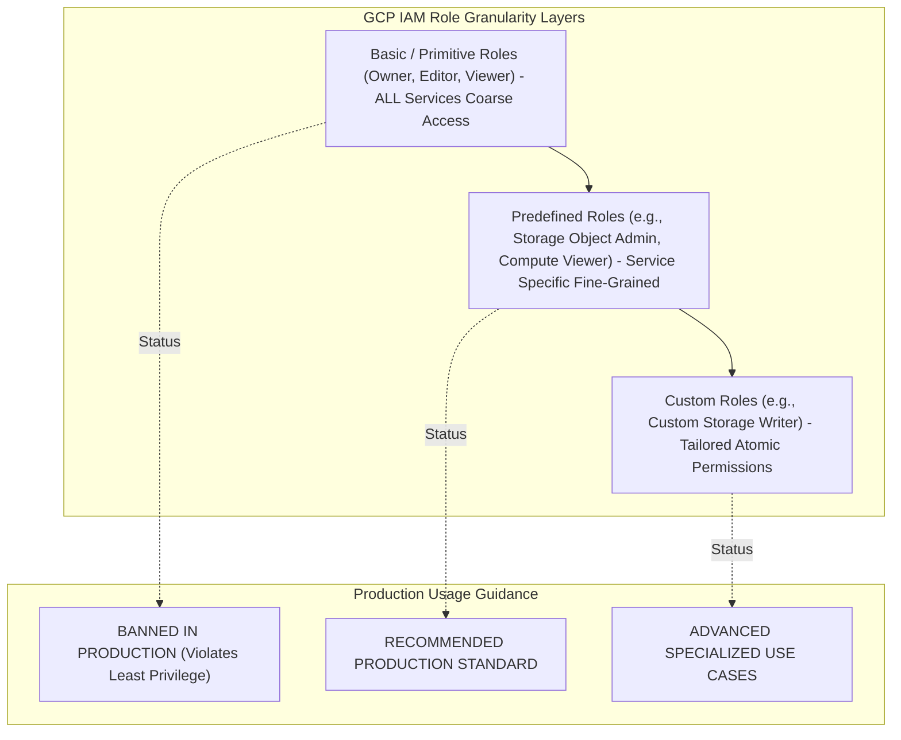

# Topic 20: Basic Roles

---

## 1. What Is It?

**Basic Roles** (also known as **Primitive Roles**) are the original, legacy access control roles introduced in the early days of Google Cloud Platform. They consist of three coarse-grained privileges: **Owner** (`roles/owner`), **Editor** (`roles/editor`), and **Viewer** (`roles/viewer`).

Basic roles grant sweeping, all-encompassing permissions across **all** GCP services within a project or folder simultaneously. Because they bundle thousands of unrelated permissions together, Basic Roles violate the Principle of Least Privilege and are strictly banned in enterprise production environments.

### Real-World Analogy
Think of Basic Roles like master skeleton keys issued by a hotel manager:
- **Owner**: Master key that unlocks every room, lets you change hotel ownership deeds, and modify room rates.
- **Editor**: Master key that unlocks every room and lets you add or throw away furniture in any room.
- **Viewer**: Clear glass window allowing you to look into every room in the hotel.

Instead of issuing master skeleton keys to every employee (Basic Roles), modern security requires giving the pool maintenance worker a key that *only* unlocks the pool maintenance shed (Predefined Roles).

---

## 2. Where Does It Fit?

Basic Roles exist at the broadest level of the GCP IAM permission hierarchy, encompassing Predefined Roles and Custom Roles.



---

## 3. Core Concepts

| Basic Role | Role Identifier | Scope & Capabilities | Production Risk Level |
|---|---|---|---|
| **Owner** | `roles/owner` | Full control: Same as Editor + ability to manage IAM policies, grant/revoke roles, and delete projects. | **CRITICAL RISK** (Gives complete project control, billing changes, and IAM escalation). |
| **Editor** | `roles/editor` | Full modification: Create, modify, and delete resources across ALL GCP services (VMs, Buckets, DBs). | **HIGH RISK** (Allows deleting production data or launching unmonitored expensive compute). |
| **Viewer** | `roles/viewer` | Read-only access: View state, configurations, and metadata across ALL GCP services. | **MEDIUM RISK** (Exposes sensitive configuration metadata across all project services). |
| **Browser** | `roles/browser` | Minimal read-only access to view the resource hierarchy structure without reading data. | **LOW RISK** (Used for resource hierarchy navigation). |

---

## 4. How It Works

Basic Roles function as massive umbrellas containing thousands of individual atomic permissions:

```text
Basic Role Assigned to Principal (e.g., roles/editor assigned to dev@company.com)
              ↓
IAM Engine maps roles/editor to 4,000+ atomic permissions across 100+ GCP services
  - compute.instances.create, compute.instances.delete
  - storage.buckets.create, storage.objects.delete
  - cloudsql.instances.create, cloudsql.databases.drop
  - bigquery.datasets.delete, pubsub.topics.publish
              ↓
User attempts action on Compute Engine -> ALLOWED (via roles/editor)
User attempts action on Cloud Storage -> ALLOWED (via roles/editor)
User attempts action on BigQuery -> ALLOWED (via roles/editor)
```

1. **Automatic Expansion**: When Google releases a brand new GCP service, Google automatically adds read/write capabilities for that new service into the existing legacy `Editor` and `Owner` basic roles.
2. **Implicit Billing Access**: Project `Owner` roles can modify billing links and budget settings.

---

## 5. Production Scenario

### Security Remediation: Replacing Legacy Basic Roles

```text
Requirement: Remediate a security audit finding where 15 developers hold primitive `roles/editor` on production projects.
    ↓
Step 1 (Audit): Query active project IAM policy using `gcloud` to identify all `roles/editor` bindings.
    ↓
Step 2 (Analysis): Analyze Cloud Audit Logs using IAM Recommender to identify actual permissions used by developers.
    ↓
Step 3 (Mapping): Map broad `roles/editor` access down to specific Predefined Roles (`roles/compute.developer`, `roles/storage.objectViewer`).
    ↓
Step 4 (Remediation): Apply new Predefined Role bindings to Google Workspace Groups (`group:dev-team@company.com`).
    ↓
Step 5 (Revocation): Remove primitive `roles/editor` bindings completely from the project policy.
```

*Why Selected*: Shifting from Basic Roles to Predefined Roles enforces least privilege, preventing developers from accidentally deleting databases or modifying firewall rules while retaining their necessary compute/storage permissions.

---

## 6. Hands-On Lab

### Prerequisites
- Active GCP Project.
- Cloud Shell or `gcloud` CLI.
- IAM permissions: `roles/resourcemanager.projectIamAdmin`.

### Console Method
1. Log into [Google Cloud Console](https://console.cloud.google.com/).
2. Navigate to **IAM & Admin** → **IAM**.
3. Locate any principal assigned a Basic Role (**Owner**, **Editor**, or **Viewer**).
4. Observe the warning icon next to Basic Roles indicating they are legacy broad permissions.
5. Click the **Edit Principal** (Pencil) icon.
6. Click the trash icon next to `Editor` or `Owner`.
7. Click **+ ADD ANOTHER ROLE** → Select a fine-grained **Predefined Role** (e.g., `Compute Instance Admin (v1)`).
8. Click **SAVE**.

### CLI Method
Audit and replace Basic Roles using `gcloud`:

```bash
# Set project context
PROJECT_ID="your-gcp-project-id"
TARGET_USER="user:developer@yourdomain.com"

# 1. Inspect all basic roles/editor or roles/owner bindings in the project
gcloud projects get-iam-policy $PROJECT_ID \
    --flatten="bindings[].members" \
    --format="table(bindings.role, bindings.members)" \
    --filter="bindings.role:roles/owner OR bindings.role:roles/editor OR bindings.role:roles/viewer"

# 2. Add fine-grained Predefined Role as replacement
gcloud projects add-iam-policy-binding $PROJECT_ID \
    --member=$TARGET_USER \
    --role="roles/compute.instanceAdmin.v1"

# 3. Revoke legacy primitive Editor role
gcloud projects remove-iam-policy-binding $TARGET_USER \
    --member=$TARGET_USER \
    --role="roles/editor"
```

### Verification
*Expected Result*: Querying the IAM policy confirms `roles/editor` is removed and replaced by `roles/compute.instanceAdmin.v1`.

### Cleanup
Revert any test role bindings added during the lab.

---

## 7. Security

### Blast Radius & Risk of Basic Roles
- **Over-Privileged Access**: A user with `roles/editor` on a project can modify firewall rules, drop database tables, delete backups, and create public storage buckets.
- **Privilege Escalation**: `roles/owner` allows a user to grant themselves any role across the organization, bypassing security restrictions.

```text
BAD PRACTICE:
Granting primitive `roles/editor` or `roles/owner` to application developers, contractors, or service accounts.
Risk: Excessive blast radius; a single compromised credential allows total project takeover.

PRODUCTION PRACTICE:
Enforce Organization Policy `constraints/iam.automaticIamGrantsForDefaultServiceAccounts` and replace all Basic Roles with fine-grained Predefined Roles.
```

---

## 8. Scaling & High Availability

Evolution of Role Models:

```text
Early GCP / Prototyping (Basic Roles: Owner / Editor / Viewer - 3 Coarse Roles)
   ↓ (GCP Growth & Granularity Expansion)
Predefined Roles (1,000+ Fine-Grained Service-Specific Roles)
   ↓ (Custom Security Enforcement)
Custom Roles (Tailored atomic permission sets for hyper-specific compliance)
```

- **Avoid Automation Scripts Using Basic Roles**: CI/CD pipelines or Terraform service accounts should never use `roles/editor`. CI/CD pipelines should use specific deployment roles (e.g., `roles/run.developer`, `roles/container.developer`).

---

## 9. Cost

### Indirect Costs of Basic Roles
- **Over-Provisioning Risk**: Developers with `roles/editor` can launch massive 96-core VMs or multi-terabyte Bigtable instances without approval.
- **Security Breach Costs**: Privileged Basic Roles make crypto-mining hijacking easy if credentials leak, resulting in tens of thousands of dollars in unauthorized charges.

---

## 10. Monitoring & Troubleshooting

### Basic Role Detection Tools
- **IAM Recommender**: GCP automatically generates recommendations in the console identifying unused permissions granted by Basic Roles and suggesting exact Predefined Role replacements.
- **Security Command Center**: Flags primitive role bindings on production projects as high-severity security vulnerabilities.

### Troubleshooting Matrix

| Symptom | Possible Cause | What to Check | Fix |
|---|---|---|---|
| Security auditor flags project for compliance violation | Basic Roles (`Owner`, `Editor`) assigned to human users | `gcloud projects get-iam-policy` | Replace Basic Roles with Predefined Roles assigned to Google Groups. |
| IAM Recommender shows "Excessive Permissions" alert | Principal holds `roles/editor` but uses <5% of permissions | Console IAM Recommender tab | Apply IAM Recommender suggestion to automatically downscope role. |
| Cannot remove `roles/owner` from project | Project must maintain at least ONE active Owner at all times | Project IAM bindings | Assign `roles/owner` to a break-glass Admin Group before removing old owner. |

---

## 11. Common Mistakes

```text
Mistake: Using `roles/editor` as a quick fix when a developer receives a "403 Permission Denied" error.
Why: Convenience of granting broad access instead of identifying the specific missing permission.
Impact: Permanently compromises project least-privilege security posture.
Correct approach: Inspect Cloud Audit Logs to identify the exact missing permission and grant the matching Predefined Role.

Mistake: Believing `roles/viewer` is completely safe for all employees.
Why: Assuming read-only access has no security implications.
Impact: `roles/viewer` exposes sensitive environment variables, network configurations, and database endpoints across all project services.
Correct approach: Use service-specific viewer roles (e.g., `roles/compute.viewer`) to restrict read-only scope.
```

---

## 12. Production Best Practices

- [ ] Ban primitive Basic Roles (`Owner`, `Editor`, `Viewer`) in all production projects.
- [ ] Utilize IAM Recommender to identify and automatically downscope legacy Basic Roles.
- [ ] Replace Basic Roles with service-specific Predefined Roles assigned to Google Groups.
- [ ] Enforce Organization Policy disabling automatic Editor role grants on default service accounts.
- [ ] Keep at least one break-glass Google Group assigned as Project Owner for emergency recovery.
- [ ] Use `roles/browser` instead of `roles/viewer` if users only need to navigate the resource tree.

---

## 13. Hyperscaler / Enterprise Perspective

```text
Personal / Learning
  100% Basic Roles (`roles/owner` or `roles/editor`) → Single user setup → No audit scanning
        ↓
Small Production
  Transitioning from Basic Roles to Predefined Roles → Manual IAM cleanup
        ↓
Enterprise Environment
  Banned Basic Roles enforced via Org Policy → IAM Recommender Auto-Remediation → Security Command Center Sinks
        ↓
Hyperscaler Environment
  Zero Basic Roles across 1,000s of Projects → Automated Policy-as-Code (Conftest / Sentinel) blocking `roles/editor` in Terraform -> JIT Emergency Access
```

In a hyperscaler environment, automated CI/CD static analysis rules automatically fail any Terraform pull request containing `roles/owner`, `roles/editor`, or `roles/viewer`. IAM Recommender bots continuously scan for legacy basic role bindings, automatically generating remediation tickets or downscoping permissions automatically.

---

## 14. Real Project Questions

### Q1: Why are Basic Roles (Owner, Editor, Viewer) strictly banned in enterprise production environments?
**Answer:** Basic Roles grant coarse, all-encompassing permissions across every single GCP service in a project simultaneously. They violate the Principle of Least Privilege, expose sensitive data, create massive blast radiuses during security breaches, and allow unauthorized resource creation or deletion across unrelated services.

### Q2: What is the technical difference between `roles/editor` and `roles/owner` in GCP IAM?
**Answer:** Both `roles/editor` and `roles/owner` can create, modify, and delete resources across all GCP services. However, `roles/owner` includes additional administrative capabilities: managing IAM policies, granting/revoking roles to other principals, modifying billing account links, and deleting the GCP project itself.

### Q3: How does GCP IAM Recommender assist organizations in removing Basic Roles?
**Answer:** IAM Recommender analyzes Cloud Audit Logs over a 90-day window to compare the permissions granted by a Basic Role against the actual permissions exercised by the principal. It automatically generates recommendations in the Console/CLI suggesting exact, fine-grained Predefined Roles that match the principal's real usage patterns.

---

## 15. Quick Decision Guide

| Requirement | Recommended Approach | Reason |
|---|---|---|
| Granting a developer permission to manage Compute VMs | **`roles/compute.instanceAdmin.v1` (Predefined Role)** | Scoped specifically to Compute Engine; cannot modify databases or storage buckets. |
| Rapid 10-minute personal sandbox prototype | **`roles/owner` (Basic Role)** | Fast setup for non-production personal learning sandboxes only. |
| Security auditor requiring read-only log access | **`roles/logging.viewer` (Predefined Role)** | Restricts read access strictly to log streams without exposing database data. |

### When should I use it?
- Basic Roles should ONLY be used in personal, disposable learning sandboxes or short-term single-user prototypes.

### When should I NOT use it?
- Never use Basic Roles in production, staging, or multi-tenant enterprise environments.

---

## 16. Related Services

```text
               [20. Basic Roles]
              /        |        \
        Predefined   Custom    IAM Recommender
          Roles      Roles     (Downscoping)
            |          |             |
        Fine-Grained Atomic     Auto-Remediation
```

- **Predefined Roles**: Fine-grained Google-managed service roles replacing Basic Roles.
- **Custom Roles**: Tailored atomic permission sets for specialized requirements.
- **IAM Recommender**: AI engine suggesting replacements for over-privileged Basic Roles.

---

## 17. Cheat Sheet

### Legacy Basic Roles
- `roles/owner` : Full control + IAM management + Billing.
- `roles/editor` : Create/Modify/Delete resources across ALL services.
- `roles/viewer` : Read-only configuration metadata across ALL services.

### Useful Commands
```bash
# List all basic role bindings in a project
gcloud projects get-iam-policy PROJECT_ID \
    --flatten="bindings[].members" \
    --filter="bindings.role:roles/owner OR bindings.role:roles/editor"

# Replace editor role with predefined role
gcloud projects add-iam-policy-binding PROJECT_ID --member="USER" --role="roles/compute.admin"
gcloud projects remove-iam-policy-binding PROJECT_ID --member="USER" --role="roles/editor"
```

---

## 18. Learning Connection

- **Previous Topic**: [19. Service Accounts](../19-service-accounts/README.md)
- **Next Topic**: [21. Predefined Roles](../21-predefined-roles/README.md)
