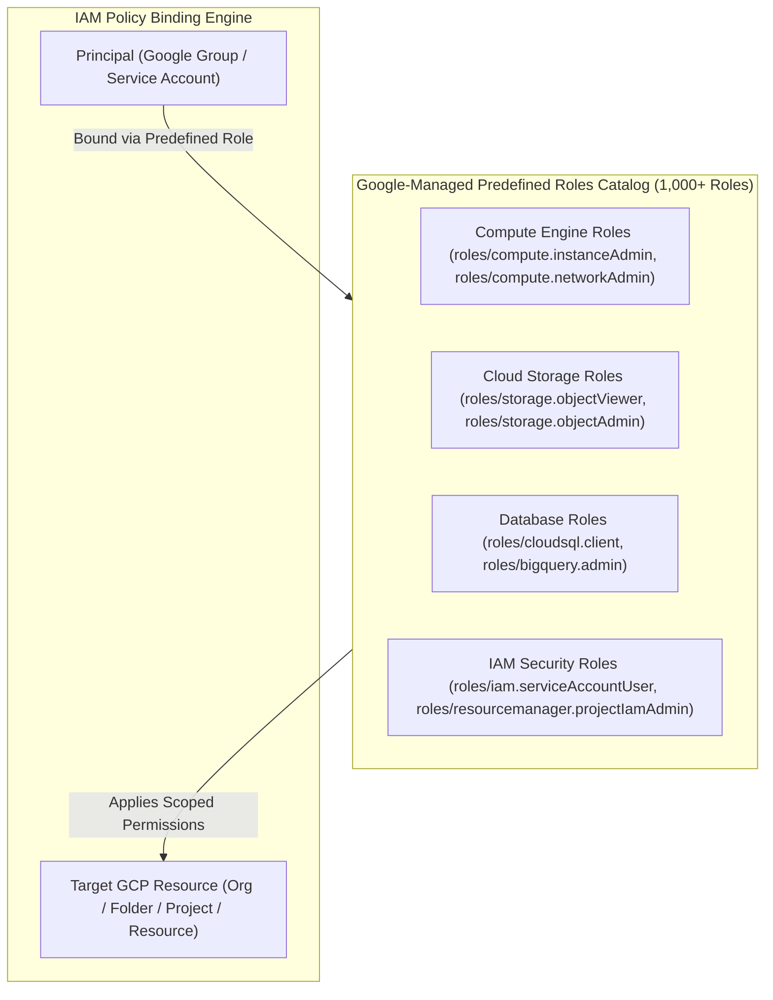

# Topic 21: Predefined Roles

---

## 1. What Is It?

**Predefined Roles** are Google-created and Google-managed IAM roles that grant fine-grained, service-specific permissions across Google Cloud Platform. 

Unlike legacy Basic Roles (`Owner`, `Editor`, `Viewer`) that grant sweeping access across all services, Predefined Roles are carefully scoped to match standard enterprise job functions—such as a Network Administrator (`roles/compute.networkAdmin`), a Storage Object Viewer (`roles/storage.objectViewer`), or a BigQuery Data Editor (`roles/bigquery.dataEditor`).

Google Cloud maintains and updates Predefined Roles automatically. When GCP introduces new features or API endpoints to a service, Google automatically updates the relevant Predefined Roles with the necessary atomic permissions without requiring manual intervention from cloud administrators.

### Real-World Analogy
Think of Predefined Roles like specialized trade toolkits issued by a factory manager. Instead of giving a worker a single master keycard that opens every door in the building (Basic Role), the manager issues a **Plumber's Toolkit** (Predefined Role) that contains only wrenches, pipes, and valves necessary for plumbing work. When the factory upgrades its plumbing fixtures, the manufacturer automatically sends updated tools for the plumber's toolkit.

---

## 2. Where Does It Fit?

Predefined Roles represent the primary, recommended access control standard for enterprise production workloads across the GCP Resource Hierarchy.



---

## 3. Core Concepts

| Predefined Role Name | Role Identifier ID | Scoped Permissions Included | Typical Use Case |
|---|---|---|---|
| **Compute Instance Admin (v1)** | `roles/compute.instanceAdmin.v1` | Full control over VMs, disks, and snapshots; cannot modify VPC networks. | Compute infrastructure engineers managing VM lifecycles. |
| **Storage Object Viewer** | `roles/storage.objectViewer` | `storage.objects.get`, `storage.objects.list`. Read-only object access. | Applications or analysts reading files from Cloud Storage buckets. |
| **BigQuery Data Editor** | `roles/bigquery.dataEditor` | Create, update, and delete tables/datasets; cannot manage BigQuery IAM. | Data pipelines loading streaming data into BigQuery tables. |
| **Service Account User** | `roles/iam.serviceAccountUser` | `iam.serviceAccounts.actAs`. Allows attaching a service account to a VM/Run. | DevOps engineers deploying apps that run under a specific Service Account. |
| **Secret Manager Secret Accessor** | `roles/secretmanager.secretAccessor` | `secretmanager.versions.access`. Access raw payload of secret versions. | Microservices retrieving API keys/passwords at runtime. |

---

## 4. How It Works

Google Cloud manages the underlying permission arrays for Predefined Roles behind the scenes:

```text
Google Cloud Engineering releases new Cloud Storage feature (e.g., Dual-Region Auto-Recovery)
              ↓
Google updates internal Predefined Role definitions (e.g., adds storage.buckets.update)
              ↓
Principal assigned roles/storage.admin inherits new permission automatically
              ↓
User executes gcloud storage buckets update -> Allowed instantly without admin maintenance
```

1. **Service Isolation**: A `roles/storage.objectAdmin` role grants full control over storage objects, but zero access to Compute VMs, Cloud SQL databases, or IAM policies.
2. **Maintenance-Free Upkeep**: Administrators do not need to manually edit role permission arrays when GCP updates API versions.

---

## 5. Production Scenario

### Enforcing Least-Privilege Microservice & DevOps Roles

```text
Requirement: Configure IAM access for a continuous delivery pipeline deploying containerized APIs to Cloud Run.
    ↓
Architecture: Dedicated CI/CD Service Account `sa-cloudbuild-deployer@prod-proj.iam.gserviceaccount.com`.
    ↓
Role Assignment Strategy:
  - `roles/run.developer` (Allows creating and updating Cloud Run service revisions).
  - `roles/artifactregistry.writer` (Allows pushing container images to Artifact Registry).
  - `roles/iam.serviceAccountUser` (Allows attaching the runtime service account to Cloud Run).
    ↓
Security: Service account has ZERO permissions to modify firewall rules, delete storage buckets, or manage IAM.
    ↓
Monitoring: Cloud Audit Logs recording Cloud Run service revision updates by the deployment service account.
```

*Why Selected*: Combining multi-service Predefined Roles grants exact operational capabilities required for automated deployments without exposing critical network or project security settings.

---

## 6. Hands-On Lab

### Prerequisites
- Active GCP Project.
- Access to Cloud Shell or `gcloud` CLI.
- IAM permissions: `roles/resourcemanager.projectIamAdmin`.

### Console Method
1. Log into [Google Cloud Console](https://console.cloud.google.com/).
2. Navigate to **IAM & Admin** → **Roles**.
3. In the search bar, type `Storage Object`.
4. Observe the list of Predefined Roles: `Storage Object Admin`, `Storage Object Creator`, `Storage Object Viewer`.
5. Click `Storage Object Viewer` to view its detailed page.
6. Inspect the **Included permissions** list (`storage.objects.get`, `storage.objects.list`).
7. Navigate to **IAM & Admin** → **IAM** → Click **GRANT ACCESS**.
8. Assign `roles/storage.objectViewer` to a target test group or user.

### CLI Method
Inspect and bind Predefined Roles using `gcloud`:

```bash
# Set project context
PROJECT_ID="your-gcp-project-id"
TARGET_GROUP="group:gcp-analysts@yourdomain.com"

# 1. Search for available Predefined Roles related to BigQuery
gcloud iam roles list --filter="name:roles/bigquery*" --format="table(name, title)"

# 2. Inspect the exact atomic permissions inside a Predefined Role
gcloud iam roles describe roles/bigquery.dataViewer

# 3. Add Predefined Role binding to a Google Group
gcloud projects add-iam-policy-binding $PROJECT_ID \
    --member=$TARGET_GROUP \
    --role="roles/bigquery.dataViewer"
```

### Verification
*Expected Result*: Output confirms `roles/bigquery.dataViewer` is bound to the target group in the project IAM policy.

### Cleanup
Remove test role binding:

```bash
gcloud projects remove-iam-policy-binding $PROJECT_ID \
    --member=$TARGET_GROUP \
    --role="roles/bigquery.dataViewer"
```

---

## 7. Security

### Least Privilege & Role Combination
- **Avoid Over-Privileged Predefined Roles**: Some predefined roles (e.g., `roles/compute.admin` or `roles/resourcemanager.projectIamAdmin`) are still very broad. Select narrow roles (e.g., `roles/compute.viewer`, `roles/compute.networkAdmin`) when possible.
- **Role Combination Pattern**: Grant multiple narrow Predefined Roles to a principal rather than selecting one oversized role.

```text
BAD PRACTICE:
Granting `roles/compute.admin` to a network engineer who only needs to manage VPC subnets and firewall rules.
Risk: Network engineer accidentally deletes or restarts production Compute Engine VM instances.

PRODUCTION PRACTICE:
Grant `roles/compute.networkAdmin` (allows network/firewall management) without compute instance management capabilities.
```

---

## 8. Scaling & High Availability

Managing Predefined Roles at Scale:

```text
Basic Roles (3 Coarse Roles - Over-privileged)
   ↓ (Standard Enterprise Production Pattern)
Predefined Roles (1,000+ Google-Managed Roles - Maintenance-free, service-scoped)
   ↓ (Hyper-Specific Regulatory Compliance)
Custom Roles (Manually managed atomic permissions arrays)
```

- **95%+ Production Coverage**: Predefined Roles satisfy more than 95% of all enterprise security requirements without needing the maintenance overhead of Custom Roles.

---

## 9. Cost

### Operational Cost Benefits
- **Zero Management Overhead**: Predefined Roles cost $0 and require zero maintenance when Google updates underlying service APIs.
- **Loss Prevention**: Restricting developers to Predefined Roles (e.g., `roles/run.developer` instead of `roles/editor`) prevents unauthorized creation of expensive standalone infrastructure.

---

## 10. Monitoring & Troubleshooting

### Predefined Role Auditing Tools
- **IAM Role Search**: Search roles by specific atomic permissions using `gcloud iam roles list --filter="includedPermissions:storage.objects.get"`.
- **Cloud Audit Logs**: Audit permissions requested by failed API operations (`protoPayload.status.message`).

### Troubleshooting Matrix

| Symptom | Possible Cause | What to Check | Fix |
|---|---|---|---|
| User cannot attach Service Account to VM | Missing `roles/iam.serviceAccountUser` role | Cloud Audit Logs for `iam.serviceAccounts.actAs` | Grant `roles/iam.serviceAccountUser` on the target Service Account. |
| Developer cannot create VPC subnets | Granted `roles/compute.instanceAdmin.v1` which excludes network permissions | Included permissions in `roles/compute.instanceAdmin.v1` | Add `roles/compute.networkAdmin` to the developer's group. |
| Predefined Role missing desired new permission | Feature newly launched in preview state | `gcloud iam roles describe <role>` | Temporarily grant a secondary predefined role or create a temporary Custom Role. |

---

## 11. Common Mistakes

```text
Mistake: Assuming a Predefined Role named `Admin` (e.g., `roles/storage.admin`) grants Project Owner or IAM management rights.
Why: Misunderstanding that service admins are scoped strictly to that specific service API.
Impact: Confusion when a Storage Admin cannot modify project firewall rules or add new IAM users.
Correct approach: Recognize that Predefined Admin roles manage resources *within that service only*, not project-level settings.

Mistake: Creating unnecessary Custom Roles for standard job functions already covered by Predefined Roles.
Why: Overlooking Google's extensive library of 1,000+ Predefined Roles.
Impact: High administrative maintenance toil when Google updates service APIs.
Correct approach: Search Google's Predefined Role catalog (`gcloud iam roles list`) before building custom roles.
```

---

## 12. Production Best Practices

- [ ] Adopt Predefined Roles as the standard default access control model across all projects.
- [ ] Combine multiple narrow Predefined Roles rather than selecting one oversized primitive role.
- [ ] Assign Predefined Roles exclusively to Google Groups or Service Accounts.
- [ ] Use `roles/iam.serviceAccountUser` to control which users can attach service accounts to workloads.
- [ ] Audit Predefined Role assignments regularly using Cloud Asset Inventory and Security Command Center.
- [ ] Automate all Predefined Role bindings using Infrastructure as Code (Terraform).

---

## 13. Hyperscaler / Enterprise Perspective

```text
Personal / Learning
  Basic Roles (Owner/Editor) → Manual assignment → Single project
        ↓
Small Production
  Standard Predefined Roles (`roles/compute.admin`, `roles/storage.admin`) → Direct group bindings
        ↓
Enterprise Environment
  Granular Predefined Roles (`roles/compute.networkAdmin`, `roles/run.developer`) → Terraform Module Automation -> IAM Policy Sinks
        ↓
Hyperscaler Environment
  Least-Privilege Predefined Role Bundles → Automated CI/CD Deployment Roles → Policy-as-Code Static Analysis → JIT Privileged Access
```

In a hyperscaler environment, security teams maintain a pre-approved catalog of Predefined Role bundles for standard persona profiles (e.g., `Profile-Backend-Developer`, `Profile-Data-Analyst`). CI/CD service accounts receive exact Predefined Roles required for build/deploy stages, preventing any single pipeline from holding excessive cloud control.

---

## 14. Real Project Questions

### Q1: Why are Predefined Roles preferred over Custom Roles for most enterprise GCP deployments?
**Answer:** Predefined Roles are maintained and updated automatically by Google Cloud. When Google introduces new API features or endpoints to a service, Google updates the relevant Predefined Roles with the required permissions. Custom Roles require manual maintenance by customer security teams whenever Google updates underlying APIs.

### Q2: What is the purpose of the `roles/iam.serviceAccountUser` Predefined Role?
**Answer:** The `roles/iam.serviceAccountUser` role grants a principal permission to "act as" or attach a specific Service Account to a compute resource (VM, Cloud Run, GKE). Without this role, a developer cannot attach a privileged Service Account to a VM, preventing unauthorized privilege escalation.

### Q3: How do Predefined Roles enforce the Principle of Least Privilege better than Basic Roles?
**Answer:** Basic Roles (`Owner`, `Editor`, `Viewer`) grant coarse access across *all* GCP services in a project simultaneously. Predefined Roles scope permissions to specific service domains (e.g., Cloud Storage only, BigQuery only) and job functions (read-only vs. admin), limiting access strictly to what is required for a specific role.

---

## 15. Quick Decision Guide

| Requirement | Recommended Approach | Reason |
|---|---|---|
| Developer needs to deploy containerized APIs to Cloud Run | **`roles/run.developer` (Predefined Role)** | Scoped specifically to Cloud Run development without granting compute VM or network admin access. |
| Application needs to read and write database rows in Cloud SQL | **`roles/cloudsql.client` (Predefined Role)** | Grants minimum permissions required to connect and query Cloud SQL instances. |
| Need to restrict access to a single atomic API permission not in any predefined role | **Custom Role** | Use Custom Roles only when no Predefined Role satisfies hyper-specific compliance constraints. |

### When should I use it?
- Standard, recommended role selection for 95%+ of all production GCP authorization policies.

### When should I NOT use it?
- Do not use primitive Basic Roles when Predefined Roles exist for the target service.

---

## 16. Related Services

```text
              [21. Predefined Roles]
               /        |        \
        Basic Roles  Custom Roles  Cloud IAM
         (Legacy)   (Customer-Refined) Engine
            |           |             |
        Coarse App   Atomic Perms  Policy Bindings
```

- **Basic Roles**: Legacy primitive roles replaced by Predefined Roles.
- **Custom Roles**: Customer-created roles for unique permission combinations.
- **Cloud IAM Engine**: Evaluates Predefined Role bindings against incoming API calls.

---

## 17. Cheat Sheet

### Common Predefined Roles
- `roles/compute.instanceAdmin.v1` : Full Compute Engine VM control.
- `roles/compute.networkAdmin` : Full VPC network and firewall control.
- `roles/storage.objectViewer` : Read-only Cloud Storage object access.
- `roles/storage.objectAdmin` : Full Cloud Storage object control.
- `roles/bigquery.dataEditor` : Create/Update/Delete BigQuery tables.
- `roles/iam.serviceAccountUser` : Attach Service Account to resources.

### Useful Commands
```bash
# List predefined roles for a service
gcloud iam roles list --filter="name:roles/storage*" --format="table(name, title)"

# Inspect permissions inside a predefined role
gcloud iam roles describe roles/storage.objectViewer

# Bind predefined role to a group
gcloud projects add-iam-policy-binding PROJECT_ID \
    --member="group:devs@company.com" \
    --role="roles/storage.objectViewer"
```

---

## 18. Learning Connection

- **Previous Topic**: [20. Basic Roles](../20-basic-roles/README.md)
- **Next Topic**: [22. Custom Roles](../22-custom-roles/README.md)
