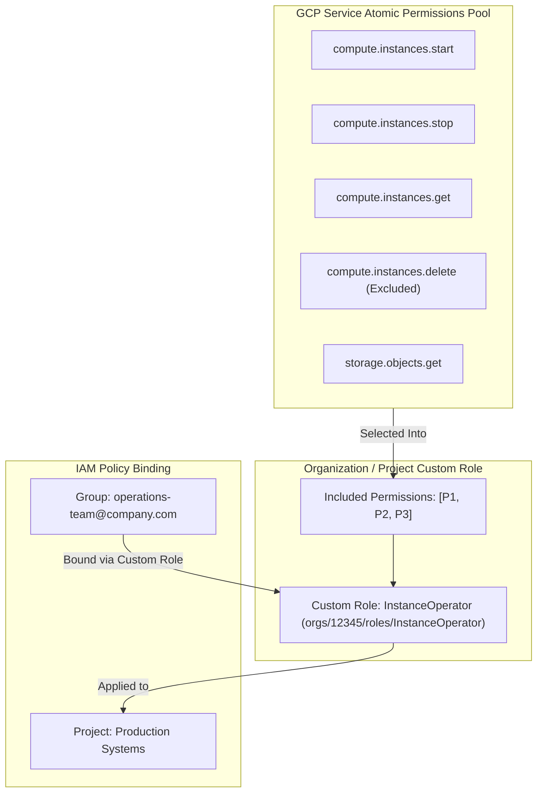

# Topic 22: Custom Roles

---

## 1. What Is It?

A **Custom Role** in Google Cloud IAM is a user-defined role created by security administrators to grant a hyper-specific, tailored set of atomic permissions that are not satisfied by existing Google-managed Predefined Roles.

While Google provides over 1,000 Predefined Roles, organizations with strict regulatory compliance requirements (such as PCI-DSS, HIPAA, or SOC 2) may require restricting access even further—for example, granting a user permission to *start* and *stop* a virtual machine (`compute.instances.start`, `compute.instances.stop`) without giving them permission to *delete* VMs or modify boot disks.

Custom Roles can be defined at either the **Project** or **Organization** level across your GCP Resource Hierarchy.

### Real-World Analogy
Think of a Custom Role like asking a locksmith to craft a custom key that opens *only* the side office door and the supply closet, but deliberately excludes the master deadbolt to the main server room. While standard off-the-shelf keys (Predefined Roles) open logical sets of doors, a Custom Role is precision-cut to open only the exact door locks specified on your blueprint.

---

## 2. Where Does It Fit?

Custom Roles sit at the most granular level of the IAM role hierarchy, allowing organizations to assemble custom arrays of individual atomic API permissions.



---

## 3. Core Concepts

| Custom Role Attribute | Description | Values / Examples | Constraint / Rule |
|---|---|---|---|
| **Role ID** | Unique identifier for the custom role within the Org or Project. | `InstanceOperator`, `CustomStorageWriter` | Cannot be changed after creation. |
| **Title & Description** | Human-readable name and documentation explaining the role's purpose. | `Instance Operator Role` | Used in Console UI listings. |
| **Included Permissions** | Array of atomic GCP permissions included in the custom role. | `["compute.instances.start", "compute.instances.stop"]` | Must be valid, non-deprecated atomic permissions. |
| **Stage (Lifecycle)** | Current operational state of the custom role definition. | `ALPHA`, `BETA`, `GA`, `DEPRECATED`, `DISABLED` | `GA` (Generally Available) recommended for production. |
| **Scope Level** | Administrative boundary where the Custom Role is defined. | Project Scope (`projects/ID/roles/NAME`) or Org Scope (`organizations/ID/roles/NAME`) | Cannot be created at Folder level. |

---

## 4. How It Works

Lifecycle and maintenance of Custom Roles require customer-driven operational management:

```text
Security Team defines Custom Role YAML (Title, ID, Included Permissions)
              ↓
Executes gcloud iam roles create at Organization or Project scope
              ↓
Custom Role registered in GCP Resource Manager IAM Catalog
              ↓
Bound to Principals via IAM Policies (gcloud projects add-iam-policy-binding)
              ↓
Google Cloud releases new API feature → Customer MUST manually update Custom Role permissions array
```

1. **Manual Maintenance**: Google does NOT automatically add new API permissions to Custom Roles when new service features launch.
2. **Permission Compatibility**: Not all GCP atomic permissions can be included in Custom Roles (some permissions are restricted to Google-managed roles).

---

## 5. Production Scenario

### Regulatory Least-Privilege Operability for PCI-DSS Compliance

```text
Requirement: Grant Tier-1 Helpdesk operators permission to restart impaired Compute Engine VMs in production without allowing VM creation, deletion, or disk modification.
    ↓
Architecture: Create an Organization-level Custom Role `orgs/1029384756/roles/Tier1VmOperator`.
    ↓
Permissions Array:
  - `compute.instances.get`
  - `compute.instances.list`
  - `compute.instances.reset`
  - `compute.instances.start`
  - `compute.instances.stop`
    ↓
Security: Explicitly exclude `compute.instances.delete`, `compute.instances.create`, and `compute.disks.create`.
    ↓
Assignment: Bound to Google Workspace Group `group:helpdesk-tier1@company.com` on Production Folders.
    ↓
Monitoring: Cloud Audit Logs tracking all `compute.instances.reset` actions performed by helpdesk operators.
```

*Why Selected*: No Predefined Role exists that grants VM restart capabilities while completely stripping VM creation/deletion rights. A Custom Role enforces strict PCI-DSS least-privilege compliance.

---

## 6. Hands-On Lab

### Prerequisites
- Active GCP Project.
- Access to Cloud Shell or `gcloud` CLI.
- IAM permissions: `roles/iam.roleAdmin` or `roles/resourcemanager.projectIamAdmin`.

### Console Method
1. Log into [Google Cloud Console](https://console.cloud.google.com/).
2. Navigate to **IAM & Admin** → **Roles**.
3. Click **CREATE ROLE** at top.
4. Set Title: `VM Operator Lite`, Role ID: `VmOperatorLite`, Stage: `General Availability`.
5. Click **+ ADD PERMISSIONS**.
6. Filter and select the following atomic permissions:
   - `compute.instances.get`
   - `compute.instances.list`
   - `compute.instances.start`
   - `compute.instances.stop`
7. Click **ADD** → Click **CREATE**.
8. Navigate to **IAM & Admin** → **IAM** → Grant `VM Operator Lite` to a test principal.

### CLI Method
Create and manage a Custom Role using a YAML definition file and `gcloud`:

```bash
# Set project context
PROJECT_ID="your-gcp-project-id"
ROLE_ID="VmRestarter"

# 1. Create a Custom Role YAML definition file
cat <<EOF > custom-role.yaml
title: "VM Restarter Role"
description: "Grants permission to view and restart Compute VMs only."
stage: "GA"
includedPermissions:
  - compute.instances.get
  - compute.instances.list
  - compute.instances.reset
EOF

# 2. Create the Custom Role at Project Scope
gcloud iam roles create $ROLE_ID \
    --project=$PROJECT_ID \
    --file=custom-role.yaml

# 3. Describe the newly created Custom Role
gcloud iam roles describe $ROLE_ID --project=$PROJECT_ID

# 4. Add an additional permission to the Custom Role
gcloud iam roles update $ROLE_ID \
    --project=$PROJECT_ID \
    --add-permissions="compute.instances.start,compute.instances.stop"
```

### Verification
*Expected Result*: `gcloud iam roles describe` returns the updated role detailing all 5 included permissions in `GA` stage.

### Cleanup
Delete (disable) the custom role:

```bash
gcloud iam roles delete $ROLE_ID --project=$PROJECT_ID --quiet
```

---

## 7. Security

### Custom Role Maintenance & Risks
- **Maintenance Burden**: If Google updates an API or deprecates a permission included in a Custom Role, the Custom Role may break or miss new security capabilities.
- **Auditing Custom Roles**: Periodically audit Custom Roles to ensure they do not accumulate unintended permissions over time (role bloat).
- **Scope Level Selection**: Define Custom Roles at the **Organization Level** (`orgs/ID/roles/NAME`) for enterprise reusability across multiple projects.

```text
BAD PRACTICE:
Creating hundreds of individual Project-level Custom Roles for minor permission variations across different teams.
Risk: High administrative toil, unmaintainable permission sprawl, and broken role definitions when APIs evolve.

PRODUCTION PRACTICE:
Use Predefined Roles for 95%+ of access control. Reserve Custom Roles for regulatory compliance gaps, defining them at the Organization level via Terraform.
```

---

## 8. Scaling & High Availability

Custom Role Limitations & Scale:

```text
Project-Scoped Custom Role (`projects/ID/roles/Name` - Isolated to 1 project)
   ↓ (Enterprise Reusability Shift)
Organization-Scoped Custom Role (`organizations/ID/roles/Name` - Reusable across all projects)
   ↓ (Infrastructure as Code Governance)
Terraform-Managed Custom Roles (`google_organization_iam_custom_role`)
```

- **Not Supported at Folder Scope**: Custom Roles can ONLY be created at the Organization or Project level—they cannot be created directly at the Folder scope.
- **Testing Stages**: Mark experimental custom roles as `ALPHA` or `BETA` before promoting to `GA` (General Availability).

---

## 9. Cost

### Financial Considerations
- **100% Free Core Feature**: Creating and assigning Custom Roles incurs zero direct GCP charges.
- **Maintenance Overhead Cost**: The real cost of Custom Roles is the human engineering hours required to test, update, and maintain permission arrays over time as GCP APIs evolve.

---

## 10. Monitoring & Troubleshooting

### Custom Role Auditing Tools
- `gcloud iam roles describe` : Inspect included permissions and lifecycle stage.
- **Cloud Audit Logs**: Filter by `protoPayload.methodName="google.iam.admin.v1.CreateRole"` to audit Custom Role modifications.

### Troubleshooting Matrix

| Symptom | Possible Cause | What to Check | Fix |
|---|---|---|---|
| `Permission is not eligible for custom roles` error | The atomic permission is restricted to Google-managed roles | GCP Custom Role documentation | Remove ineligible permission or use a Predefined Role. |
| Custom Role fails after GCP API update | Google introduced a new mandatory permission for the API | Cloud Audit Logs for missing permission | Run `gcloud iam roles update --add-permissions` to append new permission. |
| Cannot create Custom Role at Folder level | GCP IAM does not support Folder-scoped Custom Roles | Role creation command scope | Create Custom Role at Organization level (`--organization=ID`) instead. |

---

## 11. Common Mistakes

```text
Mistake: Creating Custom Roles at the Project level for every small project team.
Why: Shortcut taken without organization-level administrative rights.
Impact: Massive configuration drift; identical custom roles duplicated across dozens of projects.
Correct approach: Create reusable Custom Roles at the Organization level (`orgs/ORG_ID/roles/ROLE_NAME`).

Mistake: Creating a Custom Role that duplicates an existing Predefined Role.
Why: Failing to search the 1,000+ Predefined Role catalog before building a custom role.
Impact: Unnecessary maintenance burden for permissions Google already manages automatically.
Correct approach: Always check `gcloud iam roles list` to confirm no Predefined Role satisfies the requirement.
```

---

## 12. Production Best Practices

- [ ] Use Predefined Roles first; create Custom Roles ONLY when a strict compliance gap exists.
- [ ] Define Custom Roles at the **Organization Level** (`orgs/ORG_ID/roles/ROLE_NAME`) for enterprise-wide reusability.
- [ ] Set Custom Role stage to `GA` (General Availability) for production workloads.
- [ ] Document the business justification and target persona for every Custom Role.
- [ ] Manage all Custom Role definitions in Git using Terraform (`google_organization_iam_custom_role`).
- [ ] Conduct bi-annual reviews of Custom Role permission arrays to remove deprecated permissions.

---

## 13. Hyperscaler / Enterprise Perspective

```text
Personal / Learning
  Project-scoped Custom Role → Created via Console UI → Manual permission lists
        ↓
Small Production
  A few Project-level Custom Roles → gcloud script updates → Basic documentation
        ↓
Enterprise Environment
  Organization-level Custom Roles → Managed 100% via Terraform → Version-controlled in Git
        ↓
Hyperscaler Environment
  Policy-as-Code Enforced Custom Roles → Automated API Deprecation Checkers → CI/CD Pipeline Static Analysis → Regular Least-Privilege Audits
```

In a hyperscaler environment, Custom Roles are strictly controlled. Security teams define Organization-level Custom Roles using Terraform modules versioned in Git. Automated CI/CD bots scan for deprecated API permissions, while security policies mandate using Predefined Roles unless an approved architectural exception ticket justifies a Custom Role.

---

## 14. Real Project Questions

### Q1: When should an enterprise security team choose a Custom Role over a Predefined Role?
**Answer:** An enterprise should choose a Custom Role only when existing Google-managed Predefined Roles grant excessive permissions that breach regulatory compliance (e.g., PCI-DSS, HIPAA) or internal security policies. If no Predefined Role provides the exact narrow subset of permissions required, a Custom Role is created to strip unneeded permissions.

### Q2: What is the main operational disadvantage of using Custom Roles instead of Predefined Roles?
**Answer:** The main operational disadvantage is maintenance toil. Google automatically updates Predefined Roles when new API features or endpoints are launched. Custom Roles are unmanaged by Google; customer security teams must manually track, update, and test Custom Role permission arrays whenever GCP introduces new API requirements.

### Q3: At what levels of the GCP Resource Hierarchy can Custom Roles be created?
**Answer:** Custom Roles can ONLY be created at the **Organization** level (`organizations/ORG_ID/roles/ROLE_NAME`) or the **Project** level (`projects/PROJECT_ID/roles/ROLE_NAME`). Custom Roles cannot be created at the Folder level.

---

## 15. Quick Decision Guide

| Requirement | Recommended Approach | Reason |
|---|---|---|
| Need standard compute VM administration permissions | **`roles/compute.instanceAdmin.v1` (Predefined Role)** | Fully managed by Google; zero maintenance required when Compute APIs update. |
| Regulated Helpdesk team needs to restart VMs but must be blocked from deleting disks | **Organization-level Custom Role** | Precision-scoped to include `compute.instances.reset` while excluding disk/instance deletion. |
| Testing an experimental permission combination in a single sandbox project | **Project-level Custom Role (Stage: BETA)** | Keeps experimental role isolated to the sandbox project without affecting org catalog. |

### When should I use it?
- Use when strict compliance, audit, or least-privilege requirements cannot be met by Predefined Roles.

### When should I NOT use it?
- Do not create Custom Roles for standard job functions already covered by Google Predefined Roles.

---

## 16. Related Services

```text
                 [22. Custom Roles]
                  /       |       \
          Predefined    Cloud    Terraform
            Roles        IAM     IaC Provider
              |           |           |
          Standard     Policy      Git-Ops
          Catalogs    Bindings    Management
```

- **Predefined Roles**: Standard Google-managed roles evaluated before creating Custom Roles.
- **Cloud IAM**: Engine that binds Custom Roles to principals.
- **Terraform Provider**: Automated tool for declaring organization custom roles in code.

---

## 17. Cheat Sheet

### Scope URIs
- Organization Scope: `organizations/ORG_ID/roles/ROLE_ID`
- Project Scope: `projects/PROJECT_ID/roles/ROLE_ID`

### Lifecycle Stages
- `ALPHA`, `BETA`, `GA` (General Availability), `DEPRECATED`, `DISABLED`.

### Useful Commands
```bash
# Create a custom role from a YAML file
gcloud iam roles create ROLE_ID --project=PROJECT_ID --file=role-def.yaml

# Describe a project custom role
gcloud iam roles describe ROLE_ID --project=PROJECT_ID

# Add permissions to an existing custom role
gcloud iam roles update ROLE_ID --project=PROJECT_ID --add-permissions="compute.instances.start"

# Delete (disable) a custom role
gcloud iam roles delete ROLE_ID --project=PROJECT_ID
```

---

## 18. Learning Connection

- **Previous Topic**: [21. Predefined Roles](../21-predefined-roles/README.md)
- **Next Topic**: [23. IAM Policies](../23-iam-policies/README.md)
