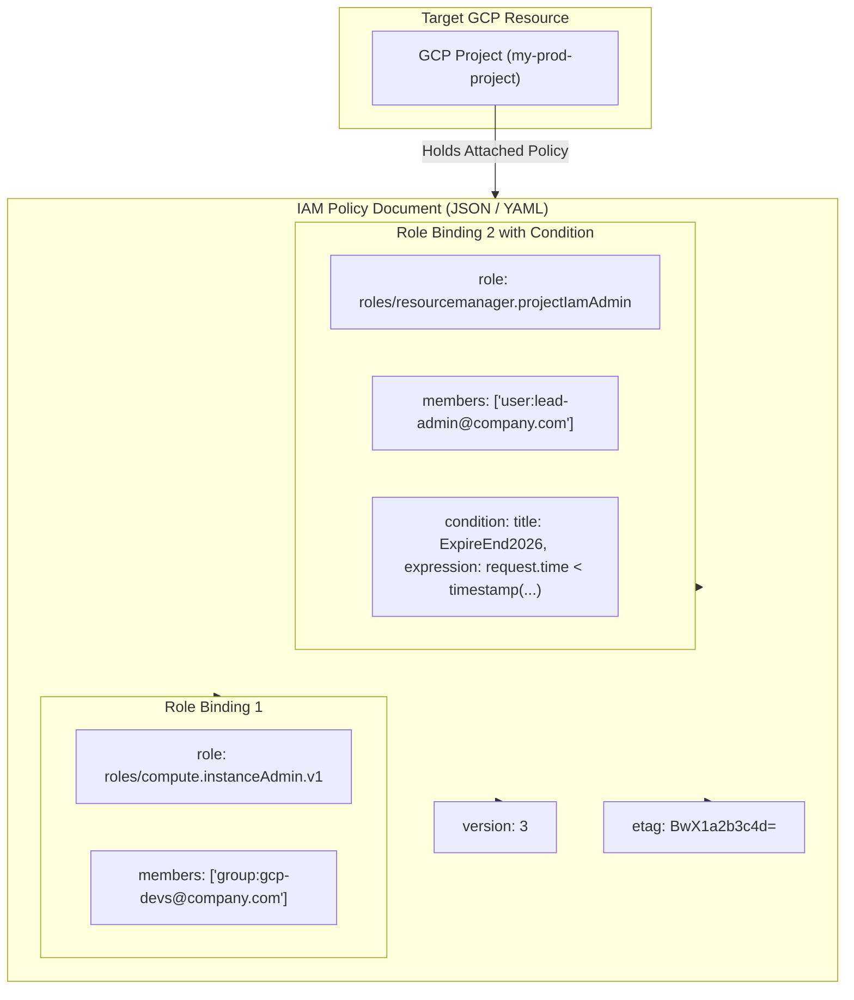

# Topic 23: IAM Policies

---

## 1. What Is It?

An **IAM Policy** in Google Cloud Platform is a structured JSON or YAML document attached to a GCP resource (Organization, Folder, Project, Bucket, VM) that defines **who** has **what roles** on that specific resource.

An IAM Policy consists of a collection of **bindings**. Each binding links one or more **principals** (users, groups, service accounts, domains) to a single **role**, and can optionally include an **IAM Condition** specifying under what exact circumstances the role assignment is valid (e.g., time window, requesting IP, resource name prefix).

### Real-World Analogy
Think of an IAM Policy like an official access register mounted on the wall right next to a secure building entrance. The register lists authorized groups and individuals (Principals) alongside their specific access badges (Roles) and rules (Conditions)—for example: *"The Engineering Group holds Building Admin keys between 8:00 AM and 5:00 PM on weekdays."*

---

## 2. Where Does It Fit?

IAM Policies are attached directly to nodes in the GCP Resource Hierarchy and individual supporting cloud resources, providing the declarative rules for the Cloud IAM Evaluation Engine.



---

## 3. Core Concepts

| Policy Element | Description | Example Value | Best Practice |
|---|---|---|---|
| **`version`** | Specifies the syntax version of the IAM policy schema. | `version: 3` | Always use `version: 3` to support IAM Conditions. |
| **`bindings[]`** | Array of role-to-members assignments. | `[ { "role": "roles/viewer", "members": [...] } ]` | Group members logically under appropriate predefined roles. |
| **`role`** | The GCP role string being granted in the binding. | `roles/storage.objectAdmin` | Prefer Predefined Roles over basic roles. |
| **`members[]`** | List of principal strings receiving the role. | `["group:devs@company.com", "serviceAccount:sa@..."]` | Use `group:` prefixes for human users. |
| **`condition`** | CEL (Common Expression Language) logic restricting binding. | `request.time < timestamp("2026-12-31T23:59:59Z")` | Use for time-bound or context-aware access. |
| **`etag`** | Cryptographic hash ensuring optimistic concurrency control. | `etag: "BwX1a2b3c4d="` | Required when replacing entire policies to prevent race conditions. |

---

## 4. How It Works

Modifying and evaluating IAM Policies follows strict concurrency and inheritance rules:

```text
Operator issues gcloud projects set-iam-policy or Terraform apply
              ↓
GCP API checks etag string to ensure policy was not modified by another admin concurrently
              ↓
New IAM Policy attached to target Resource (Project / Bucket / Folder)
              ↓
User API Request arrives → IAM Engine evaluates:
  Combined policy = (Org Policy) UNION (Folder Policy) UNION (Project Policy) UNION (Resource Policy)
              ↓
If ANY policy in the hierarchy grants requested role → ALLOWED (Unless blocked by Deny Policy)
```

1. **Optimistic Concurrency**: The `etag` prevents two administrators from accidentally overwriting each other's policy edits simultaneously.
2. **Additive Inheritance**: Policy bindings at lower levels add to, but cannot subtract from, policy bindings at higher levels.

---

## 5. Production Scenario

### Time-Bound Emergency Break-Glass IAM Policy

```text
Requirement: Grant temporary `roles/owner` break-glass access to Lead Architect for 4 hours during an active production outage.
    ↓
Architecture: IAM Policy Binding with a CEL Condition attached to `user:lead-architect@company.com`.
    ↓
CEL Condition Expression:
  ```cel
  request.time >= timestamp("2026-08-08T12:00:00Z") &&
  request.time <= timestamp("2026-08-08T16:00:00Z")
  ```
    ↓
Security: Elevated privileges automatically expire at 16:00:00Z without requiring manual admin intervention.
    ↓
Monitoring: Cloud Audit Logs recording all operations executed under the conditional break-glass window.
```

*Why Selected*: Uses IAM Policy Conditions to enforce automatic privilege expiration, eliminating the risk of forgotten elevated credentials remaining active indefinitely.

---

## 6. Hands-On Lab

### Prerequisites
- Active GCP Project.
- Access to Cloud Shell or `gcloud` CLI.
- IAM permissions: `roles/resourcemanager.projectIamAdmin`.

### Console Method
1. Log into [Google Cloud Console](https://console.cloud.google.com/).
2. Navigate to **IAM & Admin** → **IAM**.
3. Locate a test principal → Click **EDIT PRINCIPAL** (Pencil Icon).
4. Click **ADD CONDITION** below an assigned role.
5. Set Condition Title: `Expire-End-Of-Month`.
6. Set Condition Type: **Date/Time** → Select End Date.
7. Click **SAVE** → Click **SAVE** on the IAM page.
8. Observe the clock icon next to the role binding indicating an active IAM Condition.

### CLI Method
Fetch, modify, and set an IAM Policy safely using `gcloud`:

```bash
# Set project variable
PROJECT_ID="your-gcp-project-id"

# 1. Export current project IAM policy to a local JSON file (Includes etag)
gcloud projects get-iam-policy $PROJECT_ID --format="json" > policy.json

# 2. Safely add a role binding using high-level CLI wrapper (Handles etag automatically)
gcloud projects add-iam-policy-binding $PROJECT_ID \
    --member="group:gcp-qa-team@yourdomain.com" \
    --role="roles/viewer"

# 3. Add a role binding WITH an IAM Condition using gcloud
gcloud projects add-iam-policy-binding $PROJECT_ID \
    --member="user:temp-contractor@yourdomain.com" \
    --role="roles/storage.objectViewer" \
    --condition='title=TempAccess,expression=request.time < timestamp("2026-12-31T23:59:59Z")'
```

### Verification
*Expected Result*: Querying the IAM policy returns `version: 3` and displays the `condition` block under the specified role binding.

### Cleanup
Remove test bindings using `gcloud projects remove-iam-policy-binding`.

---

## 7. Security

### Etag Concurrency & Race Condition Vulnerabilities
- **Policy Overwrites**: Using `gcloud projects set-iam-policy policy.json` without updating the `etag` can silently erase role bindings added by other team members between your fetch and set operations.
- **`add-iam-policy-binding` vs `set-iam-policy`**: Always use additive helper commands (`add-iam-policy-binding`) or Terraform `google_project_iam_member` resources in production scripts to prevent overwriting whole policies.

```text
BAD PRACTICE:
Fetching an IAM policy JSON, manually editing text, and pushing it back via `set-iam-policy` without concurrency checks.
Risk: Silently overwrites and deletes security policy bindings added by other admins concurrently.

PRODUCTION PRACTICE:
Use atomic member-level IaC resources (`google_project_iam_member` in Terraform) or CLI wrappers (`add-iam-policy-binding`) that handle concurrency safely.
```

---

## 8. Scaling & High Availability

Terraform IAM Resource Patterns for Scale:

```text
`google_project_iam_policy` (Authoritative for ENTIRE project policy - Overwrites all bindings - HIGH RISK)
   ↓ (Better Concurrency)
`google_project_iam_binding` (Authoritative for a SPECIFIC ROLE - Overwrites members in that role)
   ↓ (Safest Production Pattern)
`google_project_iam_member` (Additive for a SPECIFIC PRINCIPAL + ROLE - Zero overwrite risk - BEST PRACTICE)
```

- **Use `google_project_iam_member`**: In multi-team Terraform setups, always use `google_project_iam_member` so different feature modules can manage permissions independently without clobbering each other's policy bindings.

---

## 9. Cost

### Operational Efficiency
- **100% Free Core Feature**: Managing IAM Policies costs $0.
- **Automated Expire Conditions**: Using IAM Conditions for temporary access eliminates administrative hours spent tracking manual access revocations.

---

## 10. Monitoring & Troubleshooting

### IAM Policy Observability Tools
- **Cloud Audit Logs**: Filter by `protoPayload.methodName="SetIamPolicy"` to trace all IAM policy modifications.
- **IAM Policy Troubleshooter**: Interactively test why an API call was allowed or denied based on attached IAM policies.

### Troubleshooting Matrix

| Symptom | Possible Cause | What to Check | Fix |
|---|---|---|---|
| `etag mismatch` error when running `set-iam-policy` | Policy was modified by another user/process since you fetched it | Export latest policy to get new `etag` | Fetch latest policy JSON, apply edits, and resubmit with fresh `etag`. |
| Conditional IAM binding not granting expected access | System time mismatch or invalid CEL expression in condition | IAM Policy Troubleshooter | Test condition expression in Policy Troubleshooter; check timezone UTC settings. |
| Terraform `apply` deleted all manual IAM bindings | Used `google_project_iam_policy` (authoritative full policy) | Terraform code resource type | Replace `google_project_iam_policy` with `google_project_iam_member` resources. |

---

## 11. Common Mistakes

```text
Mistake: Using authoritative `google_project_iam_policy` or `google_project_iam_binding` in multi-team Terraform repos.
Why: Assuming authoritative resource types are safer.
Impact: Terraform silently purges all IAM bindings managed outside that single code file.
Correct approach: Use additive `google_project_iam_member` resources for all production Terraform IAM code.

Mistake: Forgetting to specify `version: 3` when editing IAM policies containing conditions.
Why: Omitting policy version field in raw JSON files.
Impact: GCP API rejects condition blocks or strips them upon saving.
Correct approach: Always set `"version": 3` at the top of JSON IAM policy documents.
```

---

## 12. Production Best Practices

- [ ] Use `google_project_iam_member` in Terraform for safe, non-authoritative additive policy management.
- [ ] Use `gcloud projects add-iam-policy-binding` instead of replacing full policy JSON files manually.
- [ ] Implement IAM Conditions for temporary break-glass or time-bound access requirements.
- [ ] Set `"version": 3` in all custom JSON/YAML IAM policy templates.
- [ ] Enable Cloud Audit Logs for `SetIamPolicy` API calls to track policy modifications.
- [ ] Use IAM Policy Troubleshooter to diagnose permission evaluation issues across complex hierarchies.

---

## 13. Hyperscaler / Enterprise Perspective

```text
Personal / Learning
  Console UI role assignment → Direct user email bindings → No etag handling
        ↓
Small Production
  `gcloud add-iam-policy-binding` scripts → Basic conditional access
        ↓
Enterprise Environment
  GitOps-driven `google_project_iam_member` Terraform code → Automated `SetIamPolicy` Audit Logging
        ↓
Hyperscaler Environment
  100% Policy-as-Code (OPA / Sentinel) → Real-Time IAM Policy Drift Detection → Just-In-Time (JIT) Conditional IAM Auto-Provisioning
```

In a hyperscaler environment, IAM policies are never modified manually. Infrastructure as Code pipelines enforce `google_project_iam_member` resource patterns to allow multi-tenant feature teams to manage access safely. Automated drift detection bots monitor `SetIamPolicy` audit logs, alerting security teams if any un-versioned manual policy modifications occur.

---

## 14. Real Project Questions

### Q1: What is the difference between authoritative and additive IAM resource types in Terraform?
**Answer:** Authoritative resource types (`google_project_iam_policy` and `google_project_iam_binding`) overwrite the entire project policy or entire role member list upon apply, purging any bindings not declared in that specific code file. Additive resource types (`google_project_iam_member`) append individual principal-role pairs without touching existing policy bindings, preventing accidental permission deletion in multi-team environments.

### Q2: How does optimistic concurrency control using `etag` prevent race conditions in IAM policies?
**Answer:** Every IAM policy contains an `etag` string representing a cryptographic hash of its current state. When an admin submits a policy update, GCP compares the submitted `etag` against the live `etag`. If another process modified the policy in the interim, the `etag` values mismatch and GCP rejects the update, preventing silent overwrites.

### Q3: How do IAM Conditions enhance security for temporary administrative access?
**Answer:** IAM Conditions attach Common Expression Language (CEL) rules to role bindings (such as restricting validity to a specific start/end timestamp or requesting IP range). Once the condition's expiration timestamp passes, Cloud IAM automatically denies access without requiring a security admin to manually run a policy removal script.

---

## 15. Quick Decision Guide

| Requirement | Recommended Approach | Reason |
|---|---|---|
| Adding a new team member to an existing project role via Terraform | **`google_project_iam_member`** | Additive resource; will not overwrite existing IAM policy bindings created by other teams. |
| Temporary 4-hour administrative access during a production incident | **IAM Policy Binding with Date/Time Condition** | Automatically revokes elevated permissions when the expiration timestamp is reached. |
| Preventing concurrent admins from overwriting each other's policy changes | **`etag` validation via `add-iam-policy-binding`** | Enforces optimistic concurrency control during API update requests. |

### When should I use it?
- Essential mechanism for defining, versioning, and enforcing access rules on every GCP resource.

### When should I NOT use it?
- Do not use full policy replacement scripts (`set-iam-policy`) without strict etag handling.

---

## 16. Related Services

```text
               [23. IAM Policies]
              /        |        \
        Cloud IAM   IAM Policy  Security
         Engine    Troubleshooter Command Center
            |          |             |
        Access Evaluation Diagnostics Policy Drift Alerts
```

- **Cloud IAM Engine**: Evaluates attached IAM policy JSON documents.
- **IAM Policy Troubleshooter**: Diagnoses access evaluation results across policies.
- **Cloud Audit Logs**: Records all `SetIamPolicy` modifications.

---

## 17. Cheat Sheet

### Policy Schema (Version 3)
```json
{
  "version": 3,
  "etag": "BwX1a2b3c4d=",
  "bindings": [
    {
      "role": "roles/storage.objectViewer",
      "members": ["group:devs@company.com"],
      "condition": {
        "title": "TempAccess",
        "expression": "request.time < timestamp('2026-12-31T23:59:59Z')"
      }
    }
  ]
}
```

### Useful Commands
```bash
# Get project IAM policy
gcloud projects get-iam-policy PROJECT_ID --format="json" > policy.json

# Add additive IAM policy binding
gcloud projects add-iam-policy-binding PROJECT_ID \
    --member="group:devs@company.com" --role="roles/viewer"

# Set entire project IAM policy (Requires etag)
gcloud projects set-iam-policy PROJECT_ID policy.json
```

---

## 18. Learning Connection

- **Previous Topic**: [22. Custom Roles](../22-custom-roles/README.md)
- **Next Topic**: [24. Organization Policies](../24-organization-policies/README.md)
