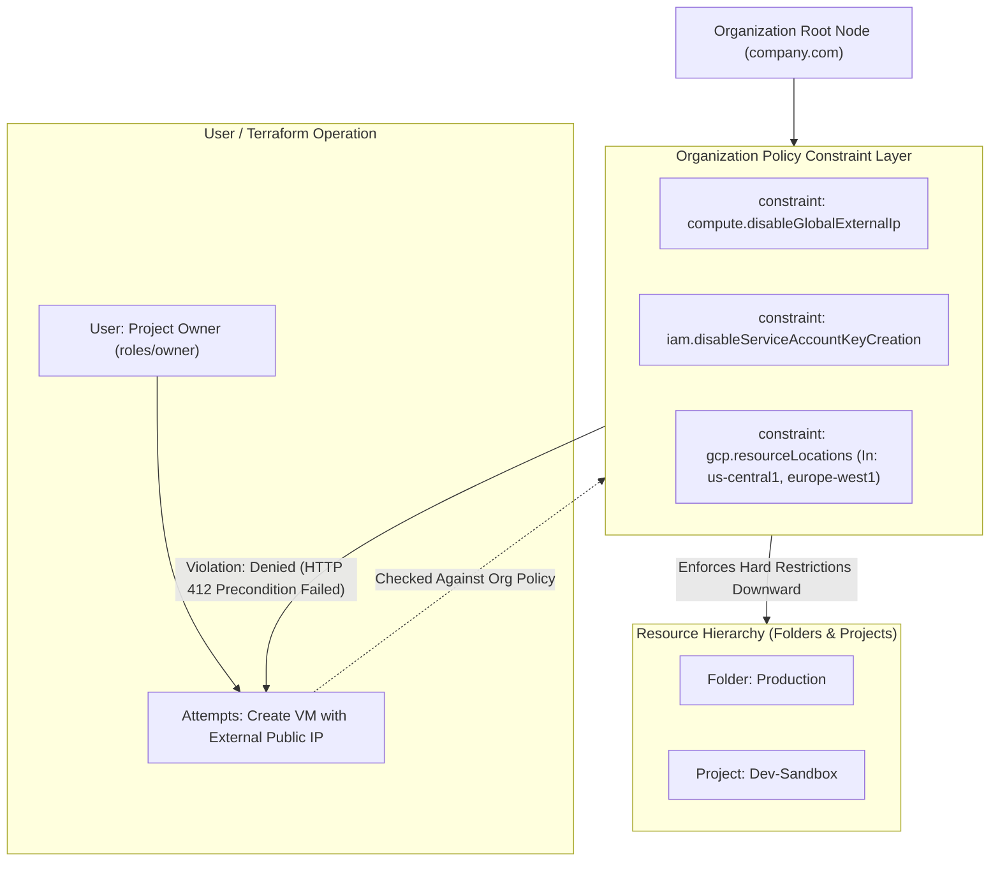

# Topic 24: Organization Policies

---

## 1. What Is It?

A GCP **Organization Policy** (Org Policy) is a centralized security and compliance governance framework that enforces strict constraints on how Google Cloud resources can be configured across your entire Resource Hierarchy (Organization, Folders, and Projects).

While Cloud IAM controls **WHO** can do **WHAT** (identity authorization), Organization Policies control **WHAT CAN OR CANNOT BE DONE** to cloud resources, regardless of who is making the request or how elevated their IAM permissions are.

Even a user holding full `roles/owner` or `roles/editor` permissions on a project cannot create a public IP address or deploy a VM into an unauthorized region if an Organization Policy constraint explicitly prohibits it.

### Real-World Analogy
Think of an Organization Policy like the physical safety governor installed on a commercial delivery truck's engine. No matter how senior the driver (IAM Owner) is, or how much authority their driver's license grants them, the physical engine governor prevents the truck from exceeding 60 MPH under any circumstances.

---

## 2. Where Does It Fit?

Organization Policies sit at the absolute top of the GCP governance stack, overriding IAM permissions and preventing non-compliant resource configurations.



---

## 3. Core Concepts

| Constraint Type | Mechanism | Example Constraint ID | Business Function |
|---|---|---|---|
| **Boolean Constraint** | Enforces a hard `TRUE` or `FALSE` rule on a resource property. | `constraints/compute.disableGlobalExternalIp` | Prevents VMs from being assigned public IPv4 addresses. |
| **List Constraint** | Enforces an `ALLOW` or `DENY` list of specific values. | `constraints/gcp.resourceLocations` | Restricts resource deployment strictly to approved geographic regions. |
| **Dry-Run Mode** | Audits policy violations without blocking deployment operations. | `dryRun: true` in policy spec | Tests new security guardrails in production safely before full enforcement. |
| **Policy Inheritance** | Policies set at higher nodes cascade down to all child folders/projects. | Root Org -> Folder -> Project | Child nodes inherit parent rules; can add restrictions but cannot relax them unless allowed. |
| **Reset / Inherit** | Restores child node behavior to match parent policy settings. | `inheritFromParent: true` | Clears custom project-level overrides. |

---

## 4. How It Works

Enforcement of Organization Policies occurs at the API Gateway level prior to resource allocation:

```text
User / Terraform submits gcloud compute instances create with Public IP
              ↓
API Gateway checks user IAM permissions -> ALLOWED (User is Project Owner)
              ↓
API Gateway evaluates Organization Policy constraints on target Project:
  Evaluates constraints/compute.disableGlobalExternalIp
              ↓
Constraint Status: ENFORCED (True)
              ↓
API Gateway rejects operation with HTTP 412 Precondition Failed
"Operation blocked by Organization Policy: compute.disableGlobalExternalIp"
```

1. **Pre-Execution Denial**: Org policies block non-compliant resource creation *before* any infrastructure is provisioned or billed.
2. **Immutable Guardrails**: Project Owners cannot modify or delete Organization Policies unless explicitly granted the `roles/orgpolicy.policyAdmin` role at the Org scope.

---

## 5. Production Scenario

### Enterprise FinOps & Zero-Trust Landing Zone Guardrails

```text
Requirement: Enforce strict data residency, block public VM IPs, and eliminate long-lived service account keys across 200 projects.
    ↓
Architecture: Configure top-level Organization Policy constraints on Organization Root (`organizations/1029384756`).
    ↓
Enforced Constraints:
  - `constraints/gcp.resourceLocations` -> ALLOW `in:us-locations`
  - `constraints/compute.disableGlobalExternalIp` -> ENFORCED
  - `constraints/iam.disableServiceAccountKeyCreation` -> ENFORCED
  - `constraints/iam.allowedPolicyMemberDomains` -> ALLOW `C01234567` (Company Domain ID)
    ↓
Security: Blocks personal `@gmail.com` invites, unapproved overseas deployments, and key leaks.
    ↓
Monitoring: Security Command Center auditing policy violation events in real time.
```

*Why Selected*: Establishes automated security guardrails that protect the enterprise against data exfiltration and compliance breaches without requiring manual code reviews for every single project.

---

## 6. Hands-On Lab

### Prerequisites
- Active GCP Organization Node (linked to Cloud Identity / Google Workspace).
- IAM permissions: `roles/orgpolicy.policyAdmin` at Organization root.
- Cloud Shell or `gcloud` CLI.

### Console Method
1. Log into [Google Cloud Console](https://console.cloud.google.com/).
2. Select your **Organization** in the top Project Selector.
3. Navigate to **IAM & Admin** → **Organization Policies**.
4. In the search filter, type `Disable service account key creation`.
5. Select `constraints/iam.disableServiceAccountKeyCreation`.
6. Click **EDIT POLICY** at top.
7. Choose **Enforcement** → Select **On** (Enforced).
8. Click **SAVE**.
9. Test enforcement: Try to create a key file for a service account in any project → Observe the red error message blocking key creation.

### CLI Method
Query and enforce Organization Policies using `gcloud`:

```bash
# Set Organization ID
ORG_ID=$(gcloud organizations list --format="value(name)")

# 1. Describe current policy status for resource locations constraint
gcloud org-policies describe constraints/gcp.resourceLocations --organization=$ORG_ID

# 2. Enforce boolean constraint blocking public IP creation at Org level
cat <<EOF > disable-public-ip.yaml
name: organizations/$ORG_ID/policies/compute.disableGlobalExternalIp
spec:
  rules:
  - enforce: true
EOF

gcloud org-policies set-policy disable-public-ip.yaml

# 3. Restrict allowed GCP deployment regions using a List Constraint
cat <<EOF > location-policy.yaml
name: organizations/$ORG_ID/policies/gcp.resourceLocations
spec:
  rules:
  - values:
      allowedValues:
      - in:us-locations
EOF

gcloud org-policies set-policy location-policy.yaml
```

### Verification
*Expected Result*: Querying `gcloud org-policies describe` returns `enforce: true` for the target constraint.

### Cleanup
To reset a policy back to default:

```bash
gcloud org-policies delete constraints/compute.disableGlobalExternalIp --organization=$ORG_ID
```

---

## 7. Security

### Identity vs Guardrail Security
- **IAM (Who)**: Controls identity access (e.g., "Alice can create Compute VMs").
- **Org Policy (What)**: Controls resource limits (e.g., "VMs created in this folder CANNOT have public IPs").
- **Policy Overrides**: Strictly control `roles/orgpolicy.policyAdmin`. Do NOT grant this role to developers or project owners.

```text
BAD PRACTICE:
Relying solely on IAM permissions to prevent public storage bucket creation or unapproved overseas data deployment.
Risk: An compromised or rogue Project Owner can bypass IAM guidelines and create public infrastructure.

PRODUCTION PRACTICE:
Enforce Organization Policy constraints at the Organization Root to establish hard security guardrails that override all project owners.
```

---

## 8. Scaling & High Availability

Dry-Run Policy Testing for Enterprise Scale:

```text
New Org Policy Constraint Requirement (e.g., Block public IP creation)
   ↓ (Deploy in Dry-Run Mode first)
`spec.dryRunSpec.rules: [{enforce: true}]` (Audits violations in SCC without breaking active apps)
   ↓ (Analyze Log Violations)
Identify & Exempt Exceptions (Add policy override rules for specific edge proxy projects)
   ↓ (Full Production Enforcement)
`spec.rules: [{enforce: true}]` (Hard enforcement active)
```

- **Dry-Run Mode**: Always test new Organization Policies in `dryRun` mode first to identify legacy applications that would break before turning on hard enforcement.

---

## 9. Cost

### FinOps Governance via Org Policies
- **$0 Direct Cost**: Organization Policy enforcement is a free core feature of GCP.
- **Cost Cap Guardrails**: Use `constraints/gcp.resourceLocations` to block deployment into expensive overseas regions, or restrict VM instance families to cheaper machine types (e.g., `e2` series).

---

## 10. Monitoring & Troubleshooting

### Org Policy Audit Tools
- **Security Command Center (SCC)**: Real-time dashboard of Organization Policy violations and dry-run audit alerts.
- **Cloud Audit Logs**: Filter by `protoPayload.status.code=9` (`FAILED_PRECONDITION`) to identify blocked operations.

### Troubleshooting Matrix

| Symptom | Possible Cause | What to Check | Fix |
|---|---|---|---|
| `HTTP 412 Precondition Failed` error when creating VM | Action blocked by active Organization Policy constraint | Audit Logs `protoPayload.status.message` | Use compliant configuration (e.g., remove public IP request) or request Org Policy exception. |
| Cannot create Service Account JSON key | Constraint `iam.disableServiceAccountKeyCreation` active | `gcloud org-policies describe` | Use keyless Workload Identity or request temporary exemption for the specific project. |
| Dry-run warnings filling logs | Policy active in `dryRunSpec` mode | Security Command Center dashboard | Remediate non-compliant resources and promote dry-run policy to full enforcement. |

---

## 11. Common Mistakes

```text
Mistake: Granting `roles/orgpolicy.policyAdmin` to project owners or developers.
Why: Shortcut taken to allow teams to bypass restrictions when needed.
Impact: Project owners delete or override Organization Policies, invalidating enterprise security guardrails.
Correct approach: Restrict `roles/orgpolicy.policyAdmin` strictly to central Security Infrastructure teams.

Mistake: Enabling strict Organization Policies globally without using Dry-Run mode first.
Why: Deploying security guardrails directly to production without testing.
Impact: Breaks active deployment pipelines and production auto-scaling scripts unexpectedly.
Correct approach: Deploy new constraints in `dryRun` mode for 14 days to observe violation logs before enforcing.
```

---

## 12. Production Best Practices

- [ ] Enforce core security constraints at the Organization Root:
  - `constraints/compute.disableGlobalExternalIp`
  - `constraints/iam.disableServiceAccountKeyCreation`
  - `constraints/iam.allowedPolicyMemberDomains`
  - `constraints/gcp.resourceLocations`
- [ ] Use **Dry-Run Mode** (`dryRunSpec`) to test new constraints before full enforcement.
- [ ] Restrict `roles/orgpolicy.policyAdmin` exclusively to central Security Governance teams.
- [ ] Manage all Organization Policy declarations in Git using Terraform (`google_org_policy_policy`).
- [ ] Monitor policy violation events using Security Command Center.
- [ ] Create documented approval exception workflows for project-level policy overrides.

---

## 13. Hyperscaler / Enterprise Perspective

```text
Personal / Learning (No Org)
  No Organization Policies → Manual Console ClickOps → Zero guardrails
        ↓
Small Production
  Enforced basic Org Policies (Disable SA Keys) → Applied manually via Console
        ↓
Enterprise Environment
  Folder-level Org Policy Overrides → Dry-Run Policy Evaluation → Centralized SCC Violation Sinks
        ↓
Hyperscaler Environment
  100% Policy-as-Code Terraform Repository → Automated CI/CD Guardrail Pipelines → Automated Anomaly Remediation Bots
```

In a hyperscaler environment, Organization Policies form the "Landing Zone Guardrails". Infrastructure pipelines automatically enforce zero public IP policies, block unapproved geographic regions, and ban static service account keys across thousands of projects, allowing developers to build inside safe sandbox boundaries without risking compliance breaches.

---

## 14. Real Project Questions

### Q1: What is the fundamental difference between an IAM Policy and an Organization Policy?
**Answer:** An IAM Policy manages **identity authorization** (WHO can do WHAT on a resource). An Organization Policy manages **resource configuration guardrails** (WHAT CAN OR CANNOT be done to a resource). Organization Policies override IAM permissions; even a Project Owner holding `roles/owner` cannot perform an action if an Organization Policy explicitly blocks it.

### Q2: How does Dry-Run mode assist enterprise security teams when rolling out new Organization Policies?
**Answer:** Dry-Run mode (`dryRunSpec`) evaluates incoming API requests against proposed policy constraints without blocking non-compliant operations. Violations are logged to Security Command Center and Cloud Audit Logs, allowing security teams to identify legacy applications that would break and grant necessary exemptions before switching to full enforcement.

### Q3: What happens when an Organization Policy is defined at the Org Root and a conflicting policy is defined on a sub-folder?
**Answer:** By default, child folders inherit constraints from parent nodes. If a child folder defines a custom policy rule, it can add further restrictions (stricter rules) or override list constraints if the parent policy explicitly allows inheritance overrides (`inheritFromParent: true`). Boolean constraints set to `ENFORCED` at the root cannot be relaxed by sub-folders unless a explicit exception policy is applied by an Org Policy Admin.

---

## 15. Quick Decision Guide

| Requirement | Recommended Approach | Reason |
|---|---|---|
| Prevent all developers across 200 projects from creating public IP addresses | **`constraints/compute.disableGlobalExternalIp` (Org Policy)** | Enforces hard automated guardrail across all current and future projects. |
| Restrict cloud data storage strictly to US datacenters for GDPR compliance | **`constraints/gcp.resourceLocations` set to `in:us-locations`** | Blocks resource creation in non-US regions at the API Gateway level. |
| Test a new security restriction without breaking existing production apps | **Deploy Org Policy in `dryRun` mode** | Logs policy violations to SCC for auditing without blocking active operations. |

### When should I use it?
- Essential security governance feature for establishing landing zones, compliance boundaries, and enterprise guardrails.

### When should I NOT use it?
- Do not use Organization Policies to manage individual user permissions—use Cloud IAM Policies instead.

---

## 16. Related Services

```text
            [24. Organization Policies]
             /           |           \
      Cloud IAM   Security Command  Resource Manager
     Permissions      Center            Hierarchy
          |              |                  |
      Identity       Violation        Root / Folders
    Authorization     Auditing         Scope Base
```

- **Cloud IAM**: Managed identity access framework overridden by Org Policies.
- **Security Command Center (SCC)**: Audits Organization Policy violations.
- **Resource Manager**: Hierarchy tree where Org Policies cascade downward.

---

## 17. Cheat Sheet

### Top Production Constraints
- `compute.disableGlobalExternalIp` : Blocks VM public IP creation.
- `iam.disableServiceAccountKeyCreation` : Blocks JSON key downloads.
- `iam.allowedPolicyMemberDomains` : Restricts IAM to corporate domain IDs.
- `gcp.resourceLocations` : Restricts geographic deployment regions.

### Useful Commands
```bash
# Describe an org policy constraint
gcloud org-policies describe constraints/compute.disableGlobalExternalIp --organization=ORG_ID

# Set an org policy from a YAML file
gcloud org-policies set-policy policy.yaml

# Delete an org policy override
gcloud org-policies delete constraints/compute.disableGlobalExternalIp --organization=ORG_ID
```

---

## 18. Learning Connection

- **Previous Topic**: [23. IAM Policies](../23-iam-policies/README.md)
- **Next Topic**: [25. Service Account Keys](../25-service-account-keys/README.md)
