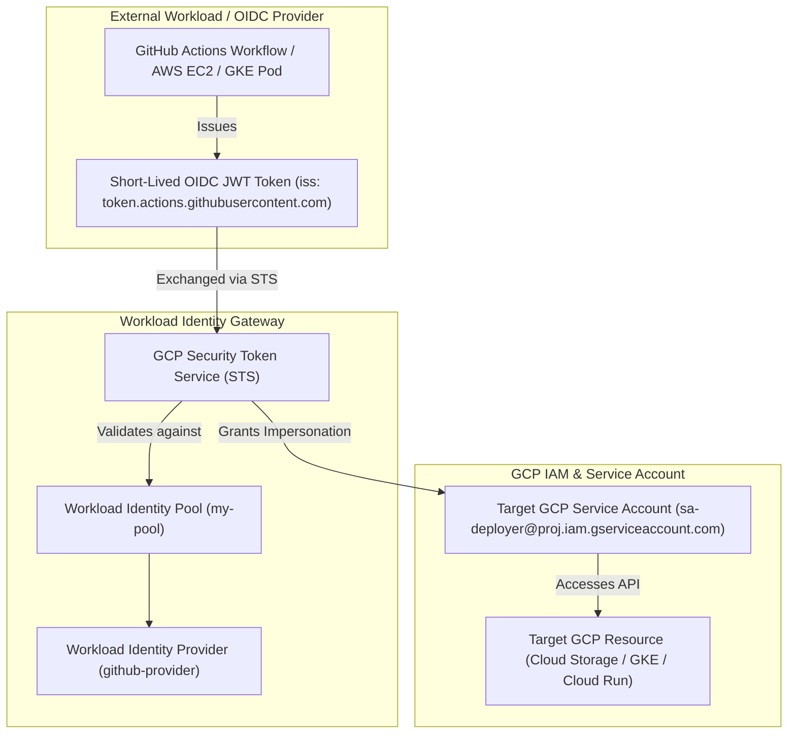

# Topic 26: Workload Identity

---

## 1. What Is It?

**Workload Identity** is the recommended keyless authentication mechanism in Google Cloud that allows workloads—running inside Kubernetes clusters (GKE Workload Identity) or external non-GCP environments like AWS, Azure, or GitHub Actions (Workload Identity Federation)—to securely access GCP APIs without downloading or managing Service Account JSON key files.

Workload Identity establishes a secure trust relationship between external OpenID Connect (OIDC) or SAML 2.0 Identity Providers and Google Cloud IAM.

Instead of storing 10-year static JSON keys, external workloads exchange short-lived OIDC tokens for short-lived (60-minute) Google Cloud OAuth2 access tokens on demand.

### Real-World Analogy
Think of Workload Identity like an international diplomatic passport exchange protocol. Instead of issuing a permanent physical entry visa valid for 10 years (JSON key file), the GCP Border Guard (Workload Identity Pool) inspects a verified 5-minute passport issued by an allied foreign country (GitHub Actions or AWS OIDC). Once verified, GCP grants a temporary 1-hour visitor pass to accomplish a specific task, which automatically expires when done.

---

## 2. Where Does It Fit?

Workload Identity sits at the perimeter between external application runtimes (GKE Pods, GitHub CI/CD, AWS EC2) and GCP Cloud IAM, translating external identity assertions into native GCP OAuth2 tokens.



---

## 3. Core Concepts

| Element | Description | Example / Syntax | Best Practice |
|---|---|---|---|
| **GKE Workload Identity** | Binds Kubernetes Service Accounts (KSA) directly to GCP Service Accounts (GSA). | `iam.gke.io/gcp-service-account: gsa-name@...` | Mandate for all GKE clusters; eliminates node pool key sharing. |
| **Workload Identity Pool** | Logical container managing trust relationships for external identity providers. | `projects/123/locations/global/workloadIdentityPools/github-pool` | Create 1 Pool per external provider system (GitHub, AWS, Azure). |
| **Workload Identity Provider** | Defines specific IdP metadata (Issuer URL, Audience, Attribute Mappings). | `https://token.actions.githubusercontent.com` | Map repository names (`attribute.repository`) to restrict access. |
| **Attribute Mapping** | Maps external OIDC claim assertions to GCP IAM attributes. | `google.subject=assertion.sub, attribute.repository=assertion.repository` | Restrict impersonation to specific GitHub repositories or branches. |
| **Security Token Service (STS)** | GCP service that exchanges external OIDC tokens for temporary GCP tokens. | `sts.googleapis.com` | Handled automatically by client SDKs and GitHub Actions. |

---

## 4. How It Works

Authentication via Workload Identity Federation follows a 4-step token exchange flow:

```text
External Workload (GitHub Actions runner) initiates deployment step
              ↓
GitHub OIDC Provider issues short-lived OIDC ID Token (JWT)
              ↓
Runner calls GCP Security Token Service (STS) with OIDC JWT
              ↓
STS validates JWT signature against GitHub's public OIDC keys & checks Pool Attribute Mappings
              ↓
STS issues temporary Federated GCP Token
              ↓
Runner calls IAM Credentials API to impersonate target GCP Service Account
              ↓
GCP issues 60-minute OAuth2 Access Token for API execution
```

1. **Zero Key Storage**: Neither GitHub nor GCP stores any static private keys.
2. **Cryptographic Validation**: Authentication relies on public-key OIDC signature verification (`https://token.actions.githubusercontent.com/.well-known/openid-configuration`).

---

## 5. Production Scenario

### Keyless GitHub Actions CI/CD Deployment Pipeline

```text
Requirement: Deploy containerized microservices from GitHub Actions to Cloud Run without storing JSON key files in GitHub Secrets.
    ↓
Step 1 (Pool Setup): Create Workload Identity Pool `github-actions-pool` and Provider `github-provider`.
    ↓
Step 2 (Attribute Restriction): Map `attribute.repository` to restrict access strictly to `org/repo-backend`.
    ↓
Step 3 (IAM Binding): Grant `roles/iam.workloadIdentityUser` on `sa-cloudrun-deployer@prod.iam.gserviceaccount.com` to `principalSet://.../attribute.repository/org/repo-backend`.
    ↓
Step 4 (GitHub Workflow):
  ```yaml
  - uses: google-github-actions/auth@v2
    with:
      workload_identity_provider: 'projects/123/locations/global/workloadIdentityPools/github-pool/providers/github-provider'
      service_account: 'sa-cloudrun-deployer@prod.iam.gserviceaccount.com'
  ```
    ↓
Monitoring: Cloud Audit Logs recording keyless federated logins by GitHub Actions workflows.
```

*Why Selected*: Ensures that even if a developer leaks their GitHub Secrets, zero static GCP credentials can be stolen. Workload Identity restricts deployment privileges strictly to official GitHub workflows running from the specific repository.

---

## 6. Hands-On Lab

### Prerequisites
- Active GCP Project.
- Cloud Shell or `gcloud` CLI.
- IAM permissions: `roles/iam.workloadIdentityUser` and `roles/iam.serviceAccountAdmin`.

### Console Method (GKE Workload Identity)
1. Log into [Google Cloud Console](https://console.cloud.google.com/).
2. Navigate to **Kubernetes Engine** → **Clusters**.
3. Click **CREATE** (or select existing cluster).
4. Under **Security** settings, enable **Workload Identity**.
5. Select or enter the Workload Identity Pool (e.g., `PROJECT_ID.svc.id.goog`).
6. Annotate your Kubernetes Service Account (KSA) in YAML to map to the target GCP Service Account (GSA):
   ```yaml
   apiVersion: v1
   kind: ServiceAccount
   metadata:
     name: my-ksa
     annotations:
       iam.gke.io/gcp-service-account: sa-gsa@PROJECT_ID.iam.gserviceaccount.com
   ```

### CLI Method (Workload Identity Federation for GitHub)
Configure Workload Identity Federation for GitHub Actions via `gcloud`:

```bash
# Set project variables
PROJECT_ID="your-gcp-project-id"
PROJECT_NUMBER=$(gcloud projects describe $PROJECT_ID --format="value(projectNumber)")
POOL_NAME="github-pool"
PROVIDER_NAME="github-provider"
REPO_PATH="your-org/your-repo"
SA_EMAIL="sa-deployer@${PROJECT_ID}.iam.gserviceaccount.com"

# 1. Create a Workload Identity Pool
gcloud iam workload-identity-pools create $POOL_NAME \
    --location="global" \
    --display-name="GitHub Actions Pool"

# 2. Create a Workload Identity Provider inside the Pool
gcloud iam workload-identity-pools providers create-oidc $PROVIDER_NAME \
    --location="global" \
    --workload-identity-pool=$POOL_NAME \
    --issuer-uri="https://token.actions.githubusercontent.com" \
    --allowed-audiences="https://iam.googleapis.com/projects/${PROJECT_NUMBER}/locations/global/workloadIdentityPools/${POOL_NAME}/providers/${PROVIDER_NAME}" \
    --attribute-mapping="google.subject=assertion.sub,attribute.repository=assertion.repository"

# 3. Allow GitHub repository to impersonate target GCP Service Account
gcloud iam service-accounts add-iam-policy-binding $SA_EMAIL \
    --role="roles/iam.workloadIdentityUser" \
    --member="principalSet://iam.googleapis.com/projects/${PROJECT_NUMBER}/locations/global/workloadIdentityPools/${POOL_NAME}/attribute.repository/${REPO_PATH}"
```

### Verification
*Expected Result*: Output confirms IAM policy binding between the target GCP Service Account and the GitHub repository attribute principal set.

### Cleanup
Delete test pool and provider:

```bash
gcloud iam workload-identity-pools delete $POOL_NAME --location="global" --quiet
```

---

## 7. Security

### Attribute Mapping Restrictions
- **Always Restrict Claims**: Never bind `roles/iam.workloadIdentityUser` to `principalSet://.../*` (all workloads). Always restrict attribute mappings to specific repositories (`assertion.repository`), AWS accounts (`assertion.arn`), or Kubernetes namespaces.
- **Audience Verification**: Set `allowed-audiences` to prevent cross-account OIDC token reuse attacks.

```text
BAD PRACTICE:
Binding Workload Identity User role to `principal://iam.googleapis.com/.../subject/*` without checking the repository claim.
Risk: Allows ANY GitHub repository in the world to impersonate your GCP Service Account.

PRODUCTION PRACTICE:
Map `attribute.repository=assertion.repository` and bind IAM impersonation strictly to your specific repository path (`attribute.repository/my-org/my-repo`).
```

---

## 8. Scaling & High Availability

Federation Topology across Clouds:

```text
Static JSON Key Exports (Banned in Production - High Risk)
   ↓ (GKE Native Solution)
GKE Workload Identity (`iam.gke.io` annotation - Keyless Pod Auth)
   ↓ (Multi-Cloud / CI-CD Federation)
Workload Identity Federation (GitHub Actions, AWS EC2, Azure VMs, HashiCorp Vault)
```

- **Global High Availability**: Workload Identity Pools operate as global GCP resources (`locations/global`), ensuring multi-region availability for CI/CD deployments and multi-cloud applications.

---

## 9. Cost

### Pricing Advantages
- **100% Free Core Feature**: Workload Identity Pools, OIDC provider mappings, and STS token exchanges are provided **completely free of charge**.
- **Financial Risk Reduction**: Prevents crypto-mining hijacking charges resulting from leaked static JSON key files.

---

## 10. Monitoring & Troubleshooting

### Workload Identity Observability Tools
- **Cloud Audit Logs**: Filter by `protoPayload.serviceName="sts.googleapis.com"` to trace OIDC token exchanges.
- **Federated Log Attributes**: Audit logs display both the GCP Service Account email AND the underlying external OIDC subject claim.

### Troubleshooting Matrix

| Symptom | Possible Cause | What to Check | Fix |
|---|---|---|---|
| `401 Unauthorized` in GitHub Actions | OIDC issuer URI or audience mismatch | GitHub workflow `auth` action logs | Verify `workload_identity_provider` string and OIDC audience parameters. |
| `Permission Denied on Service Account` | Missing `roles/iam.workloadIdentityUser` binding | IAM Policy on Service Account | Add IAM binding connecting `principalSet` to target Service Account. |
| GKE Pod receives `403` from GCP APIs | KSA missing `iam.gke.io/gcp-service-account` annotation | `kubectl describe sa <ksa-name>` | Annotate KSA with target GSA email and run `gcloud iam service-accounts add-iam-policy-binding`. |

---

## 11. Common Mistakes

```text
Mistake: Forgetting to bind `roles/iam.workloadIdentityUser` on the target Service Account.
Why: Assuming creating the Workload Identity Provider automatically grants impersonation rights.
Impact: GitHub Actions or GKE Pod fails with `403 Access Denied` during STS token exchange.
Correct approach: Explicitly run `gcloud iam service-accounts add-iam-policy-binding` linking the provider attribute set to the SA.

Mistake: Mapping `google.subject` without adding `attribute.repository` or `attribute.environment` claims.
Why: Keeping attribute mappings overly simple during initial setup.
Impact: Inability to grant different permissions to different GitHub repositories or branches.
Correct approach: Map custom OIDC assertions (`attribute.repository`, `attribute.ref`) in provider settings.
```

---

## 12. Production Best Practices

- [ ] Mandate GKE Workload Identity for 100% of container workloads running on Kubernetes Engine.
- [ ] Use **Workload Identity Federation** for all external CI/CD pipelines (GitHub Actions, GitLab).
- [ ] Map and restrict OIDC attribute assertions to specific repositories, branches, or AWS ARNs.
- [ ] Restrict `allowed-audiences` to prevent cross-tenant OIDC token reuse attacks.
- [ ] Combine Workload Identity Federation with Organization Policy `constraints/iam.disableServiceAccountKeyCreation`.
- [ ] Automate all Workload Identity Pool and Provider provisioning using Terraform (`google_iam_workload_identity_pool`).

---

## 13. Hyperscaler / Enterprise Perspective

```text
Personal / Learning
  Downloaded Service Account JSON key files → Static key storage → Manual rotation
        ↓
Small Production
  Basic GKE Workload Identity → Manual gcloud setup for GitHub Actions
        ↓
Enterprise Environment
  Centralized Workload Identity Pools (AWS / Azure / GitHub) → Terraform Automation → Org Policy Key Bans
        ↓
Hyperscaler Environment
  Zero Static Keys Across All Multi-Cloud Workloads → Automated OIDC Assertion Attestation → Policy-as-Code Token Restrictions → Security Command Center Sinks
```

In a hyperscaler environment, static Service Account JSON keys are non-existent. GKE clusters enforce Workload Identity for all Pods, while multi-cloud applications running in AWS or Azure use Workload Identity Federation. CI/CD pipelines receive short-lived federated access tokens bound to verified Git commit signatures, guaranteeing enterprise-grade Zero Trust keyless security.

---

## 14. Real Project Questions

### Q1: What is the core technical benefit of Workload Identity over Service Account JSON Key files?
**Answer:** Workload Identity eliminates static, long-lived credentials completely. Instead of storing 10-year unencrypted JSON key files that can be leaked or stolen, workloads exchange short-lived OIDC tokens for 60-minute ephemeral GCP access tokens on demand. If a token is somehow intercepted, it expires automatically within minutes, eliminating long-term credential compromise risks.

### Q2: How does GKE Workload Identity bind a Kubernetes Service Account (KSA) to a GCP Service Account (GSA)?
**Answer:** GKE Workload Identity uses an internal metadata server interceptor (`gke-metadata-server`). When a Pod runs under an annotated KSA (`iam.gke.io/gcp-service-account: gsa@proj...`), the GKE metadata server intercepts local token requests, validates the Pod's Kubernetes Service Account token, and exchanges it for a short-lived OAuth2 token for the mapped GSA, bypassing node-level service accounts.

### Q3: What is the role of the Security Token Service (STS) in Workload Identity Federation?
**Answer:** The GCP Security Token Service (STS) acts as a federated token converter. It receives a signed OIDC ID token (JWT) from an external provider (such as GitHub Actions or AWS), validates the token's signature against the provider's public keys, checks the Workload Identity Pool attribute mappings, and issues a temporary GCP federated access token to the caller.

---

## 15. Quick Decision Guide

| Requirement | Recommended Approach | Reason |
|---|---|---|
| Kubernetes Pod running on GKE accessing BigQuery | **GKE Workload Identity** | Native keyless binding between KSA and GSA; zero static keys in Pod specs. |
| GitHub Actions deploying Cloud Run services | **Workload Identity Federation (OIDC)** | Keyless authentication using short-lived 60-minute tokens restricted to your repository. |
| Application running on AWS EC2 accessing Cloud Storage | **Workload Identity Federation (AWS IAM Integration)** | Exchanges AWS STS credentials for GCP OAuth2 tokens keylessly. |

### When should I use it?
- Standard, mandatory keyless authentication pattern for all GKE workloads and external non-GCP applications.

### When should I NOT use it?
- Not required for workloads running directly on Compute Engine VMs or Cloud Run (which use native Instance Metadata Servers).

---

## 16. Related Services

```text
               [26. Workload Identity]
              /           |           \
      GKE Workload    Workload Identity  Security Token
        Identity         Federation       Service (STS)
            |                 |                |
        GKE Pods       AWS / GitHub      Token Exchange
```

- **GKE Workload Identity**: Keyless authentication for Kubernetes pods on GKE.
- **Workload Identity Federation**: Keyless authentication for external OIDC/SAML workloads.
- **Security Token Service (STS)**: Token exchange engine converting external JWTs into GCP tokens.

---

## 17. Cheat Sheet

### Key Concepts
- **KSA**: Kubernetes Service Account.
- **GSA**: Google Cloud Service Account.
- **STS**: Security Token Service (Token Exchange Gateway).
- **OIDC**: OpenID Connect Protocol.

### Useful Commands
```bash
# Create a Workload Identity Pool
gcloud iam workload-identity-pools create POOL_NAME --location="global"

# Create an OIDC Provider in the Pool
gcloud iam workload-identity-pools providers create-oidc PROVIDER_NAME \
    --location="global" \
    --workload-identity-pool=POOL_NAME \
    --issuer-uri="https://token.actions.githubusercontent.com" \
    --attribute-mapping="google.subject=assertion.sub,attribute.repository=assertion.repository"

# Allow external repo to impersonate GSA
gcloud iam service-accounts add-iam-policy-binding GSA_EMAIL \
    --role="roles/iam.workloadIdentityUser" \
    --member="principalSet://iam.googleapis.com/projects/NUM/locations/global/workloadIdentityPools/POOL/attribute.repository/ORG/REPO"
```

---

## 18. Learning Connection

- **Previous Topic**: [25. Service Account Keys](../25-service-account-keys/README.md)
- **Next Topic**: [27. VPC](../../03-networking-vpc/27-vpc/README.md)
