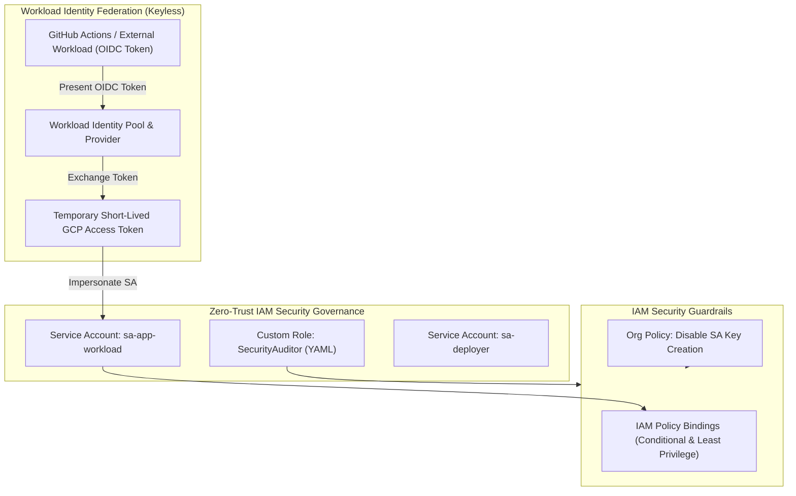

# Project 2: Zero-Trust IAM Governance & Keyless Workload Identity

---

## 1. Project Overview

Welcome to **Project 2: Zero-Trust IAM Governance & Keyless Workload Identity**. This hands-on project synthesizes all 11 topics in **Module 02 (IAM & Identity)** into an enterprise-grade security governance setup tailored to run safely on a **GCP Free Trial Account**.

### Objectives
In this project, you will:
1. **Implement Least Privilege IAM Policies**: Enforce granular access controls avoiding primitive legacy roles (`Owner`, `Editor`, `Viewer`).
2. **Author Custom IAM Roles**: Define tailored permission sets using YAML definitions to restrict administrative capabilities.
3. **Provision & Delegate Service Accounts**: Set up non-human identities for workloads, service-to-service impersonation, and token exchange.
4. **Audit Service Account Keys & Org Policies**: Inspect security risks of long-lived JSON service account keys and apply keyless guardrail constraints.
5. **Configure Workload Identity Federation**: Establish keyless OpenID Connect (OIDC) authentication for GitHub Actions and external cloud workloads.

---

## 2. Architecture & Free Trial Safety Model

This project operates within your existing GCP Free Trial project or a dedicated IAM security project ($0 cost):



> [!NOTE]
> **Free Trial Account Safety & Compatibility**:
> - **$0 Cost**: All IAM roles, Service Accounts, Workload Identity Pools, and Policy Bindings carry zero monthly infrastructure fees.
> - **Organization Policy Guardrails**: If running in a standalone Free Trial account without an Org Node, Org Policy commands will gracefully log warnings without stopping execution.

---

## 3. Module Topics Covered

| Topic Number & Name | Project Integration Point |
|---|---|
| **16. IAM Fundamentals** & **23. IAM Policies** | Enforcing identity bindings, members, roles, and conditional rules. |
| **17. Users** & **18. Groups** | Delegating permissions to Google Groups instead of individual user emails. |
| **19. Service Accounts** & **20. Basic Roles** | Avoiding primitive `Editor` roles; creating non-human service identities. |
| **21. Predefined Roles** & **22. Custom Roles** | Creating granular custom role YAML definitions (`iam/custom_roles.yaml`). |
| **24. Organization Policies** | Applying security guardrails (`iam.disableServiceAccountKeyCreation`). |
| **25. Service Account Keys** & **26. Workload Identity** | Eliminating JSON keys via OIDC Workload Identity Federation. |

---

## 4. Hands-On Execution Guide

### Step 1: Navigate to Project 2 Workspace

Open Google Cloud Shell or local terminal:

```bash
cd "02-iam-and-identity/project-02-iam-and-identity"
chmod +x scripts/*.sh
```

---

### Step 2: Inspect Custom Role & Policy Definitions

Inspect the production custom role definition in `iam/custom_roles.yaml`:

```bash
cat iam/custom_roles.yaml
```

*File View (`iam/custom_roles.yaml`)*:
```yaml
title: "Custom Security Auditor"
description: "Least privilege read-only security auditing role"
stage: "GA"
includedPermissions:
  - resourcemanager.projects.get
  - resourcemanager.projects.getIamPolicy
  - iam.serviceAccounts.list
  - iam.serviceAccounts.get
  - logging.logEntries.list
  - monitoring.timeSeries.list
```

---

### Step 3: Run the IAM Governance Setup Script

Execute `scripts/setup_iam_governance.sh` to automate:
- Creation of custom IAM roles.
- Provisioning of dedicated Service Accounts (`sa-app-runner` and `sa-deployer`).
- Binding predefined and custom roles to Service Accounts.
- Setting up a **Workload Identity Pool** and **Workload Identity Provider** for keyless GitHub Actions authentication.

```bash
./scripts/setup_iam_governance.sh
```

*Expected Script Output Snippet*:
```text
=====================================================
GCP IAM Governance & Workload Identity Setup
=====================================================
[INFO] Creating Custom Role: CustomSecurityAuditor...
[SUCCESS] Custom role created: CustomSecurityAuditor
[INFO] Creating Workload Service Accounts...
[SUCCESS] Service Accounts created: sa-app-runner, sa-deployer
[INFO] Creating Workload Identity Pool: github-actions-pool...
[SUCCESS] Workload Identity Pool created.
[INFO] Binding Service Account Token Creator role...
[SUCCESS] Workload Identity Federation established.
```

---

### Step 4: Test Service Account Impersonation (Keyless Access)

Test keyless authentication by generating a short-lived access token using Service Account Impersonation instead of a long-lived JSON key:

```bash
# Obtain a short-lived 1-hour access token for sa-deployer
SA_EMAIL="sa-deployer@$(gcloud config get-value project).iam.gserviceaccount.com"

gcloud auth print-access-token --impersonate-service-account="${SA_EMAIL}"
```

*Verification Checkpoint*: If successful, gcloud generates a 1-hour OAuth access token without requiring any JSON key files on disk!

---

## 5. Verification & Audit

Verify your IAM governance configuration:

```bash
# 1. List active custom roles in project
gcloud iam roles list --project=$(gcloud config get-value project)

# 2. Audit Workload Identity Pools
gcloud iam workload-identity-pools list --location="global"

# 3. Verify Service Account IAM policy bindings
gcloud iam service-accounts get-iam-policy ${SA_EMAIL}
```

---

## 6. Project Cleanup

To revoke IAM bindings, delete Service Accounts, custom roles, and Workload Identity pools, run:

```bash
./scripts/cleanup_iam.sh
```

---

## 7. Summary & Next Steps

Congratulations! You have completed **Project 2: Zero-Trust IAM Governance & Keyless Workload Identity**. You have eliminated long-lived JSON service account keys and established keyless OIDC federation.

- **Next Project**: [Project 3: Multi-Region Hybrid Secure VPC Architecture](../../03-networking-vpc/project-03-networking-vpc/README.md)
