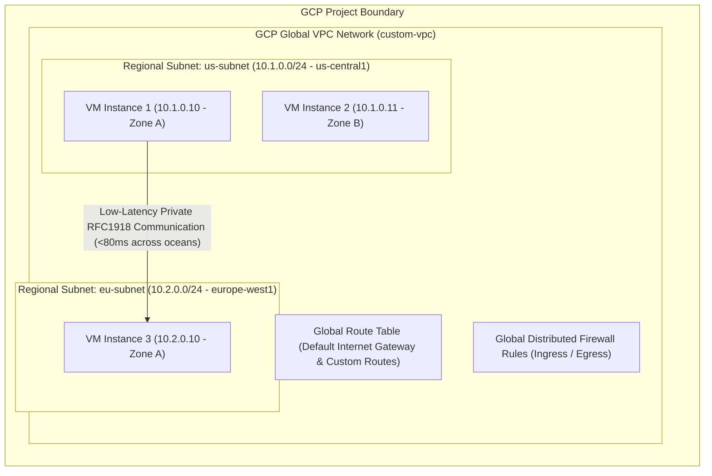

# Topic 27: VPC

---

## 1. What Is It?

A **Virtual Private Cloud (VPC)** is a global, logically isolated virtual network constructed inside Google Cloud Platform that provides private networking for your Compute Engine VMs, GKE clusters, Cloud SQL databases, and internal load balancers.

Unlike legacy physical networks or other cloud providers where virtual networks are bound to a single datacenter region, a **GCP VPC is a Global Resource**. A single GCP VPC network spans all Google Cloud regions worldwide without requiring complex cross-region VPN tunnels or complex routing hacks.

### Real-World Analogy
Think of a GCP VPC like a private internal corporate intercom and phone system installed across a company's offices in New York, London, and Tokyo. Employees in New York can dial a 4-digit internal extension to talk directly to colleagues in Tokyo over private internal wiring, completely bypassing the public international phone system.

---

## 2. Where Does It Fit?

A VPC forms the core networking foundation inside a GCP Project, providing the isolated network container where regional subnets, firewall rules, and compute resources reside.



---

## 3. Core Concepts

| Concept | Auto Mode VPC | Custom Mode VPC | Production Recommendation |
|---|---|---|---|
| **Subnet Creation** | Automatically creates 1 subnet per GCP region with predefined CIDR blocks (`10.128.0.0/9`). | Zero default subnets created; engineer defines explicit regional CIDR ranges manually. | **Custom Mode VPC** (Auto mode causes CIDR overlap issues in enterprise networks). |
| **CIDR Control** | Fixed, pre-assigned non-customizable IP ranges per region. | Fully customizable RFC1918 IP address ranges (e.g., `10.50.0.0/20`). | **Custom Mode VPC**. |
| **Network Scope** | Global. | Global. | Global VPC allows multi-region internal communication without VPNs. |
| **Firewall Rules** | Pre-populated with default permissive rules (allow-ssh, allow-icmp). | Zero default firewall rules created (Default-Deny All Ingress). | **Custom Mode VPC** (Default-Deny provides zero-trust security starting point). |
| **Expansion Flexibility**| Difficult to integrate with corporate VPNs/On-Prem due to fixed IP collisions. | Seamless expansion and IP planning for Shared VPC and Hybrid Cloud. | **Custom Mode VPC**. |

---

## 4. How It Works

Traffic routing inside a GCP Global VPC operates via Software-Defined Networking (Andromeda SDN):

```text
VM 1 in us-central1 (10.1.0.10) sends packet to VM 3 in europe-west1 (10.2.0.10)
              ↓
GCP Andromeda SDN checks Global VPC Route Table
              ↓
Route Matched: Direct Subnet Route (10.2.0.0/24 - Subnet Regional Route)
              ↓
Andromeda encapsulates packet & routes via Google's Private Subsea Fiber Network
              ↓
Arrives at VM 3 in europe-west1 without traversing the public internet
```

1. **No Inter-Subnet Gateways Required**: Subnets in the same VPC can communicate with each other over internal IP addresses by default, regardless of region.
2. **Distributed Firewall**: Firewall rules are evaluated at the virtual NIC level on individual host hypervisors, not at a central bottlenecking virtual router.

---

## 5. Production Scenario

### Enterprise Multi-Region Hybrid Network Foundation

```text
Requirement: Establish a secure, production-grade virtual network for a microservices architecture spanning US and Europe.
    ↓
Architecture: Single Custom Mode VPC (`prod-vpc-main`) with zero auto-subnets.
    ↓
Subnet Provisioning:
  - `sb-prod-us-central1` CIDR: `10.100.0.0/20`
  - `sb-prod-europe-west1` CIDR: `10.200.0.0/20`
    ↓
Security: Default-Deny Ingress firewall rule; explicit ingress allowed only via Identity-Aware Proxy (IAP) and internal CIDRs.
    ↓
Scaling: Subnet CIDR ranges expandable on-demand (`gcloud compute networks subnets expand-ip-range`) without VM downtime.
    ↓
Monitoring: VPC Flow Logs enabled on subnets, exporting packet flow samples to Cloud Logging.
```

*Why Selected*: Custom Mode VPC eliminates IP collisions with on-premises corporate datacenters, providing clean CIDR allocation and strict zero-trust default-deny security.

---

## 6. Hands-On Lab

### Prerequisites
- Active GCP Project with Compute Engine API enabled.
- Cloud Shell or `gcloud` CLI.
- IAM permissions: `roles/compute.networkAdmin`.

### Console Method
1. Log into [Google Cloud Console](https://console.cloud.google.com/).
2. Navigate to **VPC network** → **VPC networks**.
3. Click **CREATE VPC NETWORK** at top.
4. Set Name: `custom-prod-vpc`, Subnet creation mode: **Custom**.
5. Add Subnet 1: Name `sb-us-central1`, Region `us-central1`, IPv4 range `10.10.0.0/24`.
6. Add Subnet 2: Name `sb-europe-west1`, Region `europe-west1`, IPv4 range `10.20.0.0/24`.
7. Under **Firewall rules**, leave unchecked (enforces Default-Deny ingress).
8. Click **CREATE** and observe the global VPC provisioning.

### CLI Method
Create a Custom Mode VPC and regional subnets using `gcloud`:

```bash
# Set project context
PROJECT_ID="your-gcp-project-id"

# 1. Create a Custom Mode VPC (disables automatic default subnet creation)
gcloud compute networks create custom-prod-vpc \
    --subnet-mode=custom \
    --bgp-routing-mode=global

# 2. Add a regional subnet in us-central1
gcloud compute networks subnets create sb-us-central1 \
    --network=custom-prod-vpc \
    --region=us-central1 \
    --range=10.10.0.0/24

# 3. Add a regional subnet in europe-west1
gcloud compute networks subnets create sb-europe-west1 \
    --network=custom-prod-vpc \
    --region=europe-west1 \
    --range=10.20.0.0/24

# 4. Describe the created global VPC network
gcloud compute networks describe custom-prod-vpc
```

### Verification
*Expected Result*: `gcloud compute networks describe` displays `autoCreateSubnetworks: false` and lists both regional subnets bound to the global network.

### Cleanup
Delete test subnets and VPC:

```bash
gcloud compute networks subnets delete sb-us-central1 --region=us-central1 --quiet
gcloud compute networks subnets delete sb-europe-west1 --region=europe-west1 --quiet
gcloud compute networks delete custom-prod-vpc --quiet
```

---

## 7. Security

### Zero-Trust VPC Network Security
- **Always Use Custom Mode VPCs**: Auto Mode VPCs create default subnets in every region, overlapping with enterprise networks and creating unneeded exposure.
- **Default-Deny Ingress Firewall**: Custom VPCs start with zero ingress firewall rules, requiring explicit rules for allowed ports (e.g., HTTP/443 or IAP SSH).
- **VPC Flow Logs**: Enable VPC Flow Logs on subnets to capture network telemetry (source/destination IP, port, latency, packet count) for forensic auditing.

```text
BAD PRACTICE:
Using the Default VPC (`default`) provided in new GCP projects for production workloads.
Risk: Default VPC contains Auto-Mode subnets in every region and permissive default firewall rules (allow-ssh, allow-rdp from 0.0.0.0/0).

PRODUCTION PRACTICE:
Delete the Default VPC. Provision dedicated Custom Mode VPCs with explicit CIDR ranges and zero-trust default-deny firewall policies via Terraform.
```

---

## 8. Scaling & High Availability

VPC Network Topology at Scale:

```text
Standalone Custom VPC (Single project network)
   ↓ (Enterprise Multi-Project Scaling)
Shared VPC (Centralized host project network serving multiple service projects)
   ↓ (Cross-Company / Multi-Cloud Connectivity)
VPC Network Peering / Private Service Connect (Non-transitive private inter-VPC connectivity)
```

- **Dynamic Subnet Expansion**: Subnet CIDR masks can be expanded (e.g., changing `/24` to `/22`) on the fly without stopping running VMs or interrupting network traffic.

---

## 9. Cost

### Pricing Factors in VPC Networking
- **VPC Creation Cost**: Operating a VPC network itself is completely **free of charge**.
- **Internal Same-Zone Egress**: Traffic between VMs in the same zone over internal IP is $0/GB.
- **Internal Cross-Zone Egress**: Traffic between different zones in the same region is billed at $0.01/GB.
- **Internal Cross-Region Egress**: Traffic between different regions over internal IP is billed at standard cross-region egress rates ($0.02 - $0.08+/GB).

---

## 10. Monitoring & Troubleshooting

### VPC Observability Tools
- **VPC Flow Logs**: Sampled network packet logs exported to Cloud Logging or BigQuery.
- **Connectivity Tests**: Run synthetic packet tracing simulations to diagnose firewall or route blocks (`gcloud compute network-management connectivity-tests`).

### Troubleshooting Matrix

| Symptom | Possible Cause | What to Check | Fix |
|---|---|---|---|
| VMs in different subnets cannot ping each other | Ingress firewall rule blocking ICMP traffic | `gcloud compute firewall-rules list` | Create ingress firewall rule allowing ICMP from VPC internal CIDR. |
| Cannot connect to on-prem server via VPN | Subnet CIDR overlap between GCP VPC and On-Prem network | On-Prem & GCP Subnet IP ranges | Re-architect GCP subnets using non-overlapping Custom Mode CIDRs. |
| High egress billing charges | Unintended cross-region traffic flowing between microservices | VPC Flow Logs aggregated by region | Move dependent services into the same GCP region or Availability Zone. |

---

## 11. Common Mistakes

```text
Mistake: Using Auto-Mode VPCs for enterprise production environments.
Why: Shortcut taken during initial project creation.
Impact: Preassigned CIDR blocks (`10.128.0.0/9`) collide with corporate VPN networks, blocking hybrid cloud setup.
Correct approach: Always select Custom Mode VPC during network provisioning.

Mistake: Assuming GCP VPCs are regional like AWS VPCs.
Why: Carrying over concepts from other cloud providers.
Impact: Creating redundant VPN tunnels or complex Peering loops between regions unnecessarily.
Correct approach: Leverage GCP's native Global VPC property to connect multi-region subnets seamlessly.
```

---

## 12. Production Best Practices

- [ ] Delete the default `default` VPC in all production projects.
- [ ] Create dedicated **Custom Mode VPCs** with explicit, non-overlapping RFC1918 CIDR ranges.
- [ ] Implement a **Default-Deny Ingress** firewall posture for all custom VPCs.
- [ ] Enable **VPC Flow Logs** on subnets handling sensitive or regulated workloads.
- [ ] Set Dynamic BGP Routing Mode to **Global** for hybrid cloud interconnectivity.
- [ ] Automate all VPC, subnet, and firewall provisioning using Infrastructure as Code (Terraform).

---

## 13. Hyperscaler / Enterprise Perspective

```text
Personal / Learning
  Default VPC → Auto-Mode Subnets → Open SSH (0.0.0.0/0) → Public IP instances
        ↓
Small Production
  Single Custom Mode VPC → Regional Subnets → Basic Firewall Tags
        ↓
Enterprise Environment
  Shared VPC Host Project → Subnets delegated to Service Projects → Private Google Access Enabled
        ↓
Hyperscaler Environment
  Automated Landing Zone VPCs via Terraform → VPC Flow Log BigQuery Streams → Automated Connectivity Tests -> Zero Public IPs
```

In a hyperscaler environment, VPCs are managed centrally by dedicated Network Security teams using a **Shared VPC** model. Individual project teams never build their own VPC networks; instead, central IT provisions high-availability Custom VPCs with automated VPC Flow Logging, Private Service Connect endpoints, and zero public IP exposure.

---

## 14. Real Project Questions

### Q1: What makes a Google Cloud VPC different from a virtual network in AWS or Azure?
**Answer:** A GCP VPC is a **Global Resource**, meaning a single VPC network spans all Google Cloud regions worldwide. Subnets within the same GCP VPC located in different continents (e.g., US, Europe, Asia) can communicate privately over internal IP addresses out of the box without requiring cross-region VPN tunnels or VPC peering.

### Q2: Why are Auto Mode VPCs strongly discouraged for enterprise production environments?
**Answer:** Auto Mode VPCs automatically create subnets in every GCP region using fixed, predefined IP ranges (`10.128.0.0/9`). These fixed CIDR blocks frequently collide with existing corporate on-premises networks, VPNs, or partner networks, preventing hybrid cloud connectivity and Shared VPC integrations.

### Q3: How does GCP handle inter-subnet routing within the same VPC?
**Answer:** In GCP, every subnet addition automatically generates a **System Generated Regional Subnet Route** in the VPC route table. Because the VPC is global, GCP's Andromeda Software-Defined Network (SDN) automatically routes packets between any two subnets in the same VPC using low-latency internal Google fiber, requiring zero virtual routers or internet gateways.

---

## 15. Quick Decision Guide

| Requirement | Recommended Approach | Reason |
|---|---|---|
| Enterprise production application requiring hybrid VPN connection to on-prem | **Custom Mode VPC** | Allows defining non-overlapping, explicit CIDR ranges tailored to enterprise IP schemes. |
| Multi-region application requiring low-latency inter-region communication | **Single Global VPC with regional subnets** | Subnets communicate over Google's private subsea network without VPN tunnels. |
| Quick 10-minute personal test script | **Auto Mode VPC / Default VPC** | Fast setup with auto-created subnets for non-production learning sandboxes. |

### When should I use it?
- Mandatory starting foundation for all compute, container, and database networking in Google Cloud.

### When should I NOT use it?
- Never use Auto Mode or Default VPCs for enterprise hybrid cloud deployments.

---

## 16. Related Services

```text
                     [27. VPC]
                    /    |    \
             Subnets  Routes  Firewalls
                |        |        |
            Regional  Routing  Distributed
             CIDRs    Tables   Security
```

- **Subnets**: Regional IP address subdivisions within the global VPC.
- **Routes**: Directs traffic from VMs to internet, VPNs, or custom next-hops.
- **Firewall Rules**: Distributed stateful packet filtering for the VPC.

---

## 17. Cheat Sheet

### Core Attributes
- **Scope**: Global (Spans all regions).
- **Modes**: Custom Mode (Recommended) vs. Auto Mode (Legacy).
- **Default VPC**: Pre-created Auto Mode network (Delete in production).

### Useful Commands
```bash
# Create a Custom Mode VPC
gcloud compute networks create custom-vpc --subnet-mode=custom

# List all VPC networks in a project
gcloud compute networks list

# Describe specific VPC network details
gcloud compute networks describe custom-vpc

# Delete a VPC network
gcloud compute networks delete custom-vpc
```

---

## 18. Learning Connection

- **Previous Topic**: [26. Workload Identity](../../02-iam-and-identity/26-workload-identity/README.md)
- **Next Topic**: [28. Subnets](../28-subnets/README.md)
