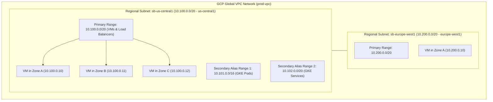

# Topic 28: Subnets

---

## 1. What Is It?

A **Subnet** (Subnetwork) in Google Cloud is a regional IP address range within a global Virtual Private Cloud (VPC) network. 

While the VPC itself is global, **Subnets are Regional Resources**. A single subnet resides inside a specific GCP region (e.g., `us-central1` or `europe-west1`), but its IP address range spans **all Availability Zones** within that region.

Subnets define the Primary internal IP ranges for Compute Engine VMs and internal load balancers, as well as Secondary IP ranges (Alias IPs) used for GKE Pods and Services.

### Real-World Analogy
Think of a VPC as a global corporate office complex, and Subnets as specific departmental floors in regional branch offices. The **Chicago Branch Floor** (`us-central1` Subnet) assigns desk extension numbers (`10.1.0.0/24`) across all rooms on that floor (Availability Zones A, B, and C). Employees on the Chicago floor can call employees on the **London Branch Floor** (`10.2.0.0/24` Subnet) over internal extension lines without placing an external long-distance call.

---

## 2. Where Does It Fit?

Subnets reside inside a Global VPC network, acting as regional IP containers that span across all Availability Zones within that region.



---

## 3. Core Concepts

| Subnet Concept | Description | Syntax / Example | Production Consideration |
|---|---|---|---|
| **Primary IP Range** | Main RFC1918 CIDR block defining internal IP addresses for VMs and Load Balancers. | `10.100.0.0/20` (4,094 usable IPs) | Must not overlap with on-premises networks or other VPCs. |
| **Secondary IP Range** | Alias IP ranges allocated to a subnet for GKE Pods and Services. | `10.101.0.0/16` (GKE Pods CIDR) | Required for VPC-Native GKE clusters. |
| **Private Google Access** | Allows VMs with ONLY internal IPs to access Google APIs (GCS, BigQuery) privately. | `privateIpGoogleAccess: true` | **Mandatory production setting** for private subnets. |
| **VPC Flow Logs** | Captures sampled network telemetry logs (source, destination, port, latency) for a subnet. | `enableFlowLogs: true` | Enable for security auditing and network troubleshooting. |
| **Reserved Gateway IP** | First IP address in the CIDR block reserved by GCP as the subnet default gateway. | `10.100.0.1` (in a `10.100.0.0/24` range) | First 2 IPs and last 2 IPs in CIDR are reserved by GCP. |

---

## 4. How It Works

IP Address Allocation and Communication inside Subnets follow deterministic rules:

```text
Engineer provisions Compute Engine VM in us-central1-a attached to sb-us-central1 (10.100.0.0/20)
              ↓
GCP DHCP assigns next available Primary internal IP (e.g., 10.100.0.5)
              ↓
VM sends packet to another VM in us-central1-b (10.100.0.15)
              ↓
Packet routed directly via Subnet's internal virtual switch layer across zones
              ↓
VM sends packet to Google Cloud Storage (storage.googleapis.com)
              ↓
Subnet's Private Google Access intercepts request & routes to GCS via internal Google network
```

1. **Multi-Zone Scope**: Single subnet CIDRs (`10.100.0.0/20`) automatically span Zone A, Zone B, Zone C, and Zone F in that region.
2. **Dynamic Expansion**: Subnet CIDR masks can be expanded (e.g., `/24` to `/20`) instantly without dropping active connections.

---

## 5. Production Scenario

### VPC-Native GKE & Serverless Private Subnet Design

```text
Requirement: Design a production subnet in `us-central1` supporting 500 Compute VMs, 2,000 GKE Pods, and private Google API access.
    ↓
Architecture: Custom Subnet `sb-prod-gke-uscentral1` in `us-central1`.
    ↓
IP Configuration:
  - Primary Range (VMs): `10.100.0.0/21` (2,046 IPs)
  - Secondary Range 1 (GKE Pods): `10.104.0.0/14` (262,140 IPs)
  - Secondary Range 2 (GKE Services): `10.108.0.0/20` (4,094 IPs)
    ↓
Security: Enable **Private Google Access**; enable **VPC Flow Logs** (5-min aggregation, 0.5 sample rate).
    ↓
Scaling: Expand Primary Range mask dynamically if VM node count grows beyond 2,000.
    ↓
Monitoring: Cloud Logging analyzing VPC Flow Log samples for unauthorized egress ports.
```

*Why Selected*: Allocating dedicated Secondary Ranges for GKE Pods and enabling Private Google Access guarantees secure, scale-ready container operations without public IP exposure.

---

## 6. Hands-On Lab

### Prerequisites
- Active GCP Project with Custom VPC created (from Topic 27).
- Cloud Shell or `gcloud` CLI.
- IAM permissions: `roles/compute.networkAdmin`.

### Console Method
1. Log into [Google Cloud Console](https://console.cloud.google.com/).
2. Navigate to **VPC network** → **VPC networks** → Click your Custom VPC.
3. Click **ADD SUBNET** at top.
4. Set Name: `sb-app-uscentral1`, Region: `us-central1`.
5. Set Primary IPv4 range: `10.50.0.0/24`.
6. Turn **Private Google Access** -> **On**.
7. Turn **Flow logs** -> **On** (Configure Aggregation interval: 5 sec, Sample rate: 50%).
8. Expand **Create secondary IPv4 range**:
   - Name: `gke-pods`, Range: `10.51.0.0/16`.
   - Name: `gke-services`, Range: `10.52.0.0/20`.
9. Click **ADD**.

### CLI Method
Create and manage subnets with Secondary Ranges using `gcloud`:

```bash
# Set project and VPC variables
PROJECT_ID="your-gcp-project-id"
VPC_NAME="custom-prod-vpc"

# 1. Create a Subnet with Private Google Access & Secondary IP Ranges
gcloud compute networks subnets create sb-app-uscentral1 \
    --network=$VPC_NAME \
    --region=us-central1 \
    --range=10.50.0.0/24 \
    --enable-private-ip-google-access \
    --enable-flow-logs \
    --secondary-range=gke-pods=10.51.0.0/16,gke-services=10.52.0.0/20

# 2. Expand Subnet Primary IP Range dynamically (from /24 to /22)
gcloud compute networks subnets expand-ip-range sb-app-uscentral1 \
    --region=us-central1 \
    --prefix-length=22

# 3. Describe subnet details
gcloud compute networks subnets describe sb-app-uscentral1 --region=us-central1
```

### Verification
*Expected Result*: Output displays updated primary range `10.50.0.0/22`, lists both secondary ranges, and confirms `privateIpGoogleAccess: true`.

### Cleanup
Delete test subnet:

```bash
gcloud compute networks subnets delete sb-app-uscentral1 --region=us-central1 --quiet
```

---

## 7. Security

### Private Subnet Security Hardening
- **Enable Private Google Access**: Allows private VMs (without public IPs) to reach Google APIs (GCS, BigQuery) using internal Google routing.
- **Default to Private VMs**: Do not assign external public IPv4 addresses to VMs. Use Private Subnets + Cloud NAT for outbound internet access.
- **Audit Reserved IP Assignments**: Ensure reserved gateway and internal DNS IPs are protected against manual static IP overrides.

```text
BAD PRACTICE:
Disabling Private Google Access on private subnets, forcing developers to assign public IPs to VMs just to download files from Cloud Storage.
Risk: Public IPs expose VMs directly to internet-wide port scans and brute-force attacks.

PRODUCTION PRACTICE:
Enable Private Google Access on 100% of internal subnets. Use Cloud NAT for outbound internet and Identity-Aware Proxy (IAP) for SSH.
```

---

## 8. Scaling & High Availability

Subnet Sizing and Expansion Rules:

```text
Initial Subnet Provisioning (e.g., /24 - 254 Usable IPs)
   ↓ (Workload Expansion / GKE Cluster Growth)
Dynamic CIDR Expansion (`gcloud compute networks subnets expand-ip-range --prefix-length=20`)
   ↓ (Expansion Constraint)
Can ONLY expand range size (e.g., /24 to /20) - CANNOT shrink or move starting IP
```

- **IP Reserved Counts**: In any GCP subnet CIDR block, GCP reserves the first two IP addresses (Network Address & Gateway IP) and the last two IP addresses (Broadcast & Reserved).

---

## 9. Cost

### Subnet Pricing & Telemetry Costs
- **Subnet Creation $0**: Creating subnets incurs zero direct cost.
- **VPC Flow Logs Cost**: Enabling VPC Flow Logs incurs small logging ingestion charges in Cloud Logging based on log volume. Use log sampling (e.g., 10% or 50% sample rate) to control telemetry costs.

---

## 10. Monitoring & Troubleshooting

### Subnet Observability Tools
- **VPC Flow Logs**: Analyze network packet traffic patterns using Cloud Logging and BigQuery.
- **IP Address Usage Dashboard**: Track allocated vs. available IP addresses per subnet in Cloud Console.

### Troubleshooting Matrix

| Symptom | Possible Cause | What to Check | Fix |
|---|---|---|---|
| Private VM cannot reach Cloud Storage bucket | **Private Google Access** disabled on the subnet | `gcloud compute networks subnets describe` | Enable Private Google Access: `--enable-private-ip-google-access`. |
| GKE cluster creation fails: `IP space exhausted` | Secondary IP range for Pods (`10.51.0.0/16`) too small | Subnet Secondary Ranges config | Add a new larger secondary range or recreate subnet with larger CIDR. |
| Cannot shrink subnet CIDR mask | GCP allows expanding CIDR ranges, but strictly prohibits shrinking CIDRs | `expand-ip-range` documentation | Subnets cannot be shrunk. Must create a new smaller subnet and migrate VMs. |

---

## 11. Common Mistakes

```text
Mistake: Provisioning undersized subnets (e.g., `/28` with only 12 usable IPs) for GKE or auto-scaling VM workloads.
Why: Over-conserving IP space during initial setup.
Impact: Auto-scaling MIGs or GKE Pod deployments fail during traffic spikes due to IP exhaustion.
Correct approach: Allocate adequate CIDR masks (minimum `/22` or `/20`) for production subnets.

Mistake: Attempting to shrink a subnet CIDR range after over-allocating IP space.
Why: Assuming subnet CIDRs can be expanded and shrunk symmetrically.
Impact: Terminal error; GCP API prohibits shrinking subnet ranges.
Correct approach: Plan IP address architectures carefully before provisioning subnets.
```

---

## 12. Production Best Practices

- [ ] Enable **Private Google Access** on all internal regional subnets.
- [ ] Enable **VPC Flow Logs** with appropriate sampling rates on production subnets.
- [ ] Allocate dedicated **Secondary IP Ranges** for GKE Pods and Services.
- [ ] Size primary subnet CIDRs adequately (e.g., `/20` or `/22`) to accommodate future scaling.
- [ ] Maintain strict non-overlapping CIDR address schemes across all subnets and hybrid VPNs.
- [ ] Automate all subnet creations using Infrastructure as Code (Terraform).

---

## 13. Hyperscaler / Enterprise Perspective

```text
Personal / Learning
  Auto-Mode Subnets (`10.128.0.0/9`) → No secondary ranges → Disabled Flow Logs
        ↓
Small Production
  Custom Subnet per Region → Private Google Access enabled → Basic VPC Flow Logs
        ↓
Enterprise Environment
  Centralized IPAM (IP Address Management) → Dedicated Subnets for Web/App/DB Tiers → VPC Flow Log Sinks to BigQuery
        ↓
Hyperscaler Environment
  Automated Shared VPC Subnet Delegation → Secondary IP Ranges for Multi-Cluster GKE → Automated Flow Log Anomaly Detection
```

In a hyperscaler environment, subnets are managed through an Enterprise IPAM (IP Address Management) system to prevent IP space collisions across hybrid clouds. Central network teams provision regional subnets in Shared VPC host projects, delegating specific subnets to application service projects while enforcing continuous VPC Flow Log streaming into security data lakes.

---

## 14. Real Project Questions

### Q1: Why is enabling Private Google Access on subnets considered a critical production requirement?
**Answer:** Private Google Access allows Compute Engine VMs and containers that lack external public IP addresses to reach Google Cloud APIs (such as Cloud Storage, BigQuery, and Secret Manager) over internal Google network paths. Disabling it forces engineers to assign insecure public IPs to VMs or route traffic through expensive NAT gateways just to access GCP services.

### Q2: What is the technical difference between a Subnet's Primary IP Range and Secondary IP Range?
**Answer:** A Primary IP Range defines the main CIDR block used to assign internal IP addresses to virtual machine interfaces (NICs) and internal load balancers. A Secondary IP Range (Alias IP) defines additional non-overlapping CIDR blocks attached to the subnet, specifically used by GKE to assign native IP addresses to Kubernetes Pods and Services without requiring overlay networks.

### Q3: Can a GCP Subnet CIDR range be shrunk after it has been created?
**Answer:** No. GCP allows expanding a subnet's Primary CIDR range (e.g., changing from `/24` to `/20`) dynamically without downtime. However, GCP API rules strictly prohibit shrinking a subnet range or moving its starting IP address. Shrinking requires creating a new smaller subnet and migrating workloads.

---

## 15. Quick Decision Guide

| Requirement | Recommended Approach | Reason |
|---|---|---|
| Private VMs accessing Cloud Storage without public IPs | **Enable Private Google Access on Subnet** | Ingests API calls internally without traversing public networks or requiring public IPs. |
| Deploying VPC-Native GKE clusters | **Configure Subnet with Secondary IP Ranges** | Provides dedicated IP blocks for Pods and Services without overlay network performance penalties. |
| Audit incoming/outgoing packet flows for a regulated database subnet | **Enable VPC Flow Logs** | Captures sampled network telemetry for compliance auditing and network diagnostics. |

### When should I use it?
- Essential regional network component required for launching any VM, container, or internal load balancer in GCP.

### When should I NOT use it?
- Do not create tiny subnets (`/28` or `/29`) for workloads expected to scale dynamically.

---

## 16. Related Services

```text
                  [28. Subnets]
                 /      |      \
           Private    VPC Flow  Secondary
           Google Logs      Ranges
           Access               |
             |        |      GKE Pods/
          GCS/BQ   Security  Services
           APIs    Telemetry
```

- **Private Google Access**: Enables private API access for subnet VMs.
- **VPC Flow Logs**: Network packet sampling and logging service.
- **Google Kubernetes Engine (GKE)**: Utilizes secondary subnet ranges for VPC-Native Pod IP allocation.

---

## 17. Cheat Sheet

### Key Subnet Rules
- **Scope**: Regional (Spans all zones in a region).
- **Expansion**: Expandable dynamically (`/24` -> `/20`); CANNOT be shrunk.
- **Reserved IPs**: First 2 IPs and last 2 IPs reserved by GCP.

### Useful Commands
```bash
# Create a custom subnet with Private Google Access
gcloud compute networks subnets create SUBNET_NAME \
    --network=VPC_NAME --region=us-central1 \
    --range=10.100.0.0/20 --enable-private-ip-google-access

# Expand an existing subnet CIDR range
gcloud compute networks subnets expand-ip-range SUBNET_NAME \
    --region=us-central1 --prefix-length=18

# List subnets in a project
gcloud compute networks subnets list
```

---

## 18. Learning Connection

- **Previous Topic**: [27. VPC](../27-vpc/README.md)
- **Next Topic**: [29. Routes](../29-routes/README.md)
