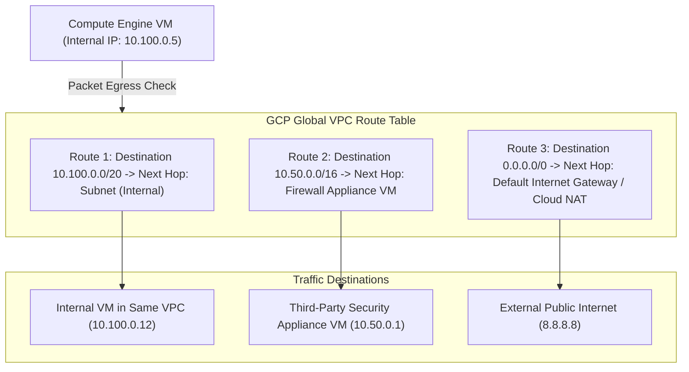

# Topic 29: Routes

---

## 1. What Is It?

In Google Cloud VPC networking, a **Route** is a rule in the network's virtual routing table that instructs GCP's Software-Defined Network (Andromeda) where to direct egress network traffic leaving a Virtual Machine instance.

Every route consists of a **Destination Range** (CIDR block) and a **Next Hop** (where to send matching packets).

GCP routes are divided into two primary categories:
1. **System-Generated Routes**: Automatically created routes (Default Internet Gateway route `0.0.0.0/0` and Regional Subnet routes for internal communication).
2. **Custom Routes**: User-defined routes that direct specific traffic to custom next hops—such as a Virtual Appliance VM (firewall/NAT instance), a Cloud VPN gateway, or Cloud Router BGP dynamic routes.

### Real-World Analogy
Think of GCP Routes like highway directional signposts. When a driver (network packet) enters an interchange with a destination city on their GPS (destination CIDR `10.2.0.0/24`), the signpost (Route Table) instructs them: *"Take Exit 4 toward London"* (Next Hop: Subnet Route). If the GPS says destination `0.0.0.0/0` (any external internet address), the signpost instructs: *"Take Main Tollway toward Public Highway"* (Next Hop: Default Internet Gateway).

---

## 2. Where Does It Fit?

Routes operate inside a Global VPC, defining packet forwarding rules for egress network traffic leaving virtual machine interfaces across regional subnets.



---

## 3. Core Concepts

| Route Type | Destination CIDR | Next Hop Type | Created By | Purpose |
|---|---|---|---|---|
| **Default Internet Route** | `0.0.0.0/0` | Default Internet Gateway (`default-internet-gateway`) | System-Generated | Directs outbound internet traffic to public gateway. |
| **Subnet Route** | Subnet CIDR (e.g., `10.100.0.0/20`) | Subnet (`subnet-name`) | System-Generated | Enables direct internal RFC1918 communication between VPC subnets. |
| **Custom Instance Route** | Custom CIDR (e.g., `192.168.1.0/24`) | Compute Instance (`next-hop-instance`) | User-Defined | Routes traffic through a third-party firewall/NAT VM appliance. |
| **Dynamic BGP Route** | Remote On-Prem CIDRs | Cloud Router (`next-hop-vpn-gateway`) | Dynamic (BGP) | Automatically learns on-premises networks via Cloud Router BGP. |

---

## 4. How It Works

GCP evaluates matching routes for egress packets using **Longest Prefix Match** and **Priority**:

```text
VM sends egress packet to destination IP 10.200.1.50
              ↓
Andromeda SDN inspects Global Route Table for matching routes:
  Route A: 0.0.0.0/0 (Priority: 1000)
  Route B: 10.0.0.0/8 (Priority: 1000)
  Route C: 10.200.1.0/24 (Priority: 1000)
              ↓
Rule 1: Select Longest Prefix Match -> Route C (10.200.1.0/24 - Most specific mask)
              ↓
(If masks are identical) Rule 2: Select Lowest Priority Number (e.g., Priority 100 beats 1000)
              ↓
Packet forwarded to Next Hop specified in winning Route
```

1. **Longest Prefix Match**: A `/24` destination route always beats a `/16` or `/0` route, regardless of priority.
2. **Priority Ties**: If multiple routes have identical destination CIDRs and priorities, GCP uses ECMP (Equal-Cost Multi-Path) load balancing to distribute packets across next hops.

---

## 5. Production Scenario

### Forced Inspection via Network Virtual Appliance (NVA)

```text
Requirement: Route all egress internet traffic from application VMs through a Palo Alto central firewall VM for Deep Packet Inspection (DPI).
    ↓
Architecture: Custom VPC with default `0.0.0.0/0` internet route overridden by a Custom Route.
    ↓
Configuration:
  - Create Custom Route `rt-force-inspection`.
  - Destination Range: `0.0.0.0/0`.
  - Priority: `800` (Beats default priority 1000).
  - Next Hop: Instance `palo-alto-firewall-vm` in `us-central1-a`.
  - Network Tag: `tagged-app-vms`.
    ↓
Security: All application VMs tagged with `tagged-app-vms` have 100% of egress traffic forced through the security appliance VM.
    ↓
Monitoring: Network Intelligence Center verifying route execution path.
```

*Why Selected*: Overriding the default internet route with a higher-priority custom route guarantees that application VMs cannot bypass central security inspection.

---

## 6. Hands-On Lab

### Prerequisites
- Active GCP Project with Custom VPC created (from Topic 27).
- Cloud Shell or `gcloud` CLI.
- IAM permissions: `roles/compute.networkAdmin`.

### Console Method
1. Log into [Google Cloud Console](https://console.cloud.google.com/).
2. Navigate to **VPC network** → **Routes**.
3. View the list of active routes in your VPC.
4. Filter by Network: `custom-prod-vpc`.
5. Observe the automatically generated **Subnet routes** and **Default internet gateway route**.
6. Click **CREATE ROUTE** at top.
7. Set Name: `rt-custom-next-hop`, Network: `custom-prod-vpc`.
8. Destination IPv4 range: `192.168.10.0/24`.
9. Priority: `900`.
10. Next hop: **Instance** → Select target VM instance.
11. Click **CREATE**.

### CLI Method
Inspect and manage routes using `gcloud`:

```bash
# Set project and VPC variables
PROJECT_ID="your-gcp-project-id"
VPC_NAME="custom-prod-vpc"

# 1. List all routes in the VPC
gcloud compute routes list --filter="network:$VPC_NAME"

# 2. Delete default 0.0.0.0/0 internet route to create a strictly private VPC
DEFAULT_ROUTE_NAME=$(gcloud compute routes list --filter="network:$VPC_NAME AND destinationRange:0.0.0.0/0" --format="value(name)")
gcloud compute routes delete $DEFAULT_ROUTE_NAME --quiet

# 3. Create a custom route targeting a specific destination range via a next-hop IP or Gateway
gcloud compute routes create rt-private-subnet-override \
    --network=$VPC_NAME \
    --destination-range=172.16.0.0/16 \
    --next-hop-gateway=default-internet-gateway \
    --priority=800
```

### Verification
*Expected Result*: `gcloud compute routes list` confirms custom route creation and displays priority 800.

### Cleanup
Delete custom route and restore project state:

```bash
gcloud compute routes delete rt-private-subnet-override --quiet
```

---

## 7. Security

### Routing Security & Egress Lockdown
- **Delete Default Internet Route**: In strict zero-trust networks, delete the default `0.0.0.0/0` internet gateway route from the VPC. Use Cloud NAT for outbound connections.
- **Network Tag Scoping**: Scope custom routes to specific Network Tags or Service Accounts so only authorized VMs utilize specialized next-hops.

```text
BAD PRACTICE:
Leaving default `0.0.0.0/0` internet gateway routes active in VPCs containing sensitive databases, allowing VMs with public IPs to bypass firewall inspection.
Risk: Direct, unmonitored egress traffic to external malicious C2 servers.

PRODUCTION PRACTICE:
Delete default `0.0.0.0/0` routes. Use Cloud NAT for outbound internet traffic or force egress through inspection appliances using high-priority custom routes.
```

---

## 8. Scaling & High Availability

Route Priority & ECMP Load Balancing:

```text
Single Next-Hop Instance (Single point of failure)
   ↓ (Multiple Next-Hop Instances with Identical Priority)
ECMP Routing (Equal-Cost Multi-Path distributes traffic across 2+ Firewall VMs)
   ↓ (Dynamic BGP Routing)
Cloud Router BGP Dynamic Routing (Automatic failover between active/standby VPN gateways)
```

- **ECMP Load Balancing**: If two custom routes have identical Destination CIDRs and Priorities, GCP automatically uses ECMP to split traffic across both next-hop instances for high availability.

---

## 9. Cost

### Pricing Impact of Routing Decisions
- **Route Table Creation $0**: Maintaining routes in GCP route tables incurs zero cost.
- **Traffic Hairpinning Costs**: Routing internal cross-region traffic through an intermediate firewall VM in another region incurs unnecessary cross-region network egress charges. Keep next-hop security appliances in the local region.

---

## 10. Monitoring & Troubleshooting

### Route Observability Tools
- **Network Intelligence Center (Connectivity Tests)**: Simulates packet traces to verify if route evaluation directs packets to the intended next hop.
- **Routes Inspection in Console**: View effective routes for a specific VM instance.

### Troubleshooting Matrix

| Symptom | Possible Cause | What to Check | Fix |
|---|---|---|---|
| Packets not reaching custom firewall VM | Next-hop VM missing IP Forwarding setting (`can_ip_forward`) | `gcloud compute instances describe <vm>` | Enable IP Forwarding on the firewall VM interface (`can_ip_forward: true`). |
| VM cannot connect to internet | Default `0.0.0.0/0` route deleted and no Cloud NAT configured | `gcloud compute routes list` | Add Cloud NAT or restore default internet route. |
| Traffic taking unexpected path | Route Priority or Longest Prefix Match misconfiguration | Connectivity Tests in Console | Verify route destination masks and lower priority number for intended route. |

---

## 11. Common Mistakes

```text
Mistake: Forgetting to enable IP Forwarding (`can_ip_forward=true`) on a VM used as a Next Hop route.
Why: GCP Compute Engine drops packets sent to a VM interface if the destination IP doesn't match the VM's IP, unless IP Forwarding is enabled.
Impact: Custom route fails completely; all routed packets are dropped at the VM hypervisor.
Correct approach: Always set `--can-ip-forward` when creating VM instances acting as routers or firewalls.

Mistake: Confusing Route Priority order (assuming 1000 is higher priority than 100).
Why: Counter-intuitive numerical ranking.
Impact: Lower priority route accidentally overrides the intended path.
Correct approach: Remember that LOW NUMBERS = HIGH PRIORITY (Priority 100 beats Priority 1000).
```

---

## 12. Production Best Practices

- [ ] Delete default `0.0.0.0/0` internet gateway routes in private VPCs.
- [ ] Enable **IP Forwarding** on all virtual appliances used as route next-hops.
- [ ] Use **Cloud Router** and BGP dynamic routing for VPN/Interconnect connections.
- [ ] Scope custom routes to specific Network Tags or Service Accounts.
- [ ] Utilize **Connectivity Tests** to validate route paths before launching production.
- [ ] Automate all VPC route tables using Infrastructure as Code (Terraform).

---

## 13. Hyperscaler / Enterprise Perspective

```text
Personal / Learning
  Default VPC Routes (`0.0.0.0/0` open) → Single routing table → No custom next-hops
        ↓
Small Production
  Custom static routes → Next-hop firewall VM → Basic network tags
        ↓
Enterprise Environment
  Dynamic BGP Routing via Cloud Router → Equal-Cost Multi-Path (ECMP) failover → Shared VPC Route Tables
        ↓
Hyperscaler Environment
  Automated Connectivity Test Pipelines → Transit VPC Hub-and-Spoke Routing → Centralized Network Virtual Appliance (NVA) Inspection Clusters
```

In a hyperscaler environment, enterprise networks avoid static routes. Central Network Operations teams use **Cloud Router** with BGP to dynamically advertise on-premises routes into Shared VPCs. High-availability NVA (Network Virtual Appliance) clusters run behind internal load balancers using ECMP routing, ensuring zero-downtime packet inspection across multi-region VPC architectures.

---

## 14. Real Project Questions

### Q1: How does GCP decide which route wins when a packet matches multiple rules in the VPC route table?
**Answer:** GCP evaluates routes using two strict rules in order:
1. **Longest Prefix Match**: The route with the most specific destination CIDR mask wins (e.g., `/24` beats `/16` or `/0`).
2. **Lowest Priority Number**: If destination CIDR masks are identical, the route with the lower numerical priority value wins (e.g., Priority `100` beats Priority `1000`).

### Q2: Why must IP Forwarding (`can_ip_forward`) be enabled on Compute Engine VMs acting as custom route next-hops?
**Answer:** By default, GCP hypervisors perform strict source/destination IP checks and drop any packet whose destination IP does not match the VM's assigned IP address. Enabling IP Forwarding allows the VM interface to receive, inspect, and forward packets addressed to external destination IPs.

### Q3: What is equal-cost multi-path (ECMP) routing in GCP VPCs?
**Answer:** ECMP occurs when multiple custom routes have identical Destination CIDR ranges and identical Priority values, pointing to different next-hop targets (e.g., two different firewall VMs). GCP's Andromeda SDN automatically balances traffic across all valid next-hops using a 5-tuple hash to provide high availability and load distribution.

---

## 15. Quick Decision Guide

| Requirement | Recommended Approach | Reason |
|---|---|---|
| Dynamically learn on-premises network routes over Cloud VPN | **Cloud Router + BGP Dynamic Routing** | Automatically updates route tables when on-premises networks change without manual intervention. |
| Force internet traffic through a Palo Alto firewall VM | **Custom Route (`0.0.0.0/0`) with Priority 800 pointing to VM** | Overrides default internet route to enforce deep packet security inspection. |
| Connect subnets inside the same VPC across regions | **System-Generated Subnet Routes (Built-in)** | Automatically created by GCP; routes traffic over Google subsea fiber with zero manual setup. |

### When should I use it?
- Essential for controlling network traffic egress paths, connecting hybrid VPNs, or steering packets through security appliances.

### When should I NOT use it?
- Do not create static routes for internal inter-subnet traffic—GCP handles subnet routing automatically.

---

## 16. Related Services

```text
                 [29. Routes]
                /      |      \
        Cloud Router  VPC  Network Virtual
         (Dynamic)  Subnets   Appliances
            |          |           |
           BGP      Internal      DPI
           VPN       Routing    Firewalls
```

- **Cloud Router**: Provides dynamic BGP routing for Cloud VPN and Interconnect.
- **VPC Network**: Holds the global routing table.
- **Network Intelligence Center**: Simulates and validates route paths.

---

## 17. Cheat Sheet

### Evaluation Hierarchy
1. **Longest Prefix Match** (Most specific CIDR mask wins).
2. **Lowest Priority Value** (Priority `100` beats `1000`).

### Useful Commands
```bash
# List all routes in a network
gcloud compute routes list --filter="network:VPC_NAME"

# Create a custom route pointing to a VM instance
gcloud compute routes create ROUTE_NAME \
    --network=VPC_NAME --destination-range=CIDR \
    --next-hop-instance=VM_NAME --next-hop-instance-zone=ZONE --priority=800

# Delete a route
gcloud compute routes delete ROUTE_NAME
```

---

## 18. Learning Connection

- **Previous Topic**: [28. Subnets](../28-subnets/README.md)
- **Next Topic**: [30. Firewall Rules](../30-firewall-rules/README.md)
