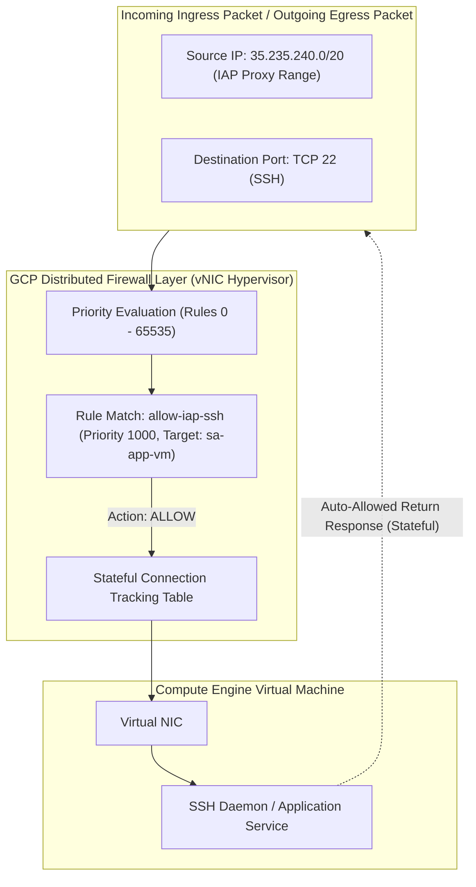

# Topic 30: Firewall Rules

---

## 1. What Is It?

GCP **VPC Firewall Rules** are distributed, stateful network filtering rules that control ingress (incoming) and egress (outgoing) traffic to and from Virtual Machine instances within a VPC network.

Unlike traditional physical networks that rely on centralized firewall appliances creating network bottlenecking, GCP firewall rules are **distributed at the hypervisor level**. Every packet is inspected directly at the virtual NIC of each VM instance by Google's Andromeda Software-Defined Network (SDN).

Firewall rules can target specific instances using **Network Tags**, **Service Accounts**, or **Subnets**, allowing fine-grained micro-segmentation of application tiers.

### Real-World Analogy
Think of GCP Firewall Rules like personal electronic security guards stationed right outside every individual office door inside a corporate building, rather than just one security guard at the front lobby desk. Each personal guard holds a specific guest list (Firewall Rule) for that specific room, checking visitors (packets) before letting them step inside.

---

## 2. Where Does It Fit?

Firewall rules reside at the Global VPC level, executing stateful packet filtering directly on VM virtual network interfaces (vNICs).



---

## 3. Core Concepts

| Rule Parameter | Description | Valid Values | Best Practice |
|---|---|---|---|
| **Direction** | Flow of packet inspection. | `INGRESS` (Incoming) or `EGRESS` (Outgoing) | Default-deny all ingress; selectively allow specific ingress ports. |
| **Action** | Result executed when packet matches rule. | `ALLOW` or `DENY` | Explicit `ALLOW` for required ports; explicit `DENY` for untrusted blocks. |
| **Priority** | Rule evaluation order (Integer from 0 to 65535). | `0` (Highest priority) to `65535` (Lowest priority) | Leave gaps (e.g., 1000, 2000) between rules for future insertions. |
| **Target** | Instances protected by the rule. | All instances, **Secure Tags**, **Network Tags**, or **Service Accounts** | **Use Secure Tags or Service Accounts** (Avoid string Network Tags in Prod). |
| **Source / Destination** | Filters for origin/destination of traffic. | IP CIDRs, Subnets, Secure Tags, or Service Accounts | Use explicit CIDR ranges (e.g., `35.235.240.0/20` for IAP). |
| **Protocols & Ports** | Specific transport protocols and destination ports. | `tcp:80,443`, `udp:53`, `icmp`, `all` | Restrict to exact required ports (never use `all` unless strictly required). |

---

## 4. How It Works

GCP evaluates firewall rules using strict Priority order and Stateful Connection tracking:

```text
Ingress Packet arrives at VM Virtual Interface (vNIC)
              ↓
Firewall Engine checks Rule Priority from 0 to 65535 (Lowest number wins)
              ↓
First matching Rule determines action:
  - If Rule Action = ALLOW → Packet passed to VM OS
  - If Rule Action = DENY  → Packet dropped immediately
              ↓
(Stateful Property): Outbound response packet automatically ALLOWED back out 
without needing a separate Egress Firewall Rule
```

1. **Stateful Filtering**: GCP firewall rules are stateful. Once an ingress connection is allowed, return egress traffic for that session is automatically permitted.
2. **Implied Rules**: Every VPC network has two implied default rules of priority 65535: **Implied Deny All Ingress** and **Implied Allow All Egress**.

---

## 5. Production Scenario

### Micro-Segmented 3-Tier Web Application Security

```text
Requirement: Secure a 3-Tier Application (Web, App API, DB) so Web can talk to App, App can talk to DB, but Web CANNOT talk directly to DB.
    ↓
Targeting Strategy: Use Service Account identities for micro-segmentation.
    ↓
Firewall Rule Setup:
  - Rule 1 (Web Ingress): ALLOW `tcp:443` from `0.0.0.0/0` → Target: `sa-web-frontend`.
  - Rule 2 (App Ingress): ALLOW `tcp:8080` from `sa-web-frontend` → Target: `sa-app-backend`.
  - Rule 3 (DB Ingress): ALLOW `tcp:5432` from `sa-app-backend` → Target: `sa-db-postgres`.
  - Rule 4 (SSH Ingress): ALLOW `tcp:22` from IAP CIDR (`35.235.240.0/20`) → Target: All instances.
    ↓
Security: Web tier cannot initiate direct TCP connections to the PostgreSQL DB tier on port 5432.
    ↓
Monitoring: Enable Firewall Rules Logging to audit all DENY events in Cloud Logging.
```

*Why Selected*: Using Service Accounts instead of IP addresses or network tags ensures micro-segmentation persists even if VMs scale, change IPs, or move subnets.

---

## 6. Hands-On Lab

### Prerequisites
- Active GCP Project with Custom VPC created (from Topic 27).
- Cloud Shell or `gcloud` CLI.
- IAM permissions: `roles/compute.securityAdmin`.

### Console Method
1. Log into [Google Cloud Console](https://console.cloud.google.com/).
2. Navigate to **VPC network** → **Firewall**.
3. Click **CREATE FIREWALL RULE** at top.
4. Set Name: `allow-iap-ssh`, Network: `custom-prod-vpc`.
5. Priority: `1000`, Direction: **Ingress**, Action: **Allow**.
6. Targets: **Specified target tags** → Target tags: `iap-ssh`.
7. Source filter: **IPv4 ranges** → Source IPv4 ranges: `35.235.240.0/20`.
8. Protocols and ports: Specified protocols and ports → Check **tcp** → Enter `22`.
9. Under **Firewall logs**, select **On** to log matched traffic.
10. Click **CREATE**.

### CLI Method
Create micro-segmented firewall rules using `gcloud`:

```bash
# Set project and VPC variables
PROJECT_ID="your-gcp-project-id"
VPC_NAME="custom-prod-vpc"

# 1. Create Ingress Firewall Rule for Identity-Aware Proxy (IAP) SSH access
gcloud compute firewall-rules create allow-iap-ssh \
    --network=$VPC_NAME \
    --direction=INGRESS \
    --priority=1000 \
    --action=ALLOW \
    --rules=tcp:22 \
    --source-ranges=35.235.240.0/20 \
    --target-tags=iap-ssh \
    --enable-logging

# 2. Create Ingress Firewall Rule allowing internal subnets to communicate
gcloud compute firewall-rules create allow-internal-subnets \
    --network=$VPC_NAME \
    --direction=INGRESS \
    --priority=2000 \
    --action=ALLOW \
    --rules=tcp,udp,icmp \
    --source-ranges=10.0.0.0/8

# 3. List all firewall rules in the VPC
gcloud compute firewall-rules list --filter="network:$VPC_NAME"
```

### Verification
*Expected Result*: `gcloud compute firewall-rules list` displays both created rules, confirming target tags, source ranges, and priority numbers.

### Cleanup
Delete test firewall rules:

```bash
gcloud compute firewall-rules delete allow-iap-ssh allow-internal-subnets --quiet
```

---

## 7. Security

### Secure Tags vs. Network Tags
- **Legacy Network Tags**: Simple text strings (e.g., `web-server`). **Warning**: Anyone with `compute.instances.update` can add or remove network tags on a VM, effectively escalating network privileges.
- **Secure Tags (Resource Manager Tags)**: Centralized, IAM-controlled key-value tags. Requires explicit `roles/resourcemanager.tagUser` permissions to attach to a VM, preventing unauthorized firewall tag escalation.

```text
BAD PRACTICE:
Creating an ingress firewall rule allowing `tcp:22` or `tcp:3389` from `0.0.0.0/0` (Entire Internet).
Risk: Public SSH/RDP ports are subjected to continuous automated brute-force attacks and zero-day exploits.

PRODUCTION PRACTICE:
Block all public SSH ingress. Allow SSH ingress ONLY from Identity-Aware Proxy (IAP) range `35.235.240.0/20` using Secure Tags or Service Accounts.
```

---

## 8. Scaling & High Availability

Firewall Performance at Scale:

```text
Centralized Firewall Appliance (Bandwidth Bottleneck - Single Point of Failure)
   ↓ (GCP Distributed Architecture)
Hypervisor-Enforced Distributed Firewall (Zero throughput bottleneck - Line-rate scaling)
   ↓ (Hierarchical Policy Management)
Hierarchical Firewall Policies (Organization & Folder level enforcement across 1,000s of VPCs)
```

- **Line-Rate Inspection**: Because GCP firewalls run in software on host hypervisors, network throughput scales automatically as compute instances scale, with zero throughput bottlenecks.

---

## 9. Cost

### Pricing Impact of Firewall Telemetry
- **Firewall Rules $0**: Creating and evaluating firewall rules incurs zero direct cost.
- **Firewall Insights & Logging**: Enabling Firewall Rules Logging incurs small log ingestion charges in Cloud Logging. Log only `DENY` rules or sampled `ALLOW` rules in high-traffic production environments to optimize costs.

---

## 10. Monitoring & Troubleshooting

### Firewall Observability Tools
- **Firewall Insights**: Machine-learning tool in Console that detects shadow (overridden) rules, redundant rules, and over-permissive rules.
- **Firewall Rules Logging**: Stream matched connection logs directly into Cloud Logging for security analysis.

### Troubleshooting Matrix

| Symptom | Possible Cause | What to Check | Fix |
|---|---|---|---|
| SSH connection via IAP fails (`Connection Refused`) | Ingress rule missing `35.235.240.0/20` range or missing target tag on VM | `gcloud compute instances describe <vm>` | Verify VM has `iap-ssh` tag and firewall rule allows port 22. |
| Rule not applying to target VM | Misspelled Network Tag or Service Account email mismatch | Firewall rule `targetServiceAccounts` / `targetTags` | Match exact tag string or service account email on VM and firewall rule. |
| High priority rule overridden by another rule | Lower numerical priority number (e.g., Priority 100 Deny) matching first | Firewall rule priority numbers | Adjust priority values so specific allow rules have lower numbers than deny rules. |

---

## 11. Common Mistakes

```text
Mistake: Using open `0.0.0.0/0` ingress rules for SSH (port 22) or RDP (port 3389).
Why: Fast way to allow remote administration during initial testing.
Impact: Server exposed to thousands of automated credential-stuffing bots per hour.
Correct approach: Restrict remote administration access strictly to Identity-Aware Proxy (`35.235.240.0/20`).

Mistake: Confusing Firewall Rule Priority numbers (assuming Priority 1000 beats Priority 100).
Why: Counter-intuitive numerical ranking.
Impact: A Priority 100 Deny rule unexpectedly blocks traffic allowed by a Priority 1000 Allow rule.
Correct approach: Remember that LOW NUMBERS = HIGH PRIORITY (Priority 100 evaluates before 1000).
```

---

## 12. Production Best Practices

- [ ] Enforce Default-Deny Ingress across all production VPC networks.
- [ ] Use **Service Accounts** or **Secure Tags** (instead of legacy Network Tags) for firewall targeting.
- [ ] Restrict SSH ingress strictly to Identity-Aware Proxy CIDR `35.235.240.0/20`.
- [ ] Enable **Firewall Rules Logging** on sensitive subnets for security auditing.
- [ ] Use **Hierarchical Firewall Policies** at the Org/Folder level for corporate guardrails.
- [ ] Review **Firewall Insights** periodically to remove redundant or unused rules.

---

## 13. Hyperscaler / Enterprise Perspective

```text
Personal / Learning
  Default VPC Rules (Allow SSH 0.0.0.0/0) → String Network Tags → Unlogged rules
        ↓
Small Production
  Custom VPC Rules → Service Account Targeting → Firewall Rules Logging enabled
        ↓
Enterprise Environment
  Hierarchical Firewall Policies at Org/Folder level → Shared VPC Rules → Firewall Insights Optimization
        ↓
Hyperscaler Environment
  Hierarchical Global Guardrails (Mandatory Denies) → Automated Firewall Rules Terraform CI/CD → Real-time SIEM Integration (Chronicle / Splunk)
```

In a hyperscaler environment, enterprise security teams use **Hierarchical Firewall Policies** applied at the Organization root. These top-level rules enforce un-bypassable security guardrails (such as blocking known malicious ports across all projects) before individual project-level VPC firewall rules are even evaluated.

---

## 14. Real Project Questions

### Q1: What makes GCP VPC Firewall Rules different from security groups or firewalls in other cloud platforms?
**Answer:** GCP Firewall Rules are **distributed at the hypervisor level** and operate at global VPC scope. Instead of running on central bottlenecking virtual appliances, rules execute directly on the virtual NICs of individual host hypervisors, processing network traffic at line-rate speed as instances scale without throughput bottlenecks.

### Q2: Why are Secure Tags (Resource Manager Tags) preferred over legacy Network Tags for firewall rule targeting?
**Answer:** Legacy Network Tags are simple text strings; any user with VM update permissions can add or remove a tag, escalating their network privileges. Secure Tags are IAM-governed key-value resources; attaching a Secure Tag to a VM requires explicit `roles/resourcemanager.tagUser` IAM permissions, preventing unauthorized network privilege escalation.

### Q3: How do Hierarchical Firewall Policies interact with standard VPC Firewall Rules?
**Answer:** Hierarchical Firewall Policies are defined at the Organization or Folder level in the Resource Hierarchy. They are evaluated **before** any project-level VPC firewall rules. A top-level Hierarchical Policy can enforce absolute `DENY` or `ALLOW` actions across thousands of VPCs that cannot be overridden by project owners.

---

## 15. Quick Decision Guide

| Requirement | Recommended Approach | Reason |
|---|---|---|
| Secure SSH access to private VMs without public IPs | **Firewall Rule allowing `tcp:22` from `35.235.240.0/20` (IAP)** | Eliminates public IP exposure while allowing authenticated Identity-Aware Proxy SSH tunnels. |
| Restricting microservice traffic between Web and DB tiers | **Target Service Accounts (`targetServiceAccounts`)** | Micro-segmentation bound to workload identity rather than static IP addresses or spoofable tags. |
| Enforcing company-wide port blocking across 500 projects | **Hierarchical Firewall Policy at Organization Root** | Evaluates before project rules; prevents individual project owners from bypassing block rules. |

### When should I use it?
- Essential security component for controlling all incoming and outgoing network traffic in GCP VPCs.

### When should I NOT use it?
- Do not rely solely on firewall rules for application layer (Layer 7) web attacks—use Cloud Armor WAF for HTTP(S) inspection.

---

## 16. Related Services

```text
               [30. Firewall Rules]
              /         |         \
      Hierarchical   Identity-Aware  Cloud Armor
        Policies        Proxy (IAP)     (WAF)
           |                |             |
      Org Guardrails   Secure SSH    Layer 7 Web
```

- **Hierarchical Firewall Policies**: Organization and Folder level rules.
- **Identity-Aware Proxy (IAP)**: Provides secure SSH/RDP tunneling through firewall rules.
- **Cloud Armor**: Layer 7 Web Application Firewall (WAF) for HTTP(S) load balancers.

---

## 17. Cheat Sheet

### Key Rules & Defaults
- **Implied Rules**: Deny All Ingress (65535), Allow All Egress (65535).
- **Priority**: 0 (Highest) to 65535 (Lowest).
- **Stateful**: Return traffic automatically allowed.
- **IAP Range**: `35.235.240.0/20`.

### Useful Commands
```bash
# Create an ingress firewall rule for IAP SSH
gcloud compute firewall-rules create allow-iap-ssh \
    --network=VPC_NAME --direction=INGRESS --priority=1000 \
    --action=ALLOW --rules=tcp:22 --source-ranges=35.235.240.0/20

# List firewall rules in a network
gcloud compute firewall-rules list --filter="network:VPC_NAME"

# Delete a firewall rule
gcloud compute firewall-rules delete RULE_NAME
```

---

## 18. Learning Connection

- **Previous Topic**: [29. Routes](../29-routes/README.md)
- **Next Topic**: [31. Cloud DNS](../31-cloud-dns/README.md)
