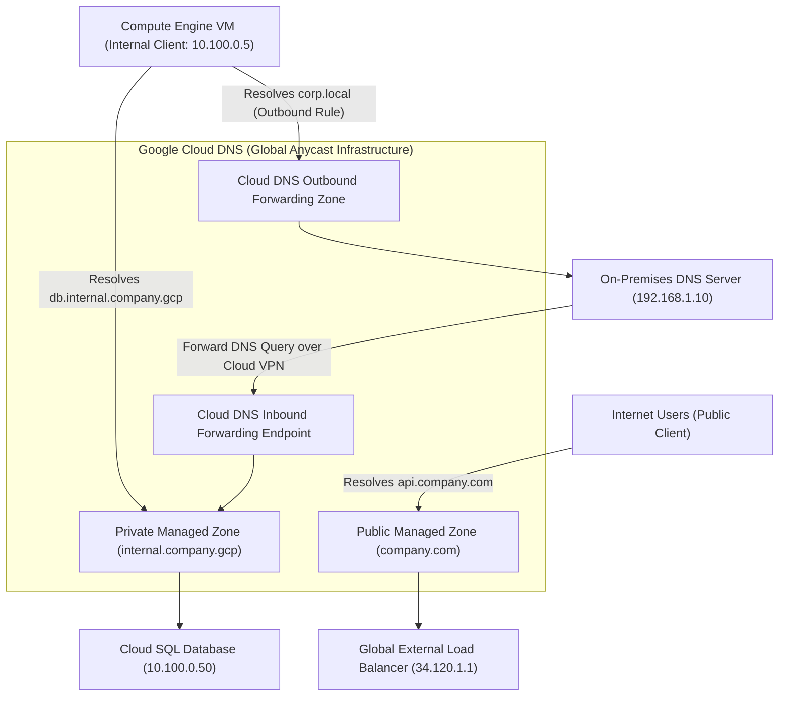

# Topic 31: Cloud DNS

---

## 1. What Is It?

**Google Cloud DNS** is a high-performance, resilient, global Domain Name System (DNS) service that translates human-readable domain names (such as `api.company.com`) into numerical IP addresses (`10.100.0.10` or `34.120.1.1`).

Cloud DNS operates on Google's global Anycast network, delivering 99.999% (100% SLA) uptime availability, ultra-low latency DNS resolution, and automated scaling.

It supports two primary operational modes:
1. **Public DNS Zones**: Serves public DNS records accessible to any user on the internet.
2. **Private DNS Zones**: Serves internal DNS records accessible exclusively inside your VPC networks, enabling hybrid cloud DNS forwarding between GCP and on-premises Active Directory / BIND DNS servers.

### Real-World Analogy
Think of Cloud DNS like a massive, global high-speed phone directory system. Instead of remembering complex 10-digit international phone numbers (IP Addresses), customers look up names in the directory ("Customer Support"). Cloud DNS instantly returns the exact extension number, routing callers to the correct desk anywhere in the world.

---

## 2. Where Does It Fit?

Cloud DNS sits at both the internet perimeter (Public DNS) and inside internal VPC networks (Private DNS & DNS Forwarding), resolving names for compute instances, databases, and microservices.



---

## 3. Core Concepts

| DNS Feature | Description | Example / Syntax | Best Practice |
|---|---|---|---|
| **Public Managed Zone** | DNS zone published to Google's public Anycast name servers (`ns-cloud-a1.googledomains.com`). | `company.com` | Enable DNSSEC to prevent DNS spoofing / cache poisoning. |
| **Private Managed Zone** | Internal DNS zone visible only to specified authorized VPC networks. | `internal.gcp.company.com` | Use for internal microservice discovery without public IP leaks. |
| **Inbound DNS Policy** | Creates an internal IP endpoint allowing on-premises DNS to resolve GCP private DNS zones. | Inbound Endpoint: `10.100.0.7` | Enables hybrid DNS resolution from on-prem to GCP. |
| **Outbound DNS Forwarding** | Forwards specific DNS queries from GCP VPC VMs to external/on-prem DNS servers. | Forward `corp.internal` to `192.168.1.10` | Connects GCP workloads to on-prem Active Directory DNS. |
| **DNSSEC** | Cryptographic signature validation verifying DNS record authenticity. | `dnssecConfig: state: "on"` | Mandate for public enterprise domain zones. |

---

## 4. How It Works

Private DNS resolution inside a GCP VPC operates via internal metadata resolvers:

```text
VM in VPC sends DNS query for `db.internal.gcp` to 169.254.169.254 (Port 53)
              ↓
Local Metadata Resolver checks VPC Private Cloud DNS Zones
              ↓
Matches Private Managed Zone `internal.gcp` (Type: Private)
              ↓
Returns internal RFC1918 IP `10.100.0.50` (A Record)
              ↓
(If Outbound Forwarding Rule matches): Forwards query over Cloud VPN to On-Prem DNS Server
```

1. **Zero Gateway Overhead**: Internal DNS resolution occurs at local hypervisors (`169.254.169.254`), providing instantaneous sub-millisecond lookups.
2. **Auto-Naming**: Compute Engine automatically assigns internal DNS names (`vm-name.c.project-id.internal`) to all VM instances.

---

## 5. Production Scenario

### Hybrid Enterprise DNS Resolution Architecture

```text
Requirement: Enable bidirectional DNS resolution between GCP private microservices (`*.gcp.company.com`) and on-premises Active Directory (`*.corp.local`).
    ↓
Architecture: Private Managed Zone + Cloud DNS Inbound/Outbound Policies connected via Cloud VPN.
    ↓
GCP Configuration:
  - Create Private Zone `gcp.company.com` linked to `prod-vpc`.
  - Create Outbound Forwarding Zone `corp.local` forwarding to On-Prem DNS (`192.168.1.10`).
  - Create Inbound DNS Policy on `prod-vpc` allocating Inbound IP `10.100.0.7`.
    ↓
On-Prem Configuration: Conditional Forwarder in Active Directory forwarding `gcp.company.com` to `10.100.0.7`.
    ↓
Security: DNSSEC enabled on public zones; private DNS queries isolated inside encrypted VPN tunnel.
    ↓
Monitoring: Cloud Logging tracking DNS query volume and response codes (`NOERROR`, `NXDOMAIN`).
```

*Why Selected*: Allows multi-cloud and hybrid workloads to resolve internal services seamlessly across environments using standard domain names rather than hardcoded IP addresses.

---

## 6. Hands-On Lab

### Prerequisites
- Active GCP Project with Custom VPC created (from Topic 27).
- Cloud Shell or `gcloud` CLI.
- IAM permissions: `roles/dns.admin`.

### Console Method
1. Log into [Google Cloud Console](https://console.cloud.google.com/).
2. Navigate to **Network services** → **Cloud DNS**.
3. Click **CREATE ZONE** at top.
4. Zone type: **Private**, Zone name: `private-gcp-zone`, DNS name: `internal.gcp.`.
5. Networks: Select `custom-prod-vpc`.
6. Click **CREATE**.
7. Inside the zone page, click **ADD STANDARD RECORD SET**:
   - Resource Record Type: `A`.
   - DNS Name: `db.internal.gcp.`.
   - IPv4 Address: `10.100.0.50`.
8. Click **CREATE**.

### CLI Method
Create a Private Managed DNS Zone and A Record using `gcloud`:

```bash
# Set project and VPC variables
PROJECT_ID="your-gcp-project-id"
VPC_NAME="custom-prod-vpc"
ZONE_NAME="private-gcp-zone"

# 1. Create a Private Managed DNS Zone linked to the VPC
gcloud dns managed-zones create $ZONE_NAME \
    --description="Internal Microservices Private Zone" \
    --dns-name="internal.gcp." \
    --visibility=private \
    --networks=$VPC_NAME

# 2. Add an A Record pointing to an internal IP address
gcloud dns record-sets create "api.internal.gcp." \
    --zone=$ZONE_NAME \
    --type="A" \
    --ttl=300 \
    --rrdatas="10.100.0.25"

# 3. List all record sets in the zone
gcloud dns record-sets list --zone=$ZONE_NAME
```

### Verification
SSH into a VM inside the VPC and test resolution:

```bash
# Execute dig command inside a VPC VM instance
gcloud compute ssh vm-us --zone=us-central1-a --command="dig api.internal.gcp. +short"
```
*Expected Result*: Returns `10.100.0.25` instantly from internal Cloud DNS metadata resolver.

### Cleanup
Delete record set and managed zone:

```bash
gcloud dns record-sets delete "api.internal.gcp." --type="A" --zone=$ZONE_NAME --quiet
gcloud dns managed-zones delete $ZONE_NAME --quiet
```

---

## 7. Security

### DNSSEC & Cache Poisoning Defense
- **DNSSEC on Public Zones**: Enable DNS Domain Name System Security Extensions (DNSSEC) on public zones to cryptographically sign DNS records, preventing DNS spoofing and man-in-the-middle cache poisoning attacks.
- **Private DNS Isolation**: Use Private DNS Zones for internal microservice communication to prevent leaking internal server hostnames and IP architectures to the public internet.

```text
BAD PRACTICE:
Publishing internal microservice hostnames (e.g., `prod-db-master.company.com`) with RFC1918 private IPs in Public DNS zones.
Risk: Exposes internal network topology, server names, and infrastructure details to external intelligence scanners.

PRODUCTION PRACTICE:
Keep internal infrastructure hostnames inside Private Managed DNS Zones linked exclusively to authorized VPC networks.
```

---

## 8. Scaling & High Availability

Anycast Global Availability Model:

```text
Traditional Master/Slave DNS Server (Single region bottleneck)
   ↓ (GCP Global Anycast Architecture)
Cloud DNS Anycast Name Servers (Hundreds of PoPs globally - 100% SLA)
   ↓ (Hybrid Enterprise Scale)
Cloud DNS Peering & Inbound/Outbound Policies (Bi-directional multi-VPC & on-prem resolution)
```

- **100% Uptime SLA**: Cloud DNS guarantees 100% availability for public DNS resolution, backed by Google's global Anycast edge network footprint.

---

## 9. Cost

### Pricing Factors in Cloud DNS
- **Managed Zone Charge**: Standard nominal fee per managed zone per month (approx. $0.20/zone/month).
- **DNS Query Charges**: Billed per million queries processed (approx. $0.40 per million queries for first 1B queries/month).
- **Internal Metadata Resolution**: Basic internal VM name resolution (`vm-name.c.project.internal`) is free.

---

## 10. Monitoring & Troubleshooting

### Cloud DNS Observability Tools
- **Cloud DNS Logging**: Enable logging on private zones to record DNS queries, client IPs, response codes (`NOERROR`, `NXDOMAIN`), and latency.
- **DNS Analytics in Monitoring**: View query volume metrics by zone and record type.

### Troubleshooting Matrix

| Symptom | Possible Cause | What to Check | Fix |
|---|---|---|---|
| `NXDOMAIN` error on internal VM lookup | Private Zone not attached to the VM's VPC network | Managed Zone details → Authorized VPC list | Edit Private Managed Zone and add target VPC network to the authorized list. |
| On-prem server cannot resolve GCP private zone | Cloud DNS Inbound Policy missing or firewall blocking port 53 | Inbound Policy IP & VPC Firewall rules | Create Inbound DNS Policy; add firewall rule allowing port 53 (UDP/TCP) from on-prem. |
| DNS changes taking hours to propagate | High Time-to-Live (TTL) setting on existing record set | Record Set TTL value | Reduce TTL (e.g., from 86400 to 300 seconds) *before* making planned IP migrations. |

---

## 11. Common Mistakes

```text
Mistake: Forgetting trailing dots in DNS record names when using `gcloud` or API calls (e.g., writing `api.company.com` instead of `api.company.com.`).
Why: Overlooking FQDN (Fully Qualified Domain Name) syntax requirements.
Impact: `gcloud` throws invalid domain name syntax errors.
Correct approach: Always include the trailing dot (`.`) for FQDNs in Cloud DNS commands.

Mistake: Making critical IP address changes without lowering the DNS record TTL in advance.
Why: Failing to account for client-side DNS caching.
Impact: End users continue routing traffic to old/deleted IP addresses until cached TTL expires.
Correct approach: Reduce TTL to 60–300 seconds 24 hours prior to initiating infrastructure IP migrations.
```

---

## 12. Production Best Practices

- [ ] Enable **DNSSEC** on all public enterprise managed zones.
- [ ] Use **Private Managed Zones** for internal microservices to avoid public hostname leaks.
- [ ] Implement **Inbound/Outbound DNS Policies** for bi-directional hybrid cloud DNS resolution.
- [ ] Reduce DNS record TTLs to 300 seconds prior to planned infrastructure migrations.
- [ ] Enable **Cloud DNS Logging** on private zones for security auditing and troubleshooting.
- [ ] Automate all managed zones and record sets using Infrastructure as Code (Terraform).

---

## 13. Hyperscaler / Enterprise Perspective

```text
Personal / Learning
  Public DNS Zone → Manual A record creation → Default 1-day TTL
        ↓
Small Production
  Private Managed Zone for VPC → basic DNSSEC enabled on public zone
        ↓
Enterprise Environment
  Inbound/Outbound DNS Policies connected to On-Prem AD → DNS Peering across Shared VPCs
        ↓
Hyperscaler Environment
  100% Terraform Managed DNS Architecture → Automated ExternalDNS for GKE → Security Command Center DNS Threat Logging
```

In a hyperscaler environment, DNS is fully automated. Kubernetes clusters use tools like **ExternalDNS** to automatically provision and delete Cloud DNS records as GKE ingress services scale. Centralized Cloud DNS Inbound/Outbound policies route millions of queries daily between multi-cloud networks and corporate Active Directory domains securely.

---

## 14. Real Project Questions

### Q1: What is the difference between a Public Managed Zone and a Private Managed Zone in Cloud DNS?
**Answer:** A Public Managed Zone publishes DNS records to Google's global Anycast name servers, making them resolveable by any client on the public internet. A Private Managed Zone publishes DNS records that are visible and resolveable *only* by authorized VMs connected to specified VPC networks, isolating internal infrastructure IP addresses from the public internet.

### Q2: How does Cloud DNS Inbound and Outbound forwarding enable hybrid cloud connectivity?
**Answer:** An **Inbound DNS Policy** allocates an internal IP address endpoint inside a GCP VPC, allowing on-premises DNS servers (like Active Directory) to forward queries for `*.gcp.company.com` into Cloud DNS over VPN/Interconnect. An **Outbound DNS Forwarding Zone** instructs Cloud DNS to forward queries for `*.corp.local` originating from GCP VMs out to on-premises DNS servers.

### Q3: Why is DNSSEC important for public enterprise domain zones?
**Answer:** DNSSEC (DNS Security Extensions) adds digital cryptographic signatures to DNS records. When enabled, resolving name servers verify the authenticity of the cryptographic signature against the domain's trust chain, preventing attackers from spoofing DNS responses, poisoning DNS caches, or redirecting users to malicious phishing websites.

---

## 15. Quick Decision Guide

| Requirement | Recommended Approach | Reason |
|---|---|---|
| Resolving internal database IP addresses for GKE microservices | **Private Managed DNS Zone** | Resolves internal RFC1918 IPs securely inside the VPC without public exposure. |
| On-premises Active Directory needing to resolve GCP resources | **Cloud DNS Inbound Policy** | Exposes internal IP endpoints inside VPC for on-premises DNS forwarders. |
| Protecting public domain name against DNS spoofing attacks | **Enable DNSSEC on Public Managed Zone** | Cryptographically signs DNS records to guarantee record authenticity. |

### When should I use it?
- Essential service for managing public domain records and internal microservice service discovery in GCP.

### When should I NOT use it?
- Do not publish private internal IP addresses in Public Managed Zones.

---

## 16. Related Services

```text
                [31. Cloud DNS]
               /       |       \
        Public Zones Private  Cloud VPN /
          (DNSSEC)    Zones  Interconnect
             |          |          |
        Internet     VPC VMs    Hybrid DNS
```

- **Cloud VPN / Interconnect**: Provides private transport for hybrid DNS forwarding.
- **Google Kubernetes Engine (GKE)**: Integrates via ExternalDNS for automated pod service discovery.
- **Global Load Balancing**: Integrates with Cloud DNS A/AAAA records for Anycast routing.

---

## 17. Cheat Sheet

### Core Concepts
- **Public Zone**: Internet-facing DNS zone.
- **Private Zone**: VPC-scoped internal DNS zone.
- **DNSSEC**: Cryptographic DNS signature validation.
- **Inbound Policy**: Allows on-prem to query GCP DNS.
- **Outbound Zone**: Forwards GCP DNS queries to on-prem.

### Useful Commands
```bash
# Create a private DNS zone
gcloud dns managed-zones create ZONE_NAME \
    --dns-name="internal.company.gcp." --visibility=private --networks=VPC_NAME

# Add an A record to a zone
gcloud dns record-sets create "api.internal.company.gcp." \
    --zone=ZONE_NAME --type="A" --ttl=300 --rrdatas="10.100.0.10"

# List record sets in a zone
gcloud dns record-sets list --zone=ZONE_NAME
```

---

## 18. Learning Connection

- **Previous Topic**: [30. Firewall Rules](../30-firewall-rules/README.md)
- **Next Topic**: [32. Cloud Router](../32-cloud-router/README.md)
