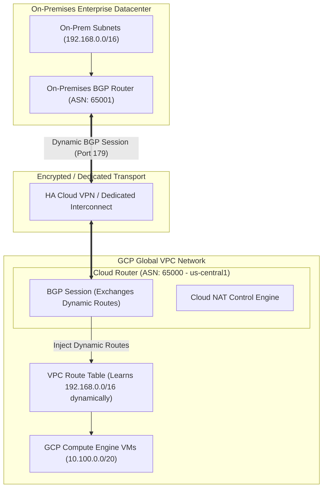

# Topic 32: Cloud Router

---

## 1. What Is It?

**Google Cloud Router** is a fully managed, distributed, software-defined virtual router that provides dynamic Border Gateway Protocol (BGP) routing for your Google Cloud VPC networks.

Cloud Router automatically exchanges dynamic routing information between your GCP VPC subnets and external networks—such as on-premises datacenters, remote branch offices, or third-party cloud environments—over HA Cloud VPN tunnels or Dedicated/Partner Cloud Interconnect circuits.

Additionally, Cloud Router serves as the control plane engine required for configuring **Cloud NAT** (Network Address Translation).

### Real-World Analogy
Think of Cloud Router like an automated traffic control air traffic controller operating at an international airport. Instead of workers manually painting permanent detour signs (Static Routes) whenever a runway closes or opens, the Air Traffic Controller (Cloud Router) uses radio frequency channels (BGP) to instantly broadcast real-time flight path updates to all incoming pilots, ensuring traffic flows around obstacles automatically without accidents.

---

## 2. Where Does It Fit?

Cloud Router operates as a regional control-plane service inside a GCP VPC, establishing BGP peering sessions over VPN/Interconnect connections and configuring Cloud NAT gateways.



---

## 3. Core Concepts

| Concept | Description | Example / Syntax | Best Practice |
|---|---|---|---|
| **Autonomous System Number (ASN)** | Unique integer identifying BGP routing domains. | GCP Private ASN: `65000`, On-Prem ASN: `65001` | Use private ASNs (`64512–65534`) for internal hybrid routing. |
| **BGP Session** | Active TCP connection (Port 179) exchanging route updates between routers. | Cloud Router <-> On-Prem Router BGP Peering | Establish dual BGP sessions across HA VPN for 99.99% SLA. |
| **BGP Route Advertisement** | Custom or Default IP ranges announced by Cloud Router to BGP peers. | Advertise `10.100.0.0/20` to On-Premises | Use Custom Route Advertisements to control hybrid traffic flow. |
| **Dynamic Routing Mode** | Scope of BGP route propagation within the GCP VPC. | `REGIONAL` or `GLOBAL` | **Set to GLOBAL** in enterprise multi-region VPC setups. |
| **BGP MED (Multi-Exit Discriminator)** | Priority metric assigned to advertised routes to influence ingress paths. | MED `100` (Primary) vs. MED `200` (Backup) | Use MED to configure active/standby hybrid failover paths. |

---

## 4. How It Works

Dynamic BGP routing via Cloud Router operates through continuous route exchange:

```text
HA Cloud VPN Tunnel establishes physical link between GCP and On-Premises
              ↓
Cloud Router opens TCP Port 179 BGP Session with On-Prem Router
              ↓
Cloud Router advertises GCP VPC Subnet CIDRs (10.100.0.0/20) to On-Premises
              ↓
On-Prem Router advertises On-Prem CIDRs (192.168.0.0/16) to Cloud Router
              ↓
Cloud Router dynamically updates GCP Global VPC Route Table with learned CIDRs
              ↓
(Failover Event): Primary VPN Tunnel goes down -> BGP detects session drop -> Traffic instantly switches to Backup Tunnel (<5 seconds)
```

1. **Software-Defined Control Plane**: Cloud Router manages BGP route exchanges in software, but actual packet data flows directly through hypervisors and VPN gateways.
2. **Zero In-Band Performance Bottleneck**: Cloud Router does not carry data packets; it configures the underlying VPC routing table.

---

## 5. Production Scenario

### Active/Standby Hybrid Cloud VPN Failover

```text
Requirement: Connect an enterprise datacenter to GCP via HA Cloud VPN with automatic 5-second failover and zero manual route edits.
    ↓
Architecture: Cloud Router (`cr-hybrid-uscentral1`) configured with Global Dynamic Routing and dual BGP sessions.
    ↓
BGP Configuration:
  - Cloud Router ASN: `65000`
  - Tunnel 1 BGP Peer (Primary): On-Prem Router 1 (ASN `65001`), MED `100`
  - Tunnel 2 BGP Peer (Backup): On-Prem Router 2 (ASN `65001`), MED `200`
    ↓
Security: IPSec AES-256 encryption on HA VPN tunnels; BGP MD5 authentication enabled.
    ↓
Failover Mechanics: Traffic uses Tunnel 1 (MED 100); if Tunnel 1 fails, BGP shifts traffic to Tunnel 2 (MED 200) in <5 seconds.
    ↓
Monitoring: Cloud Monitoring tracking BGP session state (`bgp/session_up`).
```

*Why Selected*: Dynamic BGP routing eliminates brittle static routes, providing automated fault detection and seamless failover for enterprise hybrid networks.

---

## 6. Hands-On Lab

### Prerequisites
- Active GCP Project with Custom VPC created (from Topic 27).
- Cloud Shell or `gcloud` CLI.
- IAM permissions: `roles/compute.networkAdmin`.

### Console Method
1. Log into [Google Cloud Console](https://console.cloud.google.com/).
2. Navigate to **Hybrid Connectivity** → **Cloud Routers**.
3. Click **CREATE ROUTER** at top.
4. Set Name: `cr-hybrid-uscentral1`, Network: `custom-prod-vpc`, Region: `us-central1`.
5. Google ASN: `65000`.
6. Dynamic Routing Mode: **Global**.
7. Under **BGP routes**, select **Advertise all subnets visible to the VPC network**.
8. Click **CREATE**.

### CLI Method
Create and inspect a Cloud Router using `gcloud`:

```bash
# Set project and VPC variables
PROJECT_ID="your-gcp-project-id"
VPC_NAME="custom-prod-vpc"
ROUTER_NAME="cr-hybrid-uscentral1"

# 1. Create a Cloud Router with Global Dynamic Routing
gcloud compute routers create $ROUTER_NAME \
    --network=$VPC_NAME \
    --region=us-central1 \
    --asn=65000 \
    --set-advertisement-mode=DEFAULT

# 2. Add custom BGP route advertisements (e.g., advertising specific IP ranges)
gcloud compute routers update $ROUTER_NAME \
    --region=us-central1 \
    --set-advertisement-mode=CUSTOM \
    --set-advertisement-groups=ALL_SUBNETS \
    --add-advertisement-ranges=10.250.0.0/16

# 3. Describe Cloud Router status and BGP configuration
gcloud compute routers describe $ROUTER_NAME --region=us-central1
```

### Verification
Check Cloud Router status to verify BGP engine initialization:

```bash
gcloud compute routers get-status $ROUTER_NAME --region=us-central1
```
*Expected Result*: Output displays router details, BGP configuration, and status of active BGP sessions.

### Cleanup
Delete test Cloud Router:

```bash
gcloud compute routers delete $ROUTER_NAME --region=us-central1 --quiet
```

---

## 7. Security

### BGP Security & Route Hijacking Prevention
- **BGP MD5 Authentication**: Enable BGP MD5 authentication keys on BGP sessions to prevent unauthorized devices from injecting fake routes into your VPC.
- **Custom Route Filtering**: Use Custom Route Advertisements to strictly control which internal IP ranges are announced to external networks.
- **Global Dynamic Routing Scope**: Use Global Dynamic Routing with care to ensure private subnets in overseas regions are not unintentionally exposed to on-premises networks without firewall checks.

```text
BAD PRACTICE:
Relying on static routes for hybrid Cloud VPN connections to on-premises datacenters.
Risk: If a primary VPN tunnel fails, static routes continue blackholing traffic, causing prolonged manual network outages.

PRODUCTION PRACTICE:
Use Cloud Router with dynamic BGP routing and HA Cloud VPN. Enforce BGP MD5 authentication and configure dual BGP sessions.
```

---

## 8. Scaling & High Availability

Dynamic Routing Modes & SLA:

```text
Regional Dynamic Routing Mode (BGP routes learned in us-central1 are ONLY visible to us-central1 VMs)
   ↓ (Enterprise Multi-Region Standard)
Global Dynamic Routing Mode (BGP routes learned in us-central1 are visible to ALL VMs in ALL regions worldwide)
   ↓ (99.99% High Availability SLA)
Dual Cloud Routers + HA Cloud VPN / Dedicated Interconnect (Redundant BGP sessions across distinct regions)
```

- **Global Dynamic Routing**: Mandatory setting for enterprise multi-region VPCs. Allows a VM in `europe-west1` to route to an on-premises network via a Cloud Router located in `us-central1`.

---

## 9. Cost

### Cloud Router Pricing
- **Control Plane $0**: Operating a Cloud Router itself incurs **zero direct hourly charge**.
- **Data Transport Costs**: Charges derive from the underlying Cloud VPN tunnels, Dedicated Interconnect circuits, or Cloud NAT data processing that Cloud Router manages.

---

## 10. Monitoring & Troubleshooting

### Cloud Router Observability Tools
- **Cloud Monitoring BGP Metrics**: Metric `router.googleapis.com/bgp/session_up` (1 = Up, 0 = Down).
- **Console BGP Status**: Real-time BGP session status indicator in Hybrid Connectivity dashboard.

### Troubleshooting Matrix

| Symptom | Possible Cause | What to Check | Fix |
|---|---|---|---|
| BGP Session stuck in `CONNECT` or `DOWN` state | BGP IP mismatch, ASN mismatch, or TCP 179 blocked by on-prem firewall | `gcloud compute routers get-status` | Verify BGP peer IP, ASN settings, and allow TCP 179 on on-prem router. |
| Learned on-prem routes not visible in another GCP region | Cloud Router Dynamic Routing Mode set to `REGIONAL` instead of `GLOBAL` | `gcloud compute networks describe <vpc>` | Change VPC Dynamic Routing Mode to `GLOBAL`. |
| Traffic routing over backup VPN instead of primary | BGP MED priority values inverted on on-premises router | BGP advertised MED values | Set lower MED value (e.g., 100) on primary link and higher MED (e.g., 200) on backup. |

---

## 11. Common Mistakes

```text
Mistake: Leaving VPC Dynamic Routing Mode set to `REGIONAL` in a multi-region VPC environment.
Why: Accepting the default single-region setting during VPC creation.
Impact: VMs deployed in `europe-west1` cannot communicate with on-premises networks connected via Cloud Router in `us-central1`.
Correct approach: Always set VPC Dynamic Routing Mode to `GLOBAL`.

Mistake: Confusing Cloud Router with a data-plane hardware router appliance.
Why: Expecting Cloud Router to show CPU/memory utilization or throughput bottlenecks.
Impact: Misunderstanding that Cloud Router is a pure control-plane software service.
Correct approach: Recognize that Cloud Router manages BGP software state; data packets flow at line-rate through hypervisors.
```

---

## 12. Production Best Practices

- [ ] Set VPC Dynamic Routing Mode to **GLOBAL** for all multi-region VPCs.
- [ ] Use **Cloud Router with dynamic BGP** instead of static routes for hybrid connectivity.
- [ ] Enable **BGP MD5 Authentication** on all external BGP sessions.
- [ ] Configure **BGP MED values** to establish deterministic primary and secondary failover paths.
- [ ] Set up Cloud Monitoring alert policies on `bgp/session_up` metrics.
- [ ] Automate Cloud Router and BGP peering configurations using Infrastructure as Code (Terraform).

---

## 13. Hyperscaler / Enterprise Perspective

```text
Personal / Learning
  Static VPC Routes → Single VPN tunnel → No BGP routing
        ↓
Small Production
  Single Cloud Router → Basic HA VPN → Regional Dynamic Routing
        ↓
Enterprise Environment
  Dual Cloud Routers across 2 Regions → Global Dynamic Routing → Dedicated Interconnect BGP Peering
        ↓
Hyperscaler Environment
  Automated BGP Peering Automation → Multi-Tier Transit VPC Routing → Real-time BGP Route Flap Damping & SCC Alerts
```

In a hyperscaler environment, Cloud Routers form the dynamic mesh connecting hybrid networks globally. Enterprises deploy redundant Cloud Routers across multiple regions, peering with Dedicated Cloud Interconnect circuits to dynamically route terabits of traffic between on-premises datacenters and global VPC subnets with 99.99% availability SLAs.

---

## 14. Real Project Questions

### Q1: What is the primary difference between Static Routing and Dynamic BGP Routing via Cloud Router in GCP?
**Answer:** Static Routing requires manually configuring fixed destination IP rules in VPC route tables; if a network path or VPN tunnel fails, static routes continue blackholing traffic until manually updated. Dynamic BGP Routing via Cloud Router uses Border Gateway Protocol to automatically exchange, update, and withdraw route paths in real time, enabling automatic failover in <5 seconds.

### Q2: Why is setting the VPC Dynamic Routing Mode to GLOBAL essential for multi-region hybrid networks?
**Answer:** In `REGIONAL` mode, routes learned by a Cloud Router in `us-central1` are only populated into the route tables of VMs located in `us-central1`. In `GLOBAL` mode, BGP routes learned anywhere in the world are propagated to all VMs across all regions in the global VPC, enabling seamless multi-region hybrid connectivity.

### Q3: Does Cloud Router process and forward actual data packets between networks?
**Answer:** No. Cloud Router is purely a **control-plane** software service that manages BGP sessions and populates the global VPC routing table. Actual data plane packets bypass Cloud Router completely, flowing at line-rate directly through host hypervisors, HA VPN gateways, or Dedicated Interconnect hardware.

---

## 15. Quick Decision Guide

| Requirement | Recommended Approach | Reason |
|---|---|---|
| Automatic 5-second failover between dual Cloud VPN tunnels | **Cloud Router + BGP Dynamic Routing** | Automatically detects tunnel failure and reroutes traffic over healthy BGP paths. |
| Provisioning outbound internet access for private VMs | **Cloud Router + Cloud NAT Gateway** | Cloud Router provides the control plane required to run Cloud NAT. |
| Connecting a single short-term test VM to a remote office | **Static VPN Route (Non-production only)** | Simple setup for non-production environments where SLA and failover are not required. |

### When should I use it?
- Mandatory service for configuring Cloud NAT, HA Cloud VPN, or Dedicated/Partner Cloud Interconnect.

### When should I NOT use it?
- Not required for standard internal VPC communication between subnets in the same network.

---

## 16. Related Services

```text
               [32. Cloud Router]
              /        |        \
        HA Cloud   Cloud NAT   Dedicated
          VPN       Gateway   Interconnect
           |           |           |
      Encrypted     Private     Private 10G/100G
         IPSec      Egress      Fiber Links
```

- **HA Cloud VPN**: Encrypted IPsec tunnels utilizing Cloud Router BGP.
- **Cloud NAT**: Managed NAT gateway controlled by Cloud Router.
- **Cloud Interconnect**: Dedicated high-speed fiber circuits using Cloud Router BGP.

---

## 17. Cheat Sheet

### Core Attributes
- **Service Type**: Software-defined BGP Control Plane.
- **Routing Modes**: Global (Recommended) vs. Regional.
- **BGP Port**: TCP 179.
- **Private ASN Range**: `64512–65534` or `4200000000–4294967294`.

### Useful Commands
```bash
# Create a Cloud Router with Global Dynamic Routing
gcloud compute routers create ROUTER_NAME \
    --network=VPC_NAME --region=us-central1 --asn=65000

# Add BGP peer to a Cloud Router
gcloud compute routers add-bgp-peer ROUTER_NAME \
    --region=us-central1 --peer-name=PEER_NAME \
    --peer-asn=65001 --interface=IF_NAME --peer-ip=IP_ADDR

# Inspect BGP session status
gcloud compute routers get-status ROUTER_NAME --region=us-central1
```

---

## 18. Learning Connection

- **Previous Topic**: [31. Cloud DNS](../31-cloud-dns/README.md)
- **Next Topic**: [33. Cloud NAT](../33-cloud-nat/README.md)
