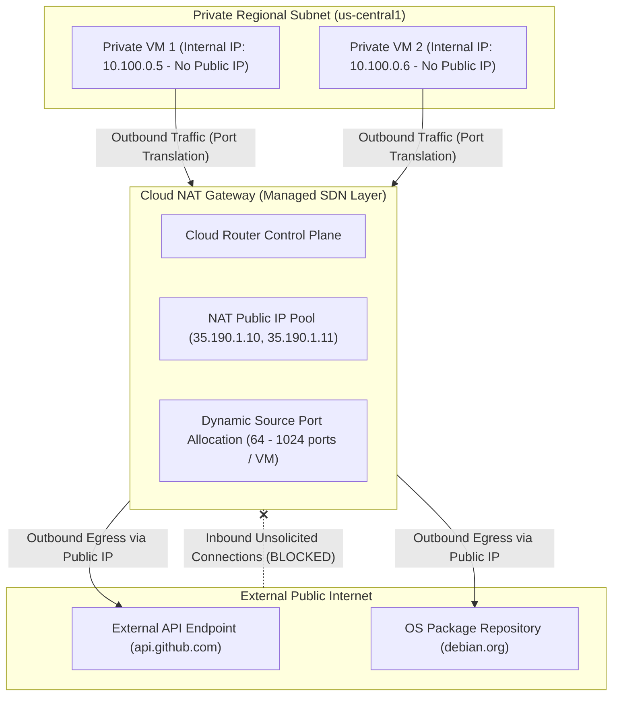

# Topic 33: Cloud NAT

---

## 1. What Is It?

**Google Cloud NAT** (Network Address Translation) is a fully managed, distributed, software-defined network service that enables Compute Engine instances and GKE Pods without external public IP addresses to send outbound packets to the internet (for software updates, API calls, or OS patching) while completely blocking unauthorized inbound internet connections.

Cloud NAT operates as a **regional Gateway service**. It does not rely on intermediate NAT virtual machines or proxy appliances. Instead, Cloud NAT allocates public IP addresses and source port mappings directly on the host hypervisors using Andromeda SDN.

### Real-World Analogy
Think of Cloud NAT like a secure outbound-only mailroom in a corporate research facility. Scientists inside private laboratory rooms (Private VMs) can drop outgoing letters into the mailroom slot to be sent out to external suppliers (Internet). The mailroom stamps the outgoing letters with the company's official return address (Cloud NAT Public IP). However, external strangers on the street cannot walk into the building or send unsolicited letters directly into private laboratory rooms.

---

## 2. Where Does It Fit?

Cloud NAT attaches to a Cloud Router in a specific region, providing outbound Network Address Translation for VMs in private VPC subnets.



---

## 3. Core Concepts

| Cloud NAT Concept | Description | Default / Option | Best Practice |
|---|---|---|---|
| **Auto-Allocated IPs** | GCP automatically provisions and scales external IP addresses as NAT demand grows. | `natIpAllocateOption: AUTO_ONLY` | Recommended for general outbound internet access. |
| **Manual IPs** | Customer specifies exact static external IP addresses to be used by Cloud NAT. | `natIpAllocateOption: MANUAL_ONLY` | Required when external partners require IP whitelisting. |
| **Minimum Ports per VM** | Minimum number of source ports allocated to each VM instance for NAT connections. | Default: `64` ports (Max connections: 64) | Increase to `1024` or higher for high-concurrency microservices. |
| **Endpoint Independent Mapping** | Reuses the same NAT IP:Port mapping for connections to different external hosts. | `enableEndpointIndependentMapping: true` | Recommended for WebRTC and peer-to-peer applications. |
| **Public NAT vs. Private NAT** | Public NAT translates to Public IPs; Private NAT translates between private subnets. | Public NAT (Default) | Use Public NAT for internet egress; Private NAT for overlapping VPCs. |

---

## 4. How It Works

Packet translation in Cloud NAT occurs at line-rate speed on host hypervisors:

```text
Private VM (10.100.0.5:45210) sends HTTPS request to 140.82.121.4 (GitHub API)
              ↓
Packet arrives at Hypervisor virtual NIC
              ↓
Hypervisor Andromeda SDN substitutes Source IP:Port with Cloud NAT IP:Port:
  Source: 10.100.0.5:45210 → Replaced by 35.190.1.10:10254
              ↓
Packet routed over internet to 140.82.121.4
              ↓
Return response packet (Destination: 35.190.1.10:10254) arrives at hypervisor
              ↓
Hypervisor translates Destination back to 10.100.0.5:45210 → Delivered to Private VM
```

1. **No Chokepoints**: Traffic does not route through a central NAT VM appliance. Andromeda handles translation in parallel on every hypervisor.
2. **Dynamic Scaling**: If VMs exhaust allocated source ports, Cloud NAT automatically attaches additional external IP addresses (in Auto mode).

---

## 5. Production Scenario

### Secure Enterprise Outbound Egress with Partner IP Whitelisting

```text
Requirement: Enable 200 private GKE nodes to fetch OS updates and call external Payment Gateway APIs that require strict IP whitelisting.
    ↓
Architecture: Cloud NAT configured with **Manual IP Allocation** using 2 Static External IP addresses (`35.200.1.1`, `35.200.1.2`).
    ↓
Configuration:
  - Attached to Cloud Router `cr-nat-uscentral1`.
  - Subnet Scope: Primary & Secondary ranges of `sb-prod-uscentral1`.
  - Min ports per VM: `1024` (to prevent port exhaustion during parallel API bursts).
    ↓
Security: Payment Gateway whitelists IPs `35.200.1.1` and `35.200.1.2`. Private GKE nodes have zero public IPs.
    ↓
Monitoring: Cloud Monitoring alert policy on `nat/port_usage` tracking port exhaustion risks.
```

*Why Selected*: Manual IP allocation provides fixed, predictable external IP addresses for external firewall whitelisting without sacrificing the scale and reliability of managed serverless NAT.

---

## 6. Hands-On Lab

### Prerequisites
- Active GCP Project with Custom VPC and Private VM created (no public IP).
- Cloud Shell or `gcloud` CLI.
- IAM permissions: `roles/compute.networkAdmin`.

### Console Method
1. Log into [Google Cloud Console](https://console.cloud.google.com/).
2. Navigate to **Network services** → **Cloud NAT**.
3. Click **GET STARTED** (or **CREATE CLOUD NAT GATEWAY**).
4. Set Gateway name: `nat-gateway-uscentral1`.
5. Select VPC network: `custom-prod-vpc`, Region: `us-central1`.
6. Select Cloud Router: Click **Create new router** → Name: `cr-nat-uscentral1` → Click **Create**.
7. NAT IP addresses: Select **Automatic (recommended)**.
8. Advanced configuration: Set **Minimum ports per VM instance**: `1024`.
9. Click **CREATE**.

### CLI Method
Create a Cloud NAT gateway with manual static IP addresses using `gcloud`:

```bash
# Set project variables
PROJECT_ID="your-gcp-project-id"
VPC_NAME="custom-prod-vpc"
REGION="us-central1"

# 1. Create Cloud Router (Control plane for NAT)
gcloud compute routers create cr-nat-uscentral1 \
    --network=$VPC_NAME \
    --region=$REGION

# 2. Reserve a static external IP address for manual NAT allocation
gcloud compute addresses create nat-static-ip-1 \
    --region=$REGION

# 3. Create Cloud NAT gateway using the reserved static IP
gcloud compute routers nats create nat-gw-uscentral1 \
    --router=cr-nat-uscentral1 \
    --region=$REGION \
    --nat-all-subnet-ip-ranges \
    --nat-external-ip-pool=nat-static-ip-1 \
    --min-ports-per-vm=1024 \
    --enable-logging
```

### Verification
SSH into a private VM (via IAP) and verify outbound internet connectivity and egress IP:

```bash
gcloud compute ssh private-vm --zone=us-central1-a --tunnel-through-iap \
    --command="curl -s https://ifconfig.me"
```
*Expected Result*: Returns `35.200.1.1` (the Cloud NAT static external IP), confirming successful outbound NAT translation.

### Cleanup
Delete Cloud NAT gateway, router, and static IP:

```bash
gcloud compute routers nats delete nat-gw-uscentral1 --router=cr-nat-uscentral1 --region=$REGION --quiet
gcloud compute routers delete cr-nat-uscentral1 --region=$REGION --quiet
gcloud compute addresses delete nat-static-ip-1 --region=$REGION --quiet
```

---

## 7. Security

### Egress Security & Anti-Exfiltration
- **Strictly Ingress-Free**: Cloud NAT allows ONLY outbound-initiated connections. Unsolicited inbound connection attempts from the internet are dropped automatically.
- **Pair with Private Google Access**: Use Private Google Access for GCP APIs (GCS, BigQuery) so traffic stays on Google's private network rather than traversing Cloud NAT.
- **Port Exhaustion Prevention**: Set appropriate `min-ports-per-vm` to prevent TCP source port exhaustion attacks or connection drops during traffic bursts.

```text
BAD PRACTICE:
Assigning ephemeral public IP addresses directly to every production VM instance to grant outbound internet access.
Risk: Exposes all VMs to internet-wide ingress port scanning, brute-force attacks, and direct exploit attempts.

PRODUCTION PRACTICE:
Deploy all VMs and GKE nodes in Private Subnets with zero public IPs. Route outbound internet traffic through Cloud NAT.
```

---

## 8. Scaling & High Availability

Cloud NAT Architecture at Scale:

```text
Individual NAT Appliance VM (Single point of failure - 1 Gbps throughput ceiling)
   ↓ (GCP Software-Defined Distributed Architecture)
Cloud NAT Gateway (Line-rate scaling - Up to 3,000,000 concurrent connections per IP)
   ↓ (Dynamic Multi-IP Auto-Scaling)
Auto-Allocated Public IP Pool (Automatically adds new public IPs when port demand increases)
```

- **Per-IP Capacity**: Each static public IP allocated to Cloud NAT provides 64,512 usable source ports. Adding static IPs scales max concurrent connections linearly.

---

## 9. Cost

### Cloud NAT Cost Structure
- **Hourly Gateway Fee**: Nominal hourly fee per Cloud NAT gateway running in a region (~$0.045/hour).
- **Data Ingestion/Egress Fee**: Per-GB charge for data processed by Cloud NAT (~$0.045/GB for first 10 TB).

```text
FinOps Optimization Tip:
Enable Private Google Access on subnets. Traffic to Cloud Storage, BigQuery, and Secret Manager will bypass Cloud NAT, avoiding Cloud NAT per-GB data processing fees.
```

---

## 10. Monitoring & Troubleshooting

### Cloud NAT Observability Tools
- **Cloud Monitoring NAT Metrics**: Metrics `nat/port_usage`, `nat/allocated_ports`, and `nat/dropped_sent_packets`.
- **Cloud NAT Logging**: Logs dropped packets due to port exhaustion or connection errors.

### Troubleshooting Matrix

| Symptom | Possible Cause | What to Check | Fix |
|---|---|---|---|
| Outbound API connections timing out intermittently | **NAT Port Exhaustion** (VM ran out of allocated source ports) | Metric `nat/dropped_sent_packets` | Increase `--min-ports-per-vm` (e.g., from 64 to 1024) or add static IPs. |
| Private VM cannot reach external internet | Cloud NAT gateway not configured for VM's subnet | Subnet NAT inclusion settings | Update Cloud NAT to include `--nat-all-subnet-ip-ranges`. |
| High Cloud NAT processing costs | GCP API traffic (GCS/BigQuery) routing through Cloud NAT | Subnet Private Google Access status | Enable **Private Google Access** on the subnet to bypass Cloud NAT. |

---

## 11. Common Mistakes

```text
Mistake: Failing to enable Private Google Access on subnets when using Cloud NAT.
Why: Assuming Cloud NAT handles all outbound traffic identically.
Impact: Paying double fees: Cloud NAT per-GB data processing fee AND Cloud Storage egress fees.
Correct approach: Enable Private Google Access so GCP API traffic bypasses Cloud NAT entirely.

Mistake: Leaving `--min-ports-per-vm` set to default 64 for high-throughput GKE nodes or microservices.
Why: Accepting defaults without calculating concurrent connection requirements.
Impact: Severe packet drops and 504 timeouts during API traffic bursts due to NAT port exhaustion.
Correct approach: Set `--min-ports-per-vm` to 1024 or higher for production microservice workloads.
```

---

## 12. Production Best Practices

- [ ] Deploy 100% of production compute instances in private subnets without public IPs.
- [ ] Use **Cloud NAT** for outbound internet egress (OS patches, external API calls).
- [ ] Enable **Private Google Access** on subnets to bypass Cloud NAT for GCP APIs.
- [ ] Use **Manual IP Allocation** if external partners require IP whitelisting.
- [ ] Increase `--min-ports-per-vm` to 1024 or higher for containerized microservices.
- [ ] Configure Cloud Monitoring alerts for `nat/dropped_sent_packets` to detect port exhaustion.

---

## 13. Hyperscaler / Enterprise Perspective

```text
Personal / Learning
  Public IPs on VMs → Direct internet egress → No NAT
        ↓
Small Production
  Cloud NAT with Auto IP allocation → Default 64 min ports → Basic egress
        ↓
Enterprise Environment
  Cloud NAT with Manual Static IP Pool → Fixed Whitelisted Egress IPs → VPC Flow Logging
        ↓
Hyperscaler Environment
  Multi-Region Cloud NAT Clusters → Automated Port Exhaustion Alerting → Dedicated Secure Web Gateways (Proxy) for HTTP Egress
```

In a hyperscaler environment, zero production VMs possess public IP addresses. Central network teams deploy regional Cloud NAT gateways using reserved pools of static external IPs for deterministic partner whitelisting. High-throughput HTTP traffic routes through enterprise Secure Web Proxies, while system updates utilize Cloud NAT with automated port monitoring.

---

## 14. Real Project Questions

### Q1: How does Cloud NAT differ from running a traditional NAT instance VM on Compute Engine?
**Answer:** A traditional NAT VM instance is a single point of failure and a bandwidth bottleneck capped by the VM's machine type. Cloud NAT is a managed, software-defined regional service that performs address translation directly on host hypervisors via Andromeda SDN. It scales to millions of concurrent connections at line-rate speed with 100% high availability and zero VM management.

### Q2: Why is enabling Private Google Access recommended alongside Cloud NAT?
**Answer:** Private Google Access routes traffic destined for Google APIs (such as Cloud Storage or BigQuery) over Google's internal network directly. If Private Google Access is disabled, VMs send API traffic through the Cloud NAT gateway, incurring unnecessary Cloud NAT per-GB data processing fees and wasting NAT source ports.

### Q3: What causes NAT Port Exhaustion and how do you prevent it?
**Answer:** NAT Port Exhaustion occurs when a private VM attempts to open more concurrent outbound TCP/UDP connections than the `min-ports-per-vm` threshold allocated to it by Cloud NAT. When exhausted, new outbound connections are dropped. It is prevented by increasing `--min-ports-per-vm` (e.g., to 1024+) or adding static external IPs to the Cloud NAT pool.

---

## 15. Quick Decision Guide

| Requirement | Recommended Approach | Reason |
|---|---|---|
| Private VMs requiring outbound internet access for OS security updates | **Cloud NAT Gateway (Auto IP Allocation)** | Managed outbound internet access with zero public IPs on VMs. |
| Private microservices calling third-party API that whitelists source IPs | **Cloud NAT Gateway (Manual Static IP Pool)** | Provides fixed, static external IPv4 addresses for external firewall whitelisting. |
| High-throughput GKE nodes making thousands of concurrent API requests | **Cloud NAT with `--min-ports-per-vm=1024`** | Prevents source port exhaustion during parallel container connection spikes. |

### When should I use it?
- Mandatory service for providing secure outbound internet access to private VMs and GKE nodes.

### When should I NOT use it?
- Do not use Cloud NAT for inbound connection handling—use External Load Balancers for ingress.

---

## 16. Related Services

```text
                 [33. Cloud NAT]
                /       |       \
        Cloud Router  Private    Compute Engine /
        (Control)    Subnets     GKE Pods
           |            |           |
        Routing     No Public    Private Egress
        Metadata       IPs         Workloads
```

- **Cloud Router**: Provides the regional control plane required to run Cloud NAT.
- **Private Subnets**: Networks containing private VMs utilizing Cloud NAT.
- **Cloud Storage / BigQuery**: Accessed privately via Private Google Access to bypass Cloud NAT.

---

## 17. Cheat Sheet

### Key Configuration Flags
- `--nat-all-subnet-ip-ranges` : Apply NAT to all subnets in the region.
- `--nat-external-ip-pool` : Specify static IPs for manual allocation.
- `--min-ports-per-vm` : Minimum source ports per VM (Default: 64).

### Useful Commands
```bash
# Reserve static IP for NAT
gcloud compute addresses create nat-ip-1 --region=us-central1

# Create Cloud NAT with manual static IP
gcloud compute routers nats create NAT_NAME \
    --router=ROUTER_NAME --region=us-central1 \
    --nat-all-subnet-ip-ranges \
    --nat-external-ip-pool=nat-ip-1 --min-ports-per-vm=1024

# List Cloud NAT gateways
gcloud compute routers nats list --router=ROUTER_NAME --region=us-central1
```

---

## 18. Learning Connection

- **Previous Topic**: [32. Cloud Router](../32-cloud-router/README.md)
- **Next Topic**: [34. Load Balancing](../34-load-balancing/README.md)
