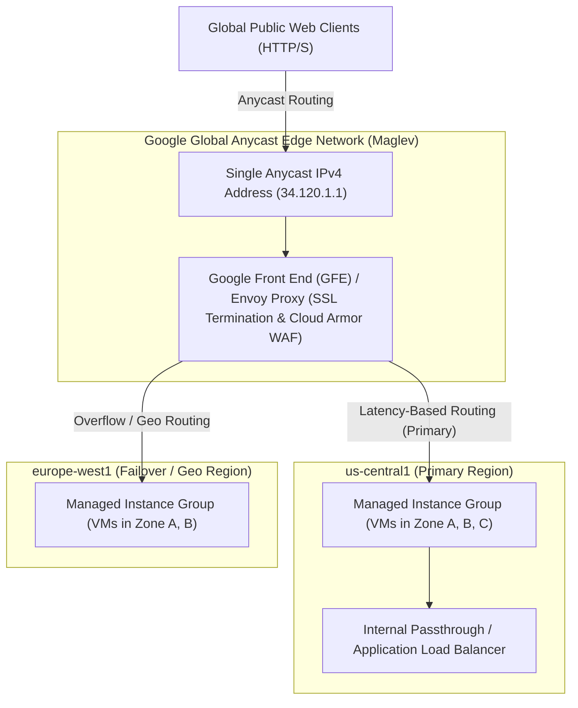

# Topic 34: Load Balancing

---

## 1. What Is It?

**Google Cloud Load Balancing (GCLB)** is a portfolio of high-performance, fully managed, software-defined load distribution services that route incoming user traffic across multiple instances, GKE pods, or serverless backends to ensure high availability, automatic scaling, and sub-second latency.

Unlike traditional hardware load balancers constrained to a single datacenter rack, GCP's **Global HTTP(S) Load Balancer** operates on Google's global Anycast edge network (Maglev & Envoy proxies). A single global Anycast IPv4/IPv6 address receives traffic worldwide, routing requests to the closest healthy backend region automatically.

### Real-World Analogy
Think of GCP Global Load Balancing like a master international dispatch system for a global courier service. Customers worldwide ship packages to a single central address. The dispatch system automatically directs the package to the nearest regional fulfillment center (US, Europe, Asia) that has available capacity and workers. If the US facility experiences a power outage, the system instantly reroutes packages to the European facility without the customer changing the shipping label.

---

## 2. Where Does It Fit?

Load Balancers sit at the entry points of your cloud architecture—either receiving public internet traffic (External Load Balancers) or distributing internal microservice traffic (Internal Load Balancers).



---

## 3. Core Concepts

GCP provides five distinct Load Balancer variants tailored to specific protocol and scope requirements:

| Load Balancer Type | Scope | Layer | Traffic Type | Primary Use Case |
|---|---|---|---|---|
| **Global Application Load Balancer** | Global | Layer 7 (HTTP/S) | HTTP, HTTPS, HTTP/2, gRPC, WebSocket | Web applications, microservices, CDN integration, WAF security. |
| **Regional Application Load Balancer** | Regional | Layer 7 (HTTP/S) | HTTP, HTTPS, gRPC | Regional compliance workloads requiring strict data residency. |
| **Global Network Proxy LB** | Global | Layer 4 (TCP/SSL) | Non-HTTP TCP with SSL termination | High-performance TCP services (gaming, custom RPC). |
| **Regional Passthrough Network LB** | Regional | Layer 4 (TCP/UDP) | Unencrypted raw TCP/UDP | High-throughput raw IP traffic, non-HTTP protocols. |
| **Internal Application / Passthrough LB** | Regional | Layer 7 / Layer 4 | Internal RFC1918 TCP/UDP | Private internal microservice communication between VPC tiers. |

---

## 4. How It Works

Global Application Load Balancing uses a multi-tier proxy architecture:

```text
User in London browses https://example.com
              ↓
DNS resolves to Single Anycast IP (34.120.1.1) → Packets routed to nearest London Edge PoP
              ↓
Google Front End (GFE) terminates SSL/TLS connection & checks Cloud Armor WAF rules
              ↓
GFE evaluates URL Map routing rules (e.g., /api/* vs /static/*)
              ↓
GFE selects healthiest backend with lowest latency (e.g., MIG in europe-west1)
              ↓
GFE proxies request over Google's internal subsea fiber network to backend VM/Pod
```

1. **Instant Failover**: If all backends in a region fail health checks, GFE automatically reroutes traffic to the next closest healthy region within milliseconds.
2. **Anycast IP**: No DNS round-robin propagation delays during regional failover.

---

## 5. Production Scenario

### Global Web Application with Cloud Armor WAF & Multi-Region Failover

```text
Requirement: Serve a web application to 5,000,000 global users with SSL termination, DDoS protection, and auto-failover between US and Europe.
    ↓
Architecture: Global External Application Load Balancer with Cloud Armor WAF.
    ↓
Components:
  - Frontend: Global Anycast IP + Managed SSL Certificate (`api.example.com`).
  - Security: Cloud Armor policy blocking SQLi, XSS, and Geo-banned IPs.
  - URL Map: `/api/*` -> Backend Service 1; `/static/*` -> Cloud Storage Bucket (CDN).
  - Backends: Dual MIGs in `us-central1` and `europe-west1`.
    ↓
Health Checks: HTTP Health Check (`/healthz`, 5s interval, 2 threshold).
    ↓
Monitoring: Cloud Monitoring tracking 5xx error rates and backend latency percentiles (p95/p99).
```

*Why Selected*: Combines global Anycast performance, WAF security, and automated multi-region failover under a single operational endpoint.

---

## 6. Hands-On Lab

### Prerequisites
- Active GCP Project with a Compute Engine Managed Instance Group (MIG) serving HTTP.
- Cloud Shell or `gcloud` CLI.
- IAM permissions: `roles/compute.loadBalancerAdmin`.

### Console Method
1. Log into [Google Cloud Console](https://console.cloud.google.com/).
2. Navigate to **Network services** → **Load balancing**.
3. Click **CREATE LOAD BALANCER**.
4. Select **Application Load Balancer (HTTP/S)** → Click **START CONFIGURATION**.
5. Choose **Internet facing (External)** & **Global Application Load Balancer**.
6. **Backend Configuration**:
   - Create a Backend Service -> Select Protocol `HTTP`, Port `80`.
   - Add Backend: Select your MIG -> Set Capacity `100% utilization`.
   - Create Health Check: Protocol `HTTP`, Path `/`.
7. **Frontend Configuration**:
   - Protocol `HTTP` (or `HTTPS` with SSL certificate), Port `80`.
8. Click **CREATE** and wait 2–3 minutes for Anycast IP provisioning.

### CLI Method
Create a Global External HTTP Load Balancer using `gcloud`:

```bash
# Set project variables
PROJECT_ID="your-gcp-project-id"

# 1. Create a global HTTP health check
gcloud compute health-checks create http http-basic-check \
    --port=80 \
    --request-path="/"

# 2. Create a Global Backend Service
gcloud compute backend-services create global-web-backend \
    --protocol=HTTP \
    --health-checks=http-basic-check \
    --global

# 3. Add a Managed Instance Group as a backend
gcloud compute backend-services add-backend global-web-backend \
    --instance-group=web-mig \
    --instance-group-zone=us-central1-a \
    --global

# 4. Create a URL Map to route all incoming requests to the backend service
gcloud compute url-maps create web-map \
    --default-service=global-web-backend

# 5. Create a Target HTTP Proxy
gcloud compute target-http-proxies create http-lb-proxy \
    --url-map=web-map

# 6. Create a Global Forwarding Rule with an Anycast IPv4 address
gcloud compute forwarding-rules create http-content-rule \
    --load-balancing-scheme=EXTERNAL_MANAGED \
    --address-port-spec=ALL \
    --target-http-proxy=http-lb-proxy \
    --global \
    --ports=80
```

### Verification
Fetch the allocated Anycast IP address and test HTTP access:

```bash
IP_ADDRESS=$(gcloud compute forwarding-rules describe http-content-rule --global --format="value(IPAddress)")
curl -i http://$IP_ADDRESS
```
*Expected Result*: Returns `HTTP/1.1 200 OK` from the backend instance group.

### Cleanup
Delete load balancer components:

```bash
gcloud compute forwarding-rules delete http-content-rule --global --quiet
gcloud compute target-http-proxies delete http-lb-proxy --quiet
gcloud compute url-maps delete web-map --quiet
gcloud compute backend-services delete global-web-backend --global --quiet
gcloud compute health-checks delete http-basic-check --quiet
```

---

## 7. Security

### SSL/TLS & WAF Security Integration
- **Google-Managed SSL Certificates**: Use Google-Managed SSL certificates for automatic provisioning and 90-day zero-downtime certificate renewal.
- **Cloud Armor Integration**: Attach Cloud Armor security policies directly to HTTP(S) Backend Services to block OWASP Top 10 web vulnerabilities and DDoS attacks.
- **SSL Security Policies**: Enforce modern TLS versions (TLS 1.2 / TLS 1.3 minimum) and restrict weak cipher suites.

```text
BAD PRACTICE:
Exposing backend Compute VMs directly to public internet IPs without a load balancer proxy.
Risk: Direct exposure to DDoS attacks, unencrypted HTTP traffic, missing WAF protection, and manual SSL certificate management.

PRODUCTION PRACTICE:
Deploy a Global HTTP(S) Load Balancer backed by Cloud Armor WAF, Google-Managed SSL Certificates, and private-only backend VMs.
```

---

## 8. Scaling & High Availability

Load Balancing Traffic Management at Scale:

```text
Regional Single Backend (Vulnerable to zonal outages)
   ↓ (Multi-Zone Regional Backend)
Regional Load Balancing across Zones A, B, and C
   ↓ (Global Multi-Region Capacity Scaling)
Global Load Balancer across US, Europe, and Asia (Automated cross-region spillover when capacity > 100%)
```

- **Capacity Spillover**: If a regional backend reaches its Max RPS (Requests Per Second) capacity limit, GFE automatically routes excess traffic to the next closest region without dropping requests.

---

## 9. Cost

### Load Balancer Pricing Structure
- **Forwarding Rule Charge**: Nominal base fee per forwarding rule per hour (~$0.025/hour).
- **Data Ingress/Egress Processing**: Per-GB data processing fee for traffic handled by the load balancer (~$0.008/GB).
- **Free Health Checks**: Health checks themselves incur zero charges.

---

## 10. Monitoring & Troubleshooting

### Load Balancing Observability Tools
- **Cloud Monitoring Metrics**: Metric `loadbalancing.googleapis.com/https/request_count`, `response_code`, and `backend_latencies`.
- **Health Check Logs**: Audit reasons for unhealthy backend status in Console.

### Troubleshooting Matrix

| Symptom | Possible Cause | What to Check | Fix |
|---|---|---|---|
| Load Balancer returns `HTTP 502 Bad Gateway` | Health Check failing on all backend instances | Health Check status in Console | Verify backend firewall rule allows Health Check IP ranges (`35.191.0.0/16`, `130.211.0.0/22`). |
| Traffic not reaching newly added region | Backend Service missing newly created regional MIG | `gcloud compute backend-services describe` | Add the new MIG to the Backend Service using `add-backend`. |
| SSL handshake failure | SSL Certificate pending validation or domain CAA record blocking Google | Certificate status in Console | Verify domain DNS points to LB Anycast IP; check CAA records. |

---

## 11. Common Mistakes

```text
Mistake: Forgetting to create a firewall rule allowing GCP Health Check IP ranges (`35.191.0.0/16` and `130.211.0.0/22`).
Why: Assuming health checks originate inside the local VPC subnet.
Impact: Health checks fail; Load Balancer marks all backends unhealthy and returns HTTP 502 errors.
Correct approach: Create an ingress firewall rule allowing `tcp:80` (or target port) from `35.191.0.0/16` and `130.211.0.0/22`.

Mistake: Selecting a Regional Load Balancer when multi-region Anycast failover is required.
Why: Misunderstanding the difference between Regional and Global Load Balancer types.
Impact: Inability to perform automatic cross-region failover or use Google-Managed SSL certificates globally.
Correct approach: Select Global Application Load Balancer for multi-region web applications.
```

---

## 12. Production Best Practices

- [ ] Use **Global Application Load Balancers** for multi-region web applications.
- [ ] Enforce **Google-Managed SSL Certificates** with TLS 1.2+ minimum policies.
- [ ] Attach **Cloud Armor WAF** policies to all external HTTP(S) backend services.
- [ ] Allow GCP Health Check probes (`35.191.0.0/16`, `130.211.0.0/22`) in VPC firewall rules.
- [ ] Configure **HTTP-to-HTTPS redirect** on frontend forwarding rules.
- [ ] Automate all load balancer components (URL maps, proxies, backends) using Terraform.

---

## 13. Hyperscaler / Enterprise Perspective

```text
Personal / Learning
  Single-region unencrypted HTTP Load Balancer → Manual SSL setup → Basic health checks
        ↓
Small Production
  Global HTTP(S) Load Balancer → Google-Managed SSL → Dual-region MIG backends
        ↓
Enterprise Environment
  Cloud Armor WAF Integration → GKE Gateway API integration → Managed SSL with RSA/ECC Ciphers
        ↓
Hyperscaler Environment
  Automated Multi-Cluster Ingress (MCI) → Global Anycast Traffic Engineering → Real-time p99 Latency Monitoring & CDN Caching
```

In a hyperscaler environment, load balancing is integrated into GKE using the **Gateway API** or **Multi-Cluster Ingress (MCI)**. Central SRE teams enforce Cloud Armor WAF policies, SSL profiles, and Cloud CDN caching rules at the global Anycast edge, ensuring sub-second response times for millions of concurrent users worldwide.

---

## 14. Real Project Questions

### Q1: What is the primary operational advantage of Google Cloud's Global Anycast IP address architecture?
**Answer:** Global Anycast assigns a single external IPv4/IPv6 address to the load balancer worldwide. Incoming user requests hit the nearest Google edge Point of Presence (PoP) via Anycast routing. If a regional datacenter fails, Google Front Ends (GFEs) instantly reroute traffic over Google's internal subsea fiber network to a healthy region without needing DNS round-robin updates or client-side DNS cache expiration delays.

### Q2: Which specific IP ranges must be allowed in VPC firewall rules for GCP Load Balancer Health Checks to function?
**Answer:** Ingress firewall rules must allow traffic from **`35.191.0.0/16`** and **`130.211.0.0/22`**. These are the dedicated IP ranges used by Google's distributed Health Check probers to test backend instance health. Blocking these ranges causes health checks to fail, resulting in `HTTP 502 Bad Gateway` errors.

### Q3: When should an enterprise select an Internal Load Balancer over an External Load Balancer?
**Answer:** An **Internal Load Balancer** should be selected when distributing traffic for private internal microservices (e.g., an internal API tier communicating with a database tier) within a VPC or across peered networks. Internal Load Balancers use private RFC1918 IP addresses, ensuring traffic is never exposed to the public internet.

---

## 15. Quick Decision Guide

| Requirement | Recommended Approach | Reason |
|---|---|---|
| Public web app requiring global SSL termination, WAF, and multi-region failover | **Global External Application Load Balancer** | Global Anycast IP, Cloud Armor integration, and sub-second multi-region routing. |
| Microservice communicating privately between App and Database tiers | **Internal Application / Passthrough Load Balancer** | Private RFC1918 IP address allocation inside the VPC with zero public internet exposure. |
| High-throughput raw TCP/UDP gaming server requiring unencrypted IP passthrough | **Regional External Passthrough Network Load Balancer** | Direct Layer 4 IP passthrough with maximum throughput and zero proxy overhead. |

### When should I use it?
- Essential service for building scalable, fault-tolerant, high-availability web applications and microservices in GCP.

### When should I NOT use it?
- Do not use External Load Balancers for private internal database communication—use Internal Load Balancers.

---

## 16. Related Services

```text
               [34. Load Balancing]
              /         |         \
       Cloud Armor  Cloud CDN   Managed Instance
          (WAF)    (Caching)    Groups (MIGs)
            |           |             |
        Security    Speed Edge     Compute
        Shield      Content        Backends
```

- **Cloud Armor**: Web Application Firewall (WAF) attached to LB backend services.
- **Cloud CDN**: Edge content caching integrated with HTTP(S) Load Balancers.
- **Managed Instance Groups (MIGs)**: Primary compute backends for load balancers.

---

## 17. Cheat Sheet

### Essential IP Ranges
- **Health Check Probers**: `35.191.0.0/16` and `130.211.0.0/22`.

### Essential CLI Commands
```bash
# Create a global HTTP health check
gcloud compute health-checks create http HEALTH_CHECK_NAME --port=80

# Create a global backend service
gcloud compute backend-services create BACKEND_NAME --protocol=HTTP --health-checks=HEALTH_CHECK_NAME --global

# Add MIG to backend service
gcloud compute backend-services add-backend BACKEND_NAME --instance-group=MIG_NAME --instance-group-zone=ZONE --global

# List load balancers
gcloud compute forwarding-rules list
```

---

## 18. Learning Connection

- **Previous Topic**: [33. Cloud NAT](../33-cloud-nat/README.md)
- **Next Topic**: [35. VPC Peering](../35-vpc-peering/README.md)
