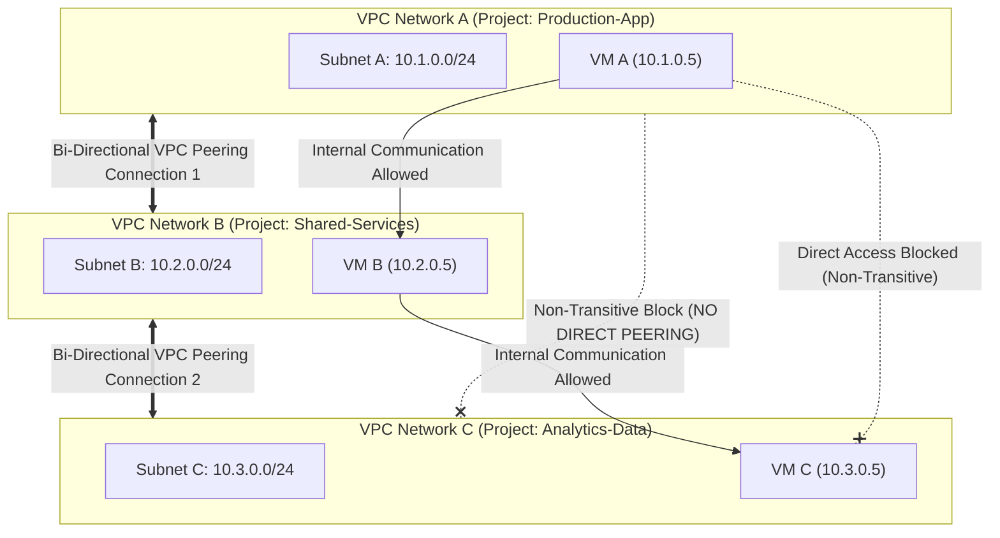

# Topic 35: VPC Peering

---

## 1. What Is It?

**VPC Network Peering** allows two independent Google Cloud Virtual Private Cloud (VPC) networks—whether in the same project or across different projects and organizations—to connect privately over internal IP addresses with low latency and high bandwidth.

Traffic between peered VPC networks stays entirely within Google's internal software-defined network (Andromeda), completely bypassing the public internet and avoiding intermediate NAT gateways or VPN encryption overhead.

A critical fundamental rule of VPC Peering is that it is **Non-Transitive**: if VPC A is peered with VPC B, and VPC B is peered with VPC C, **VPC A CANNOT communicate with VPC C** through VPC B.

### Real-World Analogy
Think of VPC Peering like building a private physical hallway directly connecting two separate corporate office buildings located next door to each other. Employees can walk between Building A and Building B without stepping outside into public street traffic (Public Internet) or showing passports (VPN Gateways). However, if Building B builds a second private hallway to Building C, an employee in Building A cannot use Building B as a shortcut to reach Building C—they must build a direct hallway from A to C.

---

## 2. Where Does It Fit?

VPC Peering connects independent global VPC networks directly, establishing cross-VPC internal routing tables while maintaining administrative project boundaries.



---

## 3. Core Concepts

| Concept | Requirement / Rule | Impact on Network Architecture | Best Practice |
|---|---|---|---|
| **CIDR Overlap** | Subnet CIDR blocks in Peered VPCs MUST NOT overlap. | If `10.1.0.0/24` exists in both VPCs, peering configuration will FAIL. | Carefully plan IP address allocation (IPAM) across all projects. |
| **Bi-Directional Setup** | Peering connection MUST be initiated independently from BOTH VPC networks. | Status stays `INACTIVE` until both VPC A -> B and VPC B -> A connections are created. | Automate both peering directions in the same Terraform plan. |
| **Non-Transitive Routing** | Direct routing applies ONLY between the two peered networks. | VPC A cannot reach VPC C through VPC B. | Use Hub-and-Spoke with Cloud Routers or VPN if transitive routing is required. |
| **Custom Route Export/Import** | Option to exchange custom static/dynamic routes across the peering link. | Allows VPC A to reach on-premises networks connected to VPC B via Cloud VPN. | Enable `import-custom-routes` and `export-custom-routes` explicitly if needed. |
| **Bandwidth & Latency** | Identical performance to same-VPC internal communication. | Zero bandwidth bottlenecking; full subsea fiber line-rate speed. | Ideal for high-throughput database and data lake peering. |

---

## 4. How It Works

Establishing VPC Peering configures global route exchange between Andromeda SDN controllers:

```text
Admin in Project A creates Peering Connection (VPC A -> VPC B) -> Status: INACTIVE
              ↓
Admin in Project B creates Peering Connection (VPC B -> VPC A) -> Status: ACTIVE
              ↓
GCP Andromeda SDN merges Subnet Routes of VPC A and VPC B
              ↓
VM in VPC A (10.1.0.5) sends packet to VM in VPC B (10.2.0.5)
              ↓
Packet routed directly over internal Google SDN without NAT or VPN encryption overhead
              ↓
VPC Firewall Rules on VPC B evaluate ingress traffic (Must explicitly allow VPC A CIDR)
```

1. **Stateful Firewall Required**: Even though peering connects the networks, VPC B's firewall rules MUST explicitly allow ingress traffic from VPC A's CIDR ranges.
2. **Administrative Isolation**: Each VPC retains its own independent IAM policies, firewall rules, and project ownership.

---

## 5. Production Scenario

### Enterprise Shared Services & SaaS Integration Architecture

```text
Requirement: Connect 50 independent application development VPCs to a central Shared Services VPC (hosting Active Directory, SonarQube, and Artifact Registry) without public internet routing.
    ↓
Architecture: Hub-and-Spoke model using VPC Peering.
    ↓
Configuration:
  - Central Hub: `shared-services-vpc` (CIDR: `10.100.0.0/16`).
  - Spoke 1: `app-frontend-vpc` (CIDR: `10.1.0.0/20`).
  - Spoke 2: `app-backend-vpc` (CIDR: `10.2.0.0/20`).
  - Peer Spoke 1 <-> Hub; Peer Spoke 2 <-> Hub.
    ↓
Security: Non-transitive routing prevents Spoke 1 from directly communicating with Spoke 2.
    ↓
Firewall Rules: Hub VPC firewall allows `tcp:443,8443` ingress from Spoke CIDRs `10.1.0.0/20` and `10.2.0.0/20`.
    ↓
Monitoring: Network Intelligence Center (Connectivity Tests) auditing cross-peering packet latency.
```

*Why Selected*: VPC Peering provides zero-cost, high-speed internal IP connectivity to shared tooling while maintaining strict isolation between independent application spoke VPCs.

---

## 6. Hands-On Lab

### Prerequisites
- Active GCP Project with two Custom VPCs created (`vpc-a` and `vpc-b`) with non-overlapping subnets (`10.1.0.0/24` and `10.2.0.0/24`).
- Cloud Shell or `gcloud` CLI.
- IAM permissions: `roles/compute.networkAdmin` on both projects.

### Console Method
1. Log into [Google Cloud Console](https://console.cloud.google.com/).
2. Navigate to **VPC network** → **VPC network peering**.
3. Click **CREATE PEERING CONNECTION**.
4. Direction 1 (VPC A -> VPC B):
   - Name: `peering-a-to-b`, Your VPC: `vpc-a`.
   - Peered VPC: **In another project** (or same project) → Enter Project ID and VPC name (`vpc-b`).
   - Click **CREATE**. Status will show **INACTIVE**.
5. Direction 2 (VPC B -> VPC A):
   - Name: `peering-b-to-a`, Your VPC: `vpc-b`.
   - Peered VPC: Select `vpc-a`.
   - Click **CREATE**.
6. Observe status change to **ACTIVE** on both peering connections.

### CLI Method
Create bi-directional VPC Peering using `gcloud`:

```bash
# Set project and VPC variables
PROJECT_A="project-a-id"
PROJECT_B="project-b-id"
VPC_A="vpc-a"
VPC_B="vpc-b"

# 1. Create Peering connection from VPC A to VPC B
gcloud compute networks peerings create peer-a-to-b \
    --network=$VPC_A \
    --peer-project=$PROJECT_B \
    --peer-network=$VPC_B \
    --auto-create-routes \
    --project=$PROJECT_A

# 2. Create Peering connection from VPC B to VPC A (Completes handshaking)
gcloud compute networks peerings create peer-b-to-a \
    --network=$VPC_B \
    --peer-project=$PROJECT_A \
    --peer-network=$VPC_A \
    --auto-create-routes \
    --project=$PROJECT_B

# 3. Verify Peering status on VPC A
gcloud compute networks peerings list --network=$VPC_A --project=$PROJECT_A
```

### Verification
*Expected Result*: Output displays `state: ACTIVE` and lists imported/exported subnet routes.

### Cleanup
Delete peering connections:

```bash
gcloud compute networks peerings delete peer-a-to-b --network=$VPC_A --project=$PROJECT_A --quiet
gcloud compute networks peerings delete peer-b-to-a --network=$VPC_B --project=$PROJECT_B --quiet
```

---

## 7. Security

### Non-Transitive Isolation & Firewall Controls
- **Explicit Ingress Firewalls Required**: VPC Peering opens route tables, NOT firewall ports. You must explicitly configure VPC firewall rules to allow traffic from the peered network CIDR.
- **Non-Transitive Security Boundary**: Spoke networks connected to a central hub cannot reach each other through peering, enforcing isolation between environments (e.g., Dev cannot reach Prod).
- **IAM Decentralization**: Administrators of VPC A cannot view, modify, or manage resources inside VPC B.

```text
BAD PRACTICE:
Creating VPC Peering between networks with overlapping IP address ranges (e.g., both using `10.0.0.0/16`).
Risk: Peering handshake fails completely; requires tearing down subnets and re-IPing workloads.

PRODUCTION PRACTICE:
Maintain a centralized IP Address Management (IPAM) registry. Ensure strict non-overlapping CIDR blocks before establishing VPC Peering.
```

---

## 8. Scaling & High Availability

VPC Peering Limits & Topology:

```text
Direct VPC Peering (Maximum 25 - 30 Peering limits per single VPC)
   ↓ (Overcoming Non-Transitive Routing & Scale Caps)
Shared VPC (Single Host VPC network serving 100s of Service Projects)
   ↓ (Private Service Access / Private Service Connect)
Private Service Connect (Endpoint-based SLA scaling without IP exhaustion or peering limits)
```

- **Maximum Peering Limits**: A single VPC network has a hard quota limit of **25 to 30 active VPC Peering connections** (depending on total metric limits). For larger multi-tenant environments, use Shared VPC or Private Service Connect.

---

## 9. Cost

### Free Data Transport in VPC Peering
- **$0 Peering Creation Fee**: Provisioning VPC Peering connections costs $0.
- **$0 Inter-VPC Internal Network Fee (Same Zone)**: Traffic exchanged between peered VPC VMs in the same Availability Zone costs $0/GB.
- **Standard Cross-Zone / Cross-Region Egress**: Data transferred across zones or regions over peering links incurs standard GCP cross-zone ($0.01/GB) or cross-region ($0.02 - $0.08+/GB) egress fees.

---

## 10. Monitoring & Troubleshooting

### VPC Peering Observability Tools
- **Network Intelligence Center (Connectivity Tests)**: Test cross-peering network paths to verify if firewall rules or routes block packets.
- **Peering Status in Console**: Real-time status indicators (`ACTIVE`, `INACTIVE`).

### Troubleshooting Matrix

| Symptom | Possible Cause | What to Check | Fix |
|---|---|---|---|
| Peering status stuck in `INACTIVE` | Peering initiated from only one side (Direction 2 missing) | `gcloud compute networks peerings list` | Create the reverse peering connection from VPC B to VPC A. |
| VMs cannot ping across active peering link | Target VPC firewall rule blocking ingress from source CIDR | `gcloud compute firewall-rules list` | Create ingress firewall rule in target VPC allowing traffic from source CIDR. |
| `Cannot peer networks with overlapping subnets` error | Both VPCs contain subnets with identical CIDRs | `gcloud compute networks subnets list` | Must re-IP subnets in one VPC or use Private Service Connect (PSC) instead. |

---

## 11. Common Mistakes

```text
Mistake: Expecting Transitive Routing to work across VPC Peering connections (A -> B -> C).
Why: Assuming GCP VPC Peering acts like a hardware router transit hub.
Impact: VM in VPC A cannot connect to VM in VPC C; network troubleshooting fails.
Correct approach: Create a direct peering link between A and C, or use Cloud VPN / Cloud Router for transitive transit.

Mistake: Forgetting to create firewall rules in the target VPC after establishing active peering.
Why: Assuming active peering automatically opens network ports between VPCs.
Impact: Traffic dropped at target VM hypervisor despite active peering status.
Correct approach: Create explicit ingress firewall rules in the target VPC allowing the source VPC's CIDR.
```

---

## 12. Production Best Practices

- [ ] Enforce strict non-overlapping CIDR address planning across all enterprise projects.
- [ ] Automate bi-directional VPC Peering creation in the same Infrastructure as Code (Terraform) template.
- [ ] Configure explicit ingress firewall rules in both peered VPC networks.
- [ ] Enable `export-custom-routes` and `import-custom-routes` if on-premises VPN routes must be shared.
- [ ] Monitor VPC Peering quotas (max 25–30 peerings per VPC) to avoid hitting network limits.
- [ ] Use **Private Service Connect (PSC)** instead of VPC Peering when connecting to third-party SaaS vendors.

---

## 13. Hyperscaler / Enterprise Perspective

```text
Personal / Learning
  Single VPC → No Peering
        ↓
Small Production
  Manual VPC Peering between Dev and Shared Services → Basic firewall rules
        ↓
Enterprise Environment
  Automated Hub-and-Spoke VPC Peering via Terraform → Shared VPC Architecture → Centralized IPAM
        ↓
Hyperscaler Environment
  Transition from VPC Peering to Private Service Connect (PSC) → Zero CIDR Overlap Issues → Automated Network Intelligence Audits
```

In a hyperscaler environment, large enterprises avoid heavy reliance on VPC Peering due to non-transitive routing limitations, CIDR overlap risks, and maximum peering quota caps. Instead, central network teams adopt **Shared VPC** for internal infrastructure and **Private Service Connect (PSC)** for service-to-service communication.

---

## 14. Real Project Questions

### Q1: What does it mean that GCP VPC Peering is Non-Transitive?
**Answer:** Non-Transitive routing means that network traffic cannot pass *through* an intermediate peered VPC to reach a third network. If VPC A is peered with VPC B, and VPC B is peered with VPC C, VPC A cannot send packets to VPC C through VPC B. Communication requires either a direct peering link between A and C or a VPN/Interconnect transit router setup.

### Q2: Why will GCP reject a VPC Peering request even if both project administrators approve the connection?
**Answer:** GCP will reject the peering request if any subnets in the two VPC networks have **overlapping IP address ranges** (CIDR blocks). VPC Peering merges subnet routing tables; overlapping IP ranges create unresolvable routing conflicts, causing the API to fail the peering creation.

### Q3: Does establishing an active VPC Peering connection automatically allow network traffic to pass between VMs in both networks?
**Answer:** No. VPC Peering updates routing tables to make internal IP paths reachable, but it does NOT alter VPC firewall rules. Target VMs in the peered network will still drop incoming packets unless explicit ingress firewall rules are created in that VPC allowing traffic from the source VPC's IP range.

---

## 15. Quick Decision Guide

| Requirement | Recommended Approach | Reason |
|---|---|---|
| Connecting two custom VPCs in different projects with zero data transit costs | **VPC Network Peering** | Uses Google internal subsea fiber; zero NAT/VPN overhead; low latency. |
| Connecting 100 service projects to a central IT network without hitting peering quotas | **Shared VPC** | Shares subnets directly from a central Host project without peering limits. |
| Connecting to a third-party SaaS provider where IP address ranges overlap | **Private Service Connect (PSC)** | Uses Endpoint IP abstraction; eliminates CIDR overlap issues completely. |

### When should I use it?
- Ideal for connecting a small number of independent VPC networks requiring high-bandwidth, zero-cost internal IP communication.

### When should I NOT use it?
- Do not use for multi-tenant SaaS environments where IP address ranges overlap or peering quotas (25–30 limit) would be exceeded.

---

## 16. Related Services

```text
               [35. VPC Peering]
              /        |        \
        Shared VPC  Private    Cloud VPN /
        (Alt Scope) Service    Interconnect
            |       Connect      (Transit)
        Multi-Proj  Endpoint       |
         Subnets   Abstracted   Transitive
```

- **Shared VPC**: Alternative multi-project networking model sharing host subnets.
- **Private Service Connect (PSC)**: Modern endpoint-based service publishing replacing Peering.
- **Cloud VPN**: Enables encrypted transitive hybrid network routing.

---

## 17. Cheat Sheet

### Core Rules
- **Scope**: Global (Spans regions).
- **Setup**: Bi-directional (A -> B AND B -> A required).
- **Transitivity**: Non-transitive (A -> B -> C DOES NOT WORK).
- **IPs**: Overlapping CIDRs strictly prohibited.
- **Limits**: Max 25–30 peerings per VPC.

### Useful Commands
```bash
# Create peering from VPC A to VPC B
gcloud compute networks peerings create PEERING_NAME \
    --network=VPC_A --peer-project=PROJECT_B \
    --peer-network=VPC_B --auto-create-routes

# List peerings and check status
gcloud compute networks peerings list --network=VPC_A

# Delete a peering connection
gcloud compute networks peerings delete PEERING_NAME --network=VPC_A
```

---

## 18. Learning Connection

- **Previous Topic**: [34. Load Balancing](../34-load-balancing/README.md)
- **Next Topic**: [36. Shared VPC](../36-shared-vpc/README.md)
