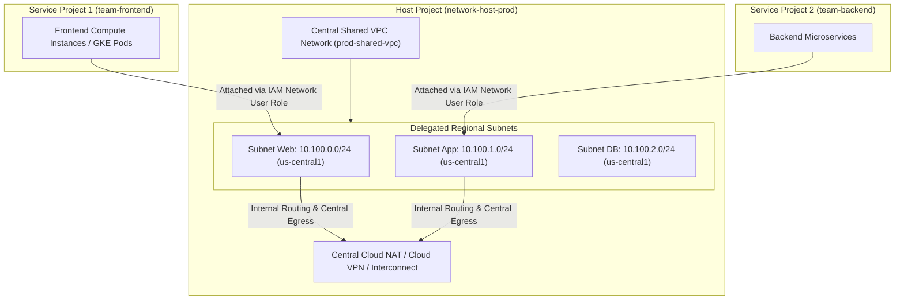

# Topic 36: Shared VPC

---

## 1. What Is It?

**Shared VPC** is an enterprise networking architecture in Google Cloud that allows an organization to designate a central project as a **Host Project** containing one or more global VPC networks, and delegate specific regional subnets to multiple application **Service Projects**.

Shared VPC separates network administration from application development. Central Network Administrators manage network infrastructure, subnets, routes, firewalls, and VPN connections in the Host Project, while Application Developers deploy Compute Engine VMs, GKE clusters, and Cloud Run services inside Service Projects using the delegated subnets.

### Real-World Analogy
Think of Shared VPC like a large commercial office building owned by a central landlord (Host Project). The landlord builds the electrical wiring, plumbing, elevators, and security gates (VPC, Subnets, Firewalls, Cloud NAT). Independent business tenants (Service Projects) rent specific office suites (Delegated Subnets) and plug their computers (VMs and Containers) directly into the landlord's pre-configured power outlets without needing to build their own electrical generators.

---

## 2. Where Does It Fit?

Shared VPC operates across GCP Organization boundaries, linking a Host Project's VPC network to multiple Service Projects via IAM role bindings (`roles/compute.networkUser`).



---

## 3. Core Concepts

| Shared VPC Term | Role / Definition | Administrative Scope | Best Practice |
|---|---|---|---|
| **Host Project** | Central project containing the shared VPC network and subnets. | Managed by Central Network / SecOps team. | Contain ONLY networking resources; no app workloads. |
| **Service Project** | Application project attached to the Host Project. | Managed by Application / DevOps feature teams. | Contains compute VMs, GKE clusters, databases. |
| **Shared VPC Admin** | IAM role (`roles/compute.xpnAdmin`) granting rights to enable Host Projects and attach Service Projects. | Organization / Folder Admin level. | Restrict strictly to central SecOps leads. |
| **Network User** | IAM role (`roles/compute.networkUser`) allowing service project developers to attach resources to specific subnets. | Granted on specific subnets in the Host Project. | Grant on a **per-subnet basis** (Principle of Least Privilege). |
| **Org Scope Requirement** | Shared VPC requires a GCP Organization node. | All Host and Service Projects must belong to the same Organization. | Standard requirement for all enterprise landing zones. |

---

## 4. How It Works

Provisioning and consuming a Shared VPC follows a 4-step administrative workflow:

```text
Step 1: Org Admin grants roles/compute.xpnAdmin to Central Network Team
              ↓
Step 2: Network Admin enables Host Project (gcloud compute shared-vpc enable host-project-id)
              ↓
Step 3: Network Admin attaches Service Project (gcloud compute shared-vpc service-projects associate)
              ↓
Step 4: Network Admin grants roles/compute.networkUser on `Subnet-Web` to `group:frontend-devs@company.com`
              ↓
Frontend Dev creates VM inside Service Project -> Selects Subnet-Web from Host Project -> VM deployed!
```

1. **Centralized Firewall Enforcement**: Firewall rules configured in the Host Project apply to all VMs in all Service Projects attached to the Shared VPC.
2. **IP Management Centralization**: Prevents IP address collisions across teams completely.

---

## 5. Production Scenario

### Enterprise Landing Zone for 100 Multi-Tenant Service Projects

```text
Requirement: Provide isolated cloud environments for 100 microservice teams while enforcing central firewall guardrails and zero duplicate IP ranges.
    ↓
Architecture: Single Host Project `proj-net-host-prod` containing 1 Shared VPC `vpc-enterprise-prod`.
    ↓
Subnet Delegation:
  - `sb-frontend-uscentral1` delegated to Service Project `proj-svc-frontend`.
  - `sb-payments-uscentral1` delegated to Service Project `proj-svc-payments`.
    ↓
IAM Governance:
  - `group:frontend-devs@company.com` granted `roles/compute.networkUser` ONLY on `sb-frontend-uscentral1`.
    ↓
Security: Central SecOps team manages all Firewall rules, Cloud NAT, and Interconnect circuits in Host Project.
    ↓
Monitoring: VPC Flow Logs in Host Project streaming all cross-service traffic to Security Command Center.
```

*Why Selected*: Shared VPC provides absolute administrative separation between network security infrastructure and developer application environments, eliminating VPC Peering quota limits and CIDR overlap bugs.

---

## 6. Hands-On Lab

### Prerequisites
- GCP Organization Node.
- Two GCP Projects in the same Org: `host-proj-123` and `service-proj-456`.
- IAM permissions: `roles/compute.xpnAdmin` at Organization level.

### Console Method
1. Log into [Google Cloud Console](https://console.cloud.google.com/).
2. Select the **Host Project** (`host-proj-123`).
3. Navigate to **VPC network** → **Shared VPC**.
4. Click **ENABLE SHARED VPC** → Select **Set as Host Project** → Click **SAVE & CONTINUE**.
5. Under **Subnet sharing**, select **Individual subnets**:
   - Select `sb-frontend` → Grant access to `service-proj-456` developers.
6. Click **SAVE & CONTINUE**.
7. Under **Attach Service Projects**, select `service-proj-456` → Click **ATTACH**.
8. Switch to **Service Project** (`service-proj-456`) → Create VM → Observe that `host-proj-123` subnets appear in the network dropdown!

### CLI Method
Configure Shared VPC using `gcloud`:

```bash
# Set variables
HOST_PROJECT="host-proj-123"
SERVICE_PROJECT="service-proj-456"
DEV_GROUP="group:frontend-devs@yourdomain.com"
SUBNET_NAME="sb-frontend"
REGION="us-central1"

# 1. Enable Host Project status
gcloud compute shared-vpc enable $HOST_PROJECT

# 2. Associate Service Project with the Host Project
gcloud compute shared-vpc service-projects associate $SERVICE_PROJECT \
    --host-project=$HOST_PROJECT

# 3. Delegate specific subnet access to Service Project developers using IAM Network User role
gcloud compute networks subnets add-iam-policy-binding $SUBNET_NAME \
    --project=$HOST_PROJECT \
    --region=$REGION \
    --member=$DEV_GROUP \
    --role="roles/compute.networkUser"
```

### Verification
List associated service projects from the host project:

```bash
gcloud compute shared-vpc list-associated-resources $HOST_PROJECT
```
*Expected Result*: Output displays `service-proj-456` listed under associated service project resources.

### Cleanup
Disable Shared VPC association:

```bash
gcloud compute shared-vpc service-projects detach $SERVICE_PROJECT --host-project=$HOST_PROJECT
gcloud compute shared-vpc disable $HOST_PROJECT
```

---

## 7. Security

### Principle of Least Privilege in Shared VPC
- **Subnet-Level IAM Delegation**: Never grant `roles/compute.networkUser` at the Host Project level (which exposes all subnets). Always grant it on specific individual subnets.
- **Service Account ActAs Binding**: Ensure service project developers are granted `roles/iam.serviceAccountUser` on their local service accounts, preventing them from impersonating host network service accounts.
- **Centralized Firewall Authority**: Service Project developers CANNOT modify firewall rules, routes, or VPN settings in the Host Project.

```text
BAD PRACTICE:
Granting `roles/compute.networkUser` to developers at the Host Project level instead of on individual subnets.
Risk: Allows developers to launch VMs inside sensitive database subnets or restricted PCI-DSS compliance subnets.

PRODUCTION PRACTICE:
Grant `roles/compute.networkUser` strictly on individual subnets matching the developer's specific application tier.
```

---

## 8. Scaling & High Availability

Enterprise Scale & Limits:

```text
VPC Peering Architecture (Hits 25-30 Peering limits - High CIDR collision risk)
   ↓ (Enterprise Scaling Shift)
Shared VPC Host Project (Supports up to 100s of Service Projects on 1 central VPC)
   ↓ (Multi-Host Architecture)
Multiple Shared VPC Host Projects (Prod Host Project vs. Non-Prod Host Project)
```

- **Host Project Separation**: Best practice is to create two distinct Host Projects: one for **Production** (`host-prod-vpc`) and one for **Non-Production** (`host-nonprod-vpc`), isolating dev/stage environments from production networks.

---

## 9. Cost

### Billing Allocation in Shared VPC
- **Shared VPC $0 Feature Fee**: Enabling Shared VPC incurs zero direct cost.
- **Service Project Billing**: Compute Engine VMs, GKE nodes, and disk usage are billed directly to the **Service Project** where the instances reside.
- **Network Egress Billing**: Network egress charges for VM traffic flowing through the Shared VPC are billed to the **Service Project** owning the VM.

---

## 10. Monitoring & Troubleshooting

### Shared VPC Observability Tools
- **Host Project VPC Flow Logs**: Captures telemetry for all VMs across all attached Service Projects in one central logging sink.
- **Cloud Asset Inventory**: Inspect subnet delegation IAM bindings across projects.

### Troubleshooting Matrix

| Symptom | Possible Cause | What to Check | Fix |
|---|---|---|---|
| Developer cannot see Host Project subnets in Console | Missing `roles/compute.networkUser` on target subnet or project not associated | Subnet IAM bindings in Host Project | Grant `roles/compute.networkUser` to developer group on specific subnet. |
| Cannot attach GKE cluster to Shared VPC | GKE Service Agent missing IAM permissions on Host Project | Host Project IAM bindings | Grant `roles/container.hostServiceAgentUser` to Service Project's GKE Service Agent. |
| Cannot enable Shared VPC | Operating user lacks `roles/compute.xpnAdmin` at Organization level | Org-level IAM bindings | Request Org Admin to grant `roles/compute.xpnAdmin` at Org/Folder level. |

---

## 11. Common Mistakes

```text
Mistake: Granting `roles/compute.networkUser` at the Host Project level instead of the Subnet level.
Why: Convenience during initial setup.
Impact: Developers gain rights to attach VMs to every subnet in the enterprise, including sensitive payment/DB subnets.
Correct approach: Bind `roles/compute.networkUser` directly to specific subnet resources.

Mistake: Forgetting to grant `roles/container.hostServiceAgentUser` to the GKE Service Account when deploying GKE in a Service Project.
Why: GKE requires special host service agent permissions to manage internal load balancers and ENIs in the Host Project.
Impact: GKE cluster creation fails during VPC-Native network provisioning.
Correct approach: Bind `roles/container.hostServiceAgentUser` on the Host Project for the GKE Service Agent.
```

---

## 12. Production Best Practices

- [ ] Create separate **Production Host Projects** and **Non-Production Host Projects**.
- [ ] Restrict `roles/compute.xpnAdmin` to central Network Security leads at the Org level.
- [ ] Grant `roles/compute.networkUser` strictly on a **per-subnet basis**.
- [ ] Grant `roles/container.hostServiceAgentUser` to GKE service accounts for GKE Shared VPC deployments.
- [ ] Manage all Host Projects, Service Project associations, and subnet IAM bindings via Terraform.
- [ ] Centralize VPC Flow Logs, Firewall Rules, and Cloud NAT in the Host Project.

---

## 13. Hyperscaler / Enterprise Perspective

```text
Personal / Learning (Single Project)
  Independent VPC → Single project → No Shared VPC
        ↓
Small Production
  Manual Host Project setup → 2 Service Projects → Basic subnet delegation
        ↓
Enterprise Environment
  Dedicated Production & Non-Production Host Projects → Terraform Automation → Subnet IAM Delegation
        ↓
Hyperscaler Environment
  Landing Zone Vending Machine → Automated Service Project Shared VPC Onboarding → Centralized Network Security Operations (NetSecOps) Control
```

In a hyperscaler environment, Shared VPC is the foundational core of the **GCP Landing Zone**. When a business unit requests a new application environment, an automated Account Vending Machine provisions a new Service Project, associates it with the enterprise Production Host Project, delegates a dedicated subnet, and configures IAM roles without manual intervention.

---

## 14. Real Project Questions

### Q1: What is the main architectural difference between Shared VPC and VPC Peering?
**Answer:** In **VPC Peering**, separate independent VPC networks in separate projects are linked together; each project owner retains full control over their own VPC, firewalls, and subnets (subject to non-transitive routing and quota limits). In **Shared VPC**, a central **Host Project** owns a single global VPC; network infrastructure and firewalls are centrally managed by network admins, while application developers in **Service Projects** simply consume delegated subnets.

### Q2: Which project is billed for Compute VM instances and network egress traffic in a Shared VPC setup?
**Answer:** Compute VM instance costs, disk storage, and network egress traffic generated by instances are billed directly to the **Service Project** that owns the VM, even though the VM's network interface is attached to a subnet residing in the central Host Project.

### Q3: What IAM role is required to allow developers in a Service Project to create VMs on a delegated Host Project subnet?
**Answer:** Developers require the **Compute Network User** role (`roles/compute.networkUser`), which should be granted on the specific delegated subnet resource in the Host Project. Additionally, developers require standard VM creation roles (e.g., `roles/compute.instanceAdmin.v1`) within their local Service Project.

---

## 15. Quick Decision Guide

| Requirement | Recommended Approach | Reason |
|---|---|---|
| Enterprise landing zone with 100 service teams requiring central firewall & IP control | **Shared VPC** | Centralized network administration in Host Project; zero CIDR overlaps; scalable subnet delegation. |
| Connecting two independent company VPCs following a corporate merger | **VPC Network Peering** | Connects separate existing VPCs over private internal IPs without changing project ownership. |
| Connecting a private GKE cluster in a Service Project to central corporate VPN | **Shared VPC** | Allows GKE nodes to consume central Host Project Cloud VPN and Cloud NAT seamlessly. |

### When should I use it?
- Standard, mandatory networking architecture for enterprise multi-project GCP landing zones.

### When should I NOT use it?
- Do not use Shared VPC if projects belong to different GCP Organizations (requires VPC Peering instead).

---

## 16. Related Services

```text
               [36. Shared VPC]
              /        |        \
        Host Project  Service   Cloud NAT /
        (Cent. Net)  Projects   Firewalls
            |            |          |
         Central     App Devs    Centralized
         Subnets     Workloads   Guardrails
```

- **Host Project**: Central project containing the Shared VPC network.
- **Service Projects**: Application projects consuming delegated subnets.
- **Organization Policy**: Enforces mandatory Shared VPC usage across enterprise folders.

---

## 17. Cheat Sheet

### Core IAM Roles
- `roles/compute.xpnAdmin` : Shared VPC Admin (Grant at Org/Folder level).
- `roles/compute.networkUser` : Allows attaching instances to delegated subnets (Grant at Subnet level).
- `roles/container.hostServiceAgentUser` : Allows GKE Service Agent to use Host VPC.

### Useful Commands
```bash
# Enable Host Project
gcloud compute shared-vpc enable HOST_PROJECT

# Associate Service Project
gcloud compute shared-vpc service-projects associate SERVICE_PROJECT --host-project=HOST_PROJECT

# Grant Network User role on a subnet
gcloud compute networks subnets add-iam-policy-binding SUBNET_NAME \
    --project=HOST_PROJECT --region=REGION \
    --member="group:devs@company.com" --role="roles/compute.networkUser"
```

---

## 18. Learning Connection

- **Previous Topic**: [35. VPC Peering](../35-vpc-peering/README.md)
- **Next Topic**: [37. Private Service Connect](../37-private-service-connect/README.md)
