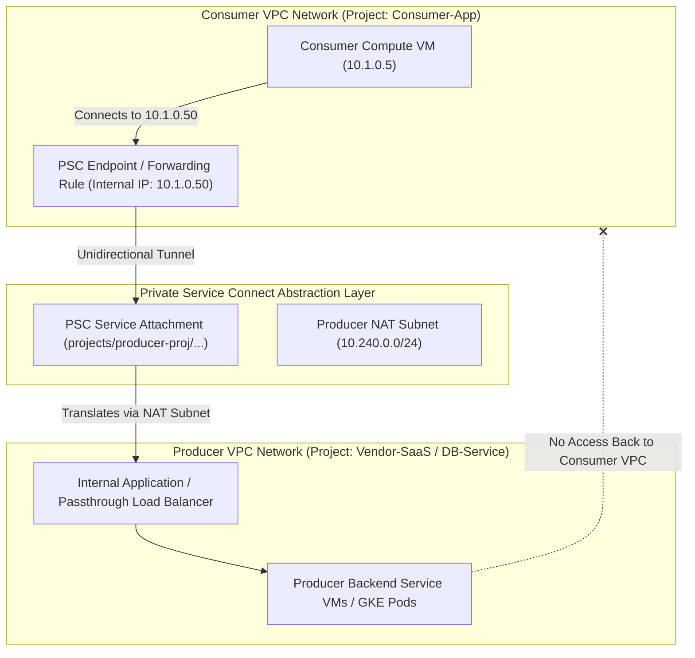

# Topic 37: Private Service Connect

---

## 1. What Is It?

**Private Service Connect (PSC)** is a modern, high-security networking capability in Google Cloud that allows consumer VPC networks to privately access services published in producer VPC networks—or managed Google APIs (such as BigQuery, Cloud Storage, and Spanner), and third-party SaaS applications (such as Snowflake, Databricks, and MongoDB Atlas)—using private internal IP endpoints inside the consumer's own local VPC.

Unlike VPC Peering, which merges whole network routing tables and exposes all subnets, Private Service Connect establishes unidirectional endpoint-based connections using Network Address Translation (NAT).

PSC completely eliminates IP address collision risks, does not require peering handshake agreements, and bypasses VPC Peering quota limits entirely.

### Real-World Analogy
Think of Private Service Connect like installing a dedicated drive-thru window on the side of a bank building (Consumer VPC) that connects directly to a specific coffee shop next door (Producer Service). Customers in the bank drive up to the window (Consumer Endpoint IP `10.1.0.50`), place an order, and receive coffee. Bank customers cannot walk into the coffee shop's kitchen (Producer Network), nor can coffee shop employees enter the bank's vault—only requests to that specific drive-thru window are permitted.

---

## 2. Where Does It Fit?

Private Service Connect creates private, unidirectional Service Attachments and Endpoints connecting Consumer VPCs directly to Producer Internal Load Balancers or Google API Gateways.



---

## 3. Core Concepts

| PSC Concept | Role / Definition | Example / Syntax | Best Practice |
|---|---|---|---|
| **PSC Endpoint** | Internal IP address in the Consumer VPC that forwards traffic to a Producer service. | Forwarding Rule (`10.1.0.50`) | Reserve dedicated internal IP addresses for PSC endpoints. |
| **Service Attachment** | Resource in the Producer VPC that exposes an Internal Load Balancer to consumers. | `projects/prod-proj/regions/us-central1/serviceAttachments/sa-db` | Require explicit Consumer Project Allow-Lists on attachments. |
| **NAT Subnet** | Dedicated subnet in the Producer VPC used by PSC to translate incoming consumer packets. | Subnet purpose: `PRIVATE_SERVICE_CONNECT` | Size NAT subnets appropriately based on expected consumer connection volume. |
| **Google APIs PSC** | Accesses Google APIs (BigQuery, GCS) via a private internal IP in your VPC. | IP `10.250.0.1` mapped to `*.googleapis.com` | Replaces legacy Private Google Access for secure API routing. |
| **Unidirectional Access** | Traffic flows ONLY from Consumer to Producer; Producer CANNOT initiate connections back. | Security Boundary | Enforces zero-trust isolation between multi-tenant environments. |

---

## 4. How It Works

Packet translation and routing in Private Service Connect use endpoint NAT encapsulation:

```text
Consumer VM (10.1.0.5) sends request to PSC Endpoint IP (10.1.0.50:443)
              ↓
GCP Forwarding Rule intercepts packet and maps to PSC Service Attachment URI
              ↓
Packet encapsulated and routed across Google SDN to Producer VPC
              ↓
PSC translates Source IP (10.1.0.5) into an IP from Producer's NAT Subnet (10.240.0.12)
              ↓
Packet delivered to Producer's Internal Load Balancer -> Processed by Producer Backend
              ↓
Return traffic flows back over established NAT session -> Delivered to Consumer VM
```

1. **Zero CIDR Overlap Conflict**: Because PSC translates source IPs into the Producer's NAT subnet, both Consumer and Producer VPCs can use the exact same internal CIDRs (e.g., `10.1.0.0/24`) without conflict.
2. **Strict Isolation**: The Producer VPC sees only packets originating from its own NAT Subnet.

---

## 5. Production Scenario

### Secure Multi-Tenant SaaS Integration (Snowflake / Databricks / Third-Party DB)

```text
Requirement: Connect 50 enterprise Consumer VPCs to a central Managed Database Service in a Producer VPC without exposing IP ranges or hitting VPC Peering quotas.
    ↓
Architecture: Private Service Connect Service Attachment + Consumer Endpoints.
    ↓
Producer Configuration:
  - Internal Load Balancer fronting database cluster.
  - PSC NAT Subnet `sb-psc-nat` (`10.240.0.0/24`, Purpose: `PRIVATE_SERVICE_CONNECT`).
  - Service Attachment `sa-db-service` with Consumer Project Accept List.
    ↓
Consumer Configuration:
  - Reserve Static Internal IP `10.1.0.50` in Consumer VPC.
  - Create PSC Endpoint (Forwarding Rule) pointing to `sa-db-service` URI.
    ↓
Security: Consumer application connects to `10.1.0.50:5432`. Unidirectional access prevents Producer from reaching Consumer VMs.
    ↓
Monitoring: Cloud Audit Logs recording PSC endpoint connection acceptance events.
```

*Why Selected*: PSC allows third-party SaaS vendors and central platform teams to publish services to thousands of customer VPCs with zero network peering management, zero IP collisions, and complete security isolation.

---

## 6. Hands-On Lab

### Prerequisites
- Active GCP Project with Producer VPC (holding an Internal Load Balancer) and Consumer VPC.
- Cloud Shell or `gcloud` CLI.
- IAM permissions: `roles/compute.networkAdmin`.

### Console Method
1. Log into [Google Cloud Console](https://console.cloud.google.com/).
2. Select the **Consumer Project**.
3. Navigate to **Network services** → **Private Service Connect**.
4. Click **CONNECT ENDPOINT** at top.
5. Target: **Published service** → Enter Service Attachment URI (`projects/.../serviceAttachments/...`).
6. Endpoint name: `psc-endpoint-db`, VPC network: `custom-prod-vpc`.
7. Subnet: `sb-app-uscentral1` → Reserve IP address: `10.1.0.50`.
8. Click **ADD ENDPOINT**.
9. Switch to **Producer Project** -> Accept connection request (if approval required).

### CLI Method
Create a Producer Service Attachment and Consumer PSC Endpoint using `gcloud`:

```bash
# Producer Side Setup
PRODUCER_PROJECT="producer-proj-123"
PRODUCER_VPC="producer-vpc"
REGION="us-central1"
ILB_FORWARDING_RULE="ilb-db-forwarding-rule"

# 1. Create a dedicated NAT Subnet in Producer VPC for PSC
gcloud compute networks subnets create sb-psc-nat \
    --network=$PRODUCER_VPC \
    --region=$REGION \
    --range=10.240.0.0/24 \
    --purpose=PRIVATE_SERVICE_CONNECT \
    --project=$PRODUCER_PROJECT

# 2. Create a Service Attachment in Producer VPC
gcloud compute service-attachments create sa-db-service \
    --region=$REGION \
    --producer-forwarding-rule=$ILB_FORWARDING_RULE \
    --nat-subnets=sb-psc-nat \
    --connection-preference=ACCEPT_AUTOMATIC \
    --project=$PRODUCER_PROJECT

# Consumer Side Setup
CONSUMER_PROJECT="consumer-proj-456"
CONSUMER_VPC="consumer-vpc"
ATTACHMENT_URI=$(gcloud compute service-attachments describe sa-db-service --region=$REGION --project=$PRODUCER_PROJECT --format="value(selfLink)")

# 3. Reserve internal IP in Consumer VPC for PSC Endpoint
gcloud compute addresses create psc-endpoint-ip \
    --region=$REGION \
    --subnet=sb-consumer-uscentral1 \
    --addresses=10.1.0.50 \
    --project=$CONSUMER_PROJECT

# 4. Create PSC Endpoint (Forwarding Rule) in Consumer VPC
gcloud compute forwarding-rules create psc-endpoint-db \
    --region=$REGION \
    --network=$CONSUMER_VPC \
    --address=psc-endpoint-ip \
    --target-service-attachment=$ATTACHMENT_URI \
    --project=$CONSUMER_PROJECT
```

### Verification
*Expected Result*: Querying `gcloud compute forwarding-rules describe psc-endpoint-db` displays status `CONNECTED`.

### Cleanup
Delete PSC endpoint and service attachment:

```bash
gcloud compute forwarding-rules delete psc-endpoint-db --region=$REGION --project=$CONSUMER_PROJECT --quiet
gcloud compute service-attachments delete sa-db-service --region=$REGION --project=$PRODUCER_PROJECT --quiet
```

---

## 7. Security

### Endpoint Abstraction & Zero-Trust Isolation
- **Unidirectional Egress Only**: PSC endpoints permit traffic to flow ONLY from Consumer to Producer. The Producer cannot initiate connections into the Consumer VPC under any circumstances.
- **Explicit Connection Accept Lists**: Producer Service Attachments should specify explicit Consumer Project IDs (`--consumer-accept-list`) rather than accepting automatic connections from any project.
- **DNS Private Integration**: Create Private DNS zones in the Consumer VPC pointing service domain names (e.g., `db.vendor.com`) directly to local PSC Endpoint IPs (`10.1.0.50`).

```text
BAD PRACTICE:
Setting Service Attachment connection preference to `ACCEPT_AUTOMATIC` without restricting allowed consumer projects.
Risk: Allows any unauthorized GCP project in the world that obtains your Service Attachment URI to connect to your private database service.

PRODUCTION PRACTICE:
Set `--connection-preference=ACCEPT_MANUAL` or configure an explicit `--consumer-accept-list` containing approved GCP Project IDs.
```

---

## 8. Scaling & High Availability

PSC Scale Advantages over Peering:

```text
VPC Peering (Capped at 25-30 Peerings - Non-Transitive - IP Overlap Collisions)
   ↓ (Service-Centric Scaling Shift)
Private Service Connect (Unlimited Producer Connections - 0 CIDR Collisions - Fine-Grained Endpoints)
```

- **Zero Quota Limits on Consumers**: A single Producer service can accept connections from thousands of independent Consumer VPCs without hitting VPC network limits.

---

## 9. Cost

### Private Service Connect Pricing
- **Endpoint Hourly Charge**: Nominal hourly charge per PSC endpoint running in a VPC (~$0.01/hour).
- **Data Ingress/Egress Processing**: Per-GB data processing fee for traffic routed over PSC endpoints (~$0.01/GB).
- **Cost Savings**: Eliminates the need for expensive dedicated interconnect circuits or complex NAT appliances to bridge isolated networks.

---

## 10. Monitoring & Troubleshooting

### PSC Observability Tools
- **Network Intelligence Center (Connectivity Tests)**: Simulates packet paths from Consumer VM through PSC Endpoint to Producer ILB.
- **Service Attachment Connection Logs**: Audit active consumer connections and status in Console.

### Troubleshooting Matrix

| Symptom | Possible Cause | What to Check | Fix |
|---|---|---|---|
| PSC Endpoint status stuck in `PENDING` | Producer Service Attachment requires manual approval | Producer Service Attachment accept list | Approve consumer project ID in Producer Service Attachment settings. |
| Consumer VM gets `Connection Refused` on PSC IP | Producer Internal Load Balancer health check failing | Producer ILB backend status | Fix health checks or firewall rules in Producer VPC for backend instances. |
| Producer NAT Subnet out of IP space | Producer NAT Subnet CIDR too small for consumer volume | Subnet purpose: `PRIVATE_SERVICE_CONNECT` | Add an additional NAT Subnet to the Service Attachment (`--nat-subnets`). |

---

## 11. Common Mistakes

```text
Mistake: Forgetting to set `--purpose=PRIVATE_SERVICE_CONNECT` on the Producer NAT Subnet.
Why: Creating a standard subnet instead of a dedicated PSC NAT Subnet.
Impact: Service Attachment creation fails with invalid subnet purpose error.
Correct approach: Always specify `--purpose=PRIVATE_SERVICE_CONNECT` when creating subnets for PSC attachments.

Mistake: Attempting to initiate connections from the Producer VPC back into the Consumer VPC.
Why: Misunderstanding that PSC is strictly a unidirectional connection model.
Impact: Packets dropped; Producer cannot initiate outbound calls to Consumer VMs.
Correct approach: If bi-directional communication is required, create a secondary PSC endpoint in the Producer VPC pointing to a Consumer Service Attachment.
```

---

## 12. Production Best Practices

- [ ] Adopt **Private Service Connect (PSC)** over VPC Peering for publishing microservices and SaaS tools.
- [ ] Set `--purpose=PRIVATE_SERVICE_CONNECT` on dedicated Producer NAT Subnets.
- [ ] Enforce explicit Consumer Project Accept Lists on Producer Service Attachments.
- [ ] Use **PSC for Google APIs** to access BigQuery/GCS via private internal IP addresses.
- [ ] Map PSC Endpoint IPs to internal domain names using Private Cloud DNS zones.
- [ ] Automate all Service Attachments and PSC Endpoints using Infrastructure as Code (Terraform).

---

## 13. Hyperscaler / Enterprise Perspective

```text
Personal / Learning
  Public IPs → Direct API access → No PSC
        ↓
Small Production
  Single PSC Endpoint for Google APIs → Manual Service Attachment
        ↓
Enterprise Environment
  PSC Publishing Catalog for Internal Microservices → Terraform Automation → Explicit Project Accept Lists
        ↓
Hyperscaler Environment
  100% PSC-Based Service Mesh Integration → Third-Party SaaS (Snowflake/Databricks) via PSC → Zero VPC Peering Dependencies
```

In a hyperscaler environment, Private Service Connect is the primary standard for service publishing. Central platform teams publish core enterprise microservices, databases, and third-party SaaS connections (Snowflake, Databricks, MongoDB Atlas) via PSC Service Attachments. Business unit projects consume these services via local PSC Endpoints with zero VPC Peering management and zero IP CIDR overlap risks.

---

## 14. Real Project Questions

### Q1: What is the primary advantage of Private Service Connect over traditional VPC Peering?
**Answer:** Private Service Connect provides **unidirectional, endpoint-based service access** using NAT, completely eliminating IP address collision risks between networks. Unlike VPC Peering, which merges whole network routing tables and exposes all subnets, PSC exposes only a single internal endpoint IP, requires no peering handshakes, and bypasses VPC Peering quota limits.

### Q2: Why is a dedicated NAT Subnet with `--purpose=PRIVATE_SERVICE_CONNECT` required in the Producer VPC?
**Answer:** The Producer NAT Subnet is used by GCP to perform Source Network Address Translation (SNAT) on incoming consumer packets. When a consumer sends a request to a PSC Endpoint, PSC translates the consumer's source IP into an IP address from the Producer's NAT Subnet before delivering the packet to the Producer's Internal Load Balancer, ensuring seamless internal routing without CIDR conflicts.

### Q3: Can a Producer service connected via Private Service Connect initiate an unprompted connection back to a Consumer VM?
**Answer:** No. Private Service Connect is strictly **unidirectional**. Connections can ONLY be initiated by the Consumer towards the PSC Endpoint. Return packets for established sessions are allowed back, but the Producer VPC cannot initiate unprompted new connections into the Consumer VPC.

---

## 15. Quick Decision Guide

| Requirement | Recommended Approach | Reason |
|---|---|---|
| Publishing a central internal database service to 500 independent customer VPCs | **Private Service Connect (PSC)** | Scales to thousands of consumer VPCs without IP CIDR collisions or peering quota limits. |
| Connecting to third-party SaaS vendors (Snowflake, MongoDB Atlas) privately | **Private Service Connect Endpoint** | Keeps traffic on internal Google network; resolves via local private IP inside your VPC. |
| Deep multi-project networking where teams require full bi-directional subnet routing | **Shared VPC** | Provides full multi-subnet internal communication under central IT administration. |

### When should I use it?
- Preferred modern standard for publishing and consuming private services, Google APIs, and SaaS tools across isolated GCP projects.

### When should I NOT use it?
- Do not use PSC if workloads require full, un-proxied, bi-directional subnet-level network routing—use Shared VPC or VPC Peering instead.

---

## 16. Related Services

```text
             [37. Private Service Connect]
              /            |            \
      Internal Load    Cloud DNS     Google APIs
        Balancer       Integration       (GCS/BQ)
           |               |                |
       Producer        Private FQDN      Private
       Backends          Mapping        Endpoints
```

- **Internal Load Balancer**: Required backend component for PSC Service Attachments.
- **Cloud DNS**: Maps internal domain names to local PSC Endpoint IPs.
- **Private Google Access**: Legacy API access mechanism replaced by PSC for Google APIs.

---

## 17. Cheat Sheet

### Core Concepts
- **Consumer Endpoint**: Local forwarding rule (`10.1.0.50`) in Consumer VPC.
- **Producer Attachment**: Exposes Producer Internal Load Balancer.
- **NAT Subnet**: Subnet with `--purpose=PRIVATE_SERVICE_CONNECT`.
- **Directionality**: Unidirectional (Consumer -> Producer ONLY).

### Useful Commands
```bash
# Create Producer PSC NAT Subnet
gcloud compute networks subnets create SUB_NAME --network=VPC \
    --region=us-central1 --range=10.240.0.0/24 --purpose=PRIVATE_SERVICE_CONNECT

# Create Service Attachment
gcloud compute service-attachments create ATTACHMENT_NAME \
    --region=us-central1 --producer-forwarding-rule=ILB_RULE --nat-subnets=SUB_NAME

# Create Consumer PSC Endpoint
gcloud compute forwarding-rules create ENDPOINT_NAME \
    --region=us-central1 --network=VPC --address=IP_ADDR \
    --target-service-attachment=ATTACHMENT_URI
```

---

## 18. Learning Connection

- **Previous Topic**: [36. Shared VPC](../36-shared-vpc/README.md)
- **Next Topic**: [38. Virtual Machines](../../04-compute-virtual-machines/38-virtual-machines/README.md)
