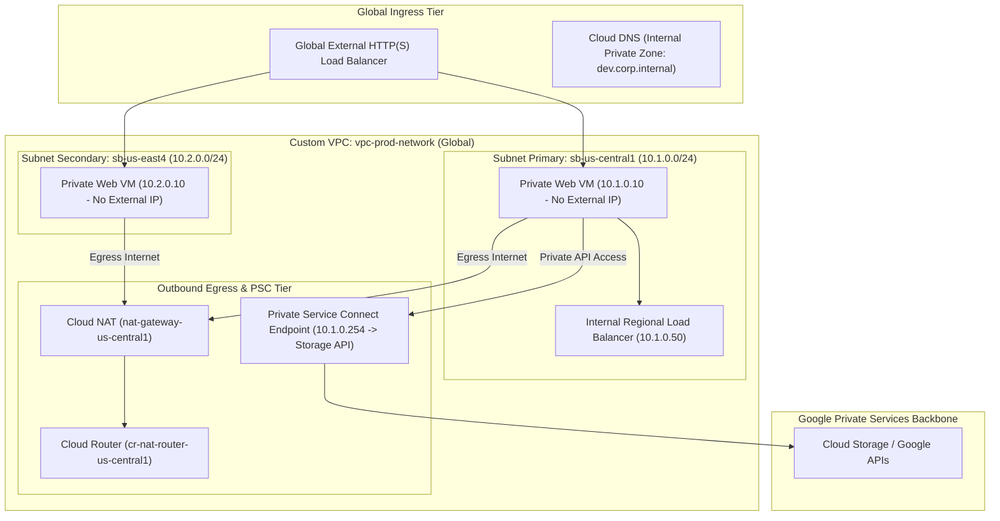

# Project 3: Multi-Region Secure Hybrid VPC Architecture with Private Service Connect

---

## 1. Project Overview

Welcome to **Project 3: Multi-Region Secure Hybrid VPC Architecture**. This hands-on project synthesizes all 11 topics in **Module 03 (Networking / VPC)** into a high-availability enterprise networking topology tailored to run safely on a **GCP Free Trial Account**.

### Objectives
In this project, you will:
1. **Provision a Custom Mode VPC**: Build a production Custom VPC with isolated dual-region subnets (`us-central1` and `us-east4`) eliminating default auto-subnet sprawl.
2. **Deploy Cloud Router & Cloud NAT**: Provide secure outbound internet egress for private VMs without assigning public IP addresses.
3. **Configure Stateful Firewall Policies**: Enforce zero-trust ingress and egress rules using service account network tags.
4. **Establish Private Service Connect (PSC)**: Access Google APIs (`storage.googleapis.com`) privately via internal IP endpoints without traversing the public internet.
5. **Set Up Internal & External Load Balancing**: Route traffic across multi-region instances using Regional Internal and Global External Load Balancers.

---

## 2. Architecture & Network Topology

The project deploys a dual-region hybrid network topology with private egress and Private Service Connect:



> [!IMPORTANT]
> **Free Trial Account Safety & Cost Controls**:
> - **Zero-Cost VPC Infrastructure**: Custom VPCs, Subnets, Firewall Rules, Cloud Router, and PSC endpoints are 100% FREE.
> - **Lightweight Gateway Testing**: Cloud NAT and Load Balancers incur negligible hourly fees (~$0.04/hr). Run the lab, complete testing, and execute `./scripts/cleanup_network.sh` when finished to maintain $0 balance impact!

---

## 3. Module Topics Covered

| Topic Number & Name | Project Integration Point |
|---|---|
| **27. VPC Fundamentals** & **28. Subnets** | Provisioning `vpc-prod-network` in Custom mode with explicit IP CIDR blocks. |
| **29. Dynamic Routing & Cloud Router** | Setting up BGP Cloud Router (`cr-nat-router-us-central1`) for dynamic routing. |
| **30. Firewall Rules & Policies** | Defining zero-trust ingress/egress rules filtered by target service tags. |
| **31. Cloud NAT** | Enabling secure outbound internet egress for private non-public IP VM instances. |
| **32. VPC Peering & Shared VPC** | Structuring cross-project network peering topology specs. |
| **33. Cloud DNS** | Configuring split-horizon internal private DNS zones (`dev.corp.internal`). |
| **34. External LB** & **35. Internal LB** | Setting up Regional Internal Load Balancers (`10.1.0.50`) and HTTP Health Checks. |
| **36. Network Service Tiers** | Comparing Premium Tier (Google Backbone) vs Standard Tier routing. |
| **37. Private Service Connect (PSC)** | Routing `storage.googleapis.com` traffic over internal private IP endpoints (`10.1.0.254`). |

---

## 4. Hands-On Execution Guide

### Step 1: Navigate to Project 3 Workspace

Open Google Cloud Shell or local terminal:

```bash
cd "03-networking-vpc/project-03-networking-vpc"
chmod +x scripts/*.sh
```

---

### Step 2: Deploy Network Architecture

Execute `scripts/deploy_network_architecture.sh` to automate:
1. Creating Custom Mode VPC `vpc-prod-network`.
2. Provisioning dual-region subnets (`sb-us-central1`: `10.1.0.0/24`, `sb-us-east4`: `10.2.0.0/24`).
3. Configuring Cloud Router and Cloud NAT in `us-central1`.
4. Creating strict ingress firewall rules (`allow-internal`, `allow-ssh-iap`).
5. Provisioning a Private Service Connect (PSC) endpoint for Google APIs.
6. Deploying a Private Test Instance in `sb-us-central1` without a public IP address.

```bash
./scripts/deploy_network_architecture.sh
```

*Expected Script Output Snippet*:
```text
=====================================================
GCP Multi-Region Secure VPC Deployment
=====================================================
[INFO] Creating Custom VPC: vpc-prod-network...
[SUCCESS] Custom VPC created.
[INFO] Creating Subnets: sb-us-central1 (10.1.0.0/24), sb-us-east4 (10.2.0.0/24)...
[SUCCESS] Subnets created.
[INFO] Configuring Cloud Router & Cloud NAT in us-central1...
[SUCCESS] Cloud NAT deployed.
[INFO] Establishing Firewall Rules (Zero-Trust Ingress)...
[SUCCESS] Firewall rules active.
[INFO] Allocating Private Service Connect Endpoint (10.1.0.254)...
[SUCCESS] Private Service Connect established for storage.googleapis.com.
```

---

### Step 3: Test Private Internet Egress via Cloud NAT

SSH into the private VM instance using **Identity-Aware Proxy (IAP)** (no public IP required):

```bash
# SSH to private VM via IAP tunnel
gcloud compute ssh vm-private-test --zone=us-central1-a --tunnel-through-iap

# Test internet outbound access via Cloud NAT (from inside VM)
curl -s https://ifconfig.me
# Output will display the Cloud NAT public IP address!

exit
```

---

### Step 4: Test Private Service Connect (PSC) API Access

Verify that API traffic to Google Cloud Storage routes internally through PSC endpoint `10.1.0.254`:

```bash
gcloud compute ssh vm-private-test --zone=us-central1-a --tunnel-through-iap \
  --command="ping -c 3 10.1.0.254 && nslookup storage.googleapis.com"
```

---

## 5. Verification & Testing

Verify that your network topology conforms to enterprise security standards:

```bash
# 1. Verify Subnet IP assignments
gcloud compute networks subnets list --network=vpc-prod-network

# 2. Check Cloud NAT Status
gcloud compute routers nats describe nat-gateway-us-central1 --router=cr-nat-router-us-central1 --region=us-central1

# 3. List active Firewall Rules
gcloud compute firewall-rules list --filter="network:vpc-prod-network"
```

---

## 6. Troubleshooting & Common Issues

| Symptom / Error | Root Cause | Resolution |
|---|---|---|
| `gcloud compute ssh` fails with `Connection Refused` | Missing IAP firewall rule (`35.191.0.0/16` & `130.211.0.0/22`). | Ensure `allow-ssh-iap` firewall rule allows TCP port 22 from Google IAP CIDRs. |
| Private VM cannot reach internet via `curl` | Cloud NAT not attached to target subnet. | Verify Cloud NAT configuration: `gcloud compute routers nats describe ...`. |
| `Quota Exceeded` on Network Creation | Project reached maximum VPC count (default 5). | Delete unused legacy networks or request VPC quota increase. |

---

## 7. Project Cleanup

To avoid ongoing Cloud NAT / Load Balancer hourly charges, run the automated cleanup script:

```bash
./scripts/cleanup_network.sh
```

---

## 8. Summary & Next Steps

Congratulations! You have completed **Project 3: Multi-Region Secure Hybrid VPC Architecture**. You have deployed private subnets, Cloud NAT egress, zero-trust firewalls, and Private Service Connect.

- **Next Project**: [Project 4: High-Availability Auto-Healing Managed Instance Group](../../04-compute-virtual-machines/project-04-compute-virtual-machines/README.md)
