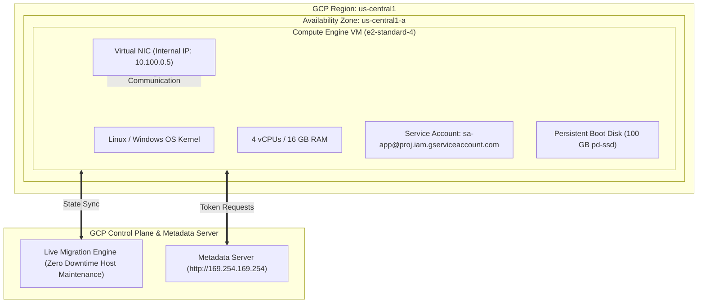

# Topic 38: Virtual Machines

---

## 1. What Is It?

A **Virtual Machine (VM) Instance** in Google Compute Engine (GCE) is an Infrastructure as a Service (IaaS) virtualized computing resource hosted on Google's global infrastructure.

Compute Engine VMs run Linux or Windows operating systems on top of Google's custom-built KVM hypervisors. Each VM instance is assigned virtual vCPUs, RAM, persistent boot disks, network interfaces (vNICs), and attached IAM service accounts.

Compute Engine provides flexible provisioning options: **Standard On-Demand VMs** (steady production workloads), **Spot / Preemptible VMs** (fault-tolerant batch workloads at up to 91% discount), and **Sole-Tenant Nodes** (dedicated physical hardware for strict compliance).

### Real-World Analogy
Think of a Compute Engine Virtual Machine like renting a fully furnished apartment in a high-rise residential building. Instead of buying land, laying bricks, and installing power generators yourself (On-Premises Physical Servers), you select an apartment size (Machine Type: 2 bedrooms / 8GB RAM), plug in your keycard (IAM Service Account), and install your furniture (OS & Application code). If you need more space, you upgrade to a penthouse apartment (Live Migration & Rightsizing) without moving out.

---

## 2. Where Does It Fit?

Virtual Machine instances reside in a specific Availability Zone within a regional Subnet of a global VPC, executing workload applications.



---

## 3. Core Concepts

| VM Provisioning Model | Pricing Discount | Lifetime / Preemption Rule | Best Used For |
|---|---|---|---|
| **Standard On-Demand** | Standard pricing | 100% guaranteed availability; no automatic termination. | Primary production databases, web servers, stateful services. |
| **Spot / Preemptible VMs** | 60% to 91% discount | Subject to preemption at any time if Google needs compute capacity back. | Batch processing, CI/CD runners, GKE stateless worker pools. |
| **Sole-Tenant Nodes** | Dedicated host pricing | Physical hardware server dedicated exclusively to your GCP project. | Strict regulatory compliance, BYOL (Bring Your Own License), compliance isolation. |
| **Live Migration** | Built-in zero cost | Google automatically migrates running VMs to new host hardware during maintenance. | Guarantees zero application downtime during Google infrastructure maintenance. |

---

## 4. How It Works

VM Lifecycle management and Live Migration operate transparently:

```text
GCP Host Hardware requires maintenance or BIOS patching in us-central1-a
              ↓
Compute Engine Live Migration engine initiates background memory page copying
              ↓
Running VM's active RAM state & CPU registers copied to new host hypervisor
              ↓
Final sub-millisecond memory delta synced -> Control transferred to new host
              ↓
VM continues running without rebooting, network disconnects, or storage unmounts!
```

1. **Live Migration**: Unlike other cloud providers that force VM reboots during host maintenance, GCP Live-Migrates running instances seamlessly with zero application downtime.
2. **Metadata Server**: Running applications query `http://169.254.169.254` to fetch instance hostname, IP addresses, custom metadata, and short-lived OAuth2 access tokens.

---

## 5. Production Scenario

### Fault-Tolerant Hybrid Compute Fleet for Microservices & Batch Analytics

```text
Requirement: Run a hybrid web application fleet where core web APIs require 100% uptime SLA, while background batch data processing scales at minimum cost.
    ↓
Architecture: Managed Instance Groups (MIGs) combining Standard and Spot VMs.
    ↓
Deployment Model:
  - Web Tier (MIG 1): Standard On-Demand N2 instances (`n2-standard-4`) across 3 zones with Auto-healing health checks.
  - Analytics Tier (MIG 2): Spot VMs (`e2-standard-8`) handling asynchronous Pub/Sub queue tasks.
    ↓
Security: All VMs deployed in Private Subnets with Zero Public IPs. Admin access strictly via Identity-Aware Proxy (IAP).
    ↓
Cost Optimization: Spot VMs reduce batch compute expenses by 75%; committed use discounts (CUDs) applied to Web Tier.
    ↓
Monitoring: Cloud Monitoring Agent collecting OS memory and disk utilization metrics.
```

*Why Selected*: Combines high-availability On-Demand instances for SLA-bound APIs with deeply discounted Spot instances for cost-effective background batch processing.

---

## 6. Hands-On Lab

### Prerequisites
- Active GCP Project with Custom VPC and Subnet created (from Topics 27 & 28).
- Cloud Shell or `gcloud` CLI.
- IAM permissions: `roles/compute.instanceAdmin.v1`.

### Console Method
1. Log into [Google Cloud Console](https://console.cloud.google.com/).
2. Navigate to **Compute Engine** → **VM instances**.
3. Click **CREATE INSTANCE** at top.
4. Set Name: `web-app-vm`, Region: `us-central1`, Zone: `us-central1-a`.
5. Machine configuration: Series **E2**, Machine type **e2-medium** (2 vCPU, 4 GB RAM).
6. Boot disk: Select **Debian GNU/Linux 12** → Size **20 GB**.
7. Identity and API access: Service account -> Select your dedicated User-Managed Service Account.
8. Networking: Expand **Advanced options** → **Networking** → Select VPC `custom-prod-vpc`, Subnet `sb-us-central1` → External IPv4: **None** (Private VM).
9. Security: Enable **Turn on Shielded VM options** (Secure Boot, vTPM).
10. Click **CREATE**.

### CLI Method
Create a secure private VM instance using `gcloud`:

```bash
# Set project and network variables
PROJECT_ID="your-gcp-project-id"
VPC_NAME="custom-prod-vpc"
SUBNET_NAME="sb-us-central1"
SA_EMAIL="sa-app@${PROJECT_ID}.iam.gserviceaccount.com"

# 1. Create a private VM instance with Shielded VM security & custom Service Account
gcloud compute instances create web-app-vm \
    --zone=us-central1-a \
    --machine-type=e2-medium \
    --network=$VPC_NAME \
    --subnet=$SUBNET_NAME \
    --no-address \
    --service-account=$SA_EMAIL \
    --scopes=cloud-platform \
    --shielded-secure-boot \
    --metadata=startup-script='#!/bin/bash
apt-get update && apt-get install -y nginx
echo "Hello from GCP Compute Engine Private VM" > /var/www/html/index.html'

# 2. Inspect created VM details
gcloud compute instances describe web-app-vm --zone=us-central1-a
```

### Verification
SSH into the private VM securely via Identity-Aware Proxy (IAP):

```bash
gcloud compute ssh web-app-vm --zone=us-central1-a --tunnel-through-iap \
    --command="curl -s http://localhost"
```
*Expected Result*: Returns `Hello from GCP Compute Engine Private VM` served by Nginx inside the private instance.

### Cleanup
Delete test VM:

```bash
gcloud compute instances delete web-app-vm --zone=us-central1-a --quiet
```

---

## 7. Security

### Shielded VMs & Hardening Standards
- **Shielded VM Options**: Always enable **Secure Boot**, **vTPM** (Virtual Trusted Platform Module), and **Integrity Monitoring** to protect VMs against rootkits, bootkits, and kernel tampering.
- **Disable Public IPs**: Provision VMs without external public IP addresses (`--no-address`). Access private VMs exclusively via Identity-Aware Proxy (IAP) SSH tunneling.
- **Dedicated Service Accounts**: Attach fine-grained User-Managed Service Accounts to VMs; never use the default compute service account holding primitive `Editor` roles.

```text
BAD PRACTICE:
Provisioning VMs with public IPv4 addresses, default service accounts (`Editor` role), and open SSH (0.0.0.0/0).
Risk: Public IPs are targeted by automated brute-force scripts within minutes of provisioning.

PRODUCTION PRACTICE:
Deploy Shielded VMs in private subnets without public IPs. Attach dedicated least-privilege service accounts and use IAP SSH.
```

---

## 8. Scaling & High Availability

VM Availability Architecture:

```text
Standalone VM Instance (SLA: 99.9% - Single point of failure if zone experiences physical hardware outage)
   ↓ (High Availability Multi-Zone Deployment)
Managed Instance Group (MIG) across Zones A, B, and C (SLA: 99.99% - Auto-healing & Auto-scaling)
   ↓ (Global High Availability)
Multi-Region MIGs behind Global Application Load Balancer (Auto-spillover & Regional Failover)
```

- **Avoid Single VMs for SLA Workloads**: Single VM instances do not offer a 99.99% SLA. Deploy production workloads inside Managed Instance Groups (MIGs) spanning multiple availability zones.

---

## 9. Cost

### FinOps Cost Optimization Techniques
- **Committed Use Discounts (CUDs)**: Save 28% to 57% off standard rates by committing to a 1-year or 3-year compute capacity usage contract.
- **Sustained Use Discounts (SUDs)**: Automatic discounts applied by GCP when running vCPUs for more than 25% of a billing month (available on N1, N2, and C2 series).
- **Custom Machine Types**: Define exact vCPU and RAM ratios (e.g., 3 vCPUs, 11 GB RAM) to avoid paying for over-provisioned standard machine sizes.
- **Stop Unused VMs**: Stopped VMs release vCPU and RAM billing instantly (you pay only for attached Persistent Disks).

---

## 10. Monitoring & Troubleshooting

### VM Observability Tools
- **Ops Agent**: Installed inside the VM OS to stream memory, disk, process metrics, and syslog to Cloud Monitoring and Logging.
- **Serial Console Logging**: View early OS boot logs and kernel panic errors in Cloud Console.

### Troubleshooting Matrix

| Symptom | Possible Cause | What to Check | Fix |
|---|---|---|---|
| SSH via IAP fails (`Connection Refused`) | Missing `35.235.240.0/20` firewall rule or missing IAP IAM permissions | `gcloud compute ssh --tunnel-through-iap` | Create IAP firewall rule for port 22 and grant `roles/iap.tunnelResourceAccessor`. |
| VM stuck in `STOPPING` or boot loop | OS kernel panic or corrupted boot disk configuration | Serial Console logs (Port 1) | Inspect Serial Console logs; detach boot disk and mount to repair VM to fix config. |
| Spot VM terminated unexpectedly | GCP reclaimed compute capacity for higher-priority workloads | Activity Audit Logs (`preempted`) | Ensure workloads running on Spot VMs are stateless and managed by auto-scaling MIGs. |

---

## 11. Common Mistakes

```text
Mistake: Using the Default Compute Engine Service Account (`PROJECT_NUMBER-compute@...`) for production VMs.
Why: Accepting the default pre-selected dropdown option during Console setup.
Impact: VM inherits primitive `Editor` permissions across the entire project, breaching least privilege.
Correct approach: Create dedicated User-Managed Service Accounts with scoped predefined roles for each VM workload.

Mistake: Leaving non-production developer VMs running 24/7 over weekends.
Why: Failing to automate instance start/stop schedules.
Impact: Paying 100% compute charges for idle non-production VMs.
Correct approach: Use Cloud Scheduler or Instance Schedules to automatically stop dev VMs outside business hours.
```

---

## 12. Production Best Practices

- [ ] Enable **Shielded VM** options (Secure Boot, vTPM, Integrity Monitoring) on all VM instances.
- [ ] Provision VMs in private subnets without public IPs (`--no-address`).
- [ ] Connect to private VMs exclusively via **Identity-Aware Proxy (IAP)**.
- [ ] Attach dedicated User-Managed Service Accounts with least-privilege roles to every VM.
- [ ] Install the **Ops Agent** to monitor OS RAM, disk space, and application logs.
- [ ] Purchase 1-year or 3-year **Committed Use Discounts (CUDs)** for baseline production workloads.

---

## 13. Hyperscaler / Enterprise Perspective

```text
Personal / Learning
  ClickOps VM Creation → Public IP enabled → Default Service Account → Manual OS management
        ↓
Small Production
  Custom VPC Subnet → IAP SSH Access → Ops Agent Installed → Custom Machine Types
        ↓
Enterprise Environment
  Instance Templates & Managed Instance Groups → Shielded VMs → Automated CUD Purchasing via FinOps
        ↓
Hyperscaler Environment
  100% Immutable Golden Images (Packer / Image Pipelines) → Automated OS Vulnerability Patching → Zero SSH Console Access Policy
```

In a hyperscaler environment, developers never SSH manually into production VMs. Enterprise infrastructure pipelines use **Packer** to build immutable golden disk images pre-installed with security agents. VMs are deployed automatically via Terraform into multi-zone Managed Instance Groups (MIGs) with automated rolling updates and zero public IP exposure.

---

## 14. Real Project Questions

### Q1: How does GCP Live Migration protect production workloads during physical host maintenance?
**Answer:** During hardware maintenance, BIOS updates, or hypervisor upgrades, Google's Live Migration engine copies the VM's active memory pages, CPU registers, and network state to a new host hypervisor in the background. The final memory delta is transferred in sub-milliseconds, allowing the VM to continue running seamlessly without rebooting, losing IP connections, or unmounting storage.

### Q2: What is the difference between Standard On-Demand VMs and Spot / Preemptible VMs?
**Answer:** Standard On-Demand VMs provide 100% guaranteed compute availability for steady production workloads. Spot VMs offer 60% to 91% cost savings off standard rates, but carry no availability guarantee; GCP can terminate (preempt) Spot instances at any time with a 30-second warning if Google requires compute capacity back. Spot VMs are ideal for fault-tolerant, stateless batch processing.

### Q3: What security features are provided by enabling Shielded VM options?
**Answer:** Shielded VMs provide cryptographic boot integrity using three features:
1. **Secure Boot**: Verifies digital signatures of bootloaders and kernel drivers, blocking rootkits.
2. **vTPM**: Virtual Trusted Platform Module used to measure and store boot integrity state.
3. **Integrity Monitoring**: Compares current boot state against a known baseline, alerting in Cloud Logging if boot tampering occurs.

---

## 15. Quick Decision Guide

| Requirement | Recommended Approach | Reason |
|---|---|---|
| Core production SQL database requiring 99.99% availability | **Standard On-Demand N2/C2 VM + Persistent Disk** | Guaranteed compute availability; no preemption risk; Live Migration supported. |
| Asynchronous video encoding pipeline handling 10,000 tasks | **Spot VMs inside Managed Instance Group** | Saves up to 90% on compute costs; auto-scaling MIG automatically replaces preempted nodes. |
| Running legacy Windows Server with strict per-socket licensing | **Sole-Tenant Nodes** | Dedicated physical hardware host allowing Bring Your Own License (BYOL) compliance. |

### When should I use it?
- Essential compute service for running stateful applications, legacy enterprise software, or custom OS workloads.

### When should I NOT use it?
- Do not use individual standalone VMs for stateless containerized web applications—use GKE or Cloud Run.

---

## 16. Related Services

```text
             [38. Virtual Machines]
            /          |           \
     Machine Types  Persistent    Managed Instance
      & Families      Disks         Groups (MIGs)
           |            |                 |
      CPU / RAM      Block         Auto-scaling &
       Specs        Storage          Auto-healing
```

- **Machine Types**: Specifies vCPU, RAM, and architecture options.
- **Persistent Disks**: High-performance durable block storage attached to VMs.
- **Managed Instance Groups (MIGs)**: Manages pools of homogeneous VMs for scaling and HA.

---

## 17. Cheat Sheet

### VM Types & Preemption
- **Standard**: 100% SLA, Live Migration enabled.
- **Spot**: Up to 91% discount, 30-second preemption warning, zero SLA.
- **Sole-Tenant**: Dedicated physical host hardware.

### Useful Commands
```bash
# Create a secure private VM with Shielded options
gcloud compute instances create VM_NAME \
    --zone=us-central1-a --machine-type=e2-medium \
    --network=VPC_NAME --subnet=SUBNET_NAME --no-address \
    --service-account=SA_EMAIL --shielded-secure-boot

# SSH into a private VM via IAP
gcloud compute ssh VM_NAME --zone=us-central1-a --tunnel-through-iap

# Stop a running VM
gcloud compute instances stop VM_NAME --zone=us-central1-a
```

---

## 18. Learning Connection

- **Previous Topic**: [37. Private Service Connect](../../03-networking-vpc/37-private-service-connect/README.md)
- **Next Topic**: [39. Machine Types](../39-machine-types/README.md)
