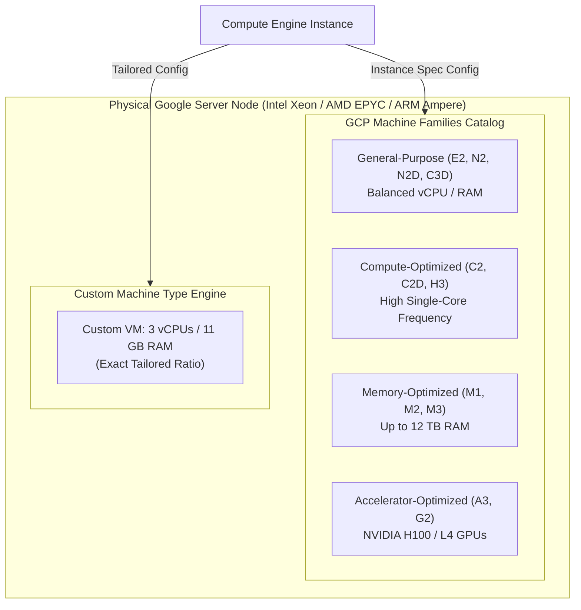

# Topic 39: Machine Types

---

## 1. What Is It?

A **Machine Type** in Google Compute Engine defines the specific virtualized hardware resources—vCPUs, RAM memory, memory bandwidth, and max network egress speed—allocated to a Virtual Machine instance.

GCP categorizes Machine Types into distinct **Machine Families** optimized for specific workload profiles:
1. **General Purpose (E2, N2, N2D, C3D)**: Balanced price-to-performance ratio for web servers, microservices, and small databases.
2. **Compute-Optimized (C2, C2D, H3)**: High clock speeds (up to 3.9 GHz) for HPC, gaming, and compute-intensive simulations.
3. **Memory-Optimized (M1, M2, M3)**: Ultra-high memory ratios (up to 12 TB RAM) for large SAP HANA and in-memory databases.
4. **Storage-Optimized (Z3)**: Local NVMe SSD storage for low-latency scale-out databases.
5. **Accelerator-Optimized (A2, A3, G2)**: NVIDIA GPUs (Tensor Core H100, L4, A100) for AI/ML training and inference.

Additionally, GCP offers **Custom Machine Types**, allowing engineers to fine-tune exact vCPU and RAM ratios to avoid paying for unneeded resources.

### Real-World Analogy
Think of Machine Types like selecting a commercial delivery vehicle from a fleet catalog:
- **General Purpose (E2/N2)**: Standard cargo van suitable for everyday package deliveries.
- **Compute-Optimized (C2)**: High-speed sports car for urgent express deliveries.
- **Memory-Optimized (M3)**: Heavy-duty semi-truck for moving massive furniture loads (RAM).
- **Custom Machine Type**: Customizing the cargo van's interior layout with custom shelves and engine tuning tailored precisely to your specific package sizes.

---

## 2. Where Does It Fit?

Machine Types dictate the hypervisor compute allocation on physical host servers, governing CPU performance, RAM capacity, and network interface throughput.



---

## 3. Core Concepts

| Machine Family | Series | Processor Platform | Best Used For | Key Feature |
|---|---|---|---|---|
| **General Purpose** | **E2** | Dynamic Shared Core (Intel/AMD) | Dev/test, web microservices, small DBs | Most cost-effective; Day-to-day work. |
| **General Purpose** | **N2 / N2D** | Intel Ice Lake / AMD EPYC | Enterprise apps, medium DBs, web tiers | Balanced performance; Custom machine types. |
| **Compute-Optimized** | **C2 / C2D** | High Frequency Intel/AMD | High-Performance Computing (HPC), gaming | Max single-thread clock speed (3.9 GHz). |
| **Memory-Optimized** | **M2 / M3** | Intel Xeon Scalable | SAP HANA, large Redis, In-memory analytics | Massive RAM capacity (up to 12 TB RAM). |
| **Accelerator-Optimized**| **G2 / A3** | NVIDIA L4 / H100 GPUs | Generative AI, LLM training, Raytracing | High-bandwidth GPU interconnects. |

---

## 4. How It Works

Resource allocation and Network Bandwidth scaling operate according to strict machine type ratios:

```text
Engineer provisions n2-standard-16 (16 vCPUs, 64 GB RAM)
              ↓
Compute Engine Hypervisor pins 16 vCPUs to physical processor cores
              ↓
Hypervisor allocates 64 GB physical RAM
              ↓
Network Egress Throughput scaled automatically based on vCPU count:
  - 1 vCPU = ~2 Gbps max egress
  - 16 vCPUs = ~32 Gbps max egress
  - 32+ vCPUs (with Tier 1 Networking) = Up to 100 Gbps egress
```

1. **vCPU Definition**: On GCP, 1 vCPU equals 1 hardware hyperthread on the underlying physical CPU core.
2. **Dynamic Rightsizing**: GCP IAM Recommender continuously monitors VM CPU and RAM utilization, generating recommendations to downscale or upscale machine types automatically.

---

## 5. Production Scenario

### Cost-Optimized Microservices Fleet with Custom Machine Types

```text
Requirement: Run a High-Traffic Node.js API that requires 3 vCPUs for CPU processing and 11 GB RAM for memory caching. Standard predefined sizes are `n2-standard-4` (4 vCPU/16GB) or `n2-standard-2` (2 vCPU/8GB).
    ↓
Architecture: Custom Machine Type `n2-custom-3-11264`.
    ↓
Configuration:
  - vCPUs: `3`
  - RAM: `11.25 GB` (11,264 MB)
    ↓
Financial Impact: Choosing `n2-custom-3-11264` instead of over-provisioning to `n2-standard-4` saves 25% on vCPU and RAM billing costs.
    ↓
Scaling: Automated Managed Instance Group (MIG) scaling custom instances based on CPU utilization metrics.
    ↓
Monitoring: Cloud Monitoring Agent tracking RAM usage to verify 11 GB headroom is sufficient.
```

*Why Selected*: Custom Machine Types eliminate waste by allowing engineers to pay strictly for the exact ratio of vCPU and memory required by their workload, rather than paying for unused pre-packaged capacity.

---

## 6. Hands-On Lab

### Prerequisites
- Active GCP Project with Compute Engine API enabled.
- Cloud Shell or `gcloud` CLI.
- IAM permissions: `roles/compute.instanceAdmin.v1`.

### Console Method
1. Log into [Google Cloud Console](https://console.cloud.google.com/).
2. Navigate to **Compute Engine** → **VM instances** → Click **CREATE INSTANCE**.
3. Set Name: `custom-app-vm`, Region: `us-central1`, Zone: `us-central1-a`.
4. Under **Machine configuration**:
   - Series: Select **N2**.
   - Machine type: Select **Custom**.
   - Cores: Move slider to **3 vCPUs**.
   - Memory: Adjust slider to **11 GB**.
5. Observe the estimated monthly cost update in real time on the right panel.
6. Click **CREATE**.

### CLI Method
Create custom machine type instances and modify existing VM machine types using `gcloud`:

```bash
# Set project variable
PROJECT_ID="your-gcp-project-id"

# 1. Create a VM using a Custom Machine Type (3 vCPUs, 11264 MB RAM)
gcloud compute instances create custom-app-vm \
    --zone=us-central1-a \
    --machine-type=n2-custom-3-11264 \
    --subnet=default

# 2. Stop the VM to change its machine type
gcloud compute instances stop custom-app-vm --zone=us-central1-a

# 3. Change machine type to Compute-Optimized (c2-standard-4) for high-performance processing
gcloud compute instances set-machine-type custom-app-vm \
    --zone=us-central1-a \
    --machine-type=c2-standard-4

# 4. Start the VM again with the new hardware spec
gcloud compute instances start custom-app-vm --zone=us-central1-a
```

### Verification
*Expected Result*: Running `gcloud compute instances describe custom-app-vm --zone=us-central1-a --format="value(machineType)"` confirms machine type updated to `c2-standard-4`.

### Cleanup
Delete test VM:

```bash
gcloud compute instances delete custom-app-vm --zone=us-central1-a --quiet
```

---

## 7. Security

### CPU Vulnerability & Memory Isolation
- **Hardware Isolation**: General Purpose N2/C3 and Memory-Optimized M3 series use hardware-enforced CPU virtualization extensions, protecting against speculative execution side-channel attacks (Spectre/Meltdown).
- **Sole-Tenant Nodes**: If compliance requires physical hardware isolation (preventing co-locating on the same physical host with other GCP customers), deploy machine types on **Sole-Tenant Nodes**.

```text
BAD PRACTICE:
Over-provisioning production VMs to massive machine types (e.g., `n2-standard-32`) "just in case", without analyzing real workload metrics.
Risk: Paying thousands of dollars monthly for idle vCPUs and unused memory.

PRODUCTION PRACTICE:
Start with cost-effective E2 or N2 machine types. Use Cloud Monitoring and IAM Recommender to rightsize machine types based on actual p95 CPU/RAM usage.
```

---

## 8. Scaling & High Availability

Machine Type Modification Lifecycle:

```text
Running VM (e2-standard-2) -> vCPU utilization consistently at 95%
   ↓ (Vertical Scaling / Rightsizing)
Stop VM -> Change Machine Type (`gcloud compute instances set-machine-type --machine-type=n2-standard-8`) -> Start VM
   ↓ (Horizontal Auto-Scaling Alternative)
Keep VM size fixed -> Use Managed Instance Groups (MIGs) to scale from 2 to 10 instances horizontally
```

- **Horizontal vs. Vertical Scaling**: Changing machine types requires stopping the VM (vertical scaling). For zero-downtime high availability, use horizontal scaling with Managed Instance Groups (MIGs) instead.

---

## 9. Cost

### Pricing Strategies by Machine Family
- **E2 Series**: Most cost-effective general-purpose family (~30% cheaper than N1/N2). Uses dynamic resource sharing for non-sustained workloads.
- **Spot / Preemptible Discount**: Apply up to 90% discount regardless of machine family chosen.
- **Custom Machine Type Pricing**: Priced per vCPU and per GB of RAM allocated, carrying a small custom surcharge compared to pre-packaged standard shapes.

---

## 10. Monitoring & Troubleshooting

### Machine Type Observability Tools
- **IAM Recommender (Rightsizing)**: Automatically scans 8-day CPU/RAM utilization and flags over-provisioned or under-provisioned machine types in Console.
- **Ops Agent**: Required to monitor actual OS RAM memory usage (GCP hypervisor metrics monitor CPU and disk I/O, but require Ops Agent for internal RAM visibility).

### Troubleshooting Matrix

| Symptom | Possible Cause | What to Check | Fix |
|---|---|---|---|
| `QUOTA_EXCEEDED` error when creating C2/A3 instance | Project lacks regional quota for specific CPU family (e.g., C2 CPUs) | `gcloud compute regions describe` | Submit Quota Increase Request via Console for the specific machine family. |
| Network bandwidth capped at low speed | Small machine type selected (e.g., 1 vCPU = ~2 Gbps max egress) | Machine type vCPU count | Increase vCPU count or enable Tier 1 Networking on 30+ vCPU instances. |
| VM running out of memory (OOM killer invoked) | RAM under-provisioned for application footprint | Ops Agent Memory metrics | Stop VM and upgrade machine type RAM ratio (e.g., move to `n2-highmem` series). |

---

## 11. Common Mistakes

```text
Mistake: Assuming GCP hypervisors automatically track internal OS memory (RAM) usage out of the box.
Why: Expecting GCP Console metrics to show RAM utilization without installing agents.
Impact: Inability to detect OOM memory exhaustion risks; rightsizing recommendations miss RAM bottlenecks.
Correct approach: Always install the GCP Ops Agent inside the VM OS to stream memory metrics.

Mistake: Using Compute-Optimized (C2) or Memory-Optimized (M1) machine types for simple low-traffic dev/test web apps.
Why: Assuming expensive machine families make every application run faster.
Impact: Massive unnecessary cloud spending with zero noticeable performance improvement.
Correct approach: Default to E2 or N2 series for general-purpose workloads; reserve C2/M1 for benchmark-proven bottlenecks.
```

---

## 12. Production Best Practices

- [ ] Use **E2 or N2 series** as the default baseline machine family for general workloads.
- [ ] Utilize **Custom Machine Types** to match exact vCPU and RAM requirements without waste.
- [ ] Install the **Ops Agent** on 100% of VMs to capture OS memory and disk telemetry.
- [ ] Review **IAM Recommender** rightsizing suggestions monthly to eliminate over-provisioned VMs.
- [ ] Reserve **C2/C2D** series for high-frequency single-thread compute workloads (HPC, gaming).
- [ ] Reserve **M1/M2/M3** series for massive in-memory enterprise databases (SAP HANA).

---

## 13. Hyperscaler / Enterprise Perspective

```text
Personal / Learning
  Pre-packaged e2-medium → Manual machine type selection → No memory monitoring
        ↓
Small Production
  Custom Machine Types (N2) → Ops Agent Installed → Basic Rightsizing
        ↓
Enterprise Environment
  Automated Recommender Downscaling → Committed Use Discounts (CUDs) by Machine Family → Sole-Tenant Compliance Nodes
        ↓
Hyperscaler Environment
  100% Automated Policy-as-Code Machine Type Enforcement → FinOps Rightsizing Dashboards → Accelerator (GPU) Capacity Reservations
```

In a hyperscaler environment, enterprise FinOps teams establish strict Machine Family guidelines. Automated scripts query IAM Recommender APIs across thousands of VMs, automatically creating pull requests to downscale idle machine types, while 1-year and 3-year Committed Use Discounts (CUDs) are purchased centrally to maximize cost savings across machine families.

---

## 14. Real Project Questions

### Q1: What is the main operational advantage of GCP Custom Machine Types over fixed pre-packaged instance sizes?
**Answer:** Custom Machine Types allow engineers to specify exact vCPU counts and RAM ratios (e.g., 3 vCPUs and 11 GB RAM) tailored to an application's specific resource footprint. This eliminates the forced over-provisioning and wasted cost associated with pre-packaged instance shapes (such as being forced to buy a 4 vCPU/16GB instance when only 3 vCPUs/11GB are needed).

### Q2: What is the difference between the General-Purpose (N2), Compute-Optimized (C2), and Memory-Optimized (M3) machine families?
**Answer:**
- **N2 (General-Purpose)**: Balanced vCPU-to-memory ratio suitable for general web applications, microservices, and medium databases.
- **C2 (Compute-Optimized)**: High single-core clock frequencies (up to 3.9 GHz) designed for compute-bound tasks, gaming servers, and HPC simulations.
- **M3 (Memory-Optimized)**: Ultra-high memory capacity (up to 12 TB RAM) designed specifically for massive in-memory databases like SAP HANA and Redis.

### Q3: Why is installing the Ops Agent necessary to perform accurate VM memory rightsizing?
**Answer:** The GCP hypervisor monitors CPU utilization and disk/network I/O from the host hypervisor level, but it cannot see inside the VM's operating system memory space. Installing the Ops Agent streams OS-level memory (RAM) usage metrics to Cloud Monitoring, enabling accurate rightsizing recommendations for RAM.

---

## 15. Quick Decision Guide

| Requirement | Recommended Approach | Reason |
|---|---|---|
| Standard web API requiring 3 vCPUs and 11 GB RAM | **Custom Machine Type (`n2-custom-3-11264`)** | Avoids over-paying for a pre-packaged 4 vCPU/16GB instance shape. |
| High-performance electronic design automation (EDA) simulation | **Compute-Optimized (`c2-standard-16`)** | Delivers maximum single-thread CPU clock speed (up to 3.9 GHz). |
| Multi-terabyte SAP HANA in-memory enterprise database | **Memory-Optimized (`m3-megamem-128`)** | Provides massive RAM capacity (up to 12 TB) certified for SAP HANA. |

### When should I use it?
- Essential task during VM provisioning to match hardware capabilities to workload requirements efficiently.

### When should I NOT use it?
- Do not select high-cost compute/memory families without benchmarking data proving performance necessity.

---

## 16. Related Services

```text
               [39. Machine Types]
              /         |         \
      Compute Engine   Ops Agent  IAM Recommender
        Hypervisor     (Memory)    (Rightsizing)
            |              |             |
        vCPU / RAM     OS Metrics   Auto Downscale
```

- **Compute Engine Hypervisor**: Allocates machine type resources on host hardware.
- **Ops Agent**: Streams OS memory metrics required for accurate RAM rightsizing.
- **IAM Recommender**: AI engine generating machine type downscaling recommendations.

---

## 17. Cheat Sheet

### Machine Family Summary
- **E2**: Cost-effective general purpose.
- **N2 / N2D**: Standard balanced enterprise general purpose.
- **C2 / C2D**: High clock-speed compute optimized.
- **M1 / M2 / M3**: Large memory optimized (SAP HANA).
- **A2 / A3 / G2**: GPU accelerator optimized (AI/ML).

### Useful Commands
```bash
# List available machine types in a zone
gcloud compute machine-types list --filter="zone:us-central1-a AND name:n2*"

# Create VM with Custom Machine Type
gcloud compute instances create VM_NAME \
    --zone=us-central1-a --machine-type=n2-custom-3-11264

# Change machine type of a stopped VM
gcloud compute instances set-machine-type VM_NAME \
    --zone=us-central1-a --machine-type=c2-standard-4
```

---

## 18. Learning Connection

- **Previous Topic**: [38. Virtual Machines](../38-virtual-machines/README.md)
- **Next Topic**: [40. Persistent Disks](../40-persistent-disks/README.md)
