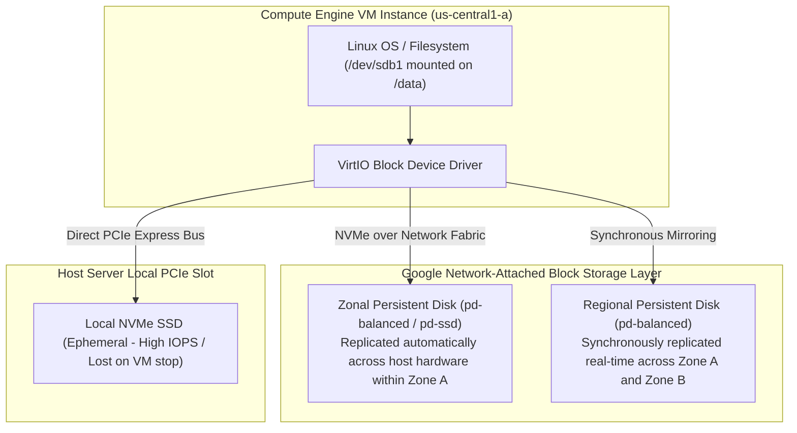

# Topic 40: Persistent Disks

---

## 1. What Is It?

A **Persistent Disk (PD)** in Google Cloud is a durable, high-performance, network-attached block storage device mounted to Compute Engine Virtual Machines and GKE nodes.

Persistent Disks function like network SAN (Storage Area Network) drives. Because they exist independently of the physical host hardware running your VM instance, data stored on a Persistent Disk survives intact even if the VM instance is stopped, deleted, or live-migrated to a new physical server.

GCP offers five primary block storage options:
1. **Standard Persistent Disk (`pd-standard`)**: High-capacity spinning hard drives for sequential I/O and cold storage.
2. **Balanced Persistent Disk (`pd-balanced`)**: Cost-effective SSD storage for general enterprise workloads.
3. **Performance SSD (`pd-ssd`)**: High-IOPS SSD storage for latency-sensitive databases.
4. **Extreme Persistent Disk (`pd-extreme`)**: Provisioned IOPS storage for mission-critical enterprise workloads (SAP HANA, SQL Server).
5. **Local SSD**: Ultra-high-speed NVMe drives physically attached to the host server (ephemeral, non-persistent).

### Real-World Analogy
Think of a Persistent Disk like an external high-speed USB-C solid-state drive (SSD). You can plug the external drive into your laptop (VM Instance) to work on files. If your laptop motherboard breaks, you simply unplug the external drive and plug it into a brand new laptop—all your files, installed operating systems, and database files remain 100% intact without losing a single byte of data.

---

## 2. Where Does It Fit?

Persistent Disks attach over Google's high-speed internal datacenter network to Compute Engine VMs, providing durable block storage layer for operating systems and databases.



---

## 3. Core Concepts

| Disk Type | Media Type | Max IOPS (Read/Write) | Max Throughput | Primary Use Case |
|---|---|---|---|---|
| **`pd-standard`** | HDD (Spinning Disk) | 3,000 / 15,000 | 400 MB/s | Large sequential logs, batch processing, cold data. |
| **`pd-balanced`** | SSD (Balanced) | 80,000 / 80,000 | 1,200 MB/s | Default production choice; web servers, dev/test. |
| **`pd-ssd`** | SSD (High Performance)| 100,000 / 100,000 | 1,200 MB/s | Transactional databases (PostgreSQL, MySQL). |
| **`pd-extreme`** | Provisioned SSD | 120,000 / 120,000 | 4,000 MB/s | High-performance SAP HANA, Oracle, SQL Server. |
| **Local SSD** | Physical NVMe SSD | 930,000 / 350,000 | 9,300 MB/s | Scratch data, temporary swap, high-speed cache. |

---

## 4. How It Works

Durability, Replication, and Dynamic Resizing follow strict architectural rules:

```text
Engineer issues gcloud compute disks resize --size=500GB
              ↓
GCP Block Storage Control Plane expands virtual disk allocation on storage cluster
              ↓
Disk capacity expanded instantly without stopping VM or unmounting disk!
              ↓
Engineer executes OS filesystem expansion command (e.g., sudo resize2fs /dev/sdb)
              ↓
Filesystem immediately gains access to new 500 GB space
```

1. **Automatic Built-in Redundancy**: GCP automatically replicates all Zonal Persistent Disks across multiple physical hard drives within the same zone to guarantee high durability.
2. **Regional Persistent Disks**: Provides active-passive synchronous replication between two distinct availability zones in the same region, enabling zero-RPO disaster recovery for databases.

---

## 5. Production Scenario

### High-Availability Relational Database with Regional PD Failover

```text
Requirement: Protect a production PostgreSQL database against a complete zonal datacenter failure with near-zero RPO (Recovery Point Objective).
    ↓
Architecture: Compute Engine VM using a **Regional Persistent Disk** (`pd-balanced`).
    ↓
Replication Setup:
  - Primary Zone: `us-central1-a`
  - Secondary Zone: `us-central1-b`
  - Synchronous block-level mirroring handled by GCP storage layer.
    ↓
Disaster Recovery Trigger:
  - Zone A experiences physical power outage.
  - Failover script detaches Regional PD from Zone A VM and attaches to standby VM in Zone B.
  - Database boots in Zone B with 100% data integrity.
    ↓
Monitoring: Cloud Monitoring tracking disk IOPS utilization (`disk/read_ops_count`, `disk/write_ops_count`).
```

*Why Selected*: Regional Persistent Disks provide hardware-level synchronous block mirroring across two zones, enabling fast database disaster recovery without complex application-level database replication setups.

---

## 6. Hands-On Lab

### Prerequisites
- Active GCP Project with a Compute Engine VM created.
- Cloud Shell or `gcloud` CLI.
- IAM permissions: `roles/compute.disksAdmin` and `roles/compute.instanceAdmin.v1`.

### Console Method
1. Log into [Google Cloud Console](https://console.cloud.google.com/).
2. Navigate to **Compute Engine** → **Disks**.
3. Click **CREATE DISK** at top.
4. Set Name: `data-disk-01`, Region: `us-central1`, Zone: `us-central1-a`.
5. Disk type: **Balanced Persistent Disk** (`pd-balanced`), Size: **100 GB**.
6. Click **CREATE**.
7. Navigate to **VM instances** → Select target VM → Click **EDIT**.
8. Under **Additional disks**, click **ATTACH EXISTING DISK** → Select `data-disk-01`.
9. Click **SAVE**.

### CLI Method
Create, attach, dynamically resize, and mount a Persistent Disk using `gcloud`:

```bash
# Set project and VM variables
PROJECT_ID="your-gcp-project-id"
ZONE="us-central1-a"
VM_NAME="app-vm"
DISK_NAME="data-disk-01"

# 1. Create a 100 GB Balanced Persistent Disk
gcloud compute disks create $DISK_NAME \
    --zone=$ZONE \
    --type=pd-balanced \
    --size=100GB

# 2. Attach the disk to an existing running VM instance
gcloud compute instances attach-disk $VM_NAME \
    --zone=$ZONE \
    --disk=$DISK_NAME

# 3. Dynamically expand disk capacity online from 100 GB to 200 GB (NO VM REBOOT REQUIRED)
gcloud compute disks resize $DISK_NAME \
    --zone=$ZONE \
    --size=200GB
```

### Verification
SSH into the VM instance and verify block device presence:

```bash
gcloud compute ssh $VM_NAME --zone=$ZONE --command="lsblk"
```
*Expected Result*: Output displays the attached block device (e.g., `/dev/sdb` or `/dev/nvme0n2`) showing the expanded 200 GB capacity.

### Cleanup
Detach and delete test disk:

```bash
gcloud compute instances detach-disk $VM_NAME --zone=$ZONE --disk=$DISK_NAME --quiet
gcloud compute disks delete $DISK_NAME --zone=$ZONE --quiet
```

---

## 7. Security

### Disk Encryption Standards
- **Encryption by Default (Google-Managed Keys)**: All data stored on Persistent Disks is automatically encrypted at rest using AES-256 before being written to disk, at zero extra charge.
- **Customer-Managed Encryption Keys (CMEK)**: Integrate with **Cloud KMS** to manage disk encryption keys yourself, enabling key revocation compliance.
- **Confidential VMs**: Combine Persistent Disks with Confidential VMs to encrypt data in-use inside RAM and CPU registers using hardware AMD SEV memory encryption.

```text
BAD PRACTICE:
Storing temporary scratch files or sensitive data on Local SSDs without realizing Local SSDs are wiped when the VM is stopped or preempted.
Risk: Permanent data loss; Local SSD data does not survive VM instance stops or host resets.

PRODUCTION PRACTICE:
Use Persistent Disks (`pd-balanced` / `pd-ssd`) for all durable data files. Use Local SSDs strictly for temporary swap, scratch data, or read caches.
```

---

## 8. Scaling & High Availability

IOPS and Throughput Performance Scaling:

```text
Disk Performance Scaling Formula:
  PD Performance scales LINEARLY with provisioned gigabytes size up to maximum limits.
  Example (pd-ssd Read IOPS): 30 IOPS per GB.
    - 100 GB pd-ssd = 3,000 Read IOPS
    - 1,000 GB (1 TB) pd-ssd = 30,000 Read IOPS
```

- **Sizing for Performance**: If a database requires 15,000 IOPS, you can achieve this by expanding a `pd-ssd` disk size to 500 GB, even if you only need 100 GB of actual storage capacity.

---

## 9. Cost

### Pricing Factors in Block Storage
- **Provisioned Space Billing**: Persistent Disks are billed based on **provisioned capacity** per month (e.g., paying for 100 GB), regardless of how much actual data is stored on the filesystem.
- **Disk Type Cost Ratios**:
  - `pd-standard` : ~$0.040 per GB/month.
  - `pd-balanced` : ~$0.100 per GB/month.
  - `pd-ssd` : ~$0.170 per GB/month.
  - `Regional PD` : 2x Zonal PD price (due to dual-zone mirroring).

---

## 10. Monitoring & Troubleshooting

### Disk Observability Tools
- **Cloud Monitoring Disk Metrics**: Metrics `disk/read_bytes_count`, `disk/write_bytes_count`, and `disk/read_ops_count`.
- **Disk Throttling Metrics**: Track `disk/throttle_time` to identify if workloads hit IOPS or throughput caps.

### Troubleshooting Matrix

| Symptom | Possible Cause | What to Check | Fix |
|---|---|---|---|
| Disk I/O performance slow / High latency | Provisioned disk size too small to deliver required IOPS | Cloud Monitoring `disk/throttle_time` | Dynamically expand disk size via `gcloud compute disks resize`. |
| Cannot attach disk to VM in Zone B | Disk created as Zonal PD in Zone A | `gcloud compute disks list` | Create snapshot of Zone A disk and restore as a new disk in Zone B. |
| Cannot shrink disk capacity | GCP allows expanding disk sizes online, but prohibits shrinking disk sizes | Disk resize documentation | Create a new smaller disk, attach to VM, and copy files over manually. |

---

## 11. Common Mistakes

```text
Mistake: Expecting a small 20 GB `pd-ssd` disk to deliver maximum 100,000 IOPS performance.
Why: Failing to realize that PD IOPS performance scales linearly with provisioned disk size.
Impact: Severe disk throttling and poor database performance despite choosing SSD media.
Correct approach: Expand provisioned disk size to meet target IOPS requirements based on per-GB scaling formulas.

Mistake: Attempting to shrink a Persistent Disk size after over-allocating storage space.
Why: Assuming disk resizing works symmetrically in both directions.
Impact: Terminal error; GCP API strictly prohibits shrinking Persistent Disks to prevent filesystem corruption.
Correct approach: Size disks conservatively and expand capacity online as storage utilization grows.
```

---

## 12. Production Best Practices

- [ ] Use **`pd-balanced`** as the default baseline disk type for enterprise production workloads.
- [ ] Size Persistent Disks based on required **IOPS/Throughput performance**, not just raw storage gigabytes.
- [ ] Use **Regional Persistent Disks** for mission-critical databases requiring multi-zone disaster recovery.
- [ ] Enable **Customer-Managed Encryption Keys (CMEK)** via Cloud KMS for regulatory compliance.
- [ ] Set up Cloud Monitoring alert policies on `disk/percent_used` to prevent OS disk full outages.
- [ ] Automate disk provisioning, snapshots, and attachments using Infrastructure as Code (Terraform).

---

## 13. Hyperscaler / Enterprise Perspective

```text
Personal / Learning
  Standard HDD (`pd-standard`) → Manual partition formatting → Single zone
        ↓
Small Production
  Balanced SSD (`pd-balanced`) → Automated Snapshots → Online Disk Resizing
        ↓
Enterprise Environment
  Regional Persistent Disks for HA Databases → CMEK Key Rotation via Cloud KMS → Automated Ops Agent Monitoring
        ↓
Hyperscaler Environment
  100% Terraform Managed Storage → Automated Snapshot Schedules → Extreme PD Provisioned IOPS for SAP HANA → Continuous FinOps Disk Cleanup Bots
```

In a hyperscaler environment, enterprise storage architecture is governed by automated policies. FinOps bots continuously scan for orphaned (unattached) Persistent Disks left behind by deleted VMs, automatically creating final safety snapshots and purging unattached disks to save thousands of dollars monthly in unused storage charges.

---

## 14. Real Project Questions

### Q1: How does Persistent Disk IOPS and Throughput performance scale in Google Cloud?
**Answer:** Persistent Disk performance scales **linearly with the provisioned disk size in gigabytes** up to maximum platform limits. For example, a `pd-ssd` disk provides 30 Read IOPS per GB. A 100 GB disk delivers 3,000 IOPS, while a 1,000 GB (1 TB) disk delivers 30,000 IOPS. To achieve higher performance, engineers often expand provisioned disk size.

### Q2: What is the technical difference between a Zonal Persistent Disk and a Regional Persistent Disk?
**Answer:** A Zonal Persistent Disk resides in a single availability zone, replicating data across physical host drives in that zone. A Regional Persistent Disk synchronously mirrors block-level writes in real time across **two distinct availability zones** within the same region, providing hardware-level disaster recovery that allows fast failover if an entire zone outages.

### Q3: Why should Local SSDs NEVER be used as boot disks or primary database storage for stateful applications?
**Answer:** Local SSDs are physically attached to the host server's PCIe slot for maximum performance (up to 930,000 IOPS), but they are **ephemeral and non-persistent**. If the VM instance is stopped, preempted, or experiences a host hardware crash, all data on the Local SSD is permanently lost. Local SSDs should only be used for scratch data, temp files, or read caches.

---

## 15. Quick Decision Guide

| Requirement | Recommended Approach | Reason |
|---|---|---|
| Default boot disk and data storage for production web servers | **Balanced Persistent Disk (`pd-balanced`)** | Optimal balance of performance, SSD durability, and low cost. |
| Enterprise SAP HANA or high-IOPS Oracle database requiring 100,000 IOPS | **Extreme Persistent Disk (`pd-extreme`)** | Provisioned IOPS storage delivering up to 120,000 IOPS and 4,000 MB/s throughput. |
| Temporary high-speed read cache for machine learning training | **Local SSD (NVMe)** | Ultra-high performance (up to 930,000 IOPS) directly on host PCIe bus. |

### When should I use it?
- Essential block storage component for all Compute Engine VMs and GKE stateful workloads.

### When should I NOT use it?
- Do not use Local SSDs for durable long-term file storage.

---

## 16. Related Services

```text
               [40. Persistent Disks]
              /          |          \
      Snapshots     Cloud KMS      Compute Engine
     (Backups)      (CMEK Keys)      (VM Attachment)
         |              |                 |
      Durable       Encryption         Mounted
      Storage       at Rest           Filesystem
```

- **Snapshots**: Point-in-time incremental backups of Persistent Disks.
- **Cloud KMS**: Provides Customer-Managed Encryption Keys (CMEK) for disk encryption.
- **Compute Engine**: Virtual Machine instances mounting Persistent Disks.

---

## 17. Cheat Sheet

### Disk Types Summary
- **`pd-standard`** : Cheap HDD storage.
- **`pd-balanced`** : Default SSD storage (Best value).
- **`pd-ssd`** : High-performance transactional SSD.
- **`pd-extreme`** : Provisioned IOPS for SAP HANA/Oracle.
- **Local SSD** : Ephemeral NVMe scratch storage.

### Useful Commands
```bash
# Create a 100GB Balanced PD
gcloud compute disks create DISK_NAME --zone=us-central1-a --type=pd-balanced --size=100GB

# Dynamically expand disk size online
gcloud compute disks resize DISK_NAME --zone=us-central1-a --size=200GB

# Attach disk to running VM
gcloud compute instances attach-disk VM_NAME --zone=us-central1-a --disk=DISK_NAME
```

---

## 18. Learning Connection

- **Previous Topic**: [39. Machine Types](../39-machine-types/README.md)
- **Next Topic**: [41. Snapshots](../41-snapshots/README.md)
