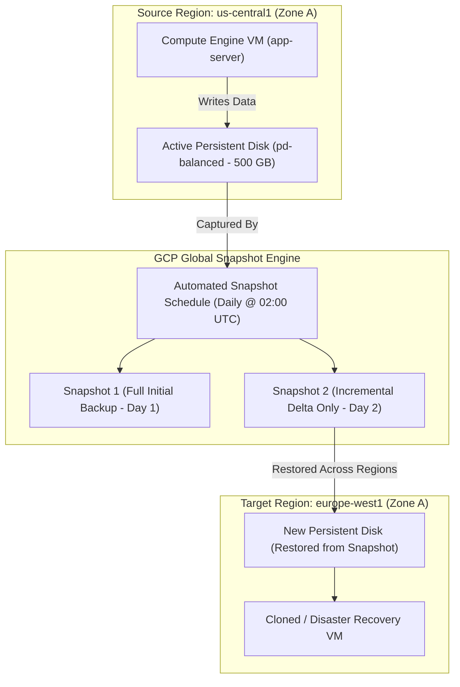

# Topic 41: Snapshots

---

## 1. What Is It?

A **Persistent Disk Snapshot** in Google Cloud is a point-in-time, differential, compressed backup of a Persistent Disk stored globally in Cloud Storage.

Snapshots provide enterprise data protection, disaster recovery, and cross-region disk cloning capabilities.

Key properties of GCP Snapshots include:
1. **Incremental Backups**: The initial snapshot copies the full disk state; subsequent snapshots store *only the modified data blocks* since the last snapshot, saving significant storage space and cost.
2. **Global Access**: Snapshots can be restored into a new Persistent Disk in **any region** worldwide, enabling rapid cross-region disaster recovery and environment cloning.
3. **Automated Snapshot Schedules**: Resource Manager schedules automatically capture daily or hourly disk backups without manual script intervention.

### Real-World Analogy
Think of a Persistent Disk Snapshot like taking a high-definition photograph of a white board every evening. On Day 1, you take a full photograph of everything written on the board (Full Initial Snapshot). On Day 2, instead of taking a whole new photo of the entire board, your camera only records the specific lines that were erased or added (Incremental Delta Snapshot). If the whiteboard is accidentally destroyed (Disk Corruption), you can use the photos to reconstruct an exact physical copy of the whiteboard in a completely different office building (Cross-Region Restore).

---

## 2. Where Does It Fit?

Snapshots capture state from Persistent Disks and compress diffs into global Cloud Storage buckets, allowing restoration into new disks across any GCP region.



---

## 3. Core Concepts

| Concept | Description | Example / Syntax | Best Practice |
|---|---|---|---|
| **Incremental Backup** | Captures only changed blocks since previous snapshot. | Automatic (Handled by GCP storage layer) | Never worry about full vs differential management; GCP optimizes diffs automatically. |
| **Snapshot Schedule** | Automated policy for periodic disk backups. | `schedule: daily, retention: 14 days` | Mandate snapshot schedules for all production boot and data disks. |
| **Multi-Regional Storage** | Storage location where snapshot delta files are saved. | `us` (Multi-region) or `us-central1` | Store snapshots in multi-regional locations for maximum disaster recovery resilience. |
| **Application-Consistent Snapshot** | Flushes OS memory buffers and freezes VSS (Windows) prior to taking snapshot. | `--guest-flush` flag | Use application-consistent snapshots for transactional databases (SQL Server). |
| **Archive Snapshot** | Low-cost long-term retention snapshot class. | `storageLocation: archive` | Use Archive Snapshots for compliance backups retained >90 days (saves up to 50% storage cost). |

---

## 4. How It Works

Incremental snapshot chains and deletion cleanup operate automatically:

```text
Day 1: Disk contains Blocks A, B, C -> Snapshot 1 created (Stores A, B, C)
              ↓
Day 2: Block B modified to B' -> Snapshot 2 created (Stores ONLY Block B')
              ↓
Day 3: Delete Snapshot 1 -> GCP merges Block A & C into Snapshot 2 automatically!
              ↓
Snapshot 2 now holds complete state required to restore full disk (Blocks A, B', C)
```

1. **Non-Disruptive Capture**: Taking a snapshot occurs online while the VM is running without unmounting disks or causing VM downtime.
2. **Safe Deletion**: Deleting an earlier snapshot in a chain never breaks later snapshots. GCP's storage engine automatically consolidates dependencies in the background.

---

## 5. Production Scenario

### Automated Ransomware & Disaster Recovery Pipeline

```text
Requirement: Protect 200 production database disks against accidental deletion, ransomware corruption, and regional outages.
    ↓
Architecture: Automated Snapshot Schedule + Multi-Regional Storage + Archive Retention.
    ↓
Snapshot Schedule Policy:
  - Frequency: Daily at 01:00 UTC.
  - Retention: Keep daily snapshots for 30 days.
  - Location: Multi-Regional `us` (stored across multiple US datacenters).
  - Class: Standard for 14 days -> Automatically transition to Archive Class for 365 days.
    ↓
Disaster Recovery Test:
  - Restore snapshot into a new `pd-ssd` disk in `europe-west1-a`.
  - Attach restored disk to test VM; verify database boots cleanly with 100% data integrity.
    ↓
Monitoring: Cloud Audit Logs recording snapshot creation success and deletion events.
```

*Why Selected*: Combines automated daily backups with multi-regional redundancy and low-cost archive retention, satisfying SOC 2 and ISO 27001 compliance standards.

---

## 6. Hands-On Lab

### Prerequisites
- Active GCP Project with a Persistent Disk created.
- Cloud Shell or `gcloud` CLI.
- IAM permissions: `roles/compute.storageAdmin`.

### Console Method
1. Log into [Google Cloud Console](https://console.cloud.google.com/).
2. Navigate to **Compute Engine** → **Snapshots**.
3. Click **CREATE SNAPSHOT** at top.
4. Set Name: `boot-disk-snap-01`, Source disk: Select your VM boot disk.
5. Location: **Multi-regional** → Select **us (multiple regions in United States)**.
6. Snapshot type: **Standard**.
7. Click **CREATE**.
8. Navigate to **Snapshot schedules** tab → Click **CREATE SNAPSHOT SCHEDULE**:
   - Name: `daily-prod-schedule`, Schedule frequency: **Daily** at 02:00 UTC.
   - Auto-delete snapshots after: **14 days**.
   - Click **CREATE** → Attach schedule to target persistent disk.

### CLI Method
Create a snapshot, snapshot schedule, and restore disk using `gcloud`:

```bash
# Set project and resource variables
PROJECT_ID="your-gcp-project-id"
ZONE="us-central1-a"
DISK_NAME="data-disk-01"
SNAP_NAME="snap-data-disk-01"

# 1. Create a manual snapshot of an existing disk
gcloud compute disks snapshot $DISK_NAME \
    --zone=$ZONE \
    --snapshot-names=$SNAP_NAME \
    --storage-location=us

# 2. Create an automated daily Snapshot Schedule
gcloud compute resource-policies create snapshot-schedule daily-backup-policy \
    --region=us-central1 \
    --max-retention-days=14 \
    --on-source-disk-delete=keep-auto-snapshots \
    --daily-schedule \
    --start-time=02:00

# 3. Attach the snapshot schedule to the persistent disk
gcloud compute disks add-resource-policies $DISK_NAME \
    --zone=$ZONE \
    --resource-policies=daily-backup-policy

# 4. Restore the snapshot into a NEW disk in a DIFFERENT region (europe-west1-a)
gcloud compute disks create restored-disk-eu \
    --zone=europe-west1-a \
    --source-snapshot=$SNAP_NAME \
    --type=pd-balanced
```

### Verification
*Expected Result*: Querying `gcloud compute disks describe restored-disk-eu --zone=europe-west1-a` displays status `READY` with source snapshot URI pointing to `$SNAP_NAME`.

### Cleanup
Delete restored disk, snapshot, and schedule policy:

```bash
gcloud compute disks delete restored-disk-eu --zone=europe-west1-a --quiet
gcloud compute snapshots delete $SNAP_NAME --quiet
gcloud compute resource-policies delete daily-backup-policy --region=us-central1 --quiet
```

---

## 7. Security

### Snapshot Encryption & Identity Security
- **Default Encryption at Rest**: All snapshots are automatically encrypted at rest using Google-managed AES-256 keys or Customer-Managed Encryption Keys (CMEK).
- **Snapshot Access Isolation**: Restrict `roles/compute.storageAdmin` and `roles/compute.snapshotAdmin` IAM roles to authorized backup administrators to prevent unauthorized snapshot downloads or deletion.
- **Cross-Project Restores**: Use IAM Service Account permissions to allow restoring snapshots across different GCP projects securely.

```text
BAD PRACTICE:
Manually running shell scripts inside VMs to copy raw block devices over SSH for backups.
Risk: Causes filesystem corruption, consumes high CPU/network bandwidth, and fails to handle incremental diff management properly.

PRODUCTION PRACTICE:
Use native GCP Snapshot Schedules attached to Persistent Disks. Enable application-consistent `--guest-flush` options for database disks.
```

---

## 8. Scaling & High Availability

Snapshot Storage Class Tiering:

```text
Frequent Production Backups (Daily Snapshots - Standard Snapshot Class)
   ↓ (Retention > 14 Days)
Standard Storage Tier (Fast restore speed - ~$0.026/GB/month)
   ↓ (Compliance Archiving > 90 Days)
Archive Snapshot Storage Tier (Low storage cost - ~$0.013/GB/month - 50% Savings)
```

- **Global Cross-Region Recovery**: Because snapshots are global resources stored in Cloud Storage multi-regions, you can spin up replacement infrastructure in any GCP region during a major continental disaster.

---

## 9. Cost

### Snapshot Cost Mechanics
- **Differential Billing**: You pay ONLY for the actual compressed gigabytes of changed blocks stored in the snapshot chain, not the total size of the original disk.
- **Archive Class Savings**: Use **Archive Snapshots** for long-term compliance backups retained >90 days to reduce storage costs by up to 50%.
- **Delete Unneeded Snapshot Chains**: While individual differential snapshots are small, orphaned daily snapshot chains retained for years without cleanup can accumulate significant storage costs.

---

## 10. Monitoring & Troubleshooting

### Snapshot Observability Tools
- **Cloud Audit Logs**: Filter by `protoPayload.methodName="v1.compute.disks.createSnapshot"` to audit backup history.
- **Console Snapshot Storage Dashboard**: View total storage bytes consumed across snapshot chains.

### Troubleshooting Matrix

| Symptom | Possible Cause | What to Check | Fix |
|---|---|---|---|
| Snapshot creation slow or timed out | High volume of disk write operations occurring during snapshot | Cloud Monitoring disk write IOPS | Schedule snapshot schedules during low-traffic windows (e.g., 02:00 UTC). |
| Cannot restore snapshot in target region | Snapshot restricted to a single regional location | Snapshot `--storage-location` | Create snapshot with multi-regional location (e.g., `us` or `eu`). |
| High snapshot storage bill | Old daily snapshots accumulating without retention policy | `gcloud compute snapshots list` | Enforce max retention days (`--max-retention-days`) in Snapshot Schedules. |

---

## 11. Common Mistakes

```text
Mistake: Deleting an initial snapshot assuming it will corrupt or invalidate subsequent incremental snapshots in the chain.
Why: Misunderstanding how GCP manages differential snapshot block dependency trees.
Impact: Avoiding cleanup of old snapshots out of fear, resulting in massive accumulated storage bills.
Correct approach: Trust GCP's snapshot engine; deleting any snapshot automatically consolidates required data blocks into remaining snapshots.

Mistake: Creating manual cron jobs inside VMs to trigger `gcloud compute disks snapshot` commands.
Why: Unaware of native GCP Resource Manager Snapshot Schedules.
Impact: High maintenance overhead; fails when cron VM experiences downtime.
Correct approach: Attach native GCP Snapshot Schedules (`gcloud compute resource-policies`) directly to Persistent Disks.
```

---

## 12. Production Best Practices

- [ ] Attach **Automated Snapshot Schedules** to 100% of production boot and data disks.
- [ ] Enforce automated **Snapshot Retention Policies** (e.g., delete snapshots older than 30 days).
- [ ] Store snapshots in **Multi-Regional locations** (`us` or `eu`) for cross-region disaster recovery.
- [ ] Use **Archive Snapshots** for compliance backups retained longer than 90 days.
- [ ] Enable **`--guest-flush`** (Application-Consistent Snapshots) for transactional databases.
- [ ] Test cross-region snapshot restoration procedures quarterly to validate RTO/RPO targets.

---

## 13. Hyperscaler / Enterprise Perspective

```text
Personal / Learning
  Manual Console Snapshot → Single region storage → No retention policy
        ↓
Small Production
  Automated Snapshot Schedule → 14-day retention → Standard storage location
        ↓
Enterprise Environment
  Multi-Region Disaster Recovery Pipelines → Archive Tiering (>90 Days) → CMEK Key Encryption
        ↓
Hyperscaler Environment
  Automated Cross-Region DR Drills (Chaos Engineering) → Policy-as-Code Enforced Backup Compliance → Security Command Center Ransomware Auditing
```

In a hyperscaler environment, snapshot governance is automated at the Organization level. Enterprise landing zones use Organization Policies to mandate snapshot schedules on all newly provisioned persistent disks. Disaster recovery automation scripts regularly pick random snapshots, restore them into isolated sandbox VPCs, run automated health checks, and report compliance metrics to executive dashboards.

---

## 14. Real Project Questions

### Q1: How does GCP handle incremental snapshots when an older snapshot in a backup chain is deleted?
**Answer:** GCP manages snapshot block dependency chains automatically. When an older snapshot is deleted, the snapshot engine identifies any data blocks in that snapshot that are still required by subsequent snapshots in the chain and automatically merges those blocks into the next dependent snapshot before purging unneeded data, ensuring zero data loss.

### Q2: What is the main difference between Standard Snapshots and Archive Snapshots in GCP?
**Answer:** Standard Snapshots are designed for frequent, short-term operational backups (retained <90 days) requiring rapid restore performance. Archive Snapshots are designed for long-term compliance backups (retained >90 days); they cost approximately 50% less per GB in storage fees but carry a small retrieval fee when restored.

### Q3: How do Application-Consistent Snapshots differ from standard crash-consistent snapshots?
**Answer:** Standard crash-consistent snapshots capture the exact state of the disk blocks as they exist at that instant, but may miss data held in VM RAM or unwritten OS disk caches. Application-Consistent Snapshots use guest agents (like VSS on Windows or filesystem freezing on Linux) to flush pending I/O operations from RAM to disk *before* capturing the snapshot, guaranteeing clean database recovery.

---

## 15. Quick Decision Guide

| Requirement | Recommended Approach | Reason |
|---|---|---|
| Daily operational backup of production web server boot disks (retained 14 days) | **Standard Snapshot Schedule (Multi-Regional)** | Fast restore times, automated deletion after 14 days, resilient against regional failure. |
| Annual regulatory compliance backup retained for 7 years | **Archive Snapshot (Class: Archive)** | 50% lower storage cost per GB for long-term retention compliance. |
| Disaster recovery setup to clone a US database into a European region | **Restore US Snapshot to European Persistent Disk** | Snapshots are globally accessible across all regions worldwide. |

### When should I use it?
- Essential feature for automated disk backups, disaster recovery, cross-region migration, and compliance retention.

### When should I NOT use it?
- Do not use snapshots for real-time sub-second database replication—use database native replication or Regional PDs instead.

---

## 16. Related Services

```text
                 [41. Snapshots]
                /       |       \
        Persistent   Cloud      Resource Manager
          Disks     Storage      (Schedules)
            |          |              |
         Source      Global        Automated
          Data     Multi-Region   Retention
```

- **Persistent Disks**: Source block storage devices captured by snapshots.
- **Cloud Storage**: Global storage infrastructure where snapshot diffs reside.
- **Resource Manager Policies**: Automates periodic snapshot creation schedules.

---

## 17. Cheat Sheet

### Core Concepts
- **Incremental**: Stores only changed blocks.
- **Scope**: Global (Restorable to any region).
- **Classes**: Standard (<90 days) vs. Archive (>90 days).
- **Safety**: Deleting old snapshots does NOT break newer snapshots.

### Useful Commands
```bash
# Create a manual snapshot
gcloud compute disks snapshot DISK_NAME --zone=us-central1-a \
    --snapshot-names=SNAP_NAME --storage-location=us

# Create an automated daily snapshot schedule
gcloud compute resource-policies create snapshot-schedule SCHEDULE_NAME \
    --region=us-central1 --max-retention-days=14 --daily-schedule --start-time=02:00

# Attach schedule to a disk
gcloud compute disks add-resource-policies DISK_NAME \
    --zone=us-central1-a --resource-policies=SCHEDULE_NAME

# Restore snapshot to a new disk in a new region
gcloud compute disks create RESTORED_DISK_NAME \
    --zone=europe-west1-a --source-snapshot=SNAP_NAME
```

---

## 18. Learning Connection

- **Previous Topic**: [40. Persistent Disks](../40-persistent-disks/README.md)
- **Next Topic**: [42. Instance Templates](../42-instance-templates/README.md)
