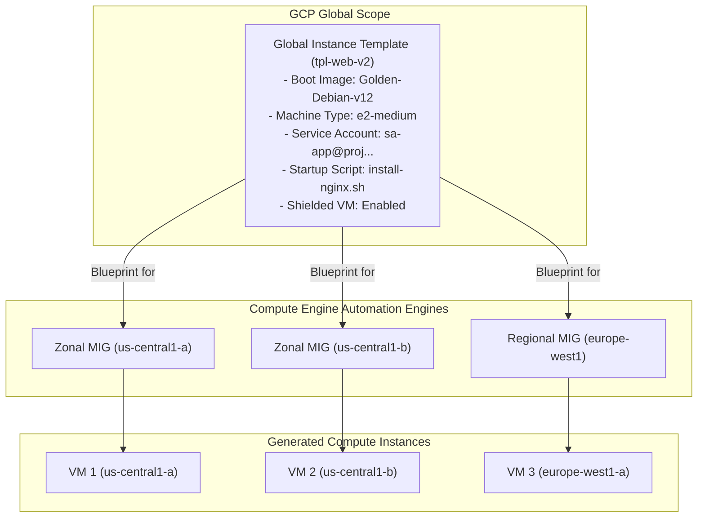

# Topic 42: Instance Templates

---

## 1. What Is It?

An **Instance Template** in Google Compute Engine is an immutable, global configuration blueprint used to create identical Virtual Machine instances and launch auto-scaling Managed Instance Groups (MIGs).

An Instance Template defines all hardware, software, security, and networking properties required to launch a VM:
- Machine Type & Family (e.g., `n2-standard-4`, custom shapes).
- Boot Disk Image (Custom Golden OS Image, Debian, Ubuntu, Windows).
- Network Interfaces (VPC, Subnet, Network Tags, External IP settings).
- IAM Identity (Attached User-Managed Service Account & Scopes).
- Metadata & Startup Scripts (Shell scripts executed during OS boot).
- Shielded VM Security Options & Scheduling (Spot vs On-Demand).

Instance Templates are **Global Resources** (not tied to a single zone or region) and are strictly **Immutable** (once created, their parameters cannot be edited).

### Real-World Analogy
Think of an Instance Template like a master architectural CAD blueprint for a standardized suburban house. Construction crews (Managed Instance Groups) use the master blueprint to build 10, 50, or 1,000 identical houses across different neighborhoods (Availability Zones). If you want to change the house layout (e.g., upgrade to a 3-car garage), you don't edit the old paper blueprint; you draw a new blueprint version (Version 2) and instruct crews to build future houses using the new blueprint.

---

## 2. Where Does It Fit?

Instance Templates serve as global configuration blueprints consumed by Managed Instance Groups (MIGs) across multiple Availability Zones and Regions.



---

## 3. Core Concepts

| Property | Rule / Behavior | Production Guidance |
|---|---|---|
| **Scope** | **Global Resource** | Can be used to launch VMs in ANY zone or region worldwide. |
| **Immutability** | **Strictly Immutable** | Cannot edit an existing template. Must create a new version (e.g., `v2`). |
| **Override Feature** | Allows overriding machine type or zone during single VM launches. | Useful for manual testing; MIGs follow template parameters strictly. |
| **Image Base** | Golden Disk Image, Public OS Image, or Custom Image. | Use custom pre-baked Golden Images (built via Packer) for fast boot times. |
| **Startup Scripts** | Shell script passed via `startup-script` metadata. | Keep scripts lightweight; bake heavy dependencies into custom disk images. |

---

## 4. How It Works

Immutable versioning and deployment workflows follow structured release patterns:

```text
Developer updates web application code in GitHub repository
              ↓
CI/CD Pipeline builds new Golden Disk Image (e.g., golden-image-v20260808)
              ↓
Pipeline creates new Instance Template (tpl-web-v2) pointing to golden-image-v20260808
              ↓
Pipeline updates Managed Instance Group (MIG) to use tpl-web-v2
              ↓
MIG performs zero-downtime Rolling Update, replacing old VMs with new v2 instances
```

1. **Zero Drift**: Immutability guarantees that every single VM created by a MIG has 100% identical software dependencies and security configurations.
2. **Global Availability**: A single template created in your project can launch VMs in `us-central1`, `europe-west1`, and `asia-east1` simultaneously.

---

## 5. Production Scenario

### Immutable Infrastructure CI/CD Release Pipeline

```text
Requirement: Deploy zero-downtime web application updates across a 50-node multi-zone Managed Instance Group.
    ↓
Architecture: Version-controlled Instance Templates driving a Regional MIG rolling update.
    ↓
Build Pipeline:
  - Step 1: Packer bakes OS security patches + app code into image `img-web-v1.2.0`.
  - Step 2: Terraform creates Instance Template `tpl-web-v1-2-0` with `img-web-v1.2.0`, `e2-medium`, and `sa-web-prod`.
  - Step 3: Trigger MIG rolling update: `gcloud compute instance-groups managed rolling-action start-update`.
    ↓
Security: Template enforces **Shielded VM** options, private subnet attachment (`--no-address`), and IAP SSH access.
    ↓
Rollback Mechanism: If health checks fail during deployment, MIG automatically rolls back to `tpl-web-v1-1-0`.
    ↓
Monitoring: Cloud Audit Logs recording template creation and MIG rolling update progress.
```

*Why Selected*: Immutable Instance Templates eliminate configuration drift and allow instant, safe automated rollbacks if newly deployed software revisions fail health checks.

---

## 6. Hands-On Lab

### Prerequisites
- Active GCP Project with Custom VPC and Subnet created (from Topics 27 & 28).
- Cloud Shell or `gcloud` CLI.
- IAM permissions: `roles/compute.instanceAdmin.v1`.

### Console Method
1. Log into [Google Cloud Console](https://console.cloud.google.com/).
2. Navigate to **Compute Engine** → **Instance templates**.
3. Click **CREATE INSTANCE TEMPLATE** at top.
4. Set Name: `tpl-web-v1`.
5. Machine configuration: Series **E2**, Machine type **e2-medium**.
6. Boot disk: Select **Debian GNU/Linux 12** → Size **20 GB**.
7. Identity and API access: Service account -> Select your dedicated User-Managed Service Account.
8. Networking: Select VPC `custom-prod-vpc`, Subnet `sb-us-central1` → External IP: **None**.
9. Advanced options → Management → Startup script:
   ```bash
   #!/bin/bash
   apt-get update && apt-get install -y nginx
   echo "App Version 1.0" > /var/www/html/index.html
   ```
10. Click **CREATE**.

### CLI Method
Create an Instance Template and launch a test VM using `gcloud`:

```bash
# Set project and network variables
PROJECT_ID="your-gcp-project-id"
VPC_NAME="custom-prod-vpc"
SUBNET_NAME="sb-us-central1"
SA_EMAIL="sa-app@${PROJECT_ID}.iam.gserviceaccount.com"

# 1. Create an immutable Instance Template
gcloud compute instance-templates create tpl-web-v1 \
    --machine-type=e2-medium \
    --image-family=debian-12 \
    --image-project=debian-cloud \
    --boot-disk-size=20GB \
    --boot-disk-type=pd-balanced \
    --network=$VPC_NAME \
    --subnet=$SUBNET_NAME \
    --no-address \
    --service-account=$SA_EMAIL \
    --scopes=cloud-platform \
    --shielded-secure-boot \
    --metadata=startup-script='#!/bin/bash
apt-get update && apt-get install -y nginx
echo "App Version 1.0" > /var/www/html/index.html'

# 2. Launch a single VM instance using the Instance Template
gcloud compute instances create web-instance-01 \
    --zone=us-central1-a \
    --source-instance-template=tpl-web-v1
```

### Verification
*Expected Result*: Querying `gcloud compute instances describe web-instance-01 --zone=us-central1-a` confirms instance properties match `tpl-web-v1`.

### Cleanup
Delete test VM and Instance Template:

```bash
gcloud compute instances delete web-instance-01 --zone=us-central1-a --quiet
gcloud compute instance-templates delete tpl-web-v1 --quiet
```

---

## 7. Security

### Immutable Guardrails & Secret Isolation
- **No Hardcoded Secrets**: NEVER embed API keys, passwords, or database credentials inside Instance Template startup scripts or metadata. Retrieve secrets dynamically from **Secret Manager** at runtime.
- **Enforce Shielded VM Options**: Enable Secure Boot, vTPM, and Integrity Monitoring inside Instance Templates so all auto-scaled VMs inherit hardware security protection.
- **Private-First Networking**: Configure network settings in templates with `--no-address` (no public IP) by default.

```text
BAD PRACTICE:
Embedding DB passwords (`DB_PASS="secret123"`) inside the `startup-script` metadata field of an Instance Template.
Risk: Anyone with `compute.instanceTemplates.get` access can read plain-text passwords from template metadata.

PRODUCTION PRACTICE:
Store credentials in Secret Manager. Configure template startup scripts to fetch secrets dynamically using the VM's Service Account identity.
```

---

## 8. Scaling & High Availability

Multi-Zone Template Deployment Model:

```text
Global Instance Template (`tpl-web-v1` - Created once at global scope)
   ↓ (Distributed Auto-Scaling)
Deploy Regional Managed Instance Group (MIG) spanning us-central1-a, b, and c
   ↓ (Rolling Update Deployment)
Update MIG to `tpl-web-v2` -> MIG replaces 33% of instances per zone progressively (Zero Downtime)
```

- **Global Scope Resilience**: Because Instance Templates are global resources, a single template can drive auto-scaling MIGs across 10 different GCP regions simultaneously.

---

## 9. Cost

### Operational Efficiency of Templates
- **100% Free Service**: Creating, storing, and managing Instance Templates incurs **zero direct cost**.
- **Spot VM Templates**: Create Instance Templates configured with `--provisioning-model=SPOT` to launch auto-scaling Spot VM fleets that save up to 90% on compute costs.

---

## 10. Monitoring & Troubleshooting

### Instance Template Observability Tools
- **Cloud Audit Logs**: Filter by `protoPayload.methodName="v1.compute.instanceTemplates.insert"` to trace template creation history.
- **MIG Deployment Logs**: View errors if VMs fail to launch from a corrupted instance template.

### Troubleshooting Matrix

| Symptom | Possible Cause | What to Check | Fix |
|---|---|---|---|
| Cannot edit existing Instance Template | Instance Templates are strictly immutable by design | GCP Template documentation | Create a new template version (`tpl-web-v2`) and update the MIG. |
| VMs created from template fail to boot | Invalid boot image URI or syntax error in startup script | Serial Console boot logs | Create new template version with fixed image URI or corrected startup script. |
| MIG scaling fails with `QUOTA_EXCEEDED` | Machine type or region specified in template exceeds project quota | `gcloud compute regions describe` | Submit Quota Increase Request or edit template to use a different machine series. |

---

## 11. Common Mistakes

```text
Mistake: Attempting to edit or update an existing Instance Template in-place.
Why: Expecting instance templates to behave like editable VM instances.
Impact: GCP API returns error; templates cannot be modified once created.
Correct approach: Embrace immutability: create a new template (`tpl-web-v2`) and point workloads to the new template.

Mistake: Putting slow 15-minute installation scripts inside the `startup-script` metadata field.
Why: Using startup scripts as an alternative to pre-baking custom VM disk images.
Impact: Auto-scaled instances take 15 minutes to join the load balancer, causing scaling delays during traffic spikes.
Correct approach: Pre-bake software dependencies into a custom Golden Disk Image using Packer; keep startup scripts under 30 seconds.
```

---

## 12. Production Best Practices

- [ ] Adopt **Immutable Infrastructure**: Never edit running VMs; update Instance Templates and trigger rolling updates.
- [ ] Pre-bake software dependencies into custom **Golden Disk Images** (via Packer) for fast boot times.
- [ ] Use **Secret Manager** to fetch secrets at startup; NEVER hardcode passwords in templates.
- [ ] Enable **Shielded VM** options (Secure Boot, vTPM) on all Instance Templates.
- [ ] Configure templates with `--no-address` (private subnets only) for backend workloads.
- [ ] Automate all Instance Template creation using Infrastructure as Code (Terraform).

---

## 13. Hyperscaler / Enterprise Perspective

```text
Personal / Learning
  Manual Template Creation via Console → Public OS Image → Plain-text startup scripts
        ↓
Small Production
  Terraform-managed templates → Custom Golden OS Images → Basic IAM Service Accounts
        ↓
Enterprise Environment
  Automated Image Bakes (Packer) → Semantic Versioned Templates (`tpl-app-v1-2-0`) → Secret Manager Integration
        ↓
Hyperscaler Environment
  100% Automated CI/CD Canary Releases → Blue/Green MIG Rolling Updates → Policy-as-Code Static Security Scanning on Templates
```

In a hyperscaler environment, developers never create Instance Templates manually. CI/CD pipelines automatically build Golden Images using Packer, run vulnerability scans, generate semantic-versioned Instance Templates via Terraform (`google_compute_instance_template`), and execute automated Canary rolling updates across multi-region Managed Instance Groups.

---

## 14. Real Project Questions

### Q1: Why are Google Compute Engine Instance Templates strictly immutable?
**Answer:** Immutability guarantees absolute software consistency and eliminates configuration drift across auto-scaled infrastructure fleets. Once created, a template's properties cannot be modified, ensuring that every single VM launched by a Managed Instance Group is 100% identical in hardware, OS image, security, and startup scripts. Updates are handled by creating a new template version and performing a rolling deployment.

### Q2: What is the technical difference between an Instance Template and a Custom Disk Image?
**Answer:** A **Custom Disk Image** is a bit-for-bit snapshot of a pre-configured boot disk (containing the OS, installed software packages, and system libraries). An **Instance Template** is a complete infrastructure blueprint that specifies the Custom Disk Image *plus* the machine type, vCPU/RAM sizing, VPC subnets, IAM service accounts, startup scripts, and firewall tags.

### Q3: Why is pre-baking software into custom images preferred over using long startup scripts in Instance Templates?
**Answer:** Startup scripts run *after* the VM boots up. If a startup script downloads and compiles heavy software dependencies, instance startup can take 10 to 15 minutes. During auto-scaling traffic spikes, this delay prevents new VMs from serving traffic quickly. Pre-baking dependencies into a custom image allows new instances to boot and serve traffic in under 30 seconds.

---

## 15. Quick Decision Guide

| Requirement | Recommended Approach | Reason |
|---|---|---|
| Launching an auto-scaling fleet of 100 identical web microservices | **Instance Template + Managed Instance Group (MIG)** | Provides an immutable blueprint for multi-zone auto-scaling and rolling updates. |
| Storing pre-installed OS packages and system binaries | **Custom Golden Disk Image (Packer)** | Pre-bakes dependencies for fast sub-30-second instance boot times. |
| Updating application code on an active production MIG | **Create Instance Template v2 + Trigger Rolling Update** | Zero-downtime rolling deployment with automated health check rollback capabilities. |

### When should I use it?
- Essential foundation for launching Managed Instance Groups (MIGs), auto-scaling fleets, and automated CI/CD deployments.

### When should I NOT use it?
- Do not use for one-off snowflake VMs that require unique individual configurations.

---

## 16. Related Services

```text
              [42. Instance Templates]
             /           |            \
     Golden Images  Managed Instance  Secret Manager
       (Packer)     Groups (MIGs)      (Runtime Keys)
           |              |                 |
       Pre-baked       Scaling          Encrypted
          OS          Auto-healing       Secrets
```

- **Golden Images**: Custom boot disk images referenced inside Instance Templates.
- **Managed Instance Groups (MIGs)**: Automation engine consuming Instance Templates.
- **Secret Manager**: Secure runtime credential store for template startup scripts.

---

## 17. Cheat Sheet

### Core Attributes
- **Scope**: Global (Spans all zones & regions).
- **Editability**: Strictly Immutable (Must create new version).
- **Cost**: 100% Free to create and store.

### Useful Commands
```bash
# Create an immutable Instance Template
gcloud compute instance-templates create TEMPLATE_NAME \
    --machine-type=e2-medium --image-family=debian-12 \
    --image-project=debian-cloud --network=VPC_NAME \
    --subnet=SUBNET_NAME --no-address --service-account=SA_EMAIL

# List instance templates
gcloud compute instance-templates list

# Launch a single VM from a template
gcloud compute instances create VM_NAME \
    --zone=us-central1-a --source-instance-template=TEMPLATE_NAME
```

---

## 18. Learning Connection

- **Previous Topic**: [41. Snapshots](../41-snapshots/README.md)
- **Next Topic**: [43. Managed Instance Groups](../43-managed-instance-groups/README.md)
