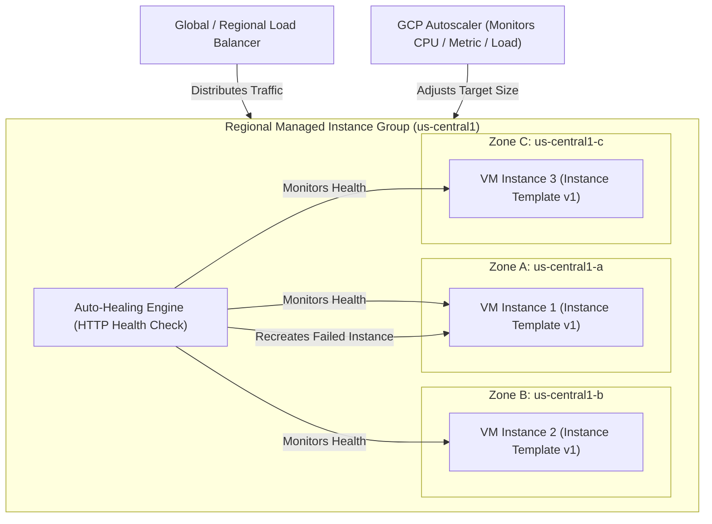

# Topic 43: Managed Instance Groups

---

## 1. What Is It?

A **Managed Instance Group (MIG)** in Google Compute Engine is an automated cluster of identical Virtual Machine instances created from a single Instance Template.

MIGs deliver key enterprise compute automation capabilities:
1. **Auto-Healing**: Automatically recreates failed VM instances that crash or fail HTTP health checks.
2. **Autoscaling**: Dynamically increases or decreases the number of VM instances based on CPU utilization, Cloud Monitoring metrics, or HTTP load balancer traffic.
3. **Multi-Zone High Availability**: Regional MIGs automatically distribute VM instances across multiple Availability Zones (e.g., `us-central1-a`, `us-central1-b`, `us-central1-c`) to protect against single-zone hardware outages.
4. **Automated Rolling Updates**: Gradually rolls out new software versions (Instance Templates) across instances with zero application downtime.

In contrast, **Unmanaged Instance Groups (UIGs)** are manual collections of heterogeneous VMs that do not support auto-scaling, auto-healing, or instance templates.

### Real-World Analogy
Think of a Managed Instance Group like an automated robotic taxi fleet managed by a central dispatch AI. When demand increases during rainy weather (High Traffic), the AI instantly dispatches 20 additional identical taxis (Autoscaling). If one taxi's tire pops or engine stalls (VM Crash), the AI automatically pulls the broken taxi off the road and launches a brand new identical taxi in its place (Auto-healing), without customers ever noticing a disruption.

---

## 2. Where Does It Fit?

Managed Instance Groups sit behind Load Balancers and Auto-scalers, automating Compute Engine VM instance lifecycles across multiple Availability Zones.



---

## 3. Core Concepts

| MIG Feature | Description | Mechanism / Trigger | Best Practice |
|---|---|---|---|
| **Auto-Healing** | Recreates impaired VMs that fail application health checks. | HTTP/S Health Check (`/healthz` endpoint) | Set initial delay (e.g., 300s) to allow VM startup scripts to finish before checking. |
| **Regional MIG (RMIG)** | Distributes instances across multiple zones in a region. | Spans 3 Availability Zones automatically | **Mandatory standard for production** (Delivers 99.99% SLA). |
| **Zonal MIG (ZMIG)** | Confines instances to a single zone within a region. | Spans 1 Availability Zone | Use only for single-zone dev/test or localized workloads. |
| **Rolling Update** | Progressively replaces instances with a new Instance Template. | Rolling replace, Proactive, or Opportunistic | Use `max-surge=1` and `max-unavailable=0` for zero-downtime deployments. |
| **Stateful MIG** | Preserves specific disk data and IP addresses upon instance recreation. | Per-instance state configurations | Use for stateful databases (Elasticsearch, Cassandra) requiring fixed disk mapping. |

---

## 4. How It Works

The Auto-Healing and Rolling Update engines operate continuously:

```text
HTTP Health Check probes VM instance every 5 seconds on port 8080 (/healthz)
              ↓
VM application crashes -> 3 consecutive health check probes return HTTP 500
              ↓
MIG Auto-Healing engine marks instance UNHEALTHY
              ↓
MIG terminates broken VM instance -> Deletes corrupted instance
              ↓
MIG provisions brand new VM instance from Instance Template in same zone
              ↓
New VM passes Health Check -> Returned to Load Balancer pool!
```

1. **Auto-Healing Grace Period**: The `initial-delay` setting prevents Auto-Healing from prematurely killing a VM while its startup script is still downloading packages.
2. **Zone Redistribution**: If an entire availability zone suffers an outage, a Regional MIG automatically provisions replacement instances in the remaining healthy zones.

---

## 5. Production Scenario

### Zero-Downtime Multi-Zone Web Microservice Fleet

```text
Requirement: Serve a high-concurrency e-commerce API across 3 availability zones with zero downtime during updates and automatic node recovery.
    ↓
Architecture: Regional Managed Instance Group (`rmig-web-prod`) spanning `us-central1-a,b,c`.
    ↓
MIG Configuration:
  - Instance Template: `tpl-web-v1.2`
  - Target Size: Min 6 instances, Max 30 instances.
  - Auto-healing Health Check: HTTP `/healthz` (Interval 5s, Timeout 5s, Unhealthy threshold 2, Initial delay 300s).
  - Update Policy: Rolling Update, `max-surge=25%`, `max-unavailable=0`.
    ↓
Security: All VMs deployed in Private Subnets; load balancer proxies ingress.
    ↓
Fault Tolerance: If Zone A fails completely, Regional MIG scales instances in Zone B and Zone C to maintain target capacity.
    ↓
Monitoring: Cloud Monitoring alert policy on `instance_group/auto-healing/recreated_instances`.
```

*Why Selected*: Combining Regional MIG multi-zone distribution with Auto-Healing and zero-unavailable rolling updates guarantees maximum uptime and resilient fault tolerance.

---

## 6. Hands-On Lab

### Prerequisites
- Active GCP Project with an Instance Template (`tpl-web-v1`) created (from Topic 42).
- Cloud Shell or `gcloud` CLI.
- IAM permissions: `roles/compute.instanceAdmin.v1`.

### Console Method
1. Log into [Google Cloud Console](https://console.cloud.google.com/).
2. Navigate to **Compute Engine** → **Instance groups**.
3. Click **CREATE INSTANCE GROUP** at top.
4. Select **New managed instance group (stateless)**.
5. Set Name: `rmig-web-prod`, Instance template: `tpl-web-v1`.
6. Location: Select **Multiple zones** (Regional) → Region: `us-central1`.
7. Select Zones: `us-central1-a`, `us-central1-b`, `us-central1-c`.
8. **Autohealing**: Select **Create a health check**:
   - Name: `hc-http-80`, Protocol: `HTTP`, Path: `/`, Port: `80`.
   - Initial delay: `300` seconds.
9. Number of instances: Set Target size to `3` (1 VM per zone).
10. Click **CREATE**.

### CLI Method
Create a Regional Managed Instance Group and configure Auto-Healing using `gcloud`:

```bash
# Set project and template variables
PROJECT_ID="your-gcp-project-id"
REGION="us-central1"
TEMPLATE_NAME="tpl-web-v1"
MIG_NAME="rmig-web-prod"

# 1. Create an HTTP Health Check for Auto-Healing
gcloud compute health-checks create http hc-http-80 \
    --port=80 \
    --request-path="/" \
    --check-interval=5s \
    --timeout=5s \
    --unhealthy-threshold=2 \
    --healthy-threshold=2

# 2. Create a Regional Managed Instance Group spanning 3 zones
gcloud compute instance-groups managed create $MIG_NAME \
    --template=$TEMPLATE_NAME \
    --size=3 \
    --region=$REGION \
    --instance-redistribution-type=PROACTIVE \
    --health-check=hc-http-80 \
    --initial-delay=300s

# 3. Perform a zero-downtime Rolling Update to a new Instance Template (e.g., tpl-web-v2)
# gcloud compute instance-groups managed rolling-action start-update $MIG_NAME \
#     --version=template=tpl-web-v2 \
#     --max-surge=1 \
#     --max-unavailable=0 \
#     --region=$REGION
```

### Verification
Check Regional MIG health and instance distribution:

```bash
gcloud compute instance-groups managed list-instances $MIG_NAME --region=$REGION
```
*Expected Result*: Output lists 3 instances across zones `us-central1-a`, `us-central1-b`, and `us-central1-c` with health status `HEALTHY`.

### Cleanup
Delete Regional MIG and Health Check:

```bash
gcloud compute instance-groups managed delete $MIG_NAME --region=$REGION --quiet
gcloud compute health-checks delete hc-http-80 --quiet
```

---

## 7. Security

### Identity & Isolation in MIG Fleets
- **Dedicated Service Accounts**: Ensure the Instance Template used by the MIG specifies a fine-grained User-Managed Service Account; every instance scaled by the MIG inherits this identity.
- **Private Subnet Deployment**: Provision MIG instances in private subnets without public IPs. Load Balancers handle external ingress, while Cloud NAT handles outbound traffic.
- **Auto-Healing Security**: Auto-healing acts as a security safeguard; if a compromised VM's process crashes or freezes, Auto-Healing destroys and recreates the instance from the clean golden image template.

```text
BAD PRACTICE:
Using Unmanaged Instance Groups (UIGs) for production web applications.
Risk: Zero auto-healing, zero auto-scaling, no automated rolling updates, and manual management of every individual VM instance.

PRODUCTION PRACTICE:
Deploy production stateless workloads inside Regional Managed Instance Groups (RMIGs) backed by Instance Templates and Auto-Healing health checks.
```

---

## 8. Scaling & High Availability

Regional vs Zonal MIG High Availability:

```text
Zonal Managed Instance Group (Single Zone - Vulnerable to Zonal Datacenter Outage)
   ↓ (Production Upgrade)
Regional Managed Instance Group (RMIG - Spans 3 Availability Zones automatically)
   ↓ (Zone Outage Resiliency)
Zone A Fails -> Regional MIG automatically provisions replacement instances in Zone B and Zone C (99.99% SLA)
```

- **Proactive Instance Redistribution**: Regional MIGs continuously rebalance instance counts evenly across zones. If one zone experiences a capacity constraint, the MIG redistributes instances to remaining healthy zones.

---

## 9. Cost

### Financial Efficiency of MIGs
- **MIG Management $0**: Operating Managed Instance Groups and Auto-Healing engines costs **zero direct fee**.
- **Spot VM Integration**: Configure MIGs to consume Spot VMs with dynamic replacement for fault-tolerant workloads, saving up to 90% on compute costs.
- **Right-Sizing Fleet Min/Max**: Set minimum instance counts low during off-peak hours to save money, letting autoscaling expand capacity during peak traffic.

---

## 10. Monitoring & Troubleshooting

### MIG Observability Tools
- **Cloud Monitoring MIG Metrics**: Metric `instance_group/size`, `instance_group/auto-healing/recreated_instances`.
- **MIG Activity Logs**: View auto-healing recreation events and rolling update progress in Console.

### Troubleshooting Matrix

| Symptom | Possible Cause | What to Check | Fix |
|---|---|---|---|
| Auto-Healing continuously kills & recreates VMs in a loop | Initial Delay too short (VM still running startup script) | Auto-healing initial delay setting | Increase `--initial-delay` (e.g., to 300s or 600s) to allow startup scripts to finish. |
| Rolling update fails to progress | New Instance Template contains invalid boot image or failing code | Health check status on new VMs | Check Serial Console logs; fix code/template or run `rolling-action cancel-update`. |
| MIG instance creation fails | vCPU quota exceeded in target region | `gcloud compute regions describe` | Submit Quota Increase Request for regional vCPUs. |

---

## 11. Common Mistakes

```text
Mistake: Setting `--initial-delay` on Auto-Healing health checks too low (e.g., 30 seconds).
Why: Underestimating how long VM OS boot and application startup scripts take to execute.
Impact: Health check probes run before app is ready; Auto-Healing assumes VM is dead and enters an endless reboot loop.
Correct approach: Set `--initial-delay` to 300 seconds (5 minutes) or longer for complex application boot cycles.

Mistake: Using Unmanaged Instance Groups (UIGs) for stateless web servers.
Why: Creating individual VMs manually and grouping them together.
Impact: Inability to use autoscaling, auto-healing, or automated rolling updates.
Correct approach: Reserve Unmanaged Instance Groups strictly for legacy heterogeneous VMs that cannot be created from a template.
```

---

## 12. Production Best Practices

- [ ] Use **Regional Managed Instance Groups (RMIGs)** spanning 3 zones for production workloads.
- [ ] Configure **Auto-Healing HTTP Health Checks** with appropriate initial delays (minimum 300s).
- [ ] Perform software deployments using **Rolling Updates** with `max-surge=1` and `max-unavailable=0`.
- [ ] Deploy MIG instances in private subnets with zero public IPs (`--no-address`).
- [ ] Integrate MIGs with **Cloud Load Balancing** for external ingress distribution.
- [ ] Automate all MIGs, health checks, and update policies using Infrastructure as Code (Terraform).

---

## 13. Hyperscaler / Enterprise Perspective

```text
Personal / Learning
  Single-zone Unmanaged Group → Manual VM additions → No health checks
        ↓
Small Production
  Zonal Managed Instance Group → Basic Auto-Healing → Manual scaling
        ↓
Enterprise Environment
  Regional Managed Instance Groups (3 Zones) → Rolling Updates via CI/CD → Auto-Healing Alerts
        ↓
Hyperscaler Environment
  Automated Multi-Region Canary MIG Rolling Deployments → Stateful MIGs for Cassandra/ES → Automated Chaos Engineering Outage Drills
```

In a hyperscaler environment, all stateless compute is managed by Regional MIGs. Deployment pipelines trigger **Canary Rolling Updates**, updating 5% of instances first, monitoring error rates for 15 minutes, and then proceeding with a full 100% rollout across regions automatically.

---

## 14. Real Project Questions

### Q1: What is the primary difference between a Managed Instance Group (MIG) and an Unmanaged Instance Group (UIG)?
**Answer:** A **Managed Instance Group (MIG)** creates identical VM instances from a single Instance Template, supporting automated features like Auto-Healing, Autoscaling, multi-zone distribution, and rolling updates. An **Unmanaged Instance Group (UIG)** is a manual collection of non-identical, individual VMs that does NOT support instance templates, autoscaling, auto-healing, or rolling updates.

### Q2: How does MIG Auto-Healing differ from basic hypervisor crash recovery?
**Answer:** Hypervisor crash recovery only detects if the physical hardware or VM operating system crashes. **MIG Auto-Healing** uses application-level HTTP/S health checks (e.g., probing `/healthz`). If an application process freezes, enters a deadlock, or returns HTTP 500 errors—even if the underlying VM OS is running—Auto-Healing automatically destroys and recreates the instance.

### Q3: Why are Regional MIGs strongly recommended over Zonal MIGs for production workloads?
**Answer:** A Zonal MIG places all VM instances in a single Availability Zone; if that datacenter zone experiences a physical hardware or power outage, the application suffers complete downtime. A **Regional MIG** automatically distributes VM instances across three separate Availability Zones, providing 99.99% high-availability SLA and automatic cross-zone failover.

---

## 15. Quick Decision Guide

| Requirement | Recommended Approach | Reason |
|---|---|---|
| Auto-scaling web application fleet requiring 99.99% multi-zone SLA | **Regional Managed Instance Group (RMIG)** | Automatically distributes instances across 3 zones; supports auto-healing and autoscaling. |
| Grouping a legacy heterogeneous mix of Windows and Linux VMs for a load balancer | **Unmanaged Instance Group (UIG)** | Allows grouping existing non-identical VMs together without instance templates. |
| Deploying a new software version across 100 VMs without dropping active user requests | **MIG Rolling Update (`max-unavailable=0`)** | Replaces instances progressively while keeping 100% of baseline capacity healthy. |

### When should I use it?
- Essential service for managing stateless web servers, microservice fleets, and auto-scaling compute workloads in GCP.

### When should I NOT use it?
- Do not use standard stateless MIGs for single-instance legacy databases that require unique persistent disk states (use Stateful MIGs or single VMs).

---

## 16. Related Services

```text
            [43. Managed Instance Groups]
           /            |            \
    Instance Templates  GCP Autoscaler  Health Checks
        (Blueprint)      (Scaling)      (Auto-Healing)
            |               |                 |
        Immutable       Dynamic           Failure
        Configs         Capacity          Recovery
```

- **Instance Templates**: Provides the global configuration blueprint for MIG instances.
- **GCP Autoscaler**: Dynamically adjusts MIG instance count based on demand.
- **Cloud Load Balancing**: Routes external traffic to MIG backends.

---

## 17. Cheat Sheet

### Core Attributes
- **Types**: Regional MIG (3 Zones - Recommended) vs. Zonal MIG (1 Zone).
- **Auto-Healing**: Recreates VMs failing HTTP health checks.
- **Rolling Updates**: Zero-downtime template updates.

### Useful Commands
```bash
# Create a Regional Managed Instance Group
gcloud compute instance-groups managed create MIG_NAME \
    --template=TEMPLATE_NAME --size=3 --region=us-central1 \
    --health-check=HC_NAME --initial-delay=300s

# Trigger a rolling update to a new template
gcloud compute instance-groups managed rolling-action start-update MIG_NAME \
    --version=template=NEW_TEMPLATE_NAME --max-surge=1 --max-unavailable=0 --region=us-central1

# List instances in a MIG
gcloud compute instance-groups managed list-instances MIG_NAME --region=us-central1
```

---

## 18. Learning Connection

- **Previous Topic**: [42. Instance Templates](../42-instance-templates/README.md)
- **Next Topic**: [44. Autoscaling](../44-autoscaling/README.md)
