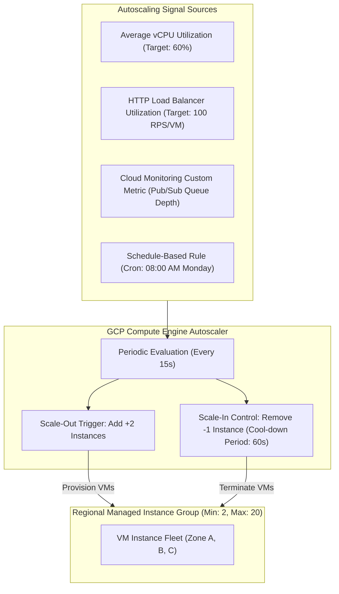

# Topic 44: Autoscaling

---

## 1. What Is It?

**Compute Engine Autoscaling** is an automated scaling engine that dynamically adjusts the number of VM instances in a Managed Instance Group (MIG) based on real-time workload demand.

When application traffic surges, the Autoscaler automatically provisions additional VM instances (Scale-Out) to prevent performance degradation. When traffic subsides, the Autoscaler terminates excess VM instances (Scale-In) to eliminate unnecessary cloud compute costs.

GCP Autoscaling supports four primary scaling signals:
1. **Average CPU Utilization**: Scales when average vCPU utilization across the fleet crosses a target threshold (e.g., 60%).
2. **HTTP Load Balancing Utilization**: Scales based on HTTP request capacity per instance (RPS) or target load balancer utilization.
3. **Cloud Monitoring Custom Metrics**: Scales based on application-specific metrics (e.g., Pub/Sub queue depth, unacknowledged message counts).
4. **Schedule-Based Scaling**: Predictively scales instance counts up or down based on a recurring calendar schedule (e.g., scaling up prior to 09:00 AM business hours).

### Real-World Analogy
Think of GCP Autoscaling like an automated cashier line management system in a busy supermarket. During quiet morning hours, only 2 checkout lanes are open (Minimum Fleet Size). As Black Friday shoppers flood into the store and queues grow long (CPU / Traffic Signal), an automated sensor immediately alerts additional cashier staff to open Lanes 3 through 10 (Scale-Out). Once shoppers clear out at night, the extra lanes close (Scale-In), saving staffing costs.

---

## 2. Where Does It Fit?

The Autoscaler monitors load metrics from VMs, Load Balancers, or Cloud Monitoring, instructing Managed Instance Groups (MIGs) to add or remove instances dynamically.



---

## 3. Core Concepts

| Concept | Description | Example / Syntax | Best Practice |
|---|---|---|---|
| **Min / Max Instances** | Hard floor and ceiling boundaries for fleet size. | `min-num-replicas: 3, max-num-replicas: 50` | Always set `min` > 1 for high availability across zones. |
| **Cool-Down Period** | Time window after VM creation before its metrics are included in autoscaling calculations. | `cool-down-period: 60` (seconds) | Set cool-down period equal to total VM boot + app startup time. |
| **Scale-In Control** | Controls max rate of instance terminations during scale-in to prevent rapid oscillation. | `max-scaled-in-replicas: 10%` per 5 min | Prevents thrashing (rapid scale-out followed by immediate scale-in). |
| **Target CPU Metric** | Target average vCPU utilization percentage across all instances. | `--target-cpu-utilization=0.60` (60%) | Set target at 60–70% to leave headroom for traffic spikes during scale-out. |
| **Custom Metric Scaling** | Scales based on external metrics (e.g., unacknowledged Pub/Sub messages). | `stackdriver-custom-metric` | Ideal for asynchronous queue-processing background workers. |

---

## 4. How It Works

The Autoscaling evaluation loop calculates the required target instance count every 15 seconds:

```text
Autoscaler collects current fleet CPU metrics (e.g., 5 instances averaging 85% CPU)
              ↓
Target CPU setting: 60%
              ↓
Calculates required instances: (5 instances * 85%) / 60% = 7.08 -> Rounds up to 8 instances
              ↓
Autoscaler requests MIG to scale out from 5 to 8 instances
              ↓
MIG launches 3 new VMs -> New VMs enter Cool-down Period (e.g., 180s)
              ↓
Once Cool-down expires, metrics from new VMs included in next calculation
```

1. **Conservative Scale-In**: To prevent flapping, the Autoscaler calculates required instances over a 10-minute trailing window and selects the highest instance count required during that window before terminating VMs.
2. **Stateless Expectation**: Instances terminated during scale-in are destroyed; application code must be stateless.

---

## 5. Production Scenario

### Multi-Metric Auto-Scaling for Flash Sale E-Commerce Application

```text
Requirement: Scale a web application fleet from a baseline of 6 instances up to 100 instances during unexpected flash sales, while pre-scaling capacity before planned marketing campaigns.
    ↓
Architecture: Regional MIG with Multi-Metric Autoscaling policies.
    ↓
Autoscaling Configuration:
  - Min Replicas: `6` (2 per zone across us-central1-a,b,c).
  - Max Replicas: `100`.
  - Primary Metric: CPU Utilization Target `60%`.
  - Secondary Metric: HTTP Load Balancing Target `150 RPS/VM`.
  - Schedule Policy: Pre-scale to 30 instances every Friday at 17:00 UTC.
  - Cool-down Period: `120s`.
  - Scale-in Control: Limit scale-in to max `10 instances per 5 minutes`.
    ↓
Security: All auto-scaled instances provisioned in private subnets with zero public IPs.
    ↓
Monitoring: Cloud Monitoring tracking `instance_group/single_group_size` and `cpu/utilization`.
```

*Why Selected*: Combining real-time CPU/RPS metrics with schedule-based pre-scaling guarantees immediate capacity for planned marketing spikes while protecting against unexpected viral traffic bursts.

---

## 6. Hands-On Lab

### Prerequisites
- Active GCP Project with a Regional Managed Instance Group (`rmig-web-prod`) created (from Topic 43).
- Cloud Shell or `gcloud` CLI.
- IAM permissions: `roles/compute.instanceAdmin.v1`.

### Console Method
1. Log into [Google Cloud Console](https://console.cloud.google.com/).
2. Navigate to **Compute Engine** → **Instance groups**.
3. Select your Regional MIG (`rmig-web-prod`) → Click **EDIT** (or **Configure Autoscaling**).
4. Under **Autoscaling**:
   - Mode: **On: scale out and scale in**.
   - Minimum number of instances: `3`.
   - Maximum number of instances: `20`.
   - Cool-down period: `120` seconds.
5. **Autoscaling signals**: Click **ADD SIGNAL**:
   - Signal type: **CPU utilization**.
   - Target CPU utilization: `60%`.
6. Click **SAVE**.

### CLI Method
Attach an Autoscaler to a Regional MIG using `gcloud`:

```bash
# Set project and MIG variables
PROJECT_ID="your-gcp-project-id"
REGION="us-central1"
MIG_NAME="rmig-web-prod"

# 1. Attach CPU-based Autoscaler with Scale-In Control
gcloud compute instance-groups managed set-autoscaling $MIG_NAME \
    --region=$REGION \
    --min-num-replicas=3 \
    --max-num-replicas=20 \
    --target-cpu-utilization=0.60 \
    --cool-down-period=120 \
    --scale-in-control=max-scaled-in-replicas=2,time-window=300

# 2. Add a Schedule-Based Autoscaling rule (e.g., pre-scale for Monday morning traffic)
gcloud compute instance-groups managed create-autoscaling-schedule $MIG_NAME \
    --region=$REGION \
    --schedule-name=monday-morning-prescale \
    --cron-schedule="0 8 * * 1" \
    --duration=14400 \
    --min-required-replicas=10

# 3. Describe Autoscaler configuration and status
gcloud compute instance-groups managed describe-autoscaling $MIG_NAME --region=$REGION
```

### Verification
*Expected Result*: Querying `describe-autoscaling` returns active status, min/max replica settings, target CPU 0.60, and cool-down period 120s.

### Cleanup
Remove Autoscaler from the MIG:

```bash
gcloud compute instance-groups managed stop-autoscaling $MIG_NAME --region=$REGION --quiet
```

---

## 7. Security

### Auto-Scaling Security Hardening
- **Stateless VM Sanitization**: Ensure auto-scaled VMs do not write persistent state to local disks. When the Autoscaler terminates an instance during scale-in, all local disk data is permanently destroyed.
- **Resource Exhaustion Guardrails**: Always set a strict **Maximum Replicas** ceiling (e.g., max 50 instances) to prevent runaway billing if a DDoS attack or infinite loop triggers rapid scale-out.
- **Least-Privilege Service Accounts**: Verify auto-scaled instances inherit dedicated least-privilege service accounts from the underlying Instance Template.

```text
BAD PRACTICE:
Setting Maximum Replicas to an unlimited or extremely high number (e.g., max 2,000 instances) without budget caps.
Risk: A sudden application bug or Layer 7 DDoS attack scales out thousands of VMs, generating tens of thousands of dollars in billable charges.

PRODUCTION PRACTICE:
Set realistic Max Replicas ceilings based on project quotas and budget limits. Attach Cloud Monitoring alerts to notify on scale-out events.
```

---

## 8. Scaling & High Availability

Multi-Zone Auto-Scaling Distribution:

```text
Single Zone Autoscaling (Vulnerable to zonal capacity constraints)
   ↓ (Enterprise Multi-Zone Distribution)
Regional MIG Autoscaling (Distributes new auto-scaled instances evenly across Zone A, B, and C)
   ↓ (Zone Outage Resiliency)
Zone A Fails -> Autoscaler detects lost instances -> Automatically scales out replacement VMs in Zone B and C
```

- **Even Zone Distribution**: When a Regional MIG scales out by 3 instances, the Autoscaler automatically places 1 instance in Zone A, 1 in Zone B, and 1 in Zone C to maintain high availability.

---

## 9. Cost

### FinOps Economics of Autoscaling
- **$0 Autoscaling Fee**: The GCP Autoscaling engine is completely **free of charge**.
- **Significant Cost Reductions**: Scale-In reduces compute infrastructure costs by 50% to 80% during off-peak night and weekend hours compared to static 24/7 provisioning.
- **Combine with Committed Use Discounts**: Size `min-num-replicas` to cover baseline 24/7 capacity using Committed Use Discounts (CUDs), allowing the Autoscaler to handle variable peak traffic above baseline.

---

## 10. Monitoring & Troubleshooting

### Autoscaling Observability Tools
- **Cloud Monitoring Autoscaler Metrics**: Metrics `instance_group/capacity`, `instance_group/size`, and `instance_group/recommended_custom_metric_capacity`.
- **Autoscaler Log Events**: View scale-out and scale-in log events under Compute Engine Logging.

### Troubleshooting Matrix

| Symptom | Possible Cause | What to Check | Fix |
|---|---|---|---|
| Autoscaler stuck at Max Replicas limit | Application load exceeds max capacity setting or project quota hit | `gcloud compute instance-groups managed describe-autoscaling` | Increase `--max-num-replicas` or submit vCPU quota increase request. |
| VMs scaling out and scaling in rapidly (Flapping) | Cool-down period too short or target CPU threshold set too close to 100% | Cool-down period & Scale-in control settings | Increase `--cool-down-period` (e.g., to 180s) and configure `--scale-in-control`. |
| Custom metric autoscaling not working | Stackdriver custom metric name or IAM permissions invalid | Cloud Monitoring metric path | Verify metric path syntax and ensure Service Account has `roles/monitoring.viewer`. |

---

## 11. Common Mistakes

```text
Mistake: Setting `--cool-down-period` shorter than the actual time required for a VM to boot and start serving traffic.
Why: Assuming cool-down period starts when VM finishes booting rather than when VM creation begins.
Impact: Autoscaler reads 0% CPU metrics from initializing VMs, assumes more instances are needed, and over-provisions unnecessary instances.
Correct approach: Set `--cool-down-period` equal to total VM boot time + app initialization time (typically 120–300s).

Mistake: Setting Target CPU Utilization too high (e.g., 95%).
Why: Attempting to maximize vCPU utilization to save money.
Impact: Incoming traffic spikes saturate instances before the Autoscaler has time to launch new VMs, causing HTTP 504 timeouts.
Correct approach: Set Target CPU Utilization to 60–70%, leaving 30–40% headroom for traffic spikes during scale-out.
```

---

## 12. Production Best Practices

- [ ] Set **Target CPU Utilization** between 60% and 70% to maintain headroom for traffic spikes.
- [ ] Set **Cool-Down Period** equal to total VM boot + application startup time (minimum 120s).
- [ ] Configure **Scale-In Controls** to prevent rapid instance termination flapping.
- [ ] Use **Schedule-Based Scaling** to pre-scale capacity prior to known high-traffic events.
- [ ] Always define a realistic **Max Replicas** ceiling to prevent runaway billing charges.
- [ ] Automate all Autoscaler configurations using Infrastructure as Code (Terraform).

---

## 13. Hyperscaler / Enterprise Perspective

```text
Personal / Learning
  Single-metric CPU Autoscaler → Default cool-down period → No max replica caps
        ↓
Small Production
  Multi-metric Autoscaling (CPU + RPS) → Custom cool-down → Basic Scale-In Controls
        ↓
Enterprise Environment
  Schedule-based pre-scaling → Custom Pub/Sub Queue Depth metrics → Integrated FinOps Budget Alerts
        ↓
Hyperscaler Environment
  Predictive Machine Learning Autoscaling → Automated Load Test Capacity Validation → Real-Time Traffic Engineering & Spillover
```

In a hyperscaler environment, autoscaling is multi-dimensional. Enterprise platforms combine real-time custom metrics (such as active WebSocket connections or Pub/Sub queue depth) with predictive machine-learning models. Prior to major retail events (like Black Friday), automated orchestration pipelines pre-scale regional MIG fleets globally, ensuring zero cold-start latency for millions of concurrent shoppers.

---

## 14. Real Project Questions

### Q1: How does the GCP Autoscaler Cool-Down Period prevent over-provisioning during scale-out events?
**Answer:** The Cool-Down Period instructs the Autoscaler to ignore metrics from newly launched VM instances while they are still booting and executing startup scripts. If cool-down were omitted, the Autoscaler would read incomplete or un-started app metrics from booting VMs, incorrectly assume capacity is still insufficient, and continuously launch redundant extra instances.

### Q2: Why is setting a Scale-In Control policy important for production web application fleets?
**Answer:** Scale-In Control limits the maximum number of instances that can be terminated within a specified time window (e.g., dropping max 10% of instances per 5 minutes). This prevents "flapping" (rapid oscillations where a fleet scales down abruptly, hits a brief traffic spike, and is forced to scale back out immediately), maintaining application stability.

### Q3: What is the benefit of Schedule-Based Autoscaling over standard reactive metric scaling?
**Answer:** Standard metric autoscaling (CPU/RPS) is *reactive*—it waits for traffic to arrive and CPU to spike before launching new VMs, which takes 1–3 minutes to boot. Schedule-Based Autoscaling is *predictive*—it pre-scales the MIG fleet up to a specified capacity *before* a known traffic event occurs (e.g., 08:00 AM on Monday), ensuring instances are fully booted and ready before users arrive.

---

## 15. Quick Decision Guide

| Requirement | Recommended Approach | Reason |
|---|---|---|
| Scaling a web API fleet based on real-time user traffic volume | **Autoscaling based on HTTP Load Balancer RPS / CPU** | Dynamically expands fleet as incoming web traffic or CPU load increases. |
| Scaling background worker nodes processing messages from a Cloud Pub/Sub queue | **Autoscaling based on Cloud Monitoring Custom Metric** | Scales instances directly based on unacknowledged queue depth rather than CPU. |
| Pre-scaling infrastructure before a planned 09:00 AM product launch event | **Schedule-Based Autoscaling** | Pre-provisions booted VM capacity in advance so instances are ready when event begins. |

### When should I use it?
- Essential feature for all production Managed Instance Groups handling variable web traffic or background processing workloads.

### When should I NOT use it?
- Do not use autoscaling for single-node stateful relational databases that cannot scale horizontally.

---

## 16. Related Services

```text
                 [44. Autoscaling]
                /        |        \
        Managed Instance Cloud    Cloud Monitoring
         Groups (MIGs)   Load Balancer (Custom Metrics)
            |                |             |
        Capacity          Inbound       Queue Depth /
        Execution         Traffic       CPU Telemetry
```

- **Managed Instance Groups (MIGs)**: Target cluster scaled by the Autoscaler.
- **Cloud Load Balancing**: Provides HTTP request-per-second (RPS) scaling signals.
- **Cloud Monitoring**: Streams CPU and custom metric signals to the Autoscaler.

---

## 17. Cheat Sheet

### Core Signals
- **CPU Utilization**: Target percentage (e.g., 60%).
- **Load Balancing**: Target RPS per instance.
- **Custom Metric**: Pub/Sub queue depth or custom telemetry.
- **Schedule**: Cron-based time pre-scaling.

### Useful Commands
```bash
# Attach CPU-based autoscaler to a MIG
gcloud compute instance-groups managed set-autoscaling MIG_NAME \
    --region=us-central1 --min-num-replicas=3 --max-num-replicas=20 \
    --target-cpu-utilization=0.60 --cool-down-period=120

# Add a schedule-based autoscaling rule
gcloud compute instance-groups managed create-autoscaling-schedule MIG_NAME \
    --region=us-central1 --schedule-name=morning-prescale \
    --cron-schedule="0 8 * * 1" --duration=14400 --min-required-replicas=10

# Stop autoscaling on a MIG
gcloud compute instance-groups managed stop-autoscaling MIG_NAME --region=us-central1
```

---

## 18. Learning Connection

- **Previous Topic**: [43. Managed Instance Groups](../43-managed-instance-groups/README.md)
- **Next Topic**: [45. Load Balancers](../45-load-balancers/README.md)
