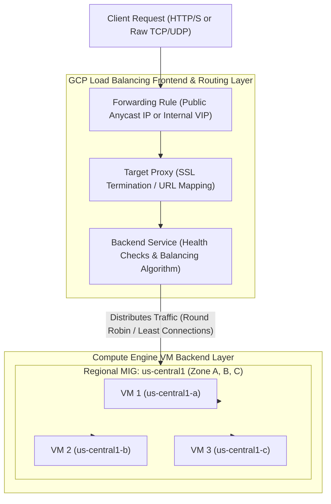

# Topic 45: Load Balancers

---

## 1. What Is It?

In the context of GCP Compute Engine Virtual Machines, **Load Balancers** act as the primary traffic routing frontend that distributes incoming application requests across pools of Compute Engine VM instances, Managed Instance Groups (MIGs), or Network Endpoint Groups (NEGs).

Integrating Load Balancers with Compute Engine VMs delivers four core production benefits:
1. **High Availability**: Routes traffic away from unhealthy VM instances to healthy VMs automatically.
2. **Scalability**: Seamlessly distributes traffic across auto-scaling MIG fleets as instance counts shrink or grow.
3. **Session Affinity**: Optionally pins a client's consecutive HTTP/TCP requests to the same backend VM instance (e.g., Client IP or Cookie affinity).
4. **SSL/TLS Offloading**: Terminates HTTPS encryption at Google's Anycast edge, relieving Compute Engine VMs of heavy cryptographic processing.

### Real-World Analogy
Think of a Load Balancer in front of Compute Engine VMs like a senior host stationed at the entrance of a busy multi-room restaurant. As guests arrive (Incoming Packets), the host checks which dining rooms (Availability Zones) have open tables and healthy waiters (VM Instances), guiding guests smoothly to their seats. If a waiter in Room 1 drops a tray (VM Health Check Failure), the host redirects new guests to Room 2 without any waiting guest noticing a problem.

---

## 2. Where Does It Fit?

Load Balancers sit in front of Compute Engine VMs and Managed Instance Groups, serving as external or internal entry points for application traffic.



---

## 3. Core Concepts

| Load Balancer Backend Concept | Description | Protocol / Setting | Best Practice |
|---|---|---|---|
| **Forwarding Rule** | Defines entry IP address, port, and protocol exposed to clients. | `34.120.1.1:443 (HTTPS)` | Reserve static external IP addresses for production forwarding rules. |
| **Backend Service** | Logical grouping of VM backends, health checks, and capacity settings. | Target Utilization / RPS | Configure explicit health checks and capacity scaling limits. |
| **Network Endpoint Group (NEG)** | Groups individual IP:Port endpoints instead of entire VM instances. | Zonal NEG / Serverless NEG | Mandate for GKE Pod backends and Cloud Run integrations. |
| **Session Affinity** | Binds client requests to the same backend VM instance. | `CLIENT_IP` or `GENERATED_COOKIE` | Avoid unless legacy stateful web sessions strictly require sticky sessions. |
| **Health Check Probes** | Probes backend VMs to verify service availability. | HTTP `/healthz` on Port 8080 | Ensure firewall rules allow prober IPs (`35.191.0.0/16`, `130.211.0.0/22`). |

---

## 4. How It Works

Traffic distribution and session management follow deterministic routing algorithms:

```text
Incoming HTTPS Request hits Load Balancer Forwarding Rule (34.120.1.1:443)
              ↓
Target Proxy terminates TLS certificate & evaluates URL Map rules
              ↓
Backend Service evaluates health check status of all attached VM instances
              ↓
Backend Service checks Capacity Settings (e.g., Max RPS per VM = 100)
              ↓
Selects healthiest VM in closest zone with available capacity -> Proxies request
              ↓
VM processes request -> Response returned to Load Balancer -> Delivered to Client
```

1. **Maglev Architecture**: GCP External Load Balancers use Maglev (Google's custom software-defined distributed packet routers), processing millions of requests per second without single points of failure.
2. **Session Sticky Cookie**: When Cookie Session Affinity is enabled, the load balancer inserts a `GCLB` hash cookie into the HTTP response header to route subsequent requests from that browser to the same VM instance.

---

## 5. Production Scenario

### Multi-Tier Enterprise Web Application Load Balancing

```text
Requirement: Secure an enterprise web application where public HTTPS traffic hits a Global Application Load Balancer, while private backend API calls to microservice VMs use an Internal Application Load Balancer.
    ↓
Architecture: Dual-Tier Load Balancing (External Layer 7 LB + Internal Layer 7 LB).
    ↓
External Tier Setup:
  - Global External HTTP(S) LB with Google-Managed SSL Certificate (`api.company.com`).
  - Cloud Armor WAF attached to block SQLi/XSS.
  - Backends: Frontend Regional MIG in `us-central1`.
    ↓
Internal Tier Setup:
  - Internal Application Load Balancer (Private IP: `10.100.1.50`).
  - Backends: Backend API Regional MIG in `us-central1`.
  - Session Affinity: `GENERATED_COOKIE` enabled for stateful user sessions.
    ↓
Security: Frontend VMs call Internal LB IP (`10.100.1.50`); Backend API VMs have zero public IPs.
    ↓
Monitoring: Cloud Monitoring tracking `backend_latencies` and 5xx error rate alerts.
```

*Why Selected*: Separating external public entry points from internal microservice load balancing isolates backend systems inside private subnets while delivering SSL offloading and WAF security at the public edge.

---

## 6. Hands-On Lab

### Prerequisites
- Active GCP Project with a Managed Instance Group (`rmig-web-prod`) created (from Topic 43).
- Cloud Shell or `gcloud` CLI.
- IAM permissions: `roles/compute.loadBalancerAdmin`.

### Console Method
1. Log into [Google Cloud Console](https://console.cloud.google.com/).
2. Navigate to **Network services** → **Load balancing**.
3. Click **CREATE LOAD BALANCER**.
4. Select **Application Load Balancer (HTTP/S)** → Click **START CONFIGURATION**.
5. Select **Internal** (or **External**) based on traffic scope.
6. **Backend Configuration**:
   - Backend Type: **Instance groups**.
   - Add Backend: Select your MIG (`rmig-web-prod`).
   - Health Check: Select `hc-http-80`.
   - Session affinity: Select **None** (or **Client IP**).
7. **Frontend Configuration**:
   - Subnet: Select `sb-us-central1`.
   - IP Address: Reserve a static internal IP (`10.100.0.50`).
   - Port: `80`.
8. Click **CREATE**.

### CLI Method
Attach a Managed Instance Group to an Internal Application Load Balancer using `gcloud`:

```bash
# Set project and network variables
PROJECT_ID="your-gcp-project-id"
VPC_NAME="custom-prod-vpc"
SUBNET_NAME="sb-us-central1"
REGION="us-central1"
MIG_NAME="rmig-web-prod"

# 1. Create a Proxy-Only Subnet (Required for Internal HTTP/S Load Balancers)
gcloud compute networks subnets create sb-proxy-only \
    --network=$VPC_NAME \
    --region=$REGION \
    --range=10.129.0.0/23 \
    --purpose=REGIONAL_MANAGED_PROXY \
    --role=ACTIVE

# 2. Create Health Check for the Backend Service
gcloud compute health-checks create http hc-ilb-80 \
    --port=80 \
    --request-path="/"

# 3. Create Internal Regional Backend Service
gcloud compute backend-services create ilb-backend-service \
    --load-balancing-scheme=INTERNAL_MANAGED \
    --protocol=HTTP \
    --health-checks=hc-ilb-80 \
    --region=$REGION

# 4. Add the Managed Instance Group to the Backend Service
gcloud compute backend-services add-backend ilb-backend-service \
    --instance-group=$MIG_NAME \
    --instance-group-region=$REGION \
    --region=$REGION

# 5. Create URL Map and Target HTTP Proxy
gcloud compute url-maps create ilb-url-map \
    --default-service=ilb-backend-service \
    --region=$REGION

gcloud compute target-http-proxies create ilb-target-proxy \
    --url-map=ilb-url-map \
    --region=$REGION

# 6. Create Internal Forwarding Rule (Virtual IP: 10.100.0.50)
gcloud compute forwarding-rules create ilb-forwarding-rule \
    --load-balancing-scheme=INTERNAL_MANAGED \
    --network=$VPC_NAME \
    --subnet=$SUBNET_NAME \
    --address=10.100.0.50 \
    --ports=80 \
    --target-http-proxy=ilb-target-proxy \
    --target-http-proxy-region=$REGION \
    --region=$REGION
```

### Verification
SSH into a private VM in the same VPC and test Internal LB resolution:

```bash
gcloud compute ssh test-vm --zone=us-central1-a --command="curl -i http://10.100.0.50"
```
*Expected Result*: Returns `HTTP/1.1 200 OK` proxied from one of the healthy MIG backend VMs.

### Cleanup
Delete Internal Load Balancer components:

```bash
gcloud compute forwarding-rules delete ilb-forwarding-rule --region=$REGION --quiet
gcloud compute target-http-proxies delete ilb-target-proxy --region=$REGION --quiet
gcloud compute url-maps delete ilb-url-map --region=$REGION --quiet
gcloud compute backend-services delete ilb-backend-service --region=$REGION --quiet
gcloud compute health-checks delete hc-ilb-80 --quiet
```

---

## 7. Security

### SSL Offloading & Proxy-Only Subnet Security
- **Proxy-Only Subnets**: Internal Application Load Balancers require a dedicated `REGIONAL_MANAGED_PROXY` subnet (e.g., `/23` range). Envoy proxies run inside this subnet to manage HTTP processing.
- **Firewall Rules for Envoy Proxies**: Create ingress firewall rules allowing traffic from the Proxy-Only Subnet range (`10.129.0.0/23`) to your backend VM instances on port 80/8080.
- **Zero-Trust Backend Encryption**: Enable **HTTPS to Backend** if traffic between the Load Balancer proxy and backend VMs must be encrypted for compliance (PCI-DSS/HIPAA).

```text
BAD PRACTICE:
Exposing private VM instances directly to external traffic without a load balancer or WAF proxy.
Risk: Direct exposure to volumetric Layer 4/7 DDoS attacks and unencrypted traffic.

PRODUCTION PRACTICE:
Place all backend Compute Engine VMs inside private subnets behind External/Internal Load Balancers with Cloud Armor WAF protection.
```

---

## 8. Scaling & High Availability

Load Balancer Backend Capacity & Balancing Modes:

```text
Balancing Mode 1: UTILIZATION (Target CPU % - e.g., 80% Max Utilization per VM)
   ↓
Balancing Mode 2: RATE (Max Requests Per Second - e.g., 100 RPS per VM)
   ↓
Traffic Overflow -> Excess requests beyond Max RPS automatically routed to secondary regional MIG backends
```

- **Cross-Region Overflow**: When using Global Application Load Balancers, if the primary regional MIG reaches its max RPS capacity, Google Front Ends automatically spill over excess traffic to secondary regional MIGs in another continent.

---

## 9. Cost

### Load Balancer Cost Optimization
- **Rule Allocation Efficiency**: Combine multiple domains and path rules under a single Global Load Balancer URL Map to avoid creating redundant forwarding rules.
- **Avoid Idle Forwarding Rules**: Delete unused external forwarding rules (each costs ~$0.025/hour).
- **Health Check Traffic $0**: Health check probes sent to backend VMs incur zero networking charges.

---

## 10. Monitoring & Troubleshooting

### Load Balancer Observability Tools
- **Cloud Monitoring Latency Metrics**: Metrics `backend_latencies` (p50, p95, p99 percentiles) and `response_code_class` (2xx, 4xx, 5xx).
- **Envoy Access Logs**: Enable logging on Backend Services to capture client IP, user agent, request path, and HTTP status codes in Cloud Logging.

### Troubleshooting Matrix

| Symptom | Possible Cause | What to Check | Fix |
|---|---|---|---|
| Load Balancer returns `HTTP 502 Bad Gateway` | Health check probes failing or missing Proxy-Only Subnet firewall rule | Health check status in Console | Add firewall rule allowing Health Check IPs (`35.191.0.0/16`, `130.211.0.0/22`) & Proxy Subnet. |
| Cannot create Internal Application Load Balancer | Missing Proxy-Only Subnet in the region | `gcloud compute networks subnets list` | Create a subnet with `--purpose=REGIONAL_MANAGED_PROXY` in target region. |
| Session Affinity not sticking to same VM | Cookie cleared by client browser or VM instance scaled down | Client HTTP headers | Verify browser allows cookies; ensure MIG size is stable. |

---

## 11. Common Mistakes

```text
Mistake: Forgetting to create a `REGIONAL_MANAGED_PROXY` subnet when deploying an Internal Application Load Balancer.
Why: Unaware that Envoy-based internal HTTP LBs require dedicated proxy IP pools.
Impact: Load balancer creation fails with missing proxy subnet error.
Correct approach: Create a dedicated Proxy-Only Subnet (e.g., `/23` range) in the region prior to creating the Internal LB.

Mistake: Failing to allow Proxy-Only Subnet IP ranges in backend VM firewall rules.
Why: Allowing Health Check IPs (`35.191.0.0/16`) but forgetting Envoy proxy IPs.
Impact: Health checks show healthy, but client requests return `HTTP 503 Service Unavailable`.
Correct approach: Create ingress firewall rules allowing both Health Check ranges AND the Proxy-Only Subnet CIDR.
```

---

## 12. Production Best Practices

- [ ] Place 100% of production Compute Engine VM backends inside private subnets behind Load Balancers.
- [ ] Create a dedicated **Proxy-Only Subnet** (`REGIONAL_MANAGED_PROXY`) in each region using Internal HTTP LBs.
- [ ] Configure explicit **VPC Firewall Rules** allowing Health Check ranges (`35.191.0.0/16`, `130.211.0.0/22`) and Proxy Subnet ranges.
- [ ] Use **Google-Managed SSL Certificates** for external HTTPS forwarding rules.
- [ ] Enable **Cloud Armor WAF** policies on all external HTTP(S) load balancers.
- [ ] Automate all Load Balancer forwarding rules, URL maps, and backend services via Terraform.

---

## 13. Hyperscaler / Enterprise Perspective

```text
Personal / Learning
  Single VM → External HTTP LB → No SSL → Open firewall
        ↓
Small Production
  Global HTTP(S) Load Balancer → Managed SSL → Regional MIG Backend
        ↓
Enterprise Environment
  Dual-Tier LBs (Global External WAF + Internal App LBs) → Proxy-Only Subnets → Cloud Armor Threat Rules
        ↓
Hyperscaler Environment
  Automated GKE Ingress / Gateway API → Multi-Cluster Anycast Traffic Engineering → Global CDN Caching & Real-time p99 SRE Alerts
```

In a hyperscaler environment, load balancing is fully decoupled from manual VM configuration. SRE teams use **GKE Gateway API** or **Multi-Cluster Ingress (MCI)** to automatically provision global Anycast load balancers, SSL certificates, and Cloud Armor WAF policies directly from Kubernetes manifests, driving high-availability traffic distribution across global compute fleets.

---

## 14. Real Project Questions

### Q1: What is the purpose of a Proxy-Only Subnet (`REGIONAL_MANAGED_PROXY`) in Google Cloud?
**Answer:** Internal Application Load Balancers (and Regional External Application Load Balancers) use Envoy proxies running in software to manage HTTP/S traffic routing, header evaluation, and SSL termination. GCP requires a dedicated **Proxy-Only Subnet** in each region to allocate internal IP addresses for these Envoy proxies so they can communicate with backend VMs.

### Q2: What is the difference between Session Affinity and Load Balancing Algorithms?
**Answer:** Load Balancing Algorithms (like Round Robin or Least Connections) distribute incoming requests across healthy backends based on capacity and health. **Session Affinity** overrides standard distribution for subsequent requests from the same client, using Client IP hashes or HTTP Cookies (`GENERATED_COOKIE`) to route consecutive requests from a user to the exact same backend VM instance.

### Q3: Why is a HTTP Health Check required on a Backend Service even if the underlying VMs are managed by a MIG?
**Answer:** MIG Health Checks govern **Auto-Healing** (deciding whether to reboot/recreate a crashed VM instance). Backend Service Health Checks govern **Traffic Routing** (deciding whether to send incoming client requests to a specific VM instance). If a VM fails the Backend Service Health Check, the Load Balancer stops sending it traffic without triggering an instance reboot.

---

## 15. Quick Decision Guide

| Requirement | Recommended Approach | Reason |
|---|---|---|
| Public web app requiring global SSL termination, Cloud Armor WAF, and CDN caching | **Global External Application Load Balancer** | Global Anycast IP, edge SSL termination, and WAF integration. |
| Private internal API communication between microservices inside a VPC | **Internal Application Load Balancer** | Private RFC1918 VIP, Layer 7 HTTP routing, Envoy proxy isolation. |
| Non-HTTP raw TCP database connection requiring client IP preservation | **Regional External Passthrough Network Load Balancer** | Direct Layer 4 passthrough with maximum throughput and zero proxy modification. |

### When should I use it?
- Essential networking service for distributing traffic, establishing high availability, and securing Compute Engine VM fleets.

### When should I NOT use it?
- Do not expose backend VMs directly to the internet without a load balancer proxy layer.

---

## 16. Related Services

```text
               [45. Load Balancers]
              /         |          \
      Cloud Armor   Compute Engine   Cloud DNS
        (WAF)       (MIG Backends)  (Anycast)
           |              |              |
       Layer 7         VM Fleet       Domain A
       Security       Instances       Records
```

- **Cloud Armor**: Web Application Firewall (WAF) attached to Load Balancers.
- **Compute Engine (MIGs)**: Primary compute backends receiving load-balanced traffic.
- **Cloud DNS**: Maps public domain A records to Load Balancer Anycast IPs.

---

## 17. Cheat Sheet

### Essential Proxy & Health Check IPs
- **Health Check Probers**: `35.191.0.0/16` and `130.211.0.0/22`.
- **Proxy-Only Subnet Purpose**: `REGIONAL_MANAGED_PROXY`.

### Useful Commands
```bash
# Create Proxy-Only Subnet for Internal LBs
gcloud compute networks subnets create PROXY_SUB_NAME \
    --network=VPC_NAME --region=us-central1 \
    --range=10.129.0.0/23 --purpose=REGIONAL_MANAGED_PROXY --role=ACTIVE

# Create Regional Internal Backend Service
gcloud compute backend-services create BS_NAME \
    --load-balancing-scheme=INTERNAL_MANAGED \
    --protocol=HTTP --health-checks=HC_NAME --region=us-central1

# Add MIG to Backend Service
gcloud compute backend-services add-backend BS_NAME \
    --instance-group=MIG_NAME --instance-group-region=us-central1 --region=us-central1
```

---

## 18. Learning Connection

- **Previous Topic**: [44. Autoscaling](../44-autoscaling/README.md)
- **Next Topic**: [46. Cloud Storage](../../05-storage-and-databases/46-cloud-storage/README.md)
