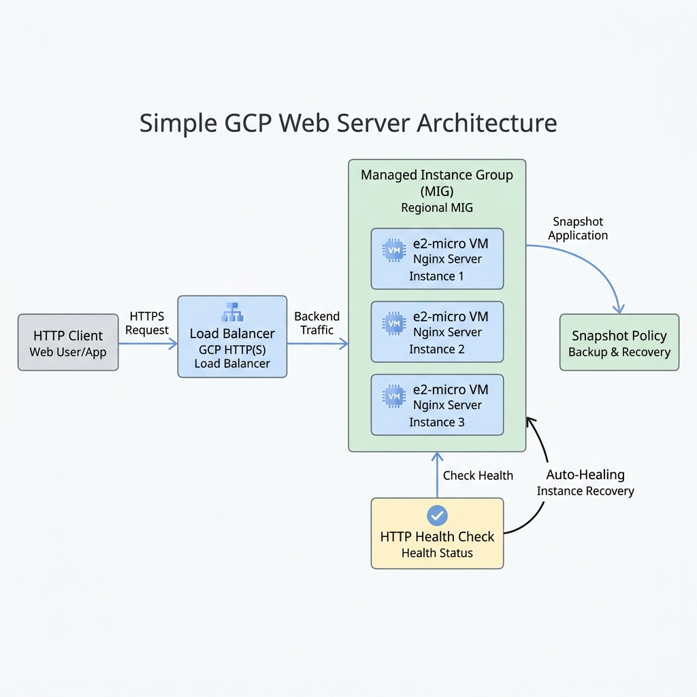
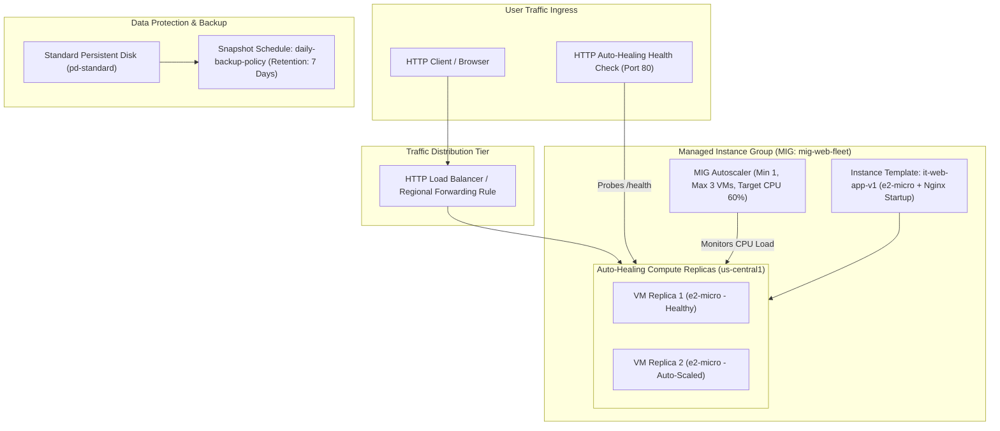

# Project 4: High-Availability Auto-Healing Managed Instance Group (MIG) with Load Balancing

---

## 1. Project Overview

Welcome to **Project 4: High-Availability Auto-Healing Managed Instance Group**. This hands-on project synthesizes all 8 topics in **Module 04 (Compute / Virtual Machines)** into a production-grade compute architecture optimized for the **GCP Always Free Tier**.

### Objectives
In this project, you will:
1. **Configure Custom Compute Workloads**: Select cost-effective machine types (`e2-micro`) and attached Persistent Disks.
2. **Automate Disks & Snapshot Schedules**: Schedule automated snapshot policies to back up persistent data disks without downtime.
3. **Build Versioned Instance Templates**: Author reusable instance templates incorporating metadata startup scripts.
4. **Deploy a Managed Instance Group (MIG)**: Create an auto-healing MIG with regional instance distribution and HTTP health checks.
5. **Implement CPU Autoscaling & Load Balancing**: Configure dynamic autoscaling policies (min 1, max 3 instances) behind an HTTP Load Balancer.

---

## 2. Architecture & Compute Model

The project provisions an auto-healing, autoscaling compute fleet serving web traffic behind a Load Balancer:





> [!IMPORTANT]
> **Always Free Tier Safety Rules**:
> - **Free Tier VM**: Compute Engine provides 1 non-preemptible `e2-micro` VM instance per month free in `us-central1`.
> - **Autoscaling Safety Ceiling**: The MIG autoscaling policy is capped at a maximum of 3 `e2-micro` instances during load testing to keep usage within your $300 Free Trial credits.
> - **Automated Cleanup**: Always execute `./scripts/cleanup_mig.sh` after completing your lab exercises to delete instance groups and stop VM billing.

---

## 3. Module Topics Covered

| Topic Number & Name | Project Integration Point |
|---|---|
| **38. Compute Engine Overview** | Provisioning Google Compute Engine (GCE) infrastructure units. |
| **39. Machine Types** | Comparing General Purpose (`e2-micro` Always Free) vs Compute/Memory Optimized families. |
| **40. Persistent Disks** | Configuring `pd-standard` boot disks and secondary data volumes. |
| **41. Snapshots & Backups** | Defining automated daily Snapshot Policies with 7-day retention cycles. |
| **42. Instance Templates** | Authoring versioned instance templates (`it-web-app-v1`) with startup metadata. |
| **43. Managed Instance Groups (MIGs)** | Deploying auto-healing MIGs (`mig-web-fleet`) with regional distribution. |
| **44. Autoscaling** | Setting target CPU utilization threshold (60%) for dynamic scaling. |
| **45. Load Balancing Integration** | Integrating backend service health probes and forwarding rules. |

---

## 4. Hands-On Execution Guide

### Step 1: Navigate to Project 4 Workspace

Open Google Cloud Shell or local terminal:

```bash
cd "04-compute-virtual-machines/project-04-compute-virtual-machines"
chmod +x scripts/*.sh
```

---

### Step 2: Inspect Startup Script

Inspect `scripts/startup_script.sh` which installs Nginx and injects hostname metadata into the web server response:

```bash
cat scripts/startup_script.sh
```

---

### Step 3: Deploy the Auto-Healing MIG Architecture

Execute `scripts/deploy_mig_app.sh` to automate:
1. Creating an automated Snapshot Schedule (`snap-policy-daily`).
2. Creating an HTTP Health Check (`hc-web-autoheal`).
3. Authoring an Instance Template (`it-web-app-v1`) using `e2-micro` and the startup script.
4. Deploying a Managed Instance Group (`mig-web-fleet`) in `us-central1-a`.
5. Attaching an Autoscaling Policy (Target CPU: 60%, Min: 1, Max: 3).

```bash
./scripts/deploy_mig_app.sh
```

*Expected Script Output Snippet*:
```text
=====================================================
GCP Managed Instance Group (MIG) Deployment
=====================================================
[INFO] Creating Snapshot Schedule: snap-policy-daily...
[SUCCESS] Snapshot policy created.
[INFO] Creating Auto-Healing Health Check: hc-web-autoheal...
[SUCCESS] Health check active on port 80.
[INFO] Creating Instance Template: it-web-app-v1 (e2-micro)...
[SUCCESS] Instance template created.
[INFO] Deploying Managed Instance Group: mig-web-fleet...
[SUCCESS] MIG deployed in us-central1-a.
[INFO] Setting CPU Autoscaling Policy (Min: 1, Max: 3, Target CPU: 60%)...
[SUCCESS] Autoscaling policy attached.
```

---

### Step 4: Test Auto-Healing & Self-Recovery

Test Compute Engine's auto-healing capability by intentionally stopping the Nginx web service on a running VM instance:

```bash
# 1. Get the name of a running VM replica in the MIG
VM_NAME=$(gcloud compute instance-groups managed list-instances mig-web-fleet --zone=us-central1-a --format="value(NAME)" | head -n 1)

# 2. Stop Nginx inside the VM to trigger health check failure
gcloud compute ssh ${VM_NAME} --zone=us-central1-a --command="sudo systemctl stop nginx"

# 3. Observe MIG health status (The MIG will detect failure and auto-recreate the VM within 2 minutes!)
watch -n 5 "gcloud compute instance-groups managed list-instances mig-web-fleet --zone=us-central1-a"
```

---

### Step 5: Test CPU Load Spike Autoscaling

Simulate a CPU load spike to verify autoscaler behavior:

```bash
# 1. Obtain active VM instance name in MIG
VM_NAME=$(gcloud compute instance-groups managed list-instances mig-web-fleet --zone=us-central1-a --format="value(NAME)" | head -n 1)

# 2. Stress CPU on instance to trigger scaling up to 2-3 replicas
gcloud compute ssh "${VM_NAME}" --zone=us-central1-a --command="sudo apt-get update && sudo apt-get install -y stress && stress --cpu 2 --timeout 120" &

# 3. Monitor autoscaling event log & instance replica count
watch -n 5 "gcloud compute instance-groups managed list-instances mig-web-fleet --zone=us-central1-a"
```

---

## 5. Verification & Testing

Verify your MIG and disk policies via CLI:

```bash
# 1. Describe MIG status & active instance count
gcloud compute instance-groups managed describe mig-web-fleet --zone=us-central1-a

# 2. Verify Snapshot Schedule attachment
gcloud compute resource-policies list --filter="region ~ us-central1"
```

---

## 6. Troubleshooting & Common Issues

| Symptom / Error | Root Cause | Resolution |
|---|---|---|
| MIG continuously recreates VMs (Infinite Reboot Loop) | Health Check port mismatch or startup script failed to launch Nginx. | Test health check port locally: `curl -I http://localhost:80` inside VM; verify startup script logs in `/var/log/syslog`. |
| Autoscaler does not scale up during load test | Stress test duration too short (< 60s stabilization period). | Run stress test for at least 3 minutes to allow CPU moving average to cross 60%. |
| `Quota Exceeded` on `e2-micro` instances | Regional vCPU quota exhausted in selected zone. | Deploy MIG in an alternate zone (e.g., `us-central1-b` or `us-central1-c`). |

---

## 7. Project Cleanup

To delete the MIG, instance templates, health checks, and snapshot policies, run:

```bash
./scripts/cleanup_mig.sh
```

---

## 8. Summary & Next Steps

Congratulations! You have completed **Project 4: High-Availability Auto-Healing Managed Instance Group**. You have mastered versioned instance templates, HTTP auto-healing, CPU autoscaling, and snapshot backups.

- **Next Project**: [Project 5: Multi-Tier Polyglot Database & Data Lake Architecture](../../05-storage-and-databases/project-05-storage-and-databases/README.md)
