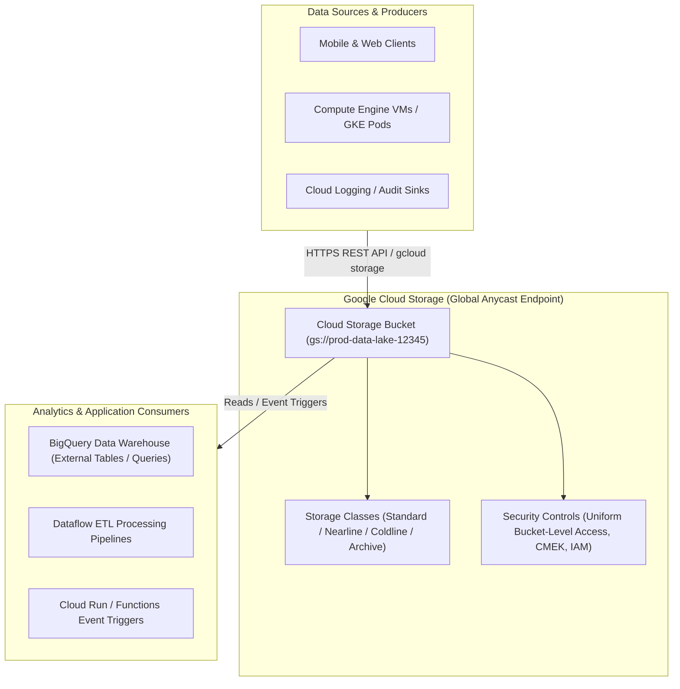

# Topic 46: Cloud Storage

---

## 1. What Is It?

**Google Cloud Storage (GCS)** is a highly durable, scalable, global object storage service designed to store and retrieve any amount of unstructured data—such as images, videos, analytics datasets, database backups, logs, and static web assets—from anywhere on the web.

Unlike traditional block storage (Persistent Disks) or file storage (Filestore), Cloud Storage organizes data as **Objects** contained within flat namespace containers called **Buckets**.

Cloud Storage delivers 99.999999999% (11 9's) annual durability, strongly consistent API reads, automatic server-side encryption at rest, and zero capacity management—allowing buckets to scale infinitely from bytes to petabytes automatically.

### Real-World Analogy
Think of Cloud Storage like a digital shipping warehouse that provides automated valet locker service. You don't manage physical room shelves, drive bays, or hard drive partitions (Block Storage). Instead, you place items (Objects) into uniquely labeled shipping containers (Buckets), receiving a unique tracking tracking ID (URL / Object Key). Whenever you give the warehouse the tracking ID, it retrieves your item instantly, regardless of whether you stored 1 item or 10 billion items.

---

## 2. Where Does It Fit?

Cloud Storage acts as the central data lake and object repository across Google Cloud Platform, integrating with BigQuery, Dataflow, Cloud Functions, and Compute Engine.



---

## 3. Core Concepts

| Concept | Description | Example / Syntax | Best Practice |
|---|---|---|---|
| **Bucket** | Flat namespace container holding objects; names are globally unique across all GCP projects worldwide. | `gs://my-company-data-lake-prod` | Enforce **Uniform Bucket-Level Access** for simple IAM management. |
| **Object** | Unstructured file (data bytes) + Key Name + Metadata stored in a bucket. | `gs://bucket/images/2026/logo.png` | Treat key names with slashes `/` as virtual directories. |
| **Strong Consistency** | Read-after-write, read-after-update, and read-after-delete consistency globally. | Immediate API consistency | Never worry about stale reads after updating or deleting an object. |
| **Storage Class** | Cost and access latency tiering (Standard, Nearline, Coldline, Archive). | `STANDARD` vs `ARCHIVE` | Use Object Lifecycle Management to auto-downgrade cold data. |
| **Object Immutability** | Individual objects cannot be partially edited in-place; updates overwrite full object. | Full object replacement | Stream large appends using multipart uploads or append logs. |

---

## 4. How It Works

Object ingestion, global Anycast routing, and strong consistency operate via Google's Colossus distributed storage engine:

```text
Client uploads 500 MB video file via HTTPS PUT to gs://my-bucket/video.mp4
              ↓
Request hits nearest Google Edge Point of Presence (PoP) via Anycast IP
              ↓
Colossus Storage Engine splits file into chunks, encrypts each chunk (AES-256),
and writes chunks across multiple physical storage nodes in target region/multi-region
              ↓
Upload completes -> GCS returns HTTP 200 OK
              ↓
Client immediately executes GET request -> Strong Consistency guarantees 100% fresh data returned
```

1. **Global Uniqueness**: Bucket names share a single global namespace across all GCP customers worldwide.
2. **Flat Namespace**: Directories do not physically exist inside buckets; slashes (`/`) in object names are simply string characters evaluated by tools as virtual folders.

---

## 5. Production Scenario

### Enterprise Data Lake for BigQuery Analytics & Archiving

```text
Requirement: Build a secure, compliant data lake storing 100 TB of daily transaction logs for real-time BigQuery analysis, retaining historical logs for 7 years at minimum cost.
    ↓
Architecture: Cloud Storage Bucket (`gs://enterprise-datalake-prod`) with automated lifecycle management.
    ↓
Configuration:
  - Location: Multi-Region `us` (High availability across US datacenters).
  - Access Control: Uniform Bucket-Level Access enabled (per-object ACLs disabled).
  - Default Storage Class: `STANDARD` (for fast ingestion and BigQuery querying).
  - Lifecycle Rules:
    - Rule 1: Change Storage Class to `NEARLINE` after 30 days.
    - Rule 2: Change Storage Class to `ARCHIVE` after 90 days.
    - Rule 3: Permanent deletion after 2,555 days (7 years).
    ↓
Security: CMEK encryption enabled using Cloud KMS key; Public Access Prevention enforced (`enforce`).
    ↓
Monitoring: Cloud Audit Logs recording all `storage.objects.create` and `storage.objects.delete` events.
```

*Why Selected*: Combines multi-regional high availability with strong consistency for analytics, automated lifecycle tiering for 80%+ cost reduction, and strict CMEK encryption compliance.

---

## 6. Hands-On Lab

### Prerequisites
- Active GCP Project.
- Cloud Shell or `gcloud` CLI.
- IAM permissions: `roles/storage.admin`.

### Console Method
1. Log into [Google Cloud Console](https://console.cloud.google.com/).
2. Navigate to **Cloud Storage** → **Buckets**.
3. Click **CREATE BUCKET** at top.
4. Set Name: `demo-datalake-12345` (Must be globally unique) → Click **CONTINUE**.
5. Location type: **Multi-region** → Select **us (multiple regions in United States)**.
6. Default storage class: **Standard**.
7. Prevent public access: Check **Enforce public access prevention on this bucket**.
8. Access control: Select **Uniform** (Uniform bucket-level access).
9. Click **CREATE**.
10. Click **UPLOAD FILES** → Upload a test text file → View file details and public access status.

### CLI Method
Create, configure, and upload to a Cloud Storage bucket using `gcloud`:

```bash
# Set project and bucket variables
PROJECT_ID="your-gcp-project-id"
BUCKET_NAME="demo-datalake-${PROJECT_ID}"

# 1. Create a Multi-Regional Cloud Storage bucket with Uniform Bucket-Level Access
gcloud storage buckets create gs://$BUCKET_NAME \
    --project=$PROJECT_ID \
    --location=us \
    --default-storage-class=STANDARD \
    --uniform-bucket-level-access \
    --public-access-prevention

# 2. Upload a local file to the Cloud Storage bucket
echo "Production Data Log Entry" > sample.log
gcloud storage cp sample.log gs://$BUCKET_NAME/logs/sample.log

# 3. List objects inside the bucket
gcloud storage ls gs://$BUCKET_NAME/logs/

# 4. Download object from bucket
gcloud storage cp gs://$BUCKET_NAME/logs/sample.log downloaded_sample.log
```

### Verification
*Expected Result*: `gcloud storage ls` lists `gs://demo-datalake-PROJECT/logs/sample.log`, confirming upload and retrieval.

### Cleanup
Delete objects and bucket:

```bash
gcloud storage rm --recursive gs://$BUCKET_NAME --quiet
rm sample.log downloaded_sample.log
```

---

## 7. Security

### Essential Cloud Storage Security Principles
- **Enforce Public Access Prevention**: Enable `public-access-prevention: enforce` on all production buckets to block accidental exposure of data to the internet.
- **Enforce Uniform Bucket-Level Access**: Use IAM policies exclusively at the bucket level; disable legacy fine-grained Per-Object Access Control Lists (ACLs).
- **Customer-Managed Encryption Keys (CMEK)**: Encrypt sensitive data using Cloud KMS keys to retain full authority over key rotation and revocation.

```text
BAD PRACTICE:
Disabling Public Access Prevention and using legacy Object ACLs (`public-read`) to share files directly with external vendors.
Risk: Bucket endpoints are indexed by search engines, exposing proprietary enterprise data publicly.

PRODUCTION PRACTICE:
Enable Uniform Bucket-Level Access and Public Access Prevention. Use short-lived Signed URLs or Workload Identity for external data sharing.
```

---

## 8. Scaling & High Availability

Multi-Region & Dual-Region Resiliency:

```text
Single Region Bucket (`us-central1` - 99.9% Availability SLA - Regional Storage)
   ↓ (High Availability Enterprise Upgrade)
Multi-Region Bucket (`us` - 99.95% Availability SLA - Redundant across US datacenters)
   ↓ (Turbo Replication Dual-Region)
Dual-Region Bucket (`nam4` us-central1 + us-east4 with 15-minute RPO Turbo Replication)
```

- **Turbo Replication**: Dual-Region buckets offer optional Turbo Replication, guaranteeing 100% of objects are geo-replicated to the secondary region within 15 minutes.

---

## 9. Cost

### Cloud Storage Cost Breakdown
- **Storage Capacity Charges**: Billed per GB per month based on Storage Class (Standard ~$0.020/GB vs Archive ~$0.0012/GB).
- **Network Egress Charges**: Data transferred out of GCP to the internet incurs standard network egress fees; data transferred to BigQuery or Compute Engine in the same region is $0/GB.
- **API Operational Charges**: Class A operations (Write/List - e.g., `storage.objects.create`) cost more than Class B operations (Read - e.g., `storage.objects.get`).

---

## 10. Monitoring & Troubleshooting

### Cloud Storage Observability Tools
- **Cloud Storage Metrics**: Monitor `storage.googleapis.com/storage/total_bytes`, `object_count`, and `network/sent_bytes_count`.
- **Cloud Audit Logs**: Audit Data Access logs for object read, write, and delete requests.

### Troubleshooting Matrix

| Symptom | Possible Cause | What to Check | Fix |
|---|---|---|---|
| `403 Access Denied` on object download | Principal lacks `roles/storage.objectViewer` or Public Access Prevention active | Bucket IAM policies & Public Access Prevention status | Grant `roles/storage.objectViewer` to principal or use Signed URLs. |
| `Bucket name already exists` error during creation | Bucket name chosen is already taken by another GCP customer globally | Global bucket namespace rules | Choose a unique bucket name containing your project ID or domain name. |
| Unexpected high storage bill | Heavy accumulation of incomplete multipart uploads or deleted object versions | Bucket Object Lifecycle policies | Add lifecycle rule `abortIncompleteMultipartUpload` and `deleteOldObjectVersions`. |

---

## 11. Common Mistakes

```text
Mistake: Assuming Cloud Storage bucket names only need to be unique within your own GCP project.
Why: Misunderstanding global namespace requirements.
Impact: Bucket creation fails with "Bucket name already exists" error.
Correct approach: Append project ID or domain prefix (e.g., `company-project-data-bucket`) to ensure global uniqueness.

Mistake: Leaving legacy Object ACLs enabled on new buckets.
Why: Using legacy GCP storage patterns.
Impact: Inconsistent IAM security; individual objects have hidden permissions bypassing bucket IAM policies.
Correct approach: Always enable **Uniform Bucket-Level Access** to enforce 100% central IAM control.
```

---

## 12. Production Best Practices

- [ ] Enable **Uniform Bucket-Level Access** on all Cloud Storage buckets.
- [ ] Enforce **Public Access Prevention** (`enforce`) at the organization or bucket level.
- [ ] Implement **Object Lifecycle Management** rules to downgrade cold data automatically.
- [ ] Use **Signed URLs** or **Signed Policy Documents** for temporary external file uploads/downloads.
- [ ] Use **Customer-Managed Encryption Keys (CMEK)** for regulated data storage.
- [ ] Automate all bucket creations and security configurations using Infrastructure as Code (Terraform).

---

## 13. Hyperscaler / Enterprise Perspective

```text
Personal / Learning
  Single-region bucket → Fine-grained ACLs → Public Read enabled → Standard Storage Class
        ↓
Small Production
  Multi-Region bucket → Uniform Bucket-Level Access → Basic Lifecycle Rules
        ↓
Enterprise Environment
  Dual-Region Buckets with Turbo Replication → CMEK Key Rotation via Cloud KMS → Security Command Center Audit Sinks
        ↓
Hyperscaler Environment
  100% Terraform Provisioned Data Lakes → Automated DLP (Data Loss Prevention) Scanning → Object Retention Locks (WORM Compliance)
```

In a hyperscaler environment, Cloud Storage is the primary repository for enterprise Data Lakes. Automated landing zone pipelines enforce Uniform Bucket Access, Public Access Prevention, and CMEK encryption. Automated **Data Loss Prevention (DLP)** jobs scan newly uploaded objects for PII (personally identifiable information), automatically redacting sensitive fields before streaming data into BigQuery.

---

## 14. Real Project Questions

### Q1: Why must Cloud Storage bucket names be globally unique across all Google Cloud Platform accounts worldwide?
**Answer:** Cloud Storage buckets are exposed globally via standard DNS endpoints (such as `https://storage.googleapis.com/BUCKET_NAME/OBJECT_NAME` or custom CNAME domains). Because bucket names populate Google's global Anycast DNS namespace, no two buckets across any GCP organization worldwide can share the same name.

### Q2: What is the technical difference between Uniform Bucket-Level Access and Fine-Grained Object ACLs?
**Answer:** **Fine-Grained Object ACLs** allow setting individual read/write access permissions on every single object independently, leading to permission drift and security leaks. **Uniform Bucket-Level Access** disables individual object ACLs completely, enforcing 100% of access control through Cloud IAM policies attached at the bucket level, simplifying auditing and compliance.

### Q3: How does Strong Consistency in Cloud Storage simplify data pipeline development?
**Answer:** Cloud Storage provides global **Strong Consistency** for all read-after-write, read-after-update, and read-after-delete operations. When an application uploads or deletes an object, any subsequent read request globally is guaranteed to receive the fresh data instantly. Developers do not need to build complex polling delays or retry loops to wait for eventual consistency propagation.

---

## 15. Quick Decision Guide

| Requirement | Recommended Approach | Reason |
|---|---|---|
| Central data lake for BigQuery analytics requiring high availability across US | **Multi-Regional Cloud Storage Bucket (`location: us`)** | Provides 99.95% SLA and global Anycast performance for high-throughput analytics. |
| Temporary 15-minute file download link for an external unauthenticated user | **Cloud Storage Signed URL** | Generates a time-bound cryptographic URL without modifying bucket IAM policies. |
| Storing 50 TB of regulatory compliance archives retained for 10 years | **Cloud Storage Bucket with Archive Class + Bucket Lock** | Delivers minimum storage costs ($0.0012/GB) with WORM compliance locking. |

### When should I use it?
- Essential service for storing unstructured files, images, backups, data lake files, and static web assets.

### When should I NOT use it?
- Do not use Cloud Storage as a replacement for high-IOPS relational databases or random-write block storage (use Cloud SQL or Persistent Disks).

---

## 16. Related Services

```text
               [46. Cloud Storage]
              /         |         \
        BigQuery    Cloud KMS    Cloud Functions
        (Analytics) (CMEK Keys)  (Event Triggers)
            |           |               |
        External     Encryption     File Processing
         Tables      at Rest         Pipelines
```

- **BigQuery**: Directly queries unstructured data files stored in Cloud Storage.
- **Cloud KMS**: Manages encryption keys for CMEK-encrypted buckets.
- **Cloud Functions / Eventarc**: Triggers automated code execution upon object uploads.

---

## 17. Cheat Sheet

### Key SLA & Properties
- **Durability**: 99.999999999% (11 9's).
- **Consistency**: Strongly Consistent globally.
- **Access Control**: Uniform Bucket-Level Access (Recommended).
- **Public Access**: Block via Public Access Prevention (`enforce`).

### Useful Commands
```bash
# Create a Multi-Regional bucket with Uniform Access
gcloud storage buckets create gs://BUCKET_NAME \
    --location=us --default-storage-class=STANDARD \
    --uniform-bucket-level-access --public-access-prevention

# Upload a file to a bucket
gcloud storage cp LOCAL_FILE gs://BUCKET_NAME/DEST_PATH

# Generate a 15-minute Signed URL for temporary access
gcloud storage sign-url gs://BUCKET_NAME/OBJECT_NAME --duration=15m
```

---

## 18. Learning Connection

- **Previous Topic**: [45. Load Balancers](../../04-compute-virtual-machines/45-load-balancers/README.md)
- **Next Topic**: [47. Buckets](../47-buckets/README.md)
