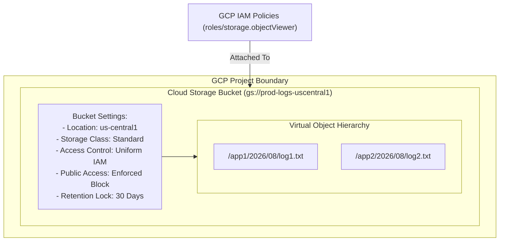

# Topic 47: Buckets

---

## 1. What Is It?

A **Bucket** is the fundamental root container in Google Cloud Storage used to hold unstructured objects (files). Every object stored in Cloud Storage resides inside a specific bucket.

Buckets control core administrative, security, and geographical properties for all objects contained within them:
- **Global Naming**: Bucket names must be globally unique across all Google Cloud accounts worldwide.
- **Location Type**: Specifies the geographical location where objects are physically stored (Region, Dual-Region, or Multi-Region).
- **Access Control Model**: Defines whether access is governed uniformly via IAM policies or fine-grained per-object ACLs.
- **Public Access Prevention**: Prevents inadvertent public internet exposure of bucket data.
- **Retention & Lock Policies**: Enforces Write-Once-Read-Many (WORM) compliance rules preventing object modification or deletion for a specified time period.

### Real-World Analogy
Think of a Bucket like a high-security physical shipping container shipped to a specific port location. The container has a globally unique serial number stamped on the outside (Bucket Name). The shipping manifest attached to the door (Bucket Policy) dictates who has keys to open the container (IAM Policies), whether the container is stored in a single warehouse or replicated across two ports (Location), and whether the locks are welded shut for 5 years for legal compliance (Retention Lock).

---

## 2. Where Does It Fit?

Buckets serve as top-level storage containers within a GCP Project, defining geographical replication and security boundaries for object data.



---

## 3. Core Concepts

| Bucket Feature | Options / Syntax | Production Guidance |
|---|---|---|
| **Naming Conventions** | 3–63 chars, lowercase, numbers, hyphens, dots. Globally unique. | Use domain or project-prefixed names (`gs://company-project-env-purpose`). |
| **Location Types** | Regional (Single region), Dual-Region (2 regions), Multi-Region (`us`, `eu`, `asia`). | Use Dual-Region or Multi-Region for business-critical data lakes. |
| **Uniform Access** | `uniformBucketLevelAccess: true` | **Mandatory standard**: Disables legacy per-object ACLs. |
| **Public Access Prevention** | `publicAccessPrevention: "enforce"` | **Mandatory standard**: Hard blocks all public internet access. |
| **Retention Policy** | Duration in seconds/days (e.g., `retentionPeriod: 31536000s` = 1 year). | Enforces WORM compliance; once locked, policy CANNOT be reduced or deleted. |

---

## 4. How It Works

Bucket evaluation and creation enforce global namespace checks and security policies:

```text
Admin submits creation request for gs://my-company-data
              ↓
GCP checks Global Anycast DNS Registry -> Is name available worldwide?
              ↓
YES -> Allocates Bucket Metadata in Resource Manager
              ↓
Applies default policies: Uniform IAM Access + Public Access Prevention + CMEK Key
              ↓
Bucket ready -> Objects can now be uploaded to gs://my-company-data
```

1. **Immutable Bucket Names**: Once a bucket is created, its name and project ownership cannot be changed. To rename a bucket, you must create a new bucket and copy the objects over.
2. **Retention Policy Lock**: Locking a bucket retention policy permanently seals the WORM duration; even a GCP Project Owner or Google Administrator cannot delete objects until the retention period expires.

---

## 5. Production Scenario

### Regulatory Financial Audit Bucket with Retention Lock (WORM)

```text
Requirement: Store SEC-compliant financial transaction records for 7 years. Records must be 100% immune to deletion or alteration by employees, hackers, or project owners.
    ↓
Architecture: Dedicated Cloud Storage Bucket `gs://fin-audit-records-prod`.
    ↓
Bucket Configuration:
  - Location: Dual-Region `nam4` (`us-central1` + `us-east4`).
  - Access Control: Uniform Bucket-Level Access.
  - Public Access Prevention: Enforced (`enforce`).
  - Retention Policy: 2,555 days (7 years).
  - Retention Lock: **LOCKED** (`gcloud storage buckets retention-policies lock`).
    ↓
Compliance Impact: Meets SEC Rule 17a-4 compliance. Even if an attacker gains full `roles/owner` privileges, GCP API rejects all object deletion requests for 7 years.
    ↓
Monitoring: Cloud Audit Logs auditing all attempts to write or delete objects.
```

*Why Selected*: Bucket Retention Locks turn standard cloud storage into immutable Write-Once-Read-Many (WORM) storage, guaranteeing zero data tampering for regulatory audits.

---

## 6. Hands-On Lab

### Prerequisites
- Active GCP Project.
- Cloud Shell or `gcloud` CLI.
- IAM permissions: `roles/storage.admin`.

### Console Method
1. Log into [Google Cloud Console](https://console.cloud.google.com/).
2. Navigate to **Cloud Storage** → **Buckets**.
3. Click **CREATE BUCKET** at top.
4. Set Name: `fin-records-12345` (Must be globally unique).
5. Location type: **Dual-region** → Select **us-central1 and us-east4**.
6. Default storage class: **Standard**.
7. Prevent public access: Check **Enforce public access prevention on this bucket**.
8. Access control: Select **Uniform**.
9. Expand **Protection data** → Check **Set a retention policy**:
   - Retention period: `30` Days.
10. Click **CREATE**.

### CLI Method
Create, configure, and set retention policies on a bucket using `gcloud`:

```bash
# Set project and bucket variables
PROJECT_ID="your-gcp-project-id"
BUCKET_NAME="sec-audit-${PROJECT_ID}"

# 1. Create a Dual-Region Bucket with Uniform Access and Public Access Prevention
gcloud storage buckets create gs://$BUCKET_NAME \
    --project=$PROJECT_ID \
    --location=nam4 \
    --default-storage-class=STANDARD \
    --uniform-bucket-level-access \
    --public-access-prevention

# 2. Add a 30-day Retention Policy (WORM) to the bucket
gcloud storage buckets retention-policies set gs://$BUCKET_NAME \
    --retention-period=30d

# 3. Inspect bucket configuration and retention policy
gcloud storage buckets describe gs://$BUCKET_NAME
```

### Verification
*Expected Result*: Output displays `location: NAM4`, `retentionPolicy.retentionPeriod: 2592000` (30 days), and `uniformBucketLevelAccess.enabled: true`.

### Cleanup
Clear retention policy and delete bucket:

```bash
gcloud storage buckets retention-policies clear gs://$BUCKET_NAME --quiet
gcloud storage buckets delete gs://$BUCKET_NAME --quiet
```

---

## 7. Security

### Hardening Bucket Security Boundaries
- **Enforce Uniform Access Globally**: Prevent security gaps caused by individual file ACLs by mandating Uniform Access.
- **Organization Policy Safeguards**: Enforce Organization Policy `constraints/storage.publicAccessPrevention` at the Org level to block any employee from creating public buckets.
- **Retention Lock Warning**: Locking a bucket retention policy is **PERMANENT**. Test retention policies extensively on temporary buckets before executing the `lock` command.

```text
BAD PRACTICE:
Creating buckets with generic names (e.g., `test-bucket`), disabling Public Access Prevention, and using legacy Per-Object ACLs.
Risk: High probability of accidental data exposure and unauthorized external public access.

PRODUCTION PRACTICE:
Use structured domain-prefixed bucket names (`gs://mycompany-prod-finance`). Enforce Uniform IAM Access and Public Access Prevention on 100% of buckets.
```

---

## 8. Scaling & High Availability

Bucket Location & Availability SLAs:

```text
Regional Bucket (`us-central1` - 99.9% Availability SLA - Lowest Latency)
   ↓ (High Availability Enterprise Upgrade)
Multi-Region Bucket (`us` - 99.95% Availability SLA - Geo-distributed)
   ↓ (Dual-Region High Performance)
Dual-Region Bucket (`nam4` - 99.99% Availability SLA - 15-min Turbo Replication RPO)
```

- **Dual-Region Performance**: Dual-region buckets combine the high-availability SLA of multi-region storage (99.99%) with optimized low-latency write performance for compute engines running in those two specific regions.

---

## 9. Cost

### Bucket Configuration Cost Impact
- **Location Storage Costs**:
  - Regional Storage: ~$0.020 per GB/month.
  - Dual-Region Storage: ~$0.044 per GB/month.
  - Multi-Region Storage: ~$0.026 per GB/month.
- **Retention Policy Cost Consideration**: Objects protected under a Retention Policy cannot be deleted until the period expires. You will be billed for storage capacity for the entire duration of the retention window.

---

## 10. Monitoring & Troubleshooting

### Bucket Observability Tools
- **Cloud Monitoring Bucket Dashboards**: Track total storage size, object counts, and bandwidth throughput per bucket.
- **Security Command Center (SCC)**: Automatically flags buckets missing Public Access Prevention or Uniform Access.

### Troubleshooting Matrix

| Symptom | Possible Cause | What to Check | Fix |
|---|---|---|---|
| Cannot delete object from bucket | Active **Retention Policy** protecting object from deletion | `gcloud storage buckets describe` | Wait until retention period expires or clear policy (if unlocked). |
| Cannot create bucket: `409 Conflict` | Bucket name already registered by another user in GCP | Global naming syntax | Choose a unique name incorporating domain or project ID. |
| Cannot set per-object ACL | **Uniform Bucket-Level Access** is enabled | Bucket access control settings | Use Cloud IAM role bindings instead of legacy object ACLs. |

---

## 11. Common Mistakes

```text
Mistake: Executing `gcloud storage buckets retention-policies lock` on a production bucket during testing.
Why: Misunderstanding that locking a retention policy is irreversible.
Impact: Permanently locks data retention; even GCP Support cannot delete objects or lower the retention time.
Correct approach: Test retention policies thoroughly on disposable test buckets; obtain executive sign-off before locking.

Mistake: Attempting to change a bucket's name or primary location after creation.
Why: Expecting bucket properties to behave like editable VM settings.
Impact: GCP API rejects modification requests.
Correct approach: Create a new target bucket with desired settings and copy objects over using `gcloud storage cp -r`.
```

---

## 12. Production Best Practices

- [ ] Use a standardized, domain-prefixed naming convention for all buckets (`gs://company-env-purpose`).
- [ ] Enforce **Uniform Bucket-Level Access** on 100% of enterprise buckets.
- [ ] Enforce **Public Access Prevention** (`enforce`) across all buckets.
- [ ] Use **Dual-Region buckets** with Turbo Replication for mission-critical active-active workloads.
- [ ] Implement **Retention Policies (WORM)** for regulatory compliance and ransomware protection.
- [ ] Automate all bucket configurations and IAM role bindings using Infrastructure as Code (Terraform).

---

## 13. Hyperscaler / Enterprise Perspective

```text
Personal / Learning
  Console Bucket Creation → Regional Location → Fine-Grained Access → No Retention
        ↓
Small Production
  Multi-Region Bucket → Uniform IAM Access → Public Access Prevention enabled
        ↓
Enterprise Environment
  Dual-Region Buckets with Turbo Replication → Locked WORM Retention Policies → CMEK Encryption
        ↓
Hyperscaler Environment
  100% Terraform Managed Landing Zone Buckets → Automated Compliance Lock Audits → Real-time SCC Bucket Drift Alerts
```

In a hyperscaler environment, bucket creation is restricted. Central security pipelines provision buckets using pre-approved Terraform modules that automatically enforce Uniform Access, Public Access Prevention, CMEK encryption, and logging sinks. Organization Policies block developers from creating unapproved regional or public buckets.

---

## 14. Real Project Questions

### Q1: What happens when an administrator locks a Cloud Storage Bucket Retention Policy?
**Answer:** Locking a Retention Policy (`retention-policies lock`) permanently freezes the WORM compliance rules. Once locked, the retention period **cannot be reduced, cleared, or removed**, and the bucket cannot be deleted until all contained objects surpass their retention duration. Even a GCP Project Owner, Organization Admin, or Google Engineer cannot bypass a locked retention policy.

### Q2: Why is Dual-Region storage preferred over Single-Region storage for enterprise production databases?
**Answer:** Dual-Region storage asynchronously mirrors objects across two specific availability regions (e.g., `us-central1` and `us-east4`) with optional **Turbo Replication** (15-minute RPO SLA). This provides a 99.99% availability SLA and guarantees zero data loss during an entire regional datacenter disaster while maintaining low-latency write performance.

### Q3: Why does GCP enforce a single global namespace for Cloud Storage bucket names?
**Answer:** Cloud Storage buckets are served directly over public DNS endpoints (e.g., `https://storage.googleapis.com/BUCKET_NAME/`). Because bucket names map directly to global HTTP/S URLs, every bucket name must be globally unique across all Google Cloud customers worldwide to prevent DNS collisions.

---

## 15. Quick Decision Guide

| Requirement | Recommended Approach | Reason |
|---|---|---|
| WORM compliance for SEC Rule 17a-4 financial record retention | **Bucket with Locked Retention Policy** | Guarantees immutability; blocks object deletion for required legal duration. |
| Global data lake requiring 99.99% SLA and sub-15 min RPO geo-replication | **Dual-Region Bucket with Turbo Replication** | Replicates data between 2 specific regions with 15-minute RPO SLA. |
| Restricting access management to central GCP IAM roles | **Uniform Bucket-Level Access** | Disables legacy object ACLs; enforces 100% centralized Cloud IAM governance. |

### When should I use it?
- Essential container component required for storing any object, file, or dataset in Google Cloud Storage.

### When should I NOT use it?
- Do not use buckets for block storage directly attached to virtual machine operating systems (use Persistent Disks).

---

## 16. Related Services

```text
                  [47. Buckets]
                 /      |      \
        Cloud IAM   Cloud KMS   Retention
        Policies     (CMEK)     Policies
            |           |           |
        Uniform     Encryption    WORM
        Access       at Rest    Compliance
```

- **Cloud IAM**: Controls bucket access permissions.
- **Cloud KMS**: Manages Customer-Managed Encryption Keys for buckets.
- **Cloud Logging**: Captures bucket operation and access audit logs.

---

## 17. Cheat Sheet

### Essential Configuration Flags
- `--uniform-bucket-level-access` : Enforce IAM access control.
- `--public-access-prevention` : Block public internet access.
- `--location=nam4` : Specify Dual-Region location.
- `--retention-period=30d` : Enforce 30-day WORM retention.

### Useful Commands
```bash
# Create a production-ready Dual-Region bucket
gcloud storage buckets create gs://BUCKET_NAME \
    --location=nam4 --uniform-bucket-level-access --public-access-prevention

# Set a 30-day retention policy
gcloud storage buckets retention-policies set gs://BUCKET_NAME --retention-period=30d

# Lock retention policy (IRREVERSIBLE!)
gcloud storage buckets retention-policies lock gs://BUCKET_NAME
```

---

## 18. Learning Connection

- **Previous Topic**: [46. Cloud Storage](../46-cloud-storage/README.md)
- **Next Topic**: [48. Objects](../48-objects/README.md)
