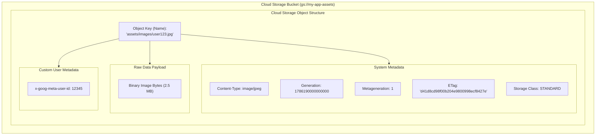

# Topic 48: Objects

---

## 1. What Is It?

An **Object** in Google Cloud Storage is an individual piece of unstructured data stored inside a Bucket. Objects can range in size from a 0-byte marker file up to a maximum of **5 Terabytes** per single object.

An Object consists of three core components:
1. **Object Data**: The raw binary byte stream (image, video, log, database backup, PDF).
2. **Object Key (Name)**: The unique string identifier acting as the object's path (e.g., `images/2026/logo.png`).
3. **Object Metadata**: Key-value pairs describing the object, including System Metadata (Content-Type, ETag, Generation ID, Storage Class, Creation Time) and Custom User Metadata (e.g., `author: Alice`).

Objects in Cloud Storage are **Immutable**: once an object is written, its internal byte data cannot be edited in-place. Modifying an object uploads a full replacement copy.

### Real-World Analogy
Think of an Object like a sealed, stamped envelope deposited into a postal system locker (Bucket). The letter inside is the **Data Bytes**. The address written on the front is the **Object Key**. The postmark, weight stamp, and airmail stickers are the **System Metadata**. Once you drop the envelope into the slot, you cannot erase or edit sentences on the paper inside—if you want to fix a typo, you must mail a brand new sealed envelope (Full Replacement).

---

## 2. Where Does It Fit?

Objects reside inside Cloud Storage Buckets, serving as the raw data payload for analytics engines, web servers, and event-driven microservices.



---

## 3. Core Concepts

| Object Concept | Description | Example / Value | Best Practice |
|---|---|---|---|
| **Max Object Size** | Hard system limit for a single object. | **5 Terabytes** (Hard System Limit) | Use Resumable / Multipart Uploads for files larger than 100 MB. |
| **Object Immutability** | Data bytes cannot be modified in-place. | Updating = Uploading new generation | Replace objects fully; use object versioning for safety. |
| **Generation Number** | 64-bit integer identifying the exact revision of object data. | `1786190000000000` | Use Generation numbers to prevent overwriting concurrent updates. |
| **Metageneration** | Integer tracking changes to object *metadata* without data changes. | `1`, `2`, `3` | Use for conditional metadata update requests. |
| **Custom Metadata** | Arbitrary key-value pairs stored with object (`x-goog-meta-`). | `environment: production` | Store indexing metadata without needing external databases. |

---

## 4. How It Works

Concurrency control during object uploads uses **Preconditions** (Generation Match):

```text
App Client A reads object (Generation: 100) -> Prepares update
App Client B reads object (Generation: 100) -> Prepares update
              ↓
App Client A uploads replacement with precondition `if-generation-match: 100`
              ↓
GCS accepts upload -> Assigns new Generation: 200
              ↓
App Client B attempts upload with precondition `if-generation-match: 100`
              ↓
GCS rejects Client B upload with HTTP 412 Precondition Failed (Prevents Lost Updates!)
```

1. **Resumable Uploads**: For large files (>100 MB), GCS initiates a session URI, allowing uploads to resume automatically after network interruptions without starting over from byte 0.
2. **Virtual Directories**: Slashes (`/`) in object names create simulated folder structures in tools, but GCS treats the entire string as a single flat key name.

---

## 5. Production Scenario

### Scalable Image Upload Pipeline with Signed URLs & Auto-Metadata

```text
Requirement: Allow 100,000 mobile app users to upload profile pictures directly to Cloud Storage without routing multi-megabyte image payloads through backend application servers.
    ↓
Architecture: Pre-Signed URLs + Object Custom Metadata + Cloud Functions.
    ↓
Workflow Steps:
  - Mobile App requests upload URL from Node.js API.
  - Node.js API uses Service Account to generate a 15-minute **Signed URL** with `Content-Type: image/jpeg` and Custom Metadata `x-goog-meta-user-id: user_99`.
  - Mobile App uploads image directly to GCS via HTTPS PUT using the Signed URL.
  - GCS fires an Eventarc event to a Cloud Function upon successful upload.
  - Cloud Function extracts `x-goog-meta-user-id` and updates the SQL database.
    ↓
Security: Backend API servers handle zero image bandwidth. Public Access Prevention blocks unauthenticated access.
    ↓
Monitoring: Cloud Audit Logs recording object generation events.
```

*Why Selected*: Direct-to-object uploads via Signed URLs eliminate backend server bandwidth bottlenecks while Custom Metadata retains identity context.

---

## 6. Hands-On Lab

### Prerequisites
- Active GCP Project with a Cloud Storage bucket created (from Topic 47).
- Cloud Shell or `gcloud` CLI.
- IAM permissions: `roles/storage.objectAdmin`.

### Console Method
1. Log into [Google Cloud Console](https://console.cloud.google.com/).
2. Navigate to **Cloud Storage** → **Buckets** → Select your bucket.
3. Click **UPLOAD FILES** → Upload a local text or image file.
4. Click the uploaded object name to inspect its details page.
5. View **System metadata**: `Size`, `Content-Type`, `Generation`, `Metageneration`, `ETag`.
6. Expand **Custom metadata** → Click **ADD METADATA**:
   - Key: `environment`, Value: `production`.
   - Key: `processed`, Value: `true`.
7. Click **SAVE**.

### CLI Method
Upload, inspect metadata, set custom headers, and delete objects using `gcloud`:

```bash
# Set variables
PROJECT_ID="your-gcp-project-id"
BUCKET_NAME="demo-datalake-${PROJECT_ID}"

# 1. Create a local sample file
echo "Sample Invoice Data 2026" > invoice_101.txt

# 2. Upload file to GCS with custom metadata and Content-Type header
gcloud storage cp invoice_101.txt gs://$BUCKET_NAME/invoices/2026/invoice_101.txt \
    --content-type="text/plain" \
    --custom-metadata="custom-app=billing,invoice-id=101"

# 3. View object details, generation number, and custom metadata
gcloud storage objects describe gs://$BUCKET_NAME/invoices/2026/invoice_101.txt

# 4. Copy (duplicate) an object within Cloud Storage
gcloud storage cp gs://$BUCKET_NAME/invoices/2026/invoice_101.txt gs://$BUCKET_NAME/archive/invoice_101_backup.txt
```

### Verification
*Expected Result*: Output displays object details, listing `generation`, `metageneration: 1`, and `metadata.custom-app: billing`.

### Cleanup
Delete objects:

```bash
gcloud storage rm gs://$BUCKET_NAME/invoices/2026/invoice_101.txt --quiet
gcloud storage rm gs://$BUCKET_NAME/archive/invoice_101_backup.txt --quiet
rm invoice_101.txt
```

---

## 7. Security

### Preconditions & Signed Access Security
- **Use Optimistic Concurrency Preconditions**: Always pass `if-generation-match` in API requests when modifying objects to prevent concurrent processes from overwriting each other's changes (Lost Update Problem).
- **Time-Bound Signed URLs**: Use short-lived Signed URLs (maximum 15 minutes) for granting temporary upload or download access to third parties.
- **Sanitize Object Keys**: Never include sensitive PII (Social Security Numbers, raw user passwords) inside object key names, as key names appear in unencrypted HTTP URL paths and Cloud Audit Logs.

```text
BAD PRACTICE:
Encoding sensitive PII inside object key strings (e.g., `gs://my-bucket/users/ssn-123-45-6789/doc.pdf`).
Risk: Object keys appear in plain text inside Cloud Audit Logs and HTTP access logs.

PRODUCTION PRACTICE:
Use UUIDs or non-sensitive hashed IDs for object keys (`gs://my-bucket/users/u-9012a4b/doc.pdf`). Store PII references inside custom metadata or databases.
```

---

## 8. Scaling & High Availability

Object Scale & Performance Boundaries:

```text
Single Bucket Object IOPS (Sustained 1,000 Write Requests / sec per bucket)
   ↓ (High Throughput Scaling Pattern)
Object Key Sharding (Avoid sequential prefixes like 0001, 0002; use random hash prefixes)
   ↓ (Auto-Partitioning Performance)
Cloud Storage Auto-Scales to 100,000+ Write Requests / sec per bucket automatically
```

- **Avoid Sequential Key Prefixes**: Avoid naming high-throughput upload objects sequentially (e.g., `log_0001`, `log_0002`). Use hash prefixes (e.g., `2a-log_0001`, `9f-log_0002`) to distribute data across storage partitions automatically.

---

## 9. Cost

### Object Storage Cost Rules
- **No File Count Penalty**: You pay strictly for total gigabytes stored across objects and API request counts, regardless of whether you have 1 large 100 GB object or 100,000 small 1 MB objects.
- **Small File Overhead**: Storing millions of tiny 1 KB files incurs higher API Class A operational costs (`storage.objects.create`) relative to storage fees. Batch small files into larger TAR/AVRO/Parquet archives when possible.

---

## 10. Monitoring & Troubleshooting

### Object Observability Tools
- **Cloud Audit Logs**: Filter by `protoPayload.methodName="storage.objects.create"` or `storage.objects.delete` to trace object access history.
- **Storage Insights**: Generate inventory reports analyzing object ages, size distributions, and storage classes across millions of objects.

### Troubleshooting Matrix

| Symptom | Possible Cause | What to Check | Fix |
|---|---|---|---|
| `HTTP 412 Precondition Failed` | Object was updated by another process since generation was fetched | Generation ID in request header | Re-fetch current object generation ID and retry request. |
| Object upload fails at 5 GB mark | Client using standard single PUT request instead of Resumable Upload | Upload method in SDK | Use Resumable / Multipart Upload API for files >5 GB (Max object size 5 TB). |
| `HTTP 403 Invalid Signed URL` | Client system clock skewed or Signed URL expired | Expiration timestamp in URL | Sync client NTP clock or request a fresh Signed URL from API. |

---

## 11. Common Mistakes

```text
Mistake: Attempting to upload a single object larger than 5 Terabytes.
Why: Overlooking Cloud Storage's Hard System Limit of 5 TB per object.
Impact: GCS API rejects upload request with payload size error.
Correct approach: Split multi-terabyte datasets into multiple <5 TB chunks prior to uploading.

Mistake: Naming millions of high-throughput log objects with sequential timestamp prefixes (`2026-08-08-0001.log`).
Why: Assuming folder-like naming schemes improve performance.
Impact: Causes storage partition hotspotting, throttling upload rates.
Correct approach: Prepend a random hash or MD5 string to high-frequency object key names (`a8f1-2026-08-08-0001.log`).
```

---

## 12. Production Best Practices

- [ ] Use **Resumable Uploads** for any file larger than 100 Megabytes.
- [ ] Implement **Preconditions** (`if-generation-match`) to prevent concurrent lost updates.
- [ ] Use **Signed URLs** with short expiration windows (max 15 minutes) for direct client uploads/downloads.
- [ ] Use hash-based key prefixes for high-throughput upload workloads to prevent partition hotspotting.
- [ ] Set appropriate **`Content-Type`** headers on objects during upload so web browsers render files correctly.
- [ ] Group millions of tiny files into larger Parquet, ORC, or TAR archives to optimize operational API costs.

---

## 13. Hyperscaler / Enterprise Perspective

```text
Personal / Learning
  Console file upload → Default Content-Type → Sequential file names → No concurrency checks
        ↓
Small Production
  gcloud SDK uploads → Custom Metadata tagging → Basic Signed URLs
        ↓
Enterprise Environment
  Resumable Uploads via Client Libraries → Precondition Generation Matching → Hash Key Sharding
        ↓
Hyperscaler Environment
  Automated Parallel Composite Uploads (Multi-GB files) → Real-Time Eventarc Streaming Pipelines → Storage Insights Analytics
```

In a hyperscaler environment, applications process petabytes of object data daily. Large multi-gigabyte files are split into parallel chunks, uploaded concurrently using **Parallel Composite Uploads**, and merged server-side. Eventarc streams real-time `object.create` events into Cloud Functions and Kafka topics for automated threat detection and data lake indexing.

---

## 14. Real Project Questions

### Q1: What is the Hard System Limit for an individual object size in Google Cloud Storage?
**Answer:** The maximum size limit for a single object in Google Cloud Storage is **5 Terabytes**. Files larger than 5 TB cannot be stored as a single object; they must be split into multiple smaller objects before uploading.

### Q2: Why are Cloud Storage Objects described as immutable, and how are updates handled?
**Answer:** Objects are immutable because their internal binary data bytes cannot be edited or appended in-place. Modifying an object involves uploading a complete new replacement copy. GCP assigns a new **Generation Number** to the replacement object, preserving historical versions if Object Versioning is enabled.

### Q3: How do generation preconditions (`if-generation-match`) prevent lost updates in multi-threaded application environments?
**Answer:** Preconditions implement optimistic concurrency control. A client includes the object's current 64-bit Generation ID when sending an update. If another process updated the object in the interim (changing its Generation ID), GCP detects the mismatch and rejects the second update with `HTTP 412 Precondition Failed`, preventing silent data overwrites.

---

## 15. Quick Decision Guide

| Requirement | Recommended Approach | Reason |
|---|---|---|
| Uploading a 50 GB database backup file over an unstable network | **Resumable Upload API** | Allows resuming failed uploads from the point of interruption without starting over. |
| Updating an object safely when multiple microservices access it concurrently | **Precondition (`if-generation-match`)** | Enforces optimistic concurrency control; blocks accidental lost updates. |
| Distributing 100,000 log uploads per second to a single bucket | **Hash-Prefixed Object Keys (`a9b1-log.txt`)** | Distributes write operations across underlying storage partitions to prevent hotspotting. |

### When should I use it?
- Essential entity for storing files, images, backups, media, and datasets in Cloud Storage.

### When should I NOT use it?
- Do not use individual 1 KB objects for high-frequency database row storage (use Bigtable or Firestore).

---

## 16. Related Services

```text
                  [48. Objects]
                 /      |      \
        Signed URLs   Eventarc   Storage Insights
        (Direct Upload) (Events)   (Analytics)
            |           |               |
        Mobile / Web  Cloud Run    Inventory
           Clients   Pipelines      Reports
```

- **Signed URLs**: Enables secure direct client uploads/downloads of objects.
- **Eventarc**: Fires event triggers upon object creation or deletion.
- **Storage Insights**: Generates automated inventory reports for millions of objects.

---

## 17. Cheat Sheet

### Essential Limits & Properties
- **Max Object Size**: 5 Terabytes.
- **Immutability**: Full replacement on update.
- **Concurrency**: Optimistic locking via Generation Number (`if-generation-match`).
- **Resumable Uploads**: Recommended for files >100 MB.

### Useful Commands
```bash
# Upload a file with custom metadata
gcloud storage cp FILE.txt gs://BUCKET_NAME/PATH/FILE.txt \
    --custom-metadata="env=prod,owner=alice"

# Inspect object metadata and generation ID
gcloud storage objects describe gs://BUCKET_NAME/PATH/FILE.txt

# Delete an object
gcloud storage rm gs://BUCKET_NAME/PATH/FILE.txt
```

---

## 18. Learning Connection

- **Previous Topic**: [47. Buckets](../47-buckets/README.md)
- **Next Topic**: [49. Storage Classes](../49-storage-classes/README.md)
